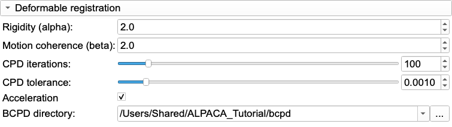

# ALPACA V: Advanced settings, tuning, and BCPD acceleration

## Introduction

The default settings of ALPACA work well for many skulls, and the other ALPACA tutorials use them unchanged. When they do not work for your data, or you want to check that they are the best choice, the **Advanced Settings** tab has the controls. This tutorial explains:

1. what each setting does, for the rigid and the deformable part of the registration;
2. how to find better settings for your own data, with a worked example on Mouse_Models;
3. how to install **BCPD**, which makes the deformable step much faster, on macOS and Linux.

It assumes you have done [ALPACA I](README.md), and uses the same data: the A/J skull as the template, and the four targets from ALPACA I Part 2 (B6C3F1, BALB_CJ, CAST_EIJ and NZO), which all have manual landmarks.


## Part 1: What the settings do

Recall the steps of ALPACA ([ALPACA I](README.md#introduction)): the two models are reduced to point clouds; the source cloud is aligned to the target, first by a global search (RANSAC), then refined (ICP); the aligned source cloud is deformed onto the target (CPD); the landmarks are carried along and projected onto the target surface.

Most of the rigid settings are given as multiples of a **voxel size**, which ALPACA computes from the size of the target model:

> voxel size = diagonal of the target's bounding box / (55 × Point Density Adjustment)

For the mouse skulls (diagonal about 27 mm) it is about 0.5 mm at the default density. Because the settings scale with the model, the defaults work the same for a mouse skull and for a gorilla skull.

### Point clouds and projection

| Setting | Default | What it does |
|---|---|---|
| **Point Density Adjustment** | 1.0 | Sets the voxel size above. Every voxel keeps one point, so higher values give more points (about 4× for 2× density) and slower runs. Also changes every setting given in voxel sizes. The same slider is on the Single Alignment tab. |
| **Maximum projection factor** | 0.02 | How far (in % of the target's bounding-box diagonal) a final landmark may move along the surface normal to reach the target surface. If the normal does not reach the surface within this distance in either direction, the landmark is moved to the closest point of the target surface instead. |
| **Poisson Point Subsample** | off | Samples points with a minimum distance between them (Poisson disk) instead of one per voxel. The points are more evenly spread, and there are fewer of them at the same density (2,319 instead of 4,813 for the A/J skull). |

### Rigid registration

| Setting | Default | What it does |
|---|---|---|
| **FPFH Search radius** | 5 × voxel | Size of the neighborhood used to describe the local shape around each point (its FPFH feature). The global search matches points of the two clouds by these descriptions. Larger radii describe coarser, more distinctive shape. |
| **FPFH Neighbor Count** | 100 | Maximum number of neighbors used for each description. |
| **Maximum corresponding point distance** | 3 × voxel | How close an aligned source point must be to a target point to count as a match, both during the search and in the **Fitness** score below. |
| **Maximum RANSAC iterations** | 1,000,000 | Upper limit on how many random alignments the global search tries. The search runs in rounds of 10,000 and stops as soon as two rounds in a row do not improve the alignment, so this limit is reached only when the search keeps improving, typically when the starting orientations differ a lot. |
| **Maximum ICP distance** | 1.5 × voxel | During the final refinement (ICP), only point pairs closer than this are used. |
| **Normal Search Radius** | 2 × voxel | Neighborhood used to estimate the surface normals for the final refinement. |

**Scaling** (on the Single Alignment and Batch tabs) interacts with the search: ALPACA first searches for a rotation and translation only, and tries again with scaling (up to 10 more searches) only if the first result is not good enough.

### Deformable registration

Before this step, both clouds are rescaled to a box about 25 units across, so these settings do not depend on the units or size of your models.

| Setting | Default | What it does |
|---|---|---|
| **Rigidity (alpha)** | 2 | Balance between fitting the target and staying smooth. **Lower values allow larger deformations**; higher values keep the source closer to its rigidly aligned shape. |
| **Motion coherence (beta)** | 2 | Width of the neighborhood over which points move together. **Higher values make larger regions move as one**; lower values let small regions deform independently. |
| **CPD iterations** | 100 | Maximum number of iterations. |
| **CPD tolerance** | 0.001 | The deformation stops when it changes less than this. |
| **Acceleration** / **BCPD directory** | off | Runs the deformable step with the BCPD program instead (Part 3). **CPD iterations** and **CPD tolerance** are then not used. |

## Part 2: Finding better settings for your data

### Set up a test set

You can only judge settings against landmarks you trust. Before a large study:

1. Pick a **template** and **3–5 test specimens** that span your sample (different groups, sizes, the odd-looking ones), and that are not the template.
2. Landmark the test specimens by hand.
3. Compare the ALPACA estimates with your manual landmarks, as in [ALPACA I](README.md), step 6. On the **Single Alignment** tab, select the manual set as **Target Landmark Set (Optional)**. Each run adds a row with its RMSE to the table, so you can change a setting (**Change ALPACA settings**), run again, and compare.

Judge a setting by its average over all test specimens, not by one pair: the best values differ from specimen to specimen. Here we use the A/J template and the four targets from ALPACA I. The default settings give an RMSE of 0.26–0.36 mm (mean 0.33 mm).

### Step 1: check the rigid alignment first

The deformable step can only refine a good rigid alignment. On the Single Alignment tab, turn on **Display source pointcloud** and **Display target pointcloud** (or the rigidly registered source model and the target model) and rotate the view: the two should overlap everywhere.

ALPACA also reports how well the global alignment fits. Open the Python console (**View → Python Console**) before running. After each run it shows a line like:

```
Non-Scaling Attempt =  0  Fitness =  1.0  RMSE is  0.19
```

**Fitness** is the fraction of the source points that end up within **Maximum corresponding point distance** of a target point (1.0 = all), and **RMSE** is their mean distance, in your model's units. For similar specimens, fitness should be at or near 1.0. If the first attempt reaches less than 0.99 and **Scaling** is on, ALPACA tries again with scaling, and you will see `Scaling Attempt` lines. A clearly lower fitness, or clouds that visibly do not overlap, means the global alignment failed. Then try, one at a time:

- a higher **Point Density Adjustment** (more points to match);
- a larger **FPFH Search radius** (more distinctive shape descriptions, useful for smooth or symmetric structures);
- more **Maximum RANSAC iterations**.

On the mouse skulls, the rigid alignment never failed: fitness was 1.0 for every target, even after we rotated the NZO skull by 120°, 45° and 70° about the three axes and moved it about 55 mm, or turned it upside down. The log also shows how long the search ran:

```
RANSAC stopped after 40000 of 1000000 iterations (4 rounds): fitness 1.0000, RMSE 0.1791
```

Because the search stops once it no longer improves, it took 40,000–50,000 iterations and 4–15 seconds per pair here. If you see it run to the full **Maximum RANSAC iterations**, the search was still improving: check the fitness and the alignment, and consider a higher limit if your specimens start in very different orientations.

> In SlicerMorph versions before late September 2026, the search always ran all 1,000,000 iterations, about 85 seconds per pair for these skulls. With those versions, lowering **Maximum RANSAC iterations** (e.g. to 10,000–100,000 for consistently oriented specimens) gives the same speed-up.

The rotated skulls show one more thing. Rotating NZO changed nothing about its shape, but the RMSE changed (0.34 mm as scanned, 0.30 mm rotated, 0.31 mm upside down), because the points were sampled from a differently placed grid. **Differences of a few hundredths of a millimeter between two settings can be sampling noise**, not a real improvement.

### Step 2: tune the deformable registration

With a good rigid alignment, **Rigidity (alpha)** and **Motion coherence (beta)** matter most. Change them in large steps (halve or double, or ×4), one at a time, and record the mean RMSE over your test set. We ran a grid of values with CPD over the four targets. Mean RMSE in mm (the default is marked):

| alpha \ beta | 0.5 | 2 | 4 | 8 |
|---|---|---|---|---|
| 0.5 | 0.417 | 0.363 | 0.379 | |
| 2 | 0.372 | **0.328** | 0.325 | |
| 8 | 0.330 | 0.321 | 0.316 | 0.307 |
| 32 | | 0.316 | 0.313 | 0.312 |

What this shows:

- **Too flexible is clearly worse.** Low alpha together with low beta (0.5 / 0.5) gives 0.417 mm, 27% worse than the default. The source then bends to fit small differences between the surfaces, and the landmarks move with it. It is also slower: about 100 s per pair for the deformable step, against 44 s at the defaults.
- **Stiffer is slightly better here.** alpha 8 and beta 8 gave 0.307 mm, 6% better than the default, and the gain levels off beyond that (alpha 32: 0.31 mm). Inbred mouse skulls differ only modestly in shape, so a smooth, stiff deformation is enough.
- **The best values differ by target.** For B6C3F1 the default was already near the best; for CAST_EIJ, beta 4 helped most. Choose values that help on average, and do not tune for one specimen.

For more variable data (several species, or very different ages), the balance may shift the other way: larger differences in shape may need more flexibility (lower alpha). The only way to know is to test on your own specimens.

### How much is it worth?

Tuning the deformable step improved the mean RMSE from 0.33 to 0.31 mm in this example. Using several templates did much more: MALPACA reduced it to 0.19–0.28 mm with default settings ([ALPACA IV](../MALPACA/MALPACA.md)). So:

1. Check the rigid alignment. If it fails, fix it: nothing else matters until it works.
2. Choose templates well, and consider MALPACA.
3. Then tune alpha and beta, if at all. Keep the defaults unless a change helps consistently across your test set by more than the noise.

Whatever you use, keep the `advancedParameters.txt` file that the batch run writes, and report the settings.

### Settings we did not test here

- **Point Density Adjustment:** more points describe the shape in more detail and can help the rigid alignment of complex or small structures, but the deformable step gets much slower. Start from the default of about 4,000–6,000 points per model ([ALPACA I](README.md), step 3).
- **Maximum projection factor:** keep the default. At 0.02 (0.02% of the diagonal, about 5 µm for these skulls), each final landmark in practice ends up at the closest point of the target surface. Larger values let landmarks travel further along the surface normal, and in earlier tests by the ALPACA developers high projection factors made the final landmarks worse. Uncheck **Projection** to keep the unprojected estimates.
- **Poisson Point Subsample:** spreads the points more evenly than the voxel grid, at the spacing set by **Point Density Adjustment**, and gives about half as many points. On A/J → NZO it gave an RMSE of 0.336 mm against 0.344 mm with the voxel grid, a difference within the noise described above. Compare it on your test set like any other setting, and raise the density if you want the same number of points.

## Part 3: Faster deformable registration with BCPD

### What BCPD does

**BCPD** (Bayesian Coherent Point Drift; Hirose, 2021) is a reformulation of CPD, the method ALPACA uses for the deformable step. It is a separate program, written in C by Osamu Hirose, that ALPACA can call instead of its built-in CPD. Its main advantage is speed: it approximates the expensive parts of the computation (with random subsampling, the Nyström method, and a nearest-neighbor search), and runs them in parallel on all processor cores.

On the A/J → NZO pair, the deformable step took **49 s with CPD and 2 s with BCPD**, with the same accuracy (RMSE 0.345 vs 0.344 mm). Since the rigid search takes only a few seconds, that makes a whole pair several times faster. The saving grows with the number of points (higher **Point Density Adjustment**) and with low **Rigidity (alpha)** values, which make CPD slow. It matters most when you try many deformable settings on the same pairs (Part 2) or run MALPACA with many templates.

Two differences from CPD:

- BCPD uses its own fixed stopping rules, so **CPD iterations** and **CPD tolerance** are ignored. **Rigidity (alpha)** and **Motion coherence (beta)** are passed to BCPD as its *lambda* and *beta*, which have the same roles.
- BCPD's approximation uses random numbers, so repeated runs are not always identical. In our tests most repeats matched exactly, but one of four repeats on BALB_CJ gave 0.335 instead of 0.352 mm. CPD always gave the same result.

### Building BCPD on macOS

BCPD comes as source code, which you compile once. It takes a few seconds.

1. **Install the Apple command line tools** (the C compiler), if you do not have them. In Terminal:
   ```
   xcode-select --install
   ```
2. **Install Homebrew** from [brew.sh](https://brew.sh), if you do not have it, then the two libraries BCPD needs: OpenMP (parallel processing) and OpenBLAS (fast linear algebra):
   ```
   brew install libomp openblas
   ```
3. **Download and compile BCPD.** Choose where to keep it (here, your home folder):
   ```
   cd ~
   git clone https://github.com/ohirose/bcpd.git
   cd bcpd
   make
   ```
   Without git, download the ZIP from [github.com/ohirose/bcpd](https://github.com/ohirose/bcpd) (**Code → Download ZIP**), extract it, and run `make` in the extracted folder.
4. **Check it:** `./bcpd -v` prints the version and `OpenMP: Turned on`.

We built it this way on an Apple Silicon Mac (macOS 26, Homebrew libomp 22 and OpenBLAS 0.3.33). The makefile finds Homebrew's libraries automatically; with MacPorts instead of Homebrew it looks in `/opt/local`.

### Building BCPD on Linux

The same steps, with the libraries from your distribution. GCC includes OpenMP, so only OpenBLAS is needed:

- Ubuntu/Debian: `sudo apt install build-essential git libopenblas-dev`
- Fedora/RHEL: `sudo dnf install gcc make git openblas-devel`

then `git clone https://github.com/ohirose/bcpd.git`, `cd bcpd`, `make`, and check with `./bcpd -v`.

### Use a current version

Use BCPD downloaded **on or after June 1, 2026**. ALPACA passes point sets to BCPD as comma-separated text. BCPD versions from March 2025 until then read such files incorrectly and stop with `ERROR: The Cholesky factorization of A failed`. The version string does not tell them apart: both print `0.98 (2026/01/02)`. If you see that error, download BCPD again and rebuild.

### Turn on acceleration in ALPACA

On the **Advanced Settings** tab, in **Deformable registration**:

1. Check **Acceleration**.
2. Set **BCPD directory** to the folder that contains the `bcpd` program, e.g. `~/bcpd`: the folder, not the program itself.



BCPD is also the quickest way to explore settings (Part 2): with BCPD, the rigid and deformable steps together took about 6–15 seconds per pair here. The two methods do not give identical results, though. At the default settings, CAST_EIJ had an RMSE of 0.34 mm with CPD and 0.41 mm with BCPD. So confirm the settings you choose with the method you will use for the study.

Both settings are remembered for later sessions. They apply to the Single Alignment and Batch processing tabs, and to MALPACA. The `advancedParameters.txt` file of a batch run records `"Acceleration": true` and the BCPD folder, so you can tell afterwards which method was used.

On Windows, no compilation is needed: BCPD ships a ready-made `bcpd.exe` in its `win` folder, which is the folder to select.

## References

- Porto, A., Rolfe, S., and Maga, A. M. (2021). ALPACA: A fast and accurate computer vision approach for automated landmarking of three-dimensional biological structures. *Methods in Ecology and Evolution*, 12(11), 2129–2144. https://doi.org/10.1111/2041-210X.13689
- Myronenko, A., and Song, X. (2010). Point set registration: Coherent point drift. *IEEE Transactions on Pattern Analysis and Machine Intelligence*, 32(12), 2262–2275. https://doi.org/10.1109/TPAMI.2010.46
- Hirose, O. (2021). A Bayesian formulation of coherent point drift. *IEEE Transactions on Pattern Analysis and Machine Intelligence*, 43(7), 2269–2286. https://doi.org/10.1109/TPAMI.2020.2971687
- Rusu, R. B., Blodow, N., and Beetz, M. (2009). Fast Point Feature Histograms (FPFH) for 3D registration. *2009 IEEE International Conference on Robotics and Automation*, 3212–3217. https://doi.org/10.1109/ROBOT.2009.5152473
