

# Automated landmarking through pointcloud alignment and correspondence analysis (ALPACA)

`ALPACA` provides fast landmark transfer from a 3D model and its associated landmark set to target 3D model(s) through pointcloud alignment and deformable mesh registration (please see the original publication https://doi.org/10.1111/2041-210X.13689 for a throrough review). Compared to patch landmarking methods in SlicerMorph, it does not require presence of fixed landmarks. Optimal set of parameters that gives the best correspondence between a source model (one with the landmarks) and a target model (to which the landmarks will be transferred) can be investigated (and outcome can be visualized) in single alignment mode, and then applied to a number of 3D models in batch mode. Invoked first time, `ALPACA` will need to download necessary ITK libraries. Depending on the internet speed, download may take a few moments but it is a one-time event.

## Module Overview
Open the ALPACA module. 

:pencil2:  If this is the first time you are opening `ALPACA`, it inform you that it will be downloading necessary python libraries. This may take a few minutes. 

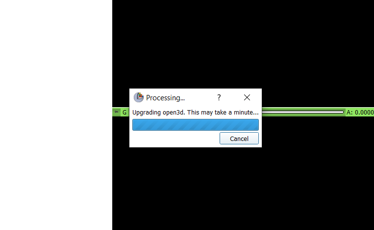

 
Otherwise, you should observe the following screen:

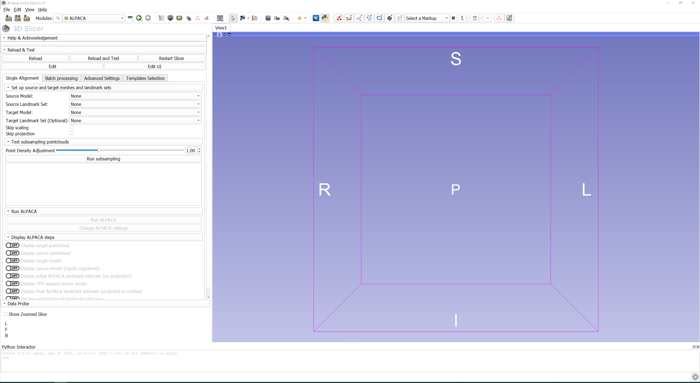

There are four main tabs in `ALPACA` : a `Single aligment`, a `Batch processing`, an "Advanced Settings", and a "Templates Selection" one.

* __Single Alignment tab__: this is the default tab when you open ALPACA. It is for performing ALPACA to landmark one target model based on a source model and accompanied source landmark set. The main purpose of the `Single aligmment` tab is to find the best combination of hyperparameters for the task, so that they can be applied to a large array of specimens. Users can conveniently explore different settings and evaluate ALPACA performance in this tab. 

* __Batch processing__: this tab allows for performing ALPACA using a single template and the multi-template version (MALPACA) for an array of specimens (>2 specimens). For this tutorial, we will only explore ALPACA. For MALPACA, please see: [MALPACA toturial](/MALPACA/MALPACA.md)

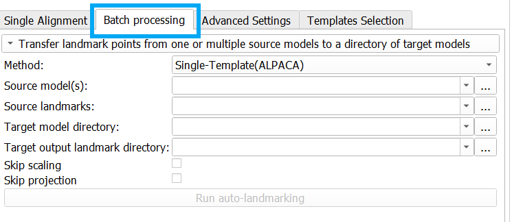

* __Advanced Settings__: this tab allows users to change settings for ALPACA and MALPACA. This is generally not recommended for novice users. Therefore, we can keep the default settings for this tutorials. However, hyperparameter tuning can sometimes significantly improve the end result. The `Step 6` in the `Single Alignment `section of this tutorial will include an overview of these parameters. For more details, please refer to the ALPACA publication: https://doi.org/10.1111/2041-210X.13689.

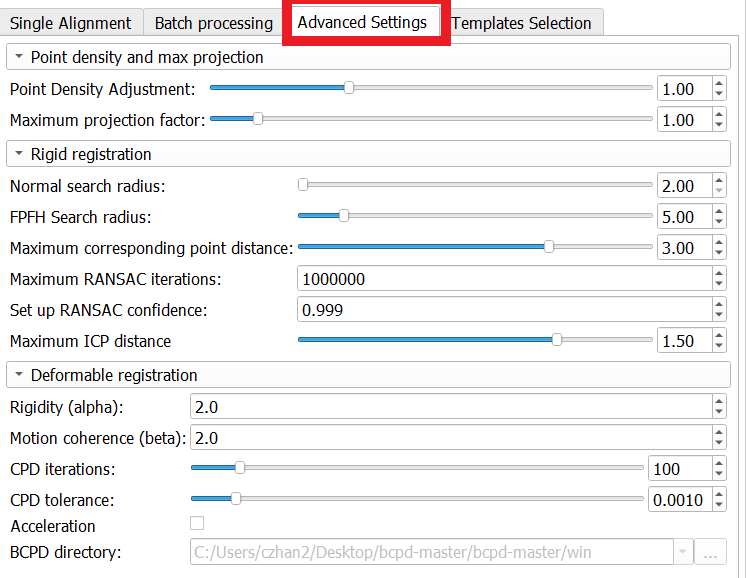

* __Templates Selection__: this tab allows users to choose specimens for the multi-template version of ALPACA (MALPACA) as templates when no prior information is availabe. Tutorials can be found at [K-means templates selection tutorial](/MALPACA/K-means_templates_selection.md)

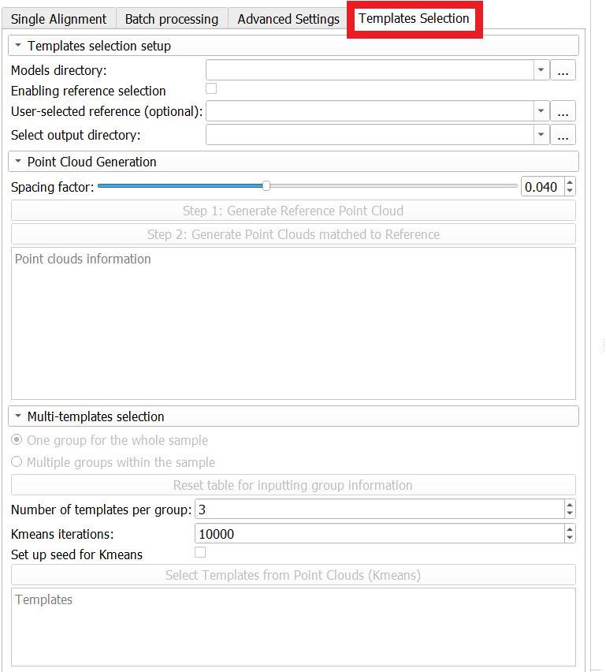

## Single Alignment

Now that we are acquainted with the overall layout of the module, let's start by doing an alignment between two example meshes. 

### Step 1. Download sample data
Download the ALPACA sample data set from the [ALPACA tutorial sample data](https://github.com/SlicerMorph/Mouse_Models) and switch to the ALPACA module. You can just click `Code` at the upper right corner then `Download Zip.` Extract all the files to a local directory. 

### Step 2. Specifying the source models (ply format), source landmark set (fcsv format) and target model (ply format). 
From the directory where you save the extracted sample data, go to the `/Mouse_Models-main/Models`folder, drag `A_J_skull_.py` and `B6C3F1_j_.ply` into Slicer. From `/Mouse_Models-main/LM` folder, drag `A_J_skull_.fcsv` into Slicer.

You can also use the Slicer's data loading capabilities by clicking the `Data load` button, then navigate to the tutorial data folder, and load the source model, source landmark file, and target model.

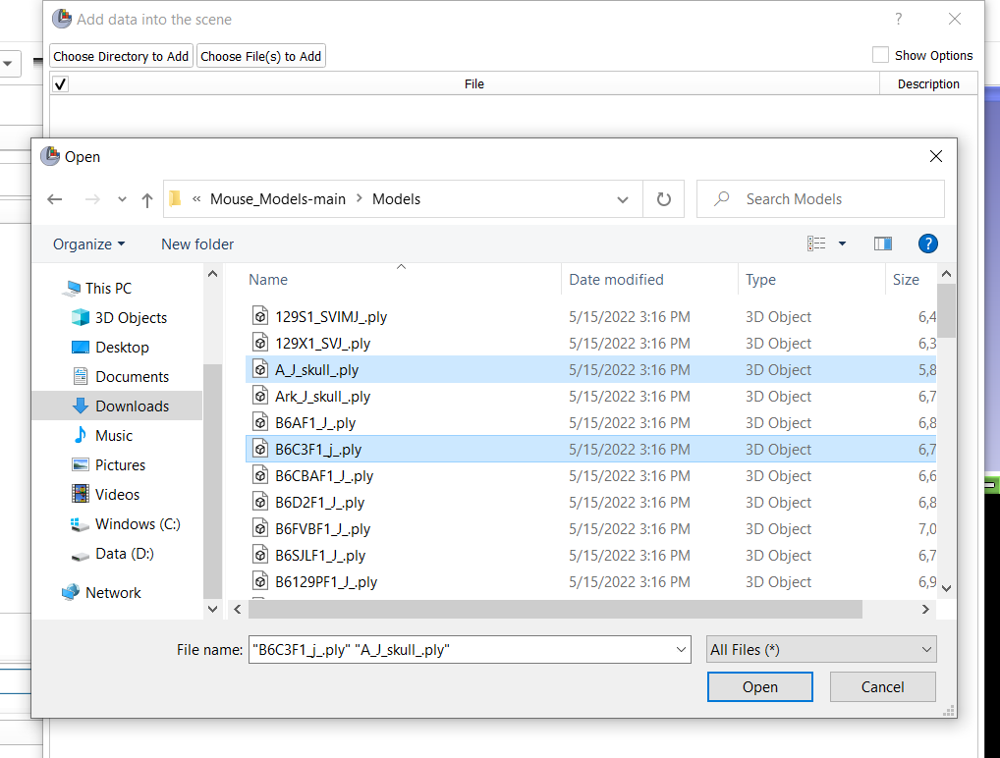
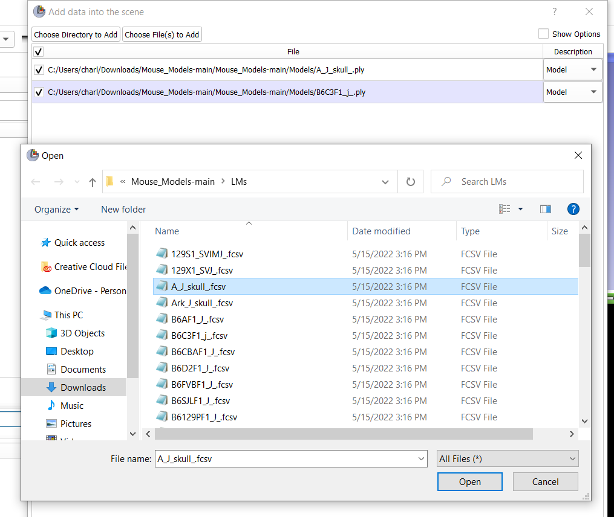

 * If everything worked properly, you should observe something that looks like this:

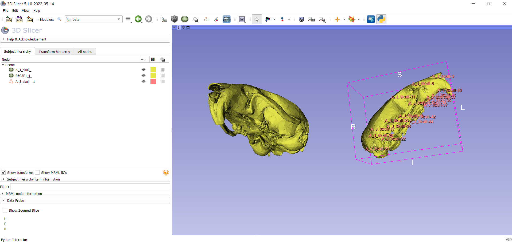

* As can be seen above, the two meshes lie in arbitrary positions in 3D space. Contrary to other approaches present in the literature, `ALPACA` can deal with arbitrary starting points. 

* Return to the `ALPACA` module and select the source model and landmark set as well as the target model loaded in Slicer from correspondant dropdown buttons under the `Single alignment` tab: 

  * __Source Model__: Under the `Source mesh`, the user is expected to select the path to the `*.ply` mesh file to be used as a template. Select `A_J_.ply `as the source model.
  
  * __Source Landmark Set__: Under the `Source Landmark Set`, the user is expected to select the path to the `*.fcsv` file containing the landmarks to be transferred to the target mesh. Select `A_J_.fcsv` as the source landmak set.

  * __Target Model__: Under the `Target mesh`, the user is expected to select the path to the `*.ply` mesh file to be used as a target (i.e., the specimen we are interested in predicting landmark positions for). Select `B6C3F1_j_.ply` as the target model. 

  * __Reference Target Landmark Set (optional)__: Leave this button blank for now. We will go over it in Step 6. 

  * __Scaling__: Argument that determines whether the source mesh should be scaled to match the size of the target mesh (default). If you want to skip scaling, please uncheck this option.

  * __Projection__: Argument that determines whether the final landmark predictions should be projected to the surface of target mesh (default). If you do not want the projection step, unchecked this option.

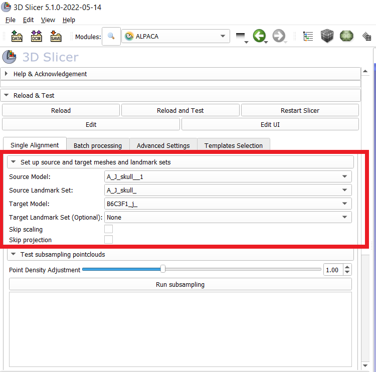

### Step 3. Generating downsampled pointclouds.
The `Test subsampling pointclouds` section contains a slider bar for adjusting point cloud density and an optional step to check generated point clouds. 
* __Point Density Adjusting slider__: the `point density value` to specify point sampling density. ALPACA is based on registering point clouds extracted from the source and target models. Under the `Point Density Adjustment`, the user can adjust the value that determine the density for sampling points from each model. The default value of point density is `1.00`, which is empirically determined to sample approximately `5000-6000` points for a given model. This `4000-6000` point cloud density can yield optimal registration for most cases. Increasing the point density value will increase the number of points sampled from a model, hence the execution time, but may not improve the registration performance. In contrast, decreasing the point density value will decrease the number of points sampled, hence the execution time.
  * The `Point Density Adjusting` slider is synchronoized with the same slider in the `Advanced Settings` tab. Ajusting one of them would automatically update the other one. 

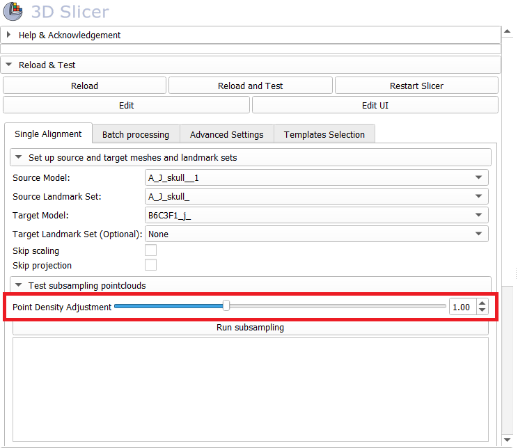

* We can press `Run subsampling` button under the `Point Density Adjustment` slider to experimenting the effect of different point density value. The number of points for the source and target point clouds will be printed in the display box blow. It is essential to aim for `5000-6000` points per mesh, so the user has the option of pressing the `Run subsampling` as much as needed. A good follow-up exercise to this tutorial is to vary the number of sampled points per mesh and evaluating the impact it has on the performance of the method. 

  * For the sample data, the default 'point cloud density' 1.00 should yield 4034 points for the source point cloud and 4945 points for the target point clouds. This is suffice for this tutorial and for achieving a good point cloud registration. The `Run subsampling` button will also load a visual representation of the `Target` pointcloud into the 3D scene (in blue).

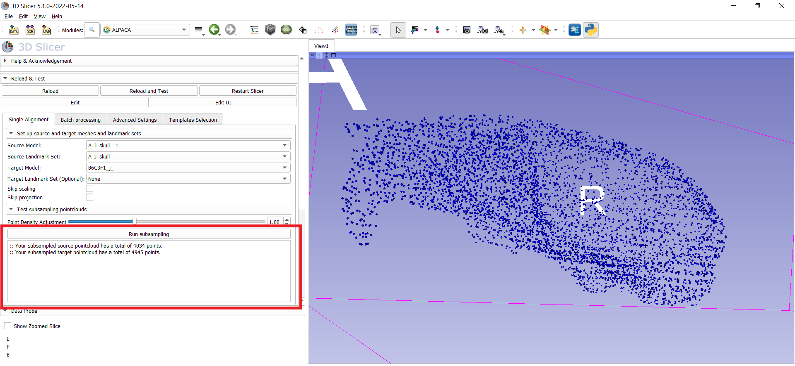

### Step 4. Run ALPACA.
Once we are satisfied with the number of sampled points, we can proceed to press the `Run ALPACA` button. This step will execute the whole process of ALPACA (about 2-3 minutes in a modern laptop) including:
* Downsampling source and target point clouds based on the Point `Density Ajustment` value. 
* Global (RANSAC) and rigid (ICP) registration that register the source point cloud to the target
* CPD (coherent point drift) registration that deform the source point cloud to the target point cloud and propogate the source landmarks to new positions in the meantime.
* Projecting the new landmarks generated from the last step to the surface of the target model for achieving the final ALPACA estimated landmarks. 

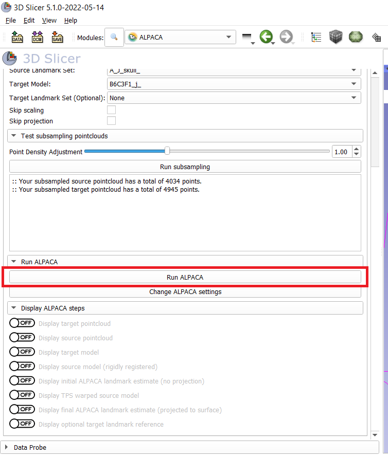

### Step 5. Displaying ALPACA steps.
Each ALPACA steps can be displayed by turning on and off the switch buttons in the `Display ALPACA steps` section. All results are saved in the `ALPACA_output_1` folder that can be viewed in the `data module`. 

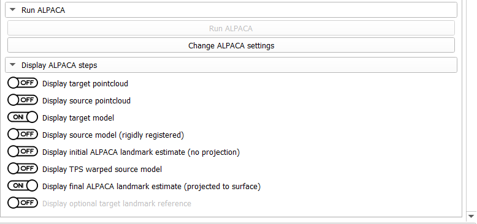

* For visualizing the most recent ALPACA steps, it is recommended to only toggle the switch button in the `Display ALPACA steps` section to avoid confusion.

* By default, after Run AlPACA, only the target model and the final ALPACA estimated landmarks are displayed.

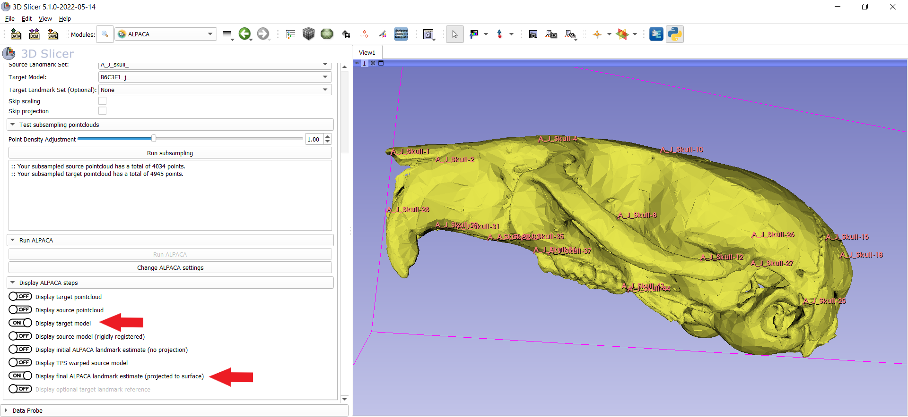

 
* To display the rigidly registered source and target pointclouds, click the switch buttons for switching the `Display target pointcloud` and `Disply source pointcloud` to the `ON`. This step will produce an output corresponding to the visual representation of the alignment between the `Source`(red) and `Target` (blue) pointclouds in the 3D scene. Please feel free to rotate those pointclouds in 3D space to make sure the alignment occured correctly.
  * The source and target point cloud nodes are `Source Pointcloud (rigidly registered)_1_` and `Target Pointcloud_1` in the `ALPACA_output_1` folder in the `data` module. 

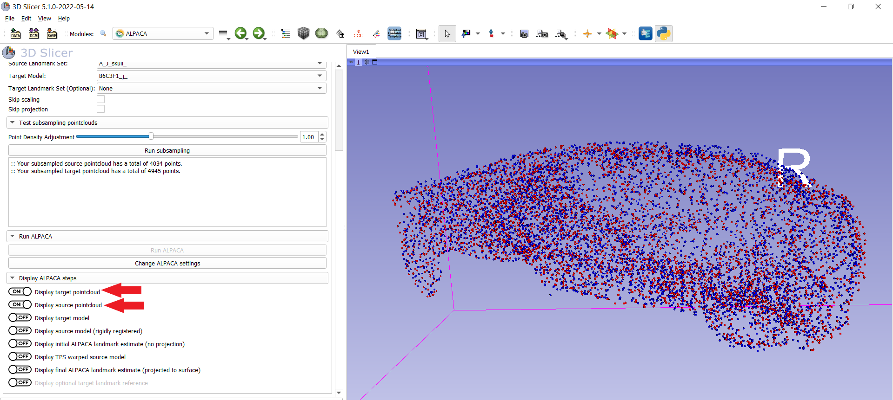

 
* Depending on the complexity of the structure of interest, it may be hard to tell if the pointclouds are properly aligned. For that reason, `ALPACA` offers the users the option of displaying the rigid aligned models. By default, the `Display target model` option is switched on. The user can click the `Display source model (rigidly registered)` switch button to turn it to `ON`. You should observe something as seen below. The source model (A_J) is in red and the target model (B6C3F1) is in yellow. Again, feel free to rotate the 3D surfaces to make sure they are properly aligned. 
  * The source model node is the `Source Model (rigidly registered)_1_` in the `ALPACA_output_1` folder in the `data` module. The target model is untransformed, therefore remain the same as the original imported one (`B6C3F1_j_.ply` model in our case) in the `data` module.

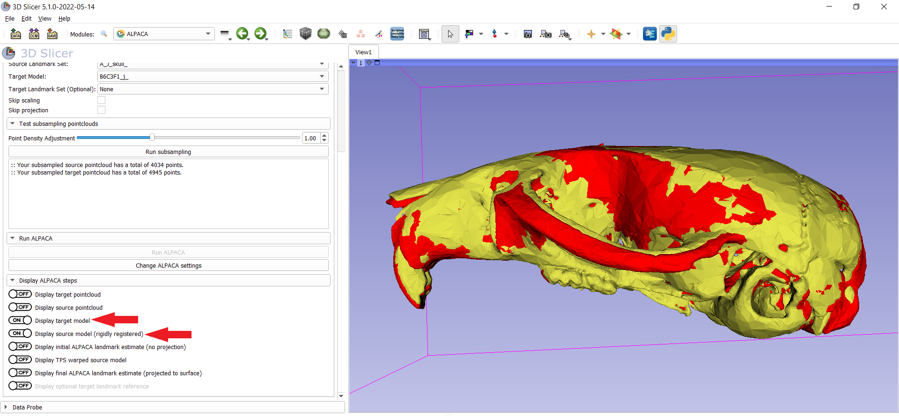

 
  * In our example case (mice), you will notice that even though we get a proper alignment between the two strains, the `A_J` mice have a downward curved face when compared to the `B6C3F1` mice. Note how the nasal bones are distant from each other. For that reason, simply transferring the landmarks after the rigid registration step is unlikely to produce good results.

* To further improve the quality of the alignment, ALPACA applies a CPD (coherent point drift) registration to deform the `Source` point cloud to match the `Target` point cloud. Note that this step takes the longest time of the pipeline. In modern laptops, this should take around 2 or 3 minutes. 
  * During the CPD deformation, the `source landmarks` are also projected to new positions to match the `Target` point cloud, though they may not strictly lie on the surface of the `Target` point cloud and model. Therefore, the positions of these transformed landmarks are still not optimal to serve as the estimated target landmarks. 
  * In this pipeline, the transformed source landmarks after CPD registration can be displayed by click the switch button of `Display initial ALPACA landmark estimate (no projection)`. 

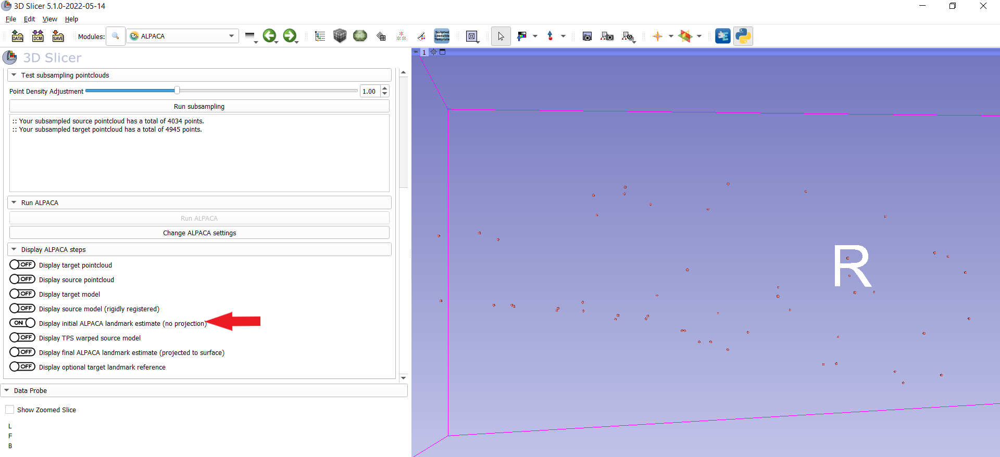

  
  * Switch on `Display target model`, you can see some of these estimated landmarks (e.g., the one pointed by the blue arrow) are slightly below the surface of the the target model.

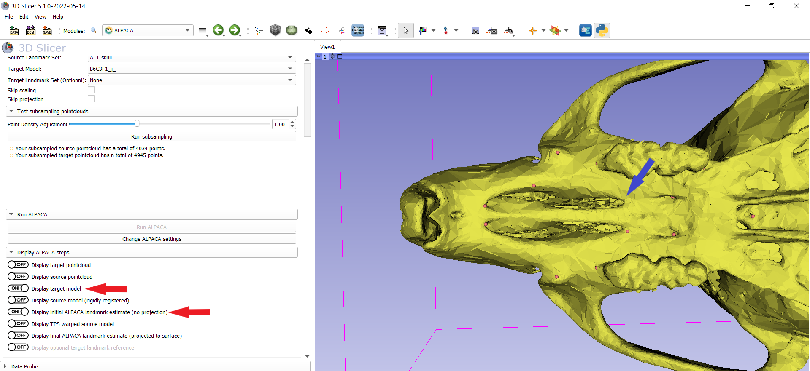

 
 
  * The `initial ALPACA landmark estimate (no projection)` node is the `Initial ALPACA landmark estimate(unprojected)_1` fiducial point node in the `ALPACA_output_1` folder in the `data` module.

* A thin-plate spline (TPS) warping between the original `source landmarks` and `initial landmark estimate (unprojected)` is then performed in order to deform the source model into a `TPS warped source model`. 
  * Turn the switch on to display the `TPS warped source model` (green). In the data module, it is called `TPS wapred source model_1 `in the `ALPACA_output_1` folder.
  * This `TPS warped source model` can also serve as a proxy of the CPD deformable registration of the `source pointcloud`. Switch on the `Target Model` (yellow). Note how the alignment of the nasal bone is much better than prior to the deformed step. The same is true for other parts of the skull.

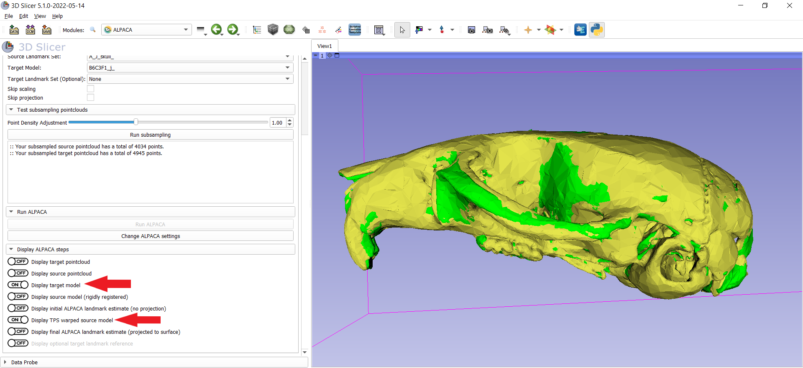

 
 * Noting that the `initial landmark estimate (unprojected)` are now located at the surface of the the `TPS warped source model` (e.g., the landmark pointed by the blue arrow). 

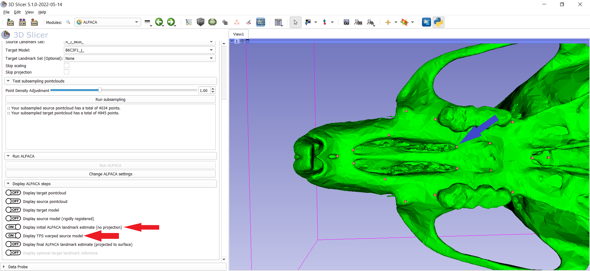

 
 
* The final step of ALPACA is to project the unprojected initial landmark estimates acheived by CPD registration, which are now loacted at the surface of the `TPS warped source model`, to the exterior surface of the target model (see https://doi.org/10.1111/2041-210X.13689 for more detail). 
  * The display of final estimated landmarks can be switched on or off by clicking the button `Display final ALPACA landmark estimate (projected to surface)`
  * In the data module, the node is 'Final ALPACA landmark estimate_1' in the `ALPACA_output_1`.

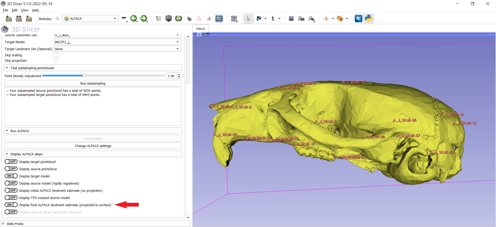

 
 
* The output of each ALPACA step is not saved into a file. In part, this is because the role of the `Single alignment's` tab main role is to find the best combination of parameters necessary to transfer landmarks between specimens. These parameters can then be transferred to the `Batch processing` tab to process an entire specimen folder. The next step presents an overview of the parameter settings of ALPACA.

### Step 6. Alter the ALPACA settings and run another ALPACA. 
After running one ALPACA, the `Run ALPACA` button will be disabled. There are three ways to enable `Run ALPACA`: 1) Choose a source or target model or both; 2) Press `Run subsampling` with or without changing the `Point Density Adjustment` value; 3) clicking the `Change ALPACA settings` button, which is enabled after finishing `Run ALPACA`, then return to the `Single Alignment` Tab.
* Clicking the `Change ALPACA settings` button will redirect to the `Advanced Settings` tab.

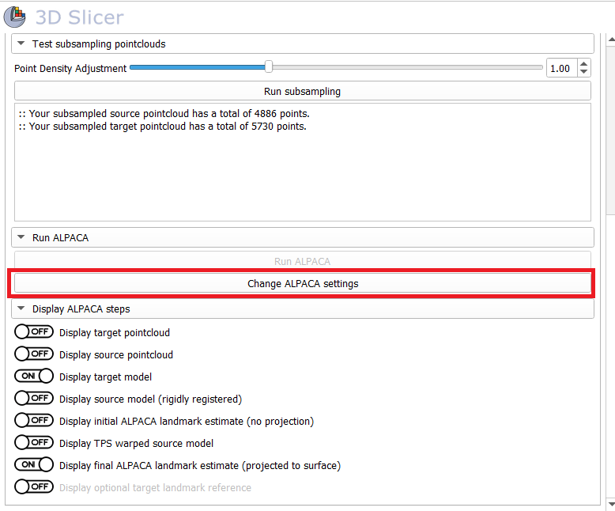

 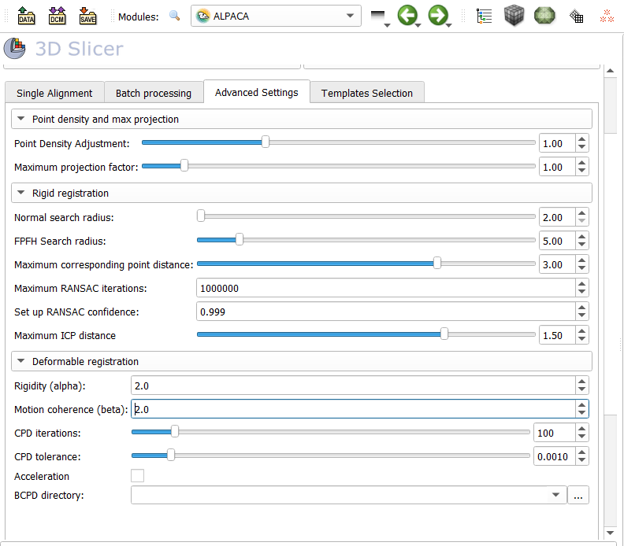

 

* In general, we do not recommend novice users to change these settings. The default settings have also achieved good performances for multiple datasets from different species. However, if any step of ALAPACA does not yield optimal results, users can experimenting tuning parameters to improve results. For details, please see: https://doi.org/10.1111/2041-210X.13689.
  * Because most steps of ALPACA is based on point cloud registration, users can adjust the `Point Density Adjustment` slider to alter the density of each point cloud. This has been overviewed in Step 3. This slider is synchronized with the `Point Density Adjustment` slider in the `Single Alignment` tab.
  * If global and rigid registration does not yield good alignment, several parameters can be adjusted: 
    * Increasing point density, which can lead to smaller voxel size, and possible improvement of the registration.
    * Increasing `maximum RANSAC iterations` and `RANSAC confidence` in the `Rigid registration` section. 
    * Other parameters in the `Rigid registration` section can also be fine tuned. 
  
  * If global and rigid registration is well, the `Deformable registration` parameters are the most likely ones to improve the quality of the registration. 
    * Parameter `Alpha` is a regularization parameter that tends to affect the length of the deformation vectors. Lower values of `Alpha` lead to larger overall deformations, and vice versa. 
    * Parameter `Beta`, on the other hand, is a regularization parameter that tends to affect the degree of motion coherence of neighboring points. Large values of `Beta` will lead to greater motion coherence among neighboring points, and vice versa.

After the `Run ALPACA` button is re-enabled, clicking it will generate a new set of ALPACA results in the `ALPACA_output_2` folder in the data module. The postcript of each node also increases by 1. This is for facilitating comparing results of different ALPACA sets. 
 * Now the `Display ALPACA steps` in the `Single Alignment` tab of the `ALPACA` module only displays the most recent ALPACA results. To compare two ALPACA results, go to the `data` module to manually display specific nodes. 

 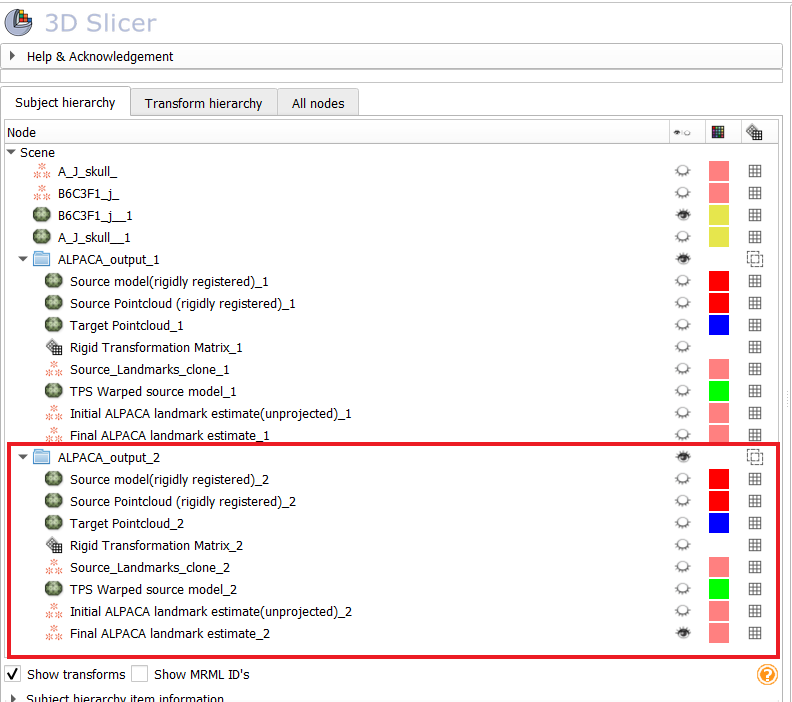

### Step 7 (Optional). Load a manual target landmark set as a reference for evaluating ALPACA performance.
An important way to evaluate the performace of ALPACA under a specific settings is to compare the landmark estimates with manual landmarks. The `Single Alignment` tab offers an option to load an fcsv file of the target manual landmark set. In the downloaded sample data, drag the `B6C3F1_j_.fcsv`, which is the manual landmark set for the target `B6C3F1_j_.ply` model, into Slicer, then select this file in the `Target Landmark Set (Optional)` drop-down menu. 

 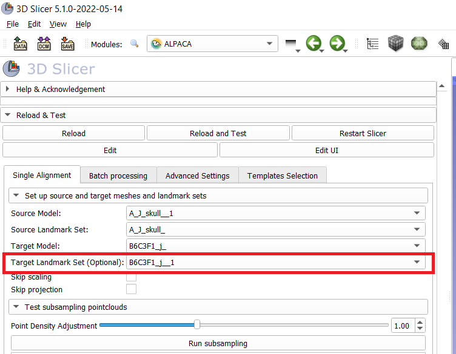

You can keep the default settings and click `Run ALPACA` button.

All other output remain the same with previous steps. You can toggle the switch buttons to display results of each step. The only addition is a table that shows the root mean square error (RMSE) between the ALPACA estimated landmark set and the imported manual landmark set of the target model. RMSE summarizes the positional differences between two landmark set. The smaller the RMSE, the closer two sets of landmarks are. 
* `ALPACA_3` at the first row of the table means that it is the 3rd ALPACA Single Alignment executed in the same Slicer scene. If you click `CTRL + W` and re-run the Single Alignment ALPACA for the same data, you will see `ALPACA_1` print out at the first row.
* You can also turn the switch button of `Display optional target landmark reference` to `On` to display the loaded target reference landmark set to compare with the ALPACA estimated landmark set as the picture below shows. 

 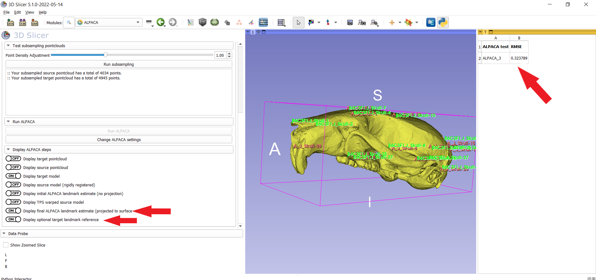

 
Now click the `Change ALPACA settings`, then return to the the `Single Alignment` tab. Click the `Run ALPACA` button again. You can see another RMSE has been calculated at the second row of the table for the current ALPACA. This allows you to compare how close the results from two rounds of ALPACA are to the target manual landmark set. 

 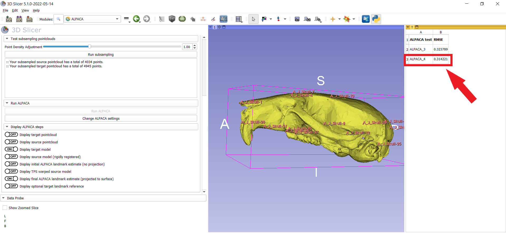

 
* You can see that even with the same settings, two ALPACAs yield slightly different RMSEs. This is because the global registration step is based on the RANSAC algorithm, a random sampling procedure. Thus, the result of global and rigid registration, which is the foundation of ALPACA, will yield slightly different alignment. Consequently, each run of ALPACA can yield slightly different landmark estimates. As long as the difference is minimal, as the example below shows, the results can be viewed as consistent. 

## Batch processing 

* As mentioned in the prior section, the main purpose of the `Single aligmment` tab is to find the best combination of hyperparameters for the task, so that they can be applied to a large array of specimens. In `ALPACA`, the parameters used in `Single alignment` tab get transferred to the `Batch processing` tab once that tab gets selected. 

* We can keep using the same sample data for the batch mode.

* In the `Batch processing` tab, click the drop-down menu of Method. You can see two options: the default option is `Single Template (ALPACA)`; another option is `Muli-template (MALPACA)`. We will work with the default option `Single Template (ALPACA)`. The multi-template option will be reviewed elsewhere. 
 
* Note that the `Batch processing` tab has much of the same elements as the `Single alignment` one. The main difference is the addition of a ` Target output landmark directory` box. 

* Select any model in the `Models` foler of the downloaded sample data dirctory as the `Source model` , and corresponding landmark file in the `LMs` folder as the `Source landmarks` fcsv file. Select the `Models folder` as the `Target model directory` that contains all target models to be landmarked, 

* Choose a local ` Target output landmark directory`. After this step, the `Run-autolandmarking` button can be pressed.

* We advise enabling the QC (quality control) option. When enabled, a basic quality control applied to the models to discover potential issues that may cause problem during the batch process. Models identified to be problematic is listed in the text box, after which the user is expected to take action (correct the issues, remove the models from the target directory, or ignore by disabling QC button). Note that problematic models will may crash ALPACA, meaning that all the jobs after that model will not run. As such we advise running the QC for long batch jobs to avoid stoppage. 

 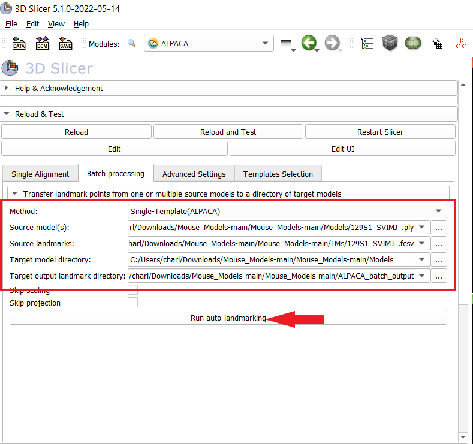

 

* The `ALPACA` module can be used synergistically with other `SlicerMorph` modules. Users can use not only manually annotated landmarks in the `ALPACA` pipeline, but also include semi-landmarks that were sampled on the 3D surface using the `Spherical Sampling` lab. The performance of the method can be explored using the GPA module to analyze the transferred landmarks.

