

# ALPACA I: Automated landmarking with a single template

## Introduction

**ALPACA** (Automated Landmarking through Point cloud Alignment and Correspondence Analysis) transfers landmarks from one 3D model that has them (the **source**, or template) to other models that do not (the **targets**). It works on point clouds sampled from the two surfaces:

1. Both models are reduced to point clouds of a few thousand points.
2. The source cloud is rigidly aligned to the target (a coarse global alignment, then a refinement), optionally with scaling.
3. The aligned source cloud is deformed onto the target cloud (a *deformable* registration), and the source landmarks are carried along.
4. The carried landmarks are projected onto the target surface.

Unlike patch-based landmarking, ALPACA does not need any fixed landmarks on the target. For the method and its validation, see Porto et al. (2021).

This is the first of five ALPACA tutorials:

1. **ALPACA I (this tutorial):** landmarking with a single template, first on one pair of skulls to understand the settings, then on a folder of skulls.
2. **[ALPACA II](../MALPACA/Consensus_atlas.md):** building a consensus atlas, an unbiased starting point for template selection.
3. **[ALPACA III](../MALPACA/K-means_templates_selection.md):** choosing a set of templates with K-means.
4. **[ALPACA IV](../MALPACA/MALPACA.md):** landmarking with several templates at once (MALPACA).
5. **[ALPACA V](Advanced_settings.md):** the advanced settings, how to tune them for your data, and BCPD acceleration.

## Get the sample data

All five tutorials use the **Mouse_Models** dataset: skull models of 62 inbred mouse strains, one specimen per strain, each with a set of 51 manually placed landmarks (Maga et al., 2017).

1. Go to [github.com/SlicerMorph/Mouse_Models](https://github.com/SlicerMorph/Mouse_Models).
2. Click the green **Code** button, then **Download ZIP**. The download is about 110 MB.
3. Extract the ZIP file. You get a folder called `Mouse_Models-main` with:
   - `Models/`: the 62 skull models, as `.ply` files (e.g. `A_J.ply`).
   - `LMs/`: the 51 landmarks of each skull, as `.mrk.json` files with the same names (e.g. `A_J.mrk.json`).

We extracted it to `/Users/Shared/ALPACA_Tutorial/`. Use any folder you like, but avoid paths that are synced to the cloud (OneDrive, iCloud Drive, Dropbox), since ALPACA writes many files.

## The ALPACA module

Open the **ALPACA** module (Modules → SlicerMorph → Geometric Morphometrics → ALPACA, or type `ALPACA` in the module finder).

ALPACA needs several Python packages (`itk`, `scikit-learn`, `itk-fpfh`, `itk-ransac`, `cpdalp`, `pandas`). The first time you run it, Slicer asks to install them. Accept, and wait until the installation finishes. It can take a few minutes, but happens only once.

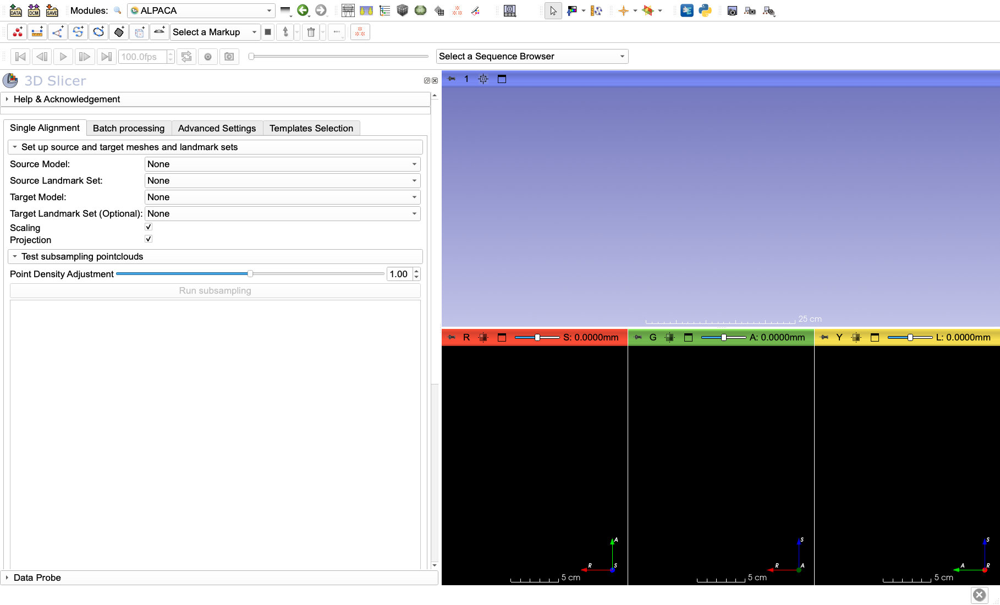

The module has four tabs:

- **Single Alignment:** landmarks one target from one source, and shows every intermediate step. Use it to check that the method works on your data and to tune the settings.
- **Batch processing:** applies the same settings to a whole folder of targets, with one template (ALPACA) or several (MALPACA, [ALPACA IV](../MALPACA/MALPACA.md)).
- **Advanced Settings:** the parameters of each step. The defaults work well for many datasets. Both of the other tabs use the values set here.
- **Templates Selection:** builds a consensus atlas and picks templates for MALPACA ([ALPACA II](../MALPACA/Consensus_atlas.md) and [III](../MALPACA/K-means_templates_selection.md)).

## Part 1: Single alignment

### Step 1. Load the source and target

We transfer the landmarks of the A/J skull to the B6C3F1 skull. Drag these three files from the extracted folder into Slicer (or use **Add Data**):

- `Models/A_J.ply`: the source model
- `LMs/A_J.mrk.json`: the source landmarks
- `Models/B6C3F1.ply`: the target model

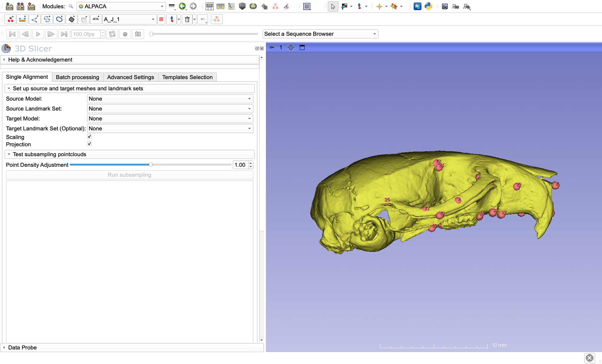

The two skulls overlap in the 3D view because they were scanned in the same orientation. ALPACA does not rely on this: it finds the alignment itself, so the models can start in any position and orientation.

The landmark node is called `A_J_1`, because Slicer adds `_1` to a name that is already used (here by the model `A_J`).

### Step 2. Select the inputs

On the **Single Alignment** tab, under **Set up source and target meshes and landmark sets**, choose:

- **Source Model:** `A_J`
- **Source Landmark Set:** `A_J_1`
- **Target Model:** `B6C3F1`
- **Target Landmark Set (Optional):** leave at `None` for now. We use it in step 6.

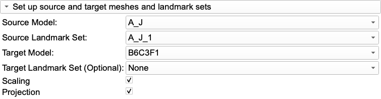

Leave both options checked:

- **Scaling** lets the rigid alignment also scale the source to the size of the target. Keep it on unless all your specimens are the same size and you need to preserve absolute size in the alignment.
- **Projection** moves the final landmark estimates onto the target surface.

### Step 3. Check the point clouds

ALPACA works on point clouds, not the full meshes. The **Point Density Adjustment** slider under **Test subsampling pointclouds** sets how densely points are sampled. At the default of 1.00, ALPACA aims for roughly 4,000–6,000 points per model, which works well in most cases. More points make every step slower without necessarily improving the result.

Click **Run subsampling**:

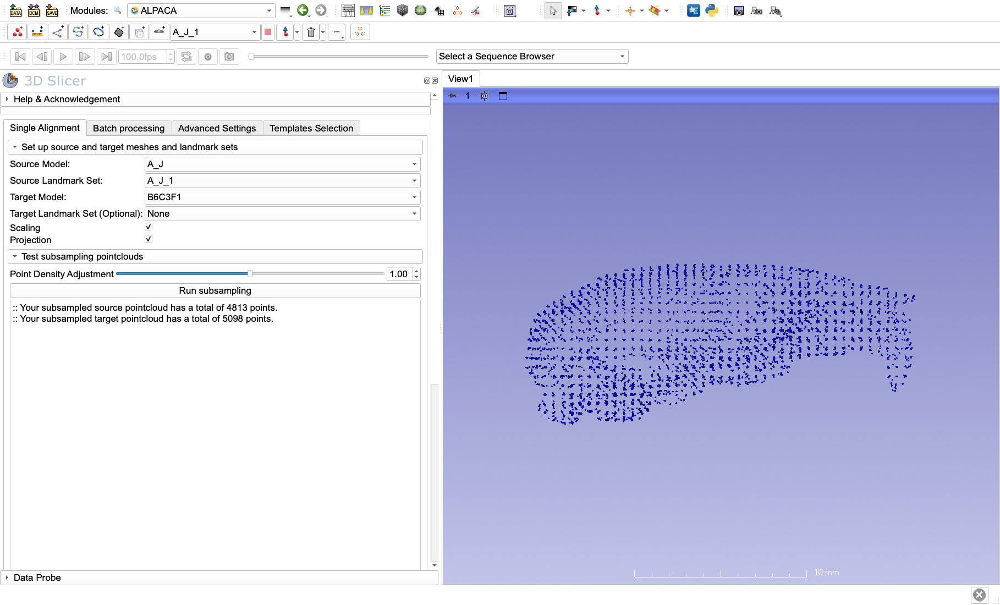

For our pair it reports 4,813 source points and 5,098 target points, and shows the target cloud in the 3D view. If your counts fall far outside the 4,000–6,000 range, move the slider and run the subsampling again. The same slider appears on the **Advanced Settings** tab; the two are kept in sync.

### Step 4. Run ALPACA

Click **Run ALPACA**. On our laptop it took about 3.5 minutes. The deformable registration is the slow part.

When it finishes, the 3D view shows the target model and the final landmark estimates:

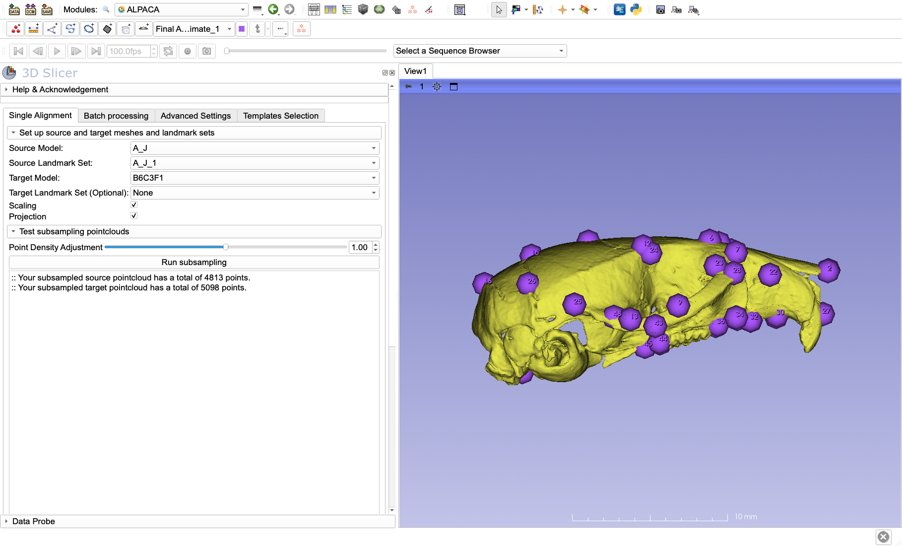

### Step 5. Look at each step

The **Display ALPACA steps** section has a checkbox for each intermediate result. Turn them on and off to follow the pipeline:

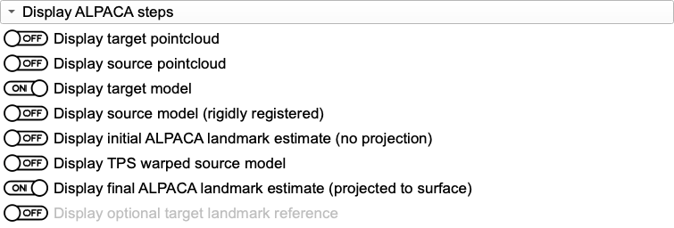

**Rigid alignment of the point clouds** (*Display source pointcloud* and *Display target pointcloud*): the source cloud (red) after the global and rigid alignment, on top of the target cloud (blue). They should overlap everywhere. Rotate the view to check.

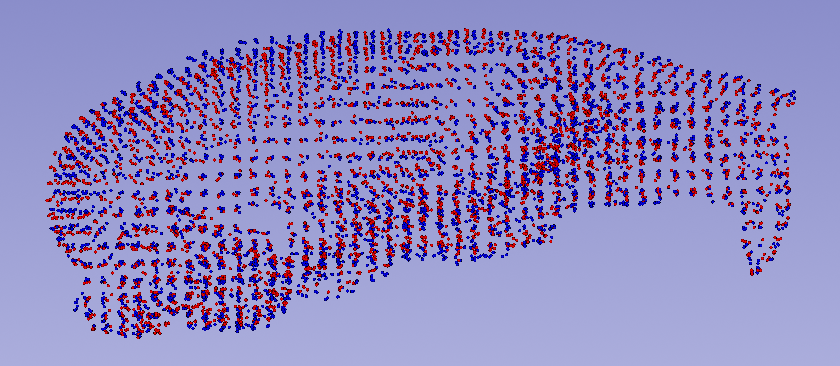

**Rigid alignment of the models** (*Display source model (rigidly registered)* and *Display target model*): the same alignment on the full models, which is easier to judge. The A/J skull (red) and the B6C3F1 skull (yellow) are well aligned overall, but their shapes differ, for example in the zygomatic arch and the snout. Copying landmarks at this stage would leave them in the wrong places, so a deformable step is needed.

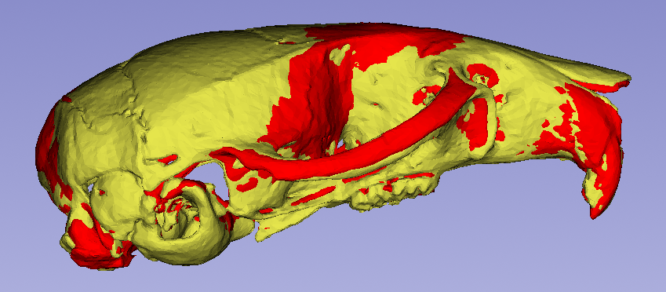

**Deformable registration** (*Display initial ALPACA landmark estimate (no projection)*): the source cloud is deformed onto the target cloud with Coherent Point Drift (CPD), and the landmarks move with it. These estimates are close to, but not exactly on, the target surface.

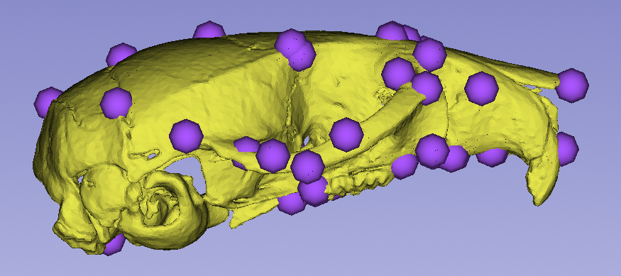

*Display TPS warped source model*: the source model warped with a thin-plate spline from the original to the deformed landmarks (green). Compare it with the rigid alignment above: the warped skull now matches the target (yellow) much more closely.

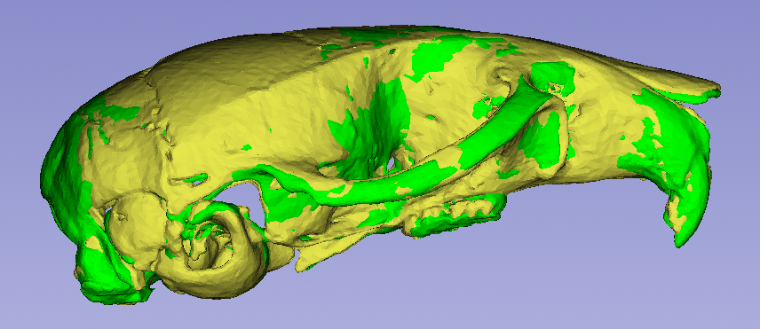

**Projection** (*Display final ALPACA landmark estimate (projected to surface)*): each estimate is projected onto the target surface. These are the final landmarks.

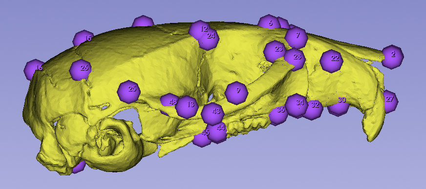

All these results are nodes in the scene, in a subject hierarchy folder called `ALPACA_output_1` (see the **Data** module). The Single Alignment tab does not save them to disk. Its purpose is to find settings that work, which you then use in batch mode. To keep a result, save it like any other node (**Save** button).

### Step 6. Measure the error against manual landmarks

If the target has manual landmarks, ALPACA can report how far its estimates are from them. Drag `LMs/B6C3F1.mrk.json` into Slicer and select it (`B6C3F1_1`) as **Target Landmark Set (Optional)**, then click **Run ALPACA** again.

After the run, a table appears next to the 3D view with the **root mean square error (RMSE)** between the ALPACA estimates and the manual landmarks, in the units of the model (here millimeters). Every run in the same scene adds a row (`ALPACA_2`, `ALPACA_3`, ...), so you can compare settings.

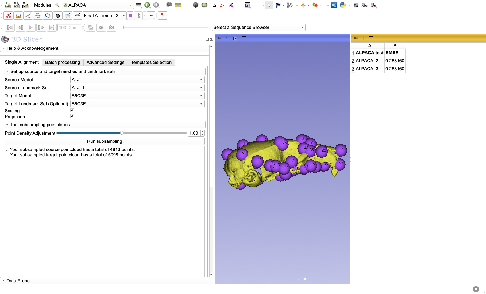

Here the RMSE is 0.26 mm. The typical landmark is 0.14 mm from its manual position (the median). The worst is landmark 10, at 0.69 mm. Check **Display optional target landmark reference** to show the manual landmarks (green) together with the estimates (purple). We made both glyphs smaller for this picture (Markups module → Display → Glyph Size).

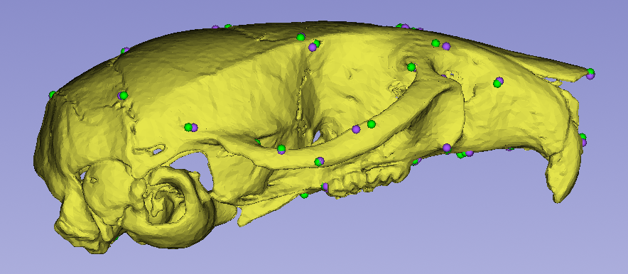

We ran it a second time with the same settings, and got the same RMSE. The global alignment uses a random search (RANSAC), but with the same inputs and settings the result was identical in our runs.

### Step 7. Changing the settings

After a run, **Run ALPACA** is disabled until something changes. Click **Change ALPACA settings** to jump to the **Advanced Settings** tab, or change an input or run the subsampling again.

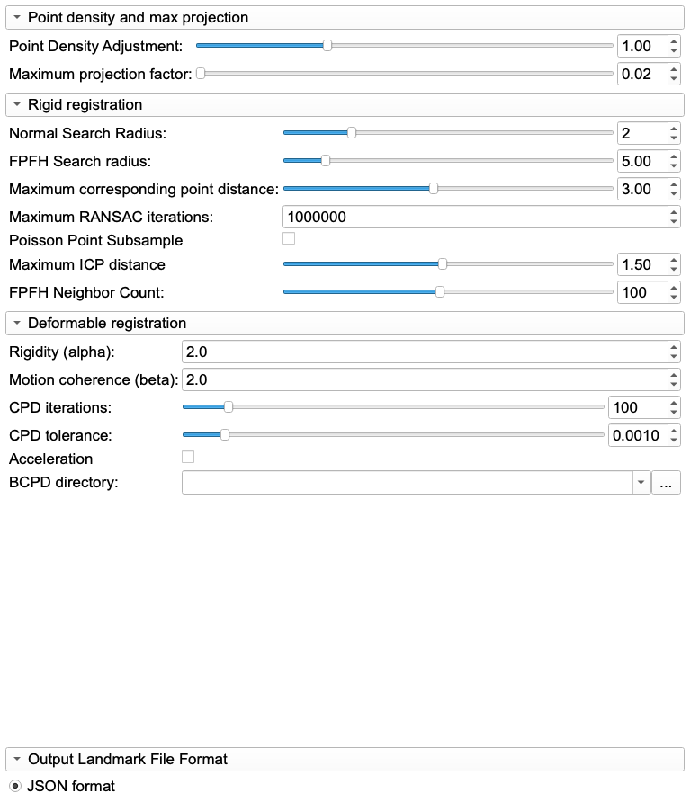

We do not recommend changing these without a reason. The defaults have worked well for skulls of many species. If a step goes wrong, these are the settings to look at:

- **Rigid alignment wrong** (the clouds in step 5 do not overlap): increase **Point Density Adjustment** or **Maximum RANSAC iterations**, or adjust the other **Rigid registration** parameters.
- **Rigid alignment right but landmarks off**: the **Deformable registration** parameters matter most.
  - **Rigidity (alpha):** lower values allow larger deformations.
  - **Motion coherence (beta):** higher values make neighboring points move more alike.
- **Acceleration:** runs the deformable step with the BCPD program, which is much faster. You need to build BCPD yourself and set its folder in **BCPD directory** ([ALPACA V](Advanced_settings.md#part-3-faster-deformable-registration-with-bcpd)). We left it off in these tutorials.

[ALPACA V](Advanced_settings.md) explains every setting, shows how to test settings on your own data, and how to install BCPD for acceleration.

## Part 2: Batch processing with one template

Once the settings work, apply them to many specimens on the **Batch processing** tab.

For this tutorial, make a folder called `targets` and copy four skulls into it from `Models`: `B6C3F1.ply`, `BALB_CJ.ply`, `CAST_EIJ.ply` and `NZO.ply`. They include a classical inbred strain (BALB/c), a large, obese one (NZO), a wild-derived strain (CAST/EiJ) and the F1 hybrid from Part 1. We use the same four targets again in [ALPACA IV](../MALPACA/MALPACA.md) to compare with multiple templates.

Then, on the **Batch processing** tab:

1. **Method:** `Single-Template(ALPACA)`.
2. **Source model(s):** the source model file, `Models/A_J.ply`.
3. **Source landmarks:** its landmarks, `LMs/A_J.mrk.json`.
4. **Target model directory:** the `targets` folder.
5. **Target output landmark directory:** an empty folder for the results (we used `ALPACA_batch_output`).

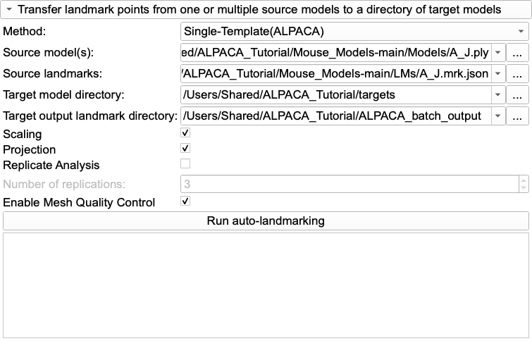

Leave **Enable Mesh Quality Control** checked. Before the run, it checks every model for problems that would stop the batch partway (empty meshes, meshes with invalid coordinates, files that fail to load) and lists them, so you can fix or remove them first.

Click **Run auto-landmarking**. Slicer is busy until the batch finishes. Our four targets took 11 minutes, under 3 minutes each, so a folder of 60 skulls would take about three hours. Start with a few specimens to check the output, then run the rest.

The output folder has one landmark file per target, named after it (`B6C3F1.mrk.json`, ...), plus `advancedParameters.txt` with every setting used. Keep that file with your data, so that you can report and repeat the run.

All four targets have manual landmarks in `LMs`, so we can check the results the same way as in step 6. The table shows the RMSE between the estimated and manual landmarks, in mm:

| Target | RMSE (mm) | Largest error (mm) |
|---|---|---|
| B6C3F1 | 0.26 | 0.69 (LM 10) |
| BALB_CJ | 0.36 | 1.25 (LM 47) |
| CAST_EIJ | 0.35 | 1.10 (LM 21) |
| NZO | 0.35 | 0.81 (LM 47) |

The B6C3F1 result is the same as the single alignment in Part 1. The other three are less accurate: they differ more from the A/J template. [ALPACA IV](../MALPACA/MALPACA.md) shows how multiple templates deal with that.

**Replicate Analysis** runs the whole batch several times into separate time-stamped folders, to check how stable the estimates are.

## Next steps

Landmarking with a single template works well when the targets are similar to the template. When a sample varies more, using several templates and taking the median of their estimates (MALPACA) is more accurate (Zhang et al., 2022). The next three tutorials show how to choose those templates without bias and run MALPACA:

- [ALPACA II: Building a consensus atlas](../MALPACA/Consensus_atlas.md)
- [ALPACA III: Selecting templates with K-means](../MALPACA/K-means_templates_selection.md)
- [ALPACA IV: Multi-template landmarking (MALPACA)](../MALPACA/MALPACA.md)
- [ALPACA V: Advanced settings, tuning, and BCPD acceleration](Advanced_settings.md)

The landmarks ALPACA produces are ordinary `.mrk.json` files, so you can analyze them in the [GPA module](../GPA_1/README.md).

## References

- Porto, A., Rolfe, S., and Maga, A. M. (2021). ALPACA: A fast and accurate computer vision approach for automated landmarking of three-dimensional biological structures. *Methods in Ecology and Evolution*, 12(11), 2129–2144. https://doi.org/10.1111/2041-210X.13689
- Zhang, C., Porto, A., Rolfe, S., Kocatulum, A., and Maga, A. M. (2022). Automated landmarking via multiple templates. *PLOS ONE*, 17(12), e0278035. https://doi.org/10.1371/journal.pone.0278035
- Maga, A. M., Tustison, N. J., and Avants, B. B. (2017). A population level atlas of *Mus musculus* craniofacial skeleton and automated image-based shape analysis. *Journal of Anatomy*, 231(3), 433–443. https://doi.org/10.1111/joa.12645
