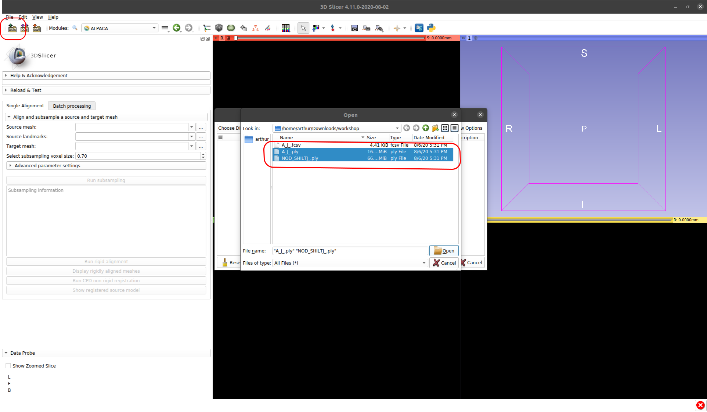
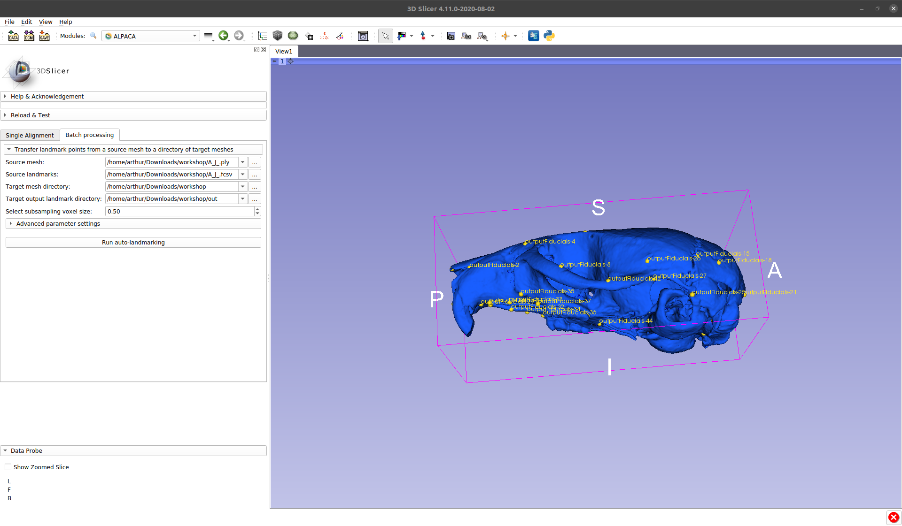

## Automated landmarking through pointcloud alignment and correspondence analysis (ALPACA)

`ALPACA` provides fast landmark transfer from a 3D model and its associated landmark set to target 3D model(s) through pointcloud alignment and deformable mesh registration. Unlike the Slicermorph's semi-landmark methods, it does not require presence of fixed landmarks. Optimal set of parameters that gives the best correspondence can be investigated (and outcome can be visualized) in single alignment mode, and then applied to a number of 3D models in batch mode. Invoked first time, `ALPACA` needs your permission to download `open3D` library. Depending on the internet speed, download may take sometime but it is a one-time event.

## Single Alignment

Download the ALPACA sample data set from the tutorial sample data folder. Open the ALPACA module.

:pencil2:  If this is the first time you are opening `ALPACA`, it will ask you if you are ok with installing `open3d`. If you are using a Windows machine, the installation process can take a few minutes. 

Otherwise, you should observe the following screen:

A closer examination of the module's main menu reveals that there are two main tabs in `ALPACA` : a `Single aligment` and a `Batch processing` one.

* __Single alignment options__

  * __Source mesh__: Under the `Source mesh`, the user is expected to select the path to the `*.ply` mesh file to be used as a template
  
  * __Source landmarks__: Under the `Source landmarks`, the user is expected to select the path to the `*.fcsv` file containing the landmarks to be transferred to the target mesh.
  
  * __Target mesh__: Under the `Target mesh`, the user is expected to select the path to the `*.ply` mesh file to be used as a target (i.e., the specimen we are interested in predicting landmark positions for).
  
  * __Select subsampling voxel size__: Under the `Select subsampling voxel size`, the user is expected to choose the voxel size to be used in subsampling the source mesh. This parameter is reported in `mm` and it will vary according to the absolute size of the specimen. Mouse specimens are usually subsampled around `0.5mm`, while Apes, for example, will generally have much higher values (e.g., `7mm`). In general, the goal should be to find a voxel size that results in a total of `5000 - 6000` points per mesh. This is essential for optimal performance and will be discussed further below.

 

 

* Note that the `Single aligment` tab also contains an `Advanced parameter settings` menu that can be expanded. This is generally not recommended for novice users, but hyperparameter tuning can significantly improve the end result. In general, the `Deformable registration` parameters are the most likely ones to improve the quality of the registration. Parameter `Alpha` is a regularization parameter that tends to affect the length of the deformation vectors. Lower values of `Alpha` lead to larger overall deformations, and vice versa. Parameter `Beta`, on the other hand, is a regularization parameter that tends to affect the degree of motion coherence of neighboring points. Large values of `Beta` will lead to greater motion coherence among neighboring points, and vice versa.

 

 

Now that we are acquainted with the overall layout of the module, let's start by looking at two example meshes. We can start by importing them using Slicer's data loading capabilities. Please click the `Data load` button, then navigate to the tutorial data folder, and load the following two meshes:

* `A_J_.ply`: A/J inbred mice are widely used to model cancer and for carcinogen testing given their high susceptibility to carcinogen-induced tumors.
* `NOD_SHILTJ_.ply`: NOD/ShiLtJ inbred mice are widely used as a polygenic model for autoimmune type 1 diabetes.

 * If everything worked properly, you should observe something that looks like this:

* As can be seen above, the two meshes lie in arbitrary positions in 3D space. Contrary to other approaches present in the literature, `ALPACA` can deal with arbitrary starting points. 

* But let's see `ALPACA` in action. Please clear your scene using `Ctrl + W`. Then let's return to the `ALPACA` module and select those two meshes under the `Single alignment` tab. 

* We will also load the `*.fcsv` file containing the landmarks that we wish to transfer from the source to the target meshes. Finally, let's select a subsampling voxel size of `0.5mm`.

* After selecting all four inputs, we can go ahead and press `Run subsampling`. 

* As seen below, `ALPACA` will print the number of points sampled in each mesh. It is essential to aim for `5000-6000` points per mesh, so the user has the option of pressing the `Run subsampling` as much as needed. A good follow-up exercise to this tutorial is to vary the number of sampled points per mesh and evaluating the impact it has on the performance of the method. 

* The `Run subsampling` button will also load a visual representation of the `Target` pointcloud into the 3D scene (in blue).

* Once we are satisfied with the number of sampled points, we can proceed with `rigid registration` steps of the pipeline by using the `Run rigid alignment` button. 

* This step will produce an output corresponding to the visual representation of the alignment between the `Source`(red) and `Target` (blue) pointclouds in the 3D scene. Please feel free to rotate those pointclouds in 3D space to make sure the alignment occured correctly.

* Depending on the complexity of the structure of interest, it may be hard to tell if the pointclouds are properly aligned. For that reason, `ALPACA` offers the users the option of displaying the rigid aligned meshes. Please press `Diplay rigid aligned meshes`. You should observe something as seen below. Again, feel free to rotate the 3D surfaces to make sure they are properly aligned. 

* In our example case (mice), you will notice that even though we get a proper alignment between the two strains, the `A_J` mice have a downward curved face when compared to the `NOD` mice. Note how the nasal bones are distant from each other. For that reason, simply transferring the landmarks after the rigid registration step is unlikely to produce good results.

* To further improve the quality of the alignment, we need to be able to deform the `Source` mesh to match the `Target` one. We can obtain the deformable alignment by pressing `Run CPD non-rigid registration`. Note that the non-rigid step is by far the longest (time) step of the pipeline. In modern laptops, this should take around 2 or 3 minutes. 

* You should get as an output the final landmark predictions in the form of `Fiducial` points. In the `Single alignment` tab, the output fiducials are not saved into a file. In part, this is because the role of the `Single alignment's` tab main role is to find the best combination of parameters necessary to transfer landmarks between specimens. These parameters can then be transferred to the `Batch processing` tab to process an entire specimen folder. 

* Note that, as a final step the `Single alignment` pipeline, the user has the option of visualizing the registered `Source` model (i.e., deformed `Source` mesh). Simply press `Show registered source model` to obtain the deformed mesh (green). Note how the alignment of the nasal bone is much better than prior to the deformed step. The same is true for posterior part of the zygomatic arch.

* The changes can be more easily visualized by navigating back the `Data` module and hiding all outputs with the exception of the `Target` (blue) and `Warped Source Model` (green). 

## Batch processing 

* As mentioned in the prior section, the main purpose of the `Single aligmment` tab is to find the best combination of hyperparameters for the task, so that they can be applied to a large array of specimens. In `ALPACA`, the parameters used in `Single alignment` tab get transferred to the `Batch processing` tab once that tab gets selected. 

* Note that the `Batch processing` tab has much of the same elements as the `Single alignment` one. The main difference is the addition of a ` Target output landmark directory` box. Before an output directory gets selected, the `Run-autolandmarking` button cannot be pressed.

* So, let's select an output folder! You should note that once the folder is selected, the `Run-autolandmarking` button becomes active. Once pressed, the analysis will proceed by iterating through all `*.ply` files contained in the `Target mesh directory`. Depending on the number of specimens, this will take a considerable amount of time. In most modern laptops, an average of `4-5min` per specimen should be expected. An output `*.fcsv` file will be produced for each specimen using the same name as the original `*.ply` files.

* The `ALPACA` module can also be used synergistically with other `SlicerMorph` modules. Users can use not only manually annotated landmarks in the `ALPACA` pipeline, but also include semi-landmarks that were sampled on the 3D surface using the `Spherical Sampling` lab. The performance of the method can be explored using the GPA module to analyze the transferred landmarks.

