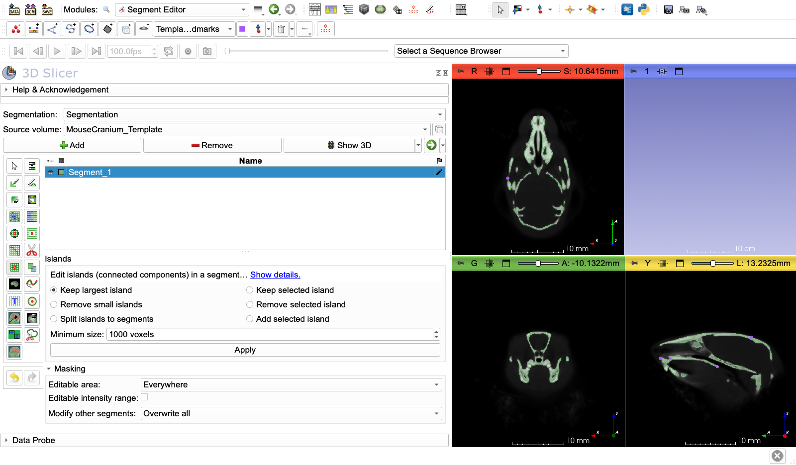
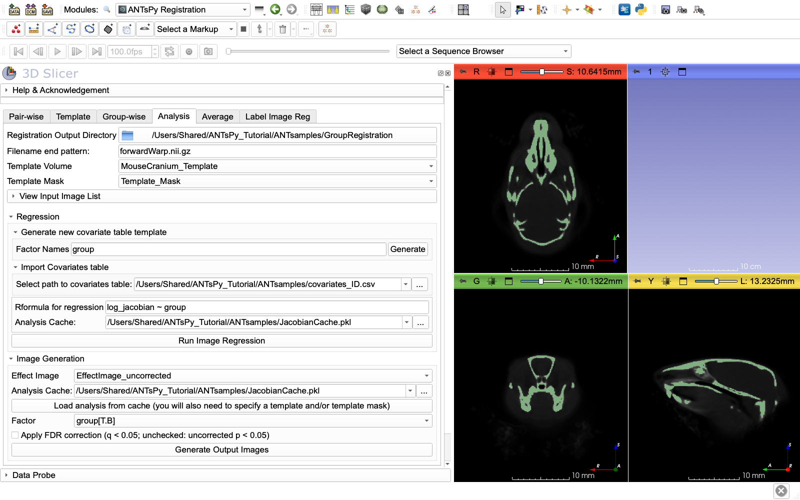
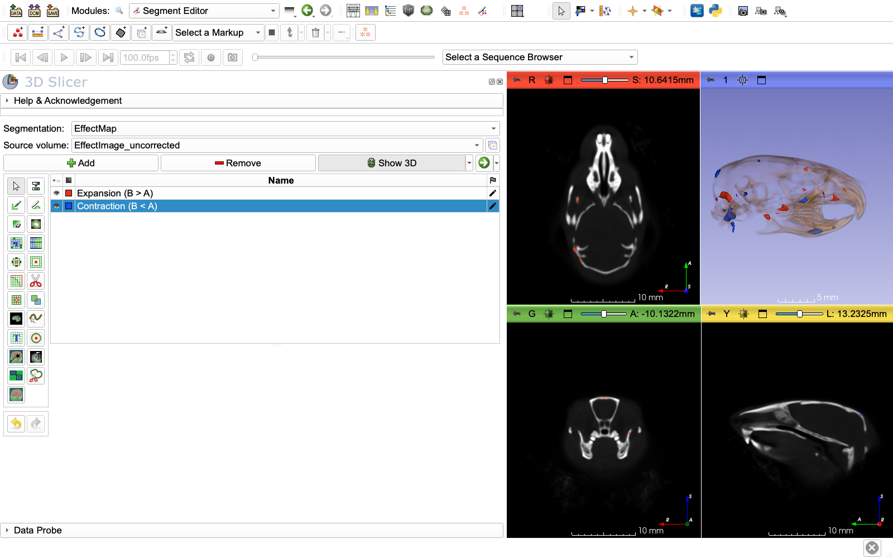

# ANTsPy-VI: Analysis tab, template mask and Jacobian analysis

Previous: [ANTsPy-V: Group-wise tab, registering all specimens to the template](Groupwise_template.md) | Next: [ANTsPy-VII: Pair-wise tab, registering one image to another](Pairwise.md)

---

## Create a Template Mask for Statistical Analysis (Segment Editor)

Before performing Jacobian analysis, we need to create a mask that defines the anatomical region of interest. This restricts the statistical analysis to biologically relevant structures (skull and mandible) and excludes background, soft tissue, and other elements.

**Why create a mask?**
- **Reduces computational load:** We don't analyze every voxel in the image
- **Focuses on relevant anatomy:** Only skull and mandible for craniometric analysis
- **Improves statistical power:** Multiple comparison correction is less severe with fewer voxels
- **Excludes artifacts:** Background noise and reconstruction artifacts are excluded
- **Biological relevance:** We're interested in bone shape, not soft tissue or air

### Load the Template

1. If not already loaded: `File → Add Data`
2. Select `MouseCranium_Template.nii.gz`
3. Click `Open`, then `OK`

### Open Segment Editor Module

1. In the module search bar, type "Segment"
2. Select **Segment Editor**

### Create New Segmentation

1. **Segmentation:** Click the dropdown
2. Select **"Create new Segmentation"**
3. A new segmentation node appears in the scene

4. **Source geometry:**
   - Click the dropdown
   - Select `MouseCranium_Template`
   - This ensures the segmentation matches the template geometry

### Segment the Skull and Mandible

We'll use semi-automatic and manual tools to define the cranium and mandible.

#### Method 1: Threshold-based Segmentation (Faster)




1. **Add a new segment:**
   - Click **"Add"** button
   - Name it "Skull_Mandible"
   - Choose a color (e.g., yellow)

2. **Use Threshold effect:**
   - Select **"Threshold"** from the Effects list
   - Adjust the threshold sliders to capture bone:
     - Drag the minimum slider until skull/mandible appears
     - Drag the maximum slider to exclude very bright artifacts
     - **Tip:** Start with automatic threshold, then refine manually
   - Click **"Apply"**

3. **Clean up the segmentation:**
   - **Islands effect:**
     - Select **"Islands"**
     - Choose "Keep largest island"
     - Click **"Apply"**
     - This removes small disconnected pieces
   
   - **Smoothing effect:**
     - Select **"Smoothing"**
     - Choose "Median" method
     - Kernel size: 3-5 voxels. The kernel is entered in mm and rounded to a whole, odd number of voxels: for this data (0.141 mm voxels), 0.5 mm gives a 3-voxel and 0.7 mm a 5-voxel kernel
     - Click **"Apply"**
     - This reduces noise and stair-stepping


4. **Remove unwanted structures:**
   - If soft tissue, nasal turbinates, or other elements are included:
   - Use **"Scissors"** effect:
     - Select "Scissors"
     - Choose "Erase inside" or "Erase outside"
     - Draw around regions to remove
     - Click **"Apply"**
   
   - Use **"Paint"** effect for manual refinement:
     - Select "Paint"
     - Adjust sphere brush size
     - Hold Shift to erase, regular click to add
     - Paint in each slice view to refine boundaries

#### Method 2: Manual Segmentation (More Control)

If automatic threshold doesn't work well:

1. **Use "Draw" effect:**
   - Select **"Draw"** from Effects
   - Draw around the skull outline in each slice
   - Work through Red, Yellow, and Green slice views
   - Time-consuming but very accurate

2. **Use "Level Tracing":**
   - Select **"Level Tracing"**
   - Click points around the boundary
   - It traces edges between points
   - Faster than manual drawing

3. **Combine with "Fill between slices":**
   - Segment every 5-10 slices manually
   - Use **"Fill between slices"** effect to interpolate
   - Review and refine interpolated slices

### Verify the Segmentation

1. **Toggle visibility:**
   - Click the eye icon next to the segment
   - Verify it covers skull and mandible only
   - Check in all three slice views

2. **Use 3D view:**
   - The segmentation appears as a 3D surface
   - Rotate to check coverage
   - Look for holes or included unwanted structures

3. **Adjust transparency:**
   - In Segment Editor, adjust opacity slider
   - Overlay on the template volume to verify accuracy

### Refine Specific Regions

**Include:**
- ✅ Cranium (all skull bones)
- ✅ Mandible (lower jaw)
- ✅ Zygomatic arches
- ✅ Occipital region

**Exclude:**
- ❌ Nasal turbinates (thin internal structures)
- ❌ Teeth (if analyzing cranial shape only)
- ❌ Soft tissue
- ❌ Background and air
- ❌ Cervical vertebrae (if visible)

**Tip:** The goal is to include the bony structures relevant to your morphometric question while excluding everything else.

### Export Segmentation as Label Map

1. In **Segment Editor**, click **"Segmentations"** button (or go to Segmentations module)

2. In the **Segmentations** module:
   - Select your segmentation, and rename it `Template_Mask-label` (the exported file is named after the segmentation, and the `-label` suffix makes Slicer load the file as a label map)
   - Under **"Export/Import"** section
   - Click **"Export to files"**

3. Configure export:
   - **Destination:** Choose `ANTsamples/`
   - **File format:** Select "NRRD" or "NIfTI"
   - The file is saved as `Template_Mask-label.nrrd` (or `.nii.gz`)
   - Click **"Export"**

**Alternative export method:**
1. Right-click the segmentation in Data module
2. Select **"Export visible segments to binary labelmap"**
3. This creates a labelmap node
4. Right-click the labelmap → Export to file
5. Save as `Template_Mask-label.nrrd`


### Load the Mask for Analysis

1. `File → Add Data`
2. Select `Template_Mask-label.nrrd`
3. The mask appears as a labelmap volume (the `-label` in the file name checks **LabelMap** in the Add Data options)
4. Verify it loaded correctly by displaying it

**The mask is now ready to use in Jacobian analysis!**

---

## Jacobian Analysis

Jacobian determinant analysis quantifies local volume changes (expansion/contraction) between each specimen and the template. We'll compare two groups of mouse strains, restricting analysis to the skull and mandible mask we just created.

### Prepare Group Assignment

Since you'll provide a CSV file later, we'll use a random split for now.

#### Create a Covariate Table

1. Create a text file: `ANTsamples/covariates.csv`

2. Add this content (random group assignment):

```csv
ID,group
129S1_SVLMJ_,A
129X1_SVJ_,B
AKR_J_,A
A_J_,B
B6AF1_J_,A
B6D2F1_J_,B
BALB_CBYJ_,A
BALB_CJ_,B
BTBR_T_Itpr3tf_j_,A
C3H_HEJ_,B
C3H_HEOUJ_,A
C57BL6_J_,B
C57BL_10J_,A
C57BL_6NJ_,B
C57L_J_,A
CAF1_J_,B
CAST_EIJ_,A
CB6F1_J_,B
CBA_CAJ_,A
CBA_J_,B
DBA_1J_,A
DBA_2J_,B
FVB_NJ_,A
MRL_MPJ_,B
NOD_SHILTJ_,A
NU_J_,B
NZBWF1_J_,A
NZW_LACJ_,B
SJL_J_,A
TALLYHO_JNGJ_,B
```

3. Save the file

**Note:** When you provide your real CSV file later, replace this with your actual groupings. The CSV must have:
- A column named `ID`: the specimen name (e.g. `C57BL6_J_`) or the name of its warp file (e.g. `C57BL6_J_-0forwardWarp.nii.gz`). Rows are matched to the files by this ID, so their order does not matter.
- Column 2: `group` (categorical factor)
- Optional: Additional columns for covariates (age, sex, etc.)

Alternatively, **Generate new covariate table template** (in the **Regression** section of the Analysis tab) writes a table with one row per input file, with the file names as IDs, for you to fill in.


### Open the Analysis Tab

1. In **ANTsPyRegistration** module
2. Click the **"Analysis"** tab

### Configure Jacobian Analysis Inputs

#### A. Registration Output Directory

- **Registration Output Directory:** Click folder icon
- Navigate to `ANTsamples/GroupRegistration/`
- Select the folder containing your registration outputs

#### B. Filename Pattern

- **Filename end pattern:** Keep the default, `forwardWarp.nii.gz`
  - This matches the forward deformable warp files from group registration
  - The module will find all files ending with this pattern
  - Example: finds `C57BL6_J_-0forwardWarp.nii.gz`, `BALB_CJ_-0forwardWarp.nii.gz`, etc.
  - **Important:** We use only the deformable component (the forward warp), NOT the composite or affine transforms
  - This isolates local shape changes from global scaling/rotation effects


#### C. Template Volume

- **Template Volume:** Select your template from the dropdown
  - `MouseCranium_Template` (or whatever you named it)
  - If not loaded: `File → Add Data` to load it first

#### D. Template Mask (Required)

- **Template Mask:** Select `Template_Mask-label` from the dropdown
  - This is the skull/mandible segmentation created in the first part of this document
  - Restricts analysis to biologically relevant bone structures
  - Excludes background, air spaces, and soft tissue
  - **Critical:** Without a mask, analysis includes irrelevant voxels and wastes computation
  - If you skipped that part, go back and create the mask now

### Load Input Images

The module needs to know which transform files correspond to which specimens.

1. Click the **"View Input Image List"** collapsible button

2. The list should auto-populate with files matching your pattern

3. Verify you see 30 files listed

If the list is empty:
- Double-check the directory path
- Verify the filename pattern (`forwardWarp.nii.gz`)
- Make sure forward warp files exist in that directory
- Ensure you selected "Separate files" (not "Composite") during group registration

### Configure Regression Analysis

Expand the **"Regression"** section.

#### Import Covariates Table

1. Expand **"Import Covariates table"**
2. **Select path to covariates table:** Click the folder icon
3. Navigate to `ANTsamples/covariates.csv`
4. Select the file

The module will read your CSV and extract factor variables.

#### Set Regression Formula

1. **Rformula for regression:** Enter:
   ```
   log_jacobian ~ group
   ```

   **Explanation:**
   - `log_jacobian` - dependent variable (computed by ANTs)
   - `~` - regressed on
   - `group` - your factor variable from the CSV
   - This tests if group A and B differ in local volume

   **Advanced formulas:**
   - `log_jacobian ~ group + age` - Include age as covariate
   - `log_jacobian ~ group * sex` - Test interaction effects
   - `log_jacobian ~ C(group, Treatment('A'))` - Set reference group

2. **Analysis Cache:** Click folder icon
   - Select a location to save results: `ANTsamples/JacobianCache.pkl`
   - This saves the analysis so you can reload it later without recomputing
   - Useful for trying different visualizations

### Run Jacobian Analysis

1. Click **"Run Image Regression"**

2. **What happens:**
   - Jacobian determinant maps are computed from each deformation field
   - Log transformation is applied (log_jacobian)
   - Statistical regression is performed at each voxel
   - Results are saved to the cache file

3. **Progress:**
   - This is computationally intensive
   - **Time estimate:** 5-15 minutes depending on image size and CPU
   - Watch the Python console for progress messages

4. **Completion:**
   - Button becomes available again
   - Results are cached and ready for visualization

### Generate Statistical Maps

Expand the **"Image Generation"** section.

#### Configure Output Image

1. **Effect Image:** Select **"Create new ScalarVolume"**
   - This will create a volume with the effect of the factor (its regression coefficient, a difference in log-Jacobian) at the voxels where it is significant, and 0 elsewhere
   - Defaults to name `EffectImage`
   - Rename if desired (e.g., `MouseCranium_Effect_GroupComparison`)

2. **Analysis Cache:** Click folder icon
   - Select `ANTsamples/JacobianCache.pkl` (the file you just created)
   - This loads the pre-computed analysis

3. **Factor:** Select `group[T.B]`
   - This is the effect of group B compared with group A (the reference group)
   - If you had multiple factors, you'd choose which one to map

4. **Apply FDR correction:** Leave checked
   - Checked: a voxel is significant when its FDR-corrected q-value is below 0.05
   - Unchecked: when its uncorrected p-value is below 0.05

#### Generate Images

1. Click **"Generate Output Images"**

2. **What happens:**
   - Voxels where the groups differ significantly are found
   - The effect image is created and appears in the Data module
   - The status bar reports the number of significant voxels

#### Why the FDR Correction Matters

Generate the image twice, once with **Apply FDR correction** unchecked (name it e.g. `EffectImage_uncorrected`) and once checked (`EffectImage_FDR`). With the random grouping of this tutorial, 2,283 of the 100,276 voxels in the mask have an uncorrected p-value below 0.05, but none has a q-value below 0.05 (the smallest is 0.915). The groups do not differ, yet a test at p < 0.05 repeated at a hundred thousand voxels finds thousands of "significant" voxels by chance alone. The FDR correction accounts for the number of tests, and nothing survives it.



### Visualize Results

#### View the Effect Image

1. In the **Volumes** module:
   - Select your effect image (e.g., `EffectImage_uncorrected`)

2. **Interpretation:**
   - **Positive values:** group B has locally larger volume than group A (expansion)
   - **Negative values:** group B has locally smaller volume than group A (contraction)
   - **0:** not significant, or outside the mask

#### Create a Threshold Map

To see the significant regions:

1. Go to **Segment Editor** module
2. Create a new segmentation, with the effect image as **Source volume**
3. Use **Threshold** effect twice:
   - A segment for positive effects: set range from just above 0 (e.g. 0.000001) to the maximum, click "Apply"
   - A segment for negative effects: set range from the minimum to just below 0 (e.g. -0.000001), click "Apply"
4. This creates maps of the regions where group B is larger (expansion) and smaller (contraction)



*The uncorrected effect image, thresholded into voxels where group B is larger (red, 875 voxels) and smaller (blue, 1,408 voxels). With the FDR correction the effect image is empty.*

#### Overlay on Template

1. In **Data** module:
   - Load both template and effect image
2. In **Volumes** module:
   - Set template as background
   - Set the effect image as foreground
   - Adjust foreground opacity slider

#### Generate 3D Visualization

1. Go to **Volume Rendering** module
2. Select your effect image
3. Click the eye icon to enable rendering
4. Adjust **Shift** slider to set threshold
5. Change colormap to highlight significant regions

### Export Results

Save your analysis results:

1. **Effect image:**
   - Right-click in Data module → Export to file
   - Save as `MouseCranium_Effect_GroupAvsB.nii.gz`

2. **Analysis cache:**
   - Already saved as `JacobianCache.pkl`
   - Can reload for future analyses

3. **Screenshots:**
   - Use Slicer's screenshot feature: Ctrl+Shift+G (Cmd+Shift+G on Mac)
   - Or module menu → Screen Capture

### Interpretation Guidelines

**Jacobian Determinant Values:**
- **J > 1**: Local expansion relative to template
- **J = 1**: No volume change
- **J < 1**: Local contraction relative to template

**Log-Jacobian (used in regression):**
- **log(J) > 0**: Expansion
- **log(J) = 0**: No change
- **log(J) < 0**: Contraction

**Effect image:**
- The value at a voxel is the difference in log-Jacobian between the groups (group B minus group A), shown only where it is significant
- With **Apply FDR correction**, significant means q < 0.05 (5% FDR); without it, uncorrected p < 0.05

**Example Biological Interpretation:**
If the effect image shows positive values (significant after FDR correction) in the frontal region, group B has relatively larger frontal bones than group A.

---

## Summary

You've completed a full morphometric analysis pipeline:

1. ✅ **Obtained data** from GitHub repository (30 mouse specimens)
2. ✅ **Prepared reference specimen** by reorienting to anatomical axes
3. ✅ **Created rigid average** from all specimens to minimize bias
4. ✅ **Built a population template** using landmark-initialized, iterative registration
5. ✅ **Registered all specimens** to the template with deformable transforms
6. ✅ **Created anatomical mask** to focus analysis on skull and mandible
7. ✅ **Performed Jacobian analysis** to identify regions of significant group differences
8. ✅ **Visualized results** as statistical maps and 3D renderings

### Key Files Created

- `NZBWF1_J_reoriented.nii.gz` - Reference specimen aligned to anatomical axes
- `RigidAverage_Template.nii.gz` - Average of rigidly aligned specimens
- `RigidAverage_Landmarks.mrk.json` - Average landmark positions
- `MouseCranium_Template.nii.gz` - Final population-averaged template
- `Template_Mask-label.nrrd` - Skull and mandible mask for statistical analysis
- `GroupRegistration/*-1forwardAffine.mat` - Affine transform components
- `GroupRegistration/*-0forwardWarp.nii.gz` - Deformable warp fields (used for Jacobian analysis)
- `GroupRegistration/*-transformed.nii.gz` - Registered volumes
- `JacobianCache.pkl` - Cached statistical analysis
- `EffectImage.nii.gz` - Group differences at the significant voxels

### Next Steps

- Replace random groupings with your real experimental design CSV
- Create anatomical masks for region-specific analysis
- Test different covariates and interactions
- Export data for external statistical analysis
- Generate publication-quality figures

---

Previous: [ANTsPy-V: Group-wise tab, registering all specimens to the template](Groupwise_template.md) | Next: [ANTsPy-VII: Pair-wise tab, registering one image to another](Pairwise.md)
