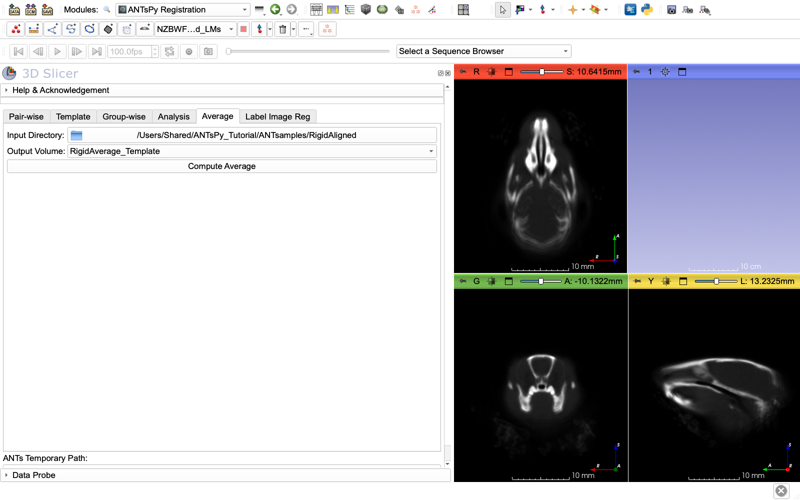

# ANTsPy-III: Average tab, an average reference volume

Previous: [ANTsPy-II: Group-wise tab, rigid alignment to the reference](Groupwise_rigid.md) | Next: [ANTsPy-IV: Template tab, building a population template](Template.md)

---

Now we'll create an average of all rigidly aligned specimens. This becomes our unbiased initial reference volume to initialize the iterative template building procedure.

## Open ANTsPyRegistration Module - Average Tab

1. In the **ANTsPyRegistration** module
2. Click the **"Average"** tab

## Configure Average Settings

1. **Input directory:** Click the folder icon
   - Navigate to `ANTsamples/RigidAligned/`
   - Select the folder containing all rigidly aligned volumes
   - The module will automatically find all .nii.gz files in this directory

2. **Output Volume:** Click the dropdown
   - Select **"Create new Volume"**
   - It will create a node called `Volume`
   - Rename it to `RigidAverage_Template` (click on the name to edit)

## Run Averaging

1. Click **"Compute Average"**

2. **What happens:**
   - The module loads all .nii.gz files from the input directory
   - Computes the voxel-wise mean across all volumes
   - Creates the output averaged volume
   - **Time estimate:** 1-2 minutes depending on image size

3. **Completion:**
   - The averaged volume `RigidAverage_Template` appears in the Data module
   - Verify it loaded correctly by displaying in slice viewers




## Save the Average Template

1. Right-click `RigidAverage_Template` in the Data module
2. Select **"Export to file..."**
3. Save as `ANTsamples/RigidAverage_Template.nii.gz`

## Create Average Landmarks (REQUIRED)

**Critical:** You must average the landmark positions to match your averaged volume. There is no tool in ANTsPy extension to do that. We will use a simple python script to do this in Slicer.

1. **Load all transformed landmark files:**
   - `File → Add Data`
   - Navigate to `ANTsamples/RigidAligned/`
   - Select all 30 `*-transformed.mrk.json` files
   - Click `Open`, then `OK`

2. **Average the landmarks using Python:**
   - Go to **Python Interactor** (View → Python Interactor)
   - Run this script:

```python
import numpy as np
import slicer

# List all loaded landmark nodes (the transformed ones from RigidAligned folder)
# Adjust these names to match what was loaded (typically specimen_-transformed)
landmarkNames = [
    "129S1_SVLMJ_-transformed",
    "129X1_SVJ_-transformed",
    "AKR_J_-transformed",
    "A_J_-transformed",
    "B6AF1_J_-transformed",
    "B6D2F1_J_-transformed",
    "BALB_CBYJ_-transformed",
    "BALB_CJ_-transformed",
    "BTBR_T_Itpr3tf_j_-transformed",
    "C3H_HEJ_-transformed",
    "C3H_HEOUJ_-transformed",
    "C57BL6_J_-transformed",
    "C57BL_10J_-transformed",
    "C57BL_6NJ_-transformed",
    "C57L_J_-transformed",
    "CAF1_J_-transformed",
    "CAST_EIJ_-transformed",
    "CB6F1_J_-transformed",
    "CBA_CAJ_-transformed",
    "CBA_J_-transformed",
    "DBA_1J_-transformed",
    "DBA_2J_-transformed",
    "FVB_NJ_-transformed",
    "MRL_MPJ_-transformed",
    "NOD_SHILTJ_-transformed",
    "NU_J_-transformed",
    "NZBWF1_J_-transformed",
    "NZW_LACJ_-transformed",
    "SJL_J_-transformed",
    "TALLYHO_JNGJ_-transformed"
]

# Get landmark nodes
markupNodes = [slicer.util.getNode(name) for name in landmarkNames]

# Get point arrays
pointArrays = [slicer.util.arrayFromMarkupsControlPoints(node) for node in markupNodes]

# Verify all have same number of points
numPoints = [arr.shape[0] for arr in pointArrays]
if len(set(numPoints)) != 1:
    print(f"ERROR: Not all landmark sets have same number of points: {set(numPoints)}")
else:
    print(f"All {len(pointArrays)} landmark sets have {numPoints[0]} points")
    
    # Compute average
    avgPoints = np.mean(pointArrays, axis=0)
    
    # Create new markup node
    avgMarkups = slicer.mrmlScene.AddNewNodeByClass('vtkMRMLMarkupsFiducialNode', 'RigidAverage_Landmarks')
    
    # Add averaged points
    for i in range(avgPoints.shape[0]):
        avgMarkups.AddControlPoint(avgPoints[i])
    
    print(f"Average landmarks created: RigidAverage_Landmarks with {avgPoints.shape[0]} points")
```

3. Save the averaged landmarks:
   - Right-click `RigidAverage_Landmarks` in Data module
   - Export to file → `ANTsamples/RigidAverage_Landmarks.mrk.json`

**Verify:** The averaged landmarks should have 45 points (same as each individual specimen) and be positioned at the mean location of all specimens' landmarks.

## Discussion: Reference Specimen Bias

**Important considerations:**

1. **Shape bias is reduced but not eliminated:**
   - The rigid average reduces bias from any single specimen
   - However, if your sample is not representative of the full population, bias remains
   - Example: If all specimens are adult males, the template won't represent females/juveniles

2. **The reference affects final template geometry:**
   - Template building is iterative, but initial geometry influences convergence
   - Very different initial references may lead to slightly different final templates
   - For most analyses, this effect is small if you use 2+ iterations

3. **Alternative: No initial template:**
   - Setting "Initial Template" to `None` it uses the first sample in your pool as the reference. We don't advise doing that except for testing purposes. 
 
**For this tutorial:** Using a rigid average provides a good balance between computational efficiency and minimizing bias.

---

Previous: [ANTsPy-II: Group-wise tab, rigid alignment to the reference](Groupwise_rigid.md) | Next: [ANTsPy-IV: Template tab, building a population template](Template.md)
