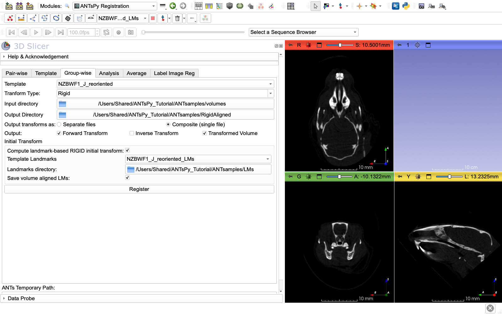

# ANTsPy-II: Group-wise tab, rigid alignment to the reference

Previous: [ANTsPy-I: Data and reference specimen](Data_and_reference.md) | Next: [ANTsPy-III: Average tab, an average reference volume](Average.md)

---

Now we'll register all specimens to the reoriented reference using rigid registration. This brings them into a common space without changing their shape. We'll use the **Group-wise** registration tab to process all specimens at once.

## Open ANTsPyRegistration Module - Group-wise Tab

1. In the module search bar, type "ANTsPy"
2. Select **ANTsPyRegistration**
3. Click the **"Group-wise"** tab

## Configure Rigid Registration Settings

1. **Template:** Select `NZBWF1_J_reoriented`
   - This is your reoriented reference specimen
   - All other specimens will be aligned to this

2. **Transform Type:** Select `Rigid`
   - Only rotation and translation, no scaling or deformation
   - Preserves the original shape and size of each specimen

3. **Input directory:** Click the folder icon
   - Navigate to `ANTsamples/volumes/`
   - Select the `volumes` folder
   - This will process all .nii.gz files in this directory

4. **Output Directory:** Click the folder icon
   - Create a new folder: `ANTsamples/RigidAligned/`
   - Select it
   - All rigidly aligned volumes will be saved here

5. **Output transforms as:** Select `Composite (single file)` or `Separate files`
   - Either option works for rigid transforms since there will be only one output file.
   
6. **Output:** Check these boxes:
   - ☑ **Forward Transform** - Saves the rigid transformation
   - ☐ **Inverse Transform** - Not needed for this step, as all linear transformations (rigid, similarity, affine) are invertable.
   - ☑ **Transformed Volume** - **REQUIRED** - This is what we need for averaging

## Configure Landmark-based Initial Transform

To ensure accurate rigid alignment:

1. Check ☑ **"Compute landmark-based RIGID initial transform"**

2. **Template Landmarks:** Select `NZBWF1_J_reoriented` landmarks
   - These are the landmarks for your reoriented reference

3. **Landmarks directory:** Click folder icon
   - Navigate to `ANTsamples/LMs/`
   - Select the `LMs` folder
   - The module automatically matches landmarks to volumes by basename

4. ☑ **Save volume aligned LMs** (REQUIRED)
   - **Must check this** to save transformed landmarks
   - These are essential for creating averaged landmarks in [ANTsPy-III](Average.md)
   - Creates files with `-transformed.mrk.json` suffix
   - Without these, you cannot compute the average landmark positions for the averaged image.

## Run Group-wise Rigid Registration

1. Click **"Register"**

2. **What happens:**
   - Each volume in the input directory is rigidly registered to `NZBWF1_J_reoriented`
   - This will result in every transformed volume having the same orientation and image dimensions and resolution as the reference image. 
   - Landmark-based rigid transform is computed first for initialization
   - Final rigid registration refines the alignment
   - Outputs are saved to `ANTsamples/RigidAligned/`

3. **Progress:**
   - Button text: "Group registration in progress"
   - 30 specimens will be processed sequentially
   - **Time estimate:** 5-15 minutes total (~10-30 seconds per specimen)
   - Much faster than deformable registration!

4. **Completion:**
   - Button returns to "Register"
   - Check the output directory for results

## Verify Outputs

Navigate to `ANTsamples/RigidAligned/` and you should see:

**For each specimen:**
- `[specimen]-forward.h5` - Rigid transform file
- `[specimen]-transformed.nii.gz` - **Rigidly aligned volume** (required for averaging)
- `[specimen]-transformed.mrk.json` - **Transformed landmarks** (required for averaging)

**Total:** 30 rigidly aligned volumes + 30 transformed landmark sets ready for averaging

## Verify Rigid Alignment

1. Load the reference: `File → Add Data → NZBWF1_J_reoriented.nii.gz`
2. Load several rigidly aligned volumes from `ANTsamples/RigidAligned/`:
   - `C57BL6_J_-transformed.nii.gz`
   - `BALB_CJ_-transformed.nii.gz`
   - `DBA_2J_-transformed.nii.gz`

3. In the **Data** module:
   - Toggle visibility between reference and aligned volumes
   - They should be in the same position and orientation
   - Individual shape differences should be clearly visible
   - No warping or deformation (only rotation/translation)

---

Previous: [ANTsPy-I: Data and reference specimen](Data_and_reference.md) | Next: [ANTsPy-III: Average tab, an average reference volume](Average.md)
