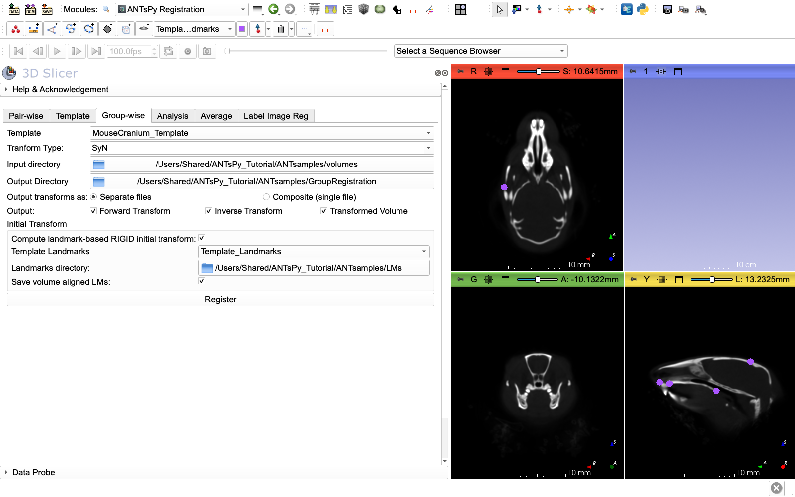
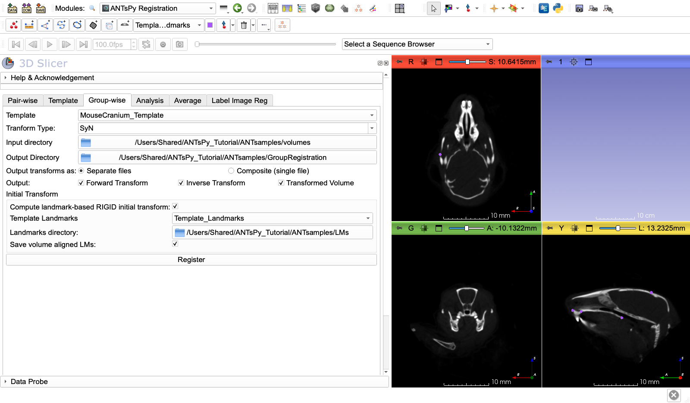

# ANTsPy-V: Group-wise tab, registering all specimens to the template

Previous: [ANTsPy-IV: Template tab, building a population template](Template.md) | Next: [ANTsPy-VI: Analysis tab, template mask and Jacobian analysis](Analysis.md)

---

Now we'll register all individual specimens to the template and save the deformation fields (needed for Jacobian analysis). These deformations are going to be used to calculate systematic localized shape difference between groups. 

## Open the Group-wise Tab

Click the **"Group-wise"** tab

## Configure Registration Settings

### A. Select Template

- **Template:** Select your template volume from the dropdown
  - If you just created it: select `MouseCranium_Template` (or whatever you named it)
  - If you saved and reloaded: use `File → Add Data` to load it first

### B. Transform Type

- **Transform Type:** Select `SyN`
  - Must match what you saved as the output of the  template building
  - SyN provides deformable registration

### C. Input Directory

- **Input directory:** Click the folder icon
- Navigate to `ANTsamples/volumes/`
- Select the `volumes` folder
- This will process all .nii.gz files in this directory

### D. Output Directory

- **Output Directory:** Click the folder icon
- Create a new folder: `ANTsamples/GroupRegistration/` (or similar)
- Select it
- All output transforms and volumes will be saved here

### E. Output Transform Options

- **Output transforms as:** Select `Separate files`
  - Creates individual forward and inverse transform files
  - **Required for Jacobian analysis** to isolate deformable component
  - Composite transforms include affine component of the deformation that can mask subtle shape differences

**Why separate files?**
- Jacobian analysis should use only the deformable (warp) component
- Composite transforms combine affine + deformable transformations
- The affine component (global scaling/rotation) can dominate and obscure local shape variations
- Separate files allow you to use only the forward warp for statistical analysis

**Understanding the output structure:**

When you select "Separate files", ANTs creates a multi-step transformation for each specimen:

1. **Forward affine component** (`*-1forwardAffine.mat`):
   - Global alignment (rotation, translation, scaling, shearing)
   - Applied first to roughly align specimen to template
   - Small file (a few hundred bytes)
   - Example: `C57BL6_J_-1forwardAffine.mat`

2. **Forward deformable warp** (`*-0forwardWarp.nii.gz`):
   - Local, non-linear deformations
   - Captures shape differences after global alignment
   - Large image file (a displacement vector for every voxel of the template; about 100 MB for this data)
   - **This is what we use for Jacobian analysis**
   - Example: `C57BL6_J_-0forwardWarp.nii.gz`

3. **Inverse transform** (`*-0inverseAffine.mat` and `*-1inverseWarp.nii.gz`) - Optional:
   - Reverses the forward transform
   - Useful for mapping results back to original specimen space
   - The warp is the same size as the forward warp
   - Example: `C57BL6_J_-0inverseAffine.mat`, `C57BL6_J_-1inverseWarp.nii.gz`

**Files per specimen:**
- If you check **only Forward Transform**: 2 files (1 affine + 1 forward warp)
- If you check **both Forward and Inverse**: 4 files (forward affine and warp + inverse affine and warp)

**For 30 specimens:**
- Forward only: 60 files total (30 affines + 30 forward warps)
- Forward + Inverse: 120 files total

The numbers (0, 1) give the position of each file in the list of transforms that ANTs returns. ANTs applies such a list from the last to the first: for the forward transform, the affine (1) first, then the deformable warp (0).

### F. Select Outputs to Save

Check the boxes for what you want:

- ☑ **Forward Transform** - **REQUIRED** for Jacobian analysis (deformable component)
- ☐ **Inverse Transform** - Optional, but suggested (useful for mapping results back to specimen space)
- ☑ **Transformed Volume** - Optional, but suggested (useful to verify registration quality)

**Important:** You MUST save forward transforms for Jacobian analysis!

## Configure Initial Transform (Landmark-based)

To improve registration accuracy:

1. Check ☑ **"Compute landmark-based RIGID initial transform"**

2. **Template Landmarks:** Select `Template_Landmarks` from the dropdown
   - These are the average landmarks you created during template building

3. **Landmarks directory:** Click folder icon
   - Navigate to `ANTsamples/LMs/`
   - Select the `LMs` folder
   - The module will automatically match landmarks to volumes by basename

4. ☑ **Save volume aligned LMs** (Optional)
   - Check this to save the transformed landmarks
   - Useful for validation and quality control
   - Creates files with `-transformed.mrk.json` suffix

## Run Group Registration

1. Click **"Register"**

2. **What happens:**
   - Each volume in the input directory is registered to the template
   - Landmark-based rigid transform is computed first
   - Then deformable registration (SyN) is applied
   - Outputs are saved to the output directory

3. **Progress:**
   - Button text: "Group registration in progress"
   - 30 specimens will be processed sequentially
   - **Time estimate:** 15-45 minutes total (~30-90 seconds per specimen)

4. **Completion:**
   - Button returns to "Register"
   - Check the output directory for results

## Verify Outputs

Navigate to `ANTsamples/GroupRegistration/` and you should see:

**For each specimen (example for C57BL6_J_):**
- `C57BL6_J_-1forwardAffine.mat` - Affine transform component
- `C57BL6_J_-0forwardWarp.nii.gz` - **Forward deformable warp** (used for Jacobian analysis)
- `C57BL6_J_-0inverseAffine.mat` and `C57BL6_J_-1inverseWarp.nii.gz` - Inverse transform (if you enabled inverse transforms)
- `C57BL6_J_-transformed.nii.gz` - Registered volume (if you checked that option)
- `C57BL6_J_-transformed.mrk.json` - Transformed landmarks (if you checked that option)

**Total files:**
- 30 forward affine transforms (.mat files)
- 30 forward warps (.nii.gz files) - **These are used for Jacobian analysis**
- 30 inverse affines and 30 inverse warps (if selected)
- 30 transformed volumes (if selected)
- 30 transformed landmarks (if selected)

## Quality Control

To verify registration quality:

1. Load the template in Slicer: `File → Add Data → MouseCranium_Template.nii.gz`
2. Load a few transformed volumes: 
   - `C57BL6_J_-transformed.nii.gz`
   - `BALB_CJ_-transformed.nii.gz`
   - `DBA_2J_-transformed.nii.gz`

3. In the **Data** module:
   - Toggle visibility between template and transformed volumes
   - They should be well-aligned
   - Anatomical features should overlap

4. Use the **Markups** module to check landmark alignment:
   - Load template landmarks and a few transformed landmark sets
   - They should be close to each other

---

Previous: [ANTsPy-IV: Template tab, building a population template](Template.md) | Next: [ANTsPy-VI: Analysis tab, template mask and Jacobian analysis](Analysis.md)
