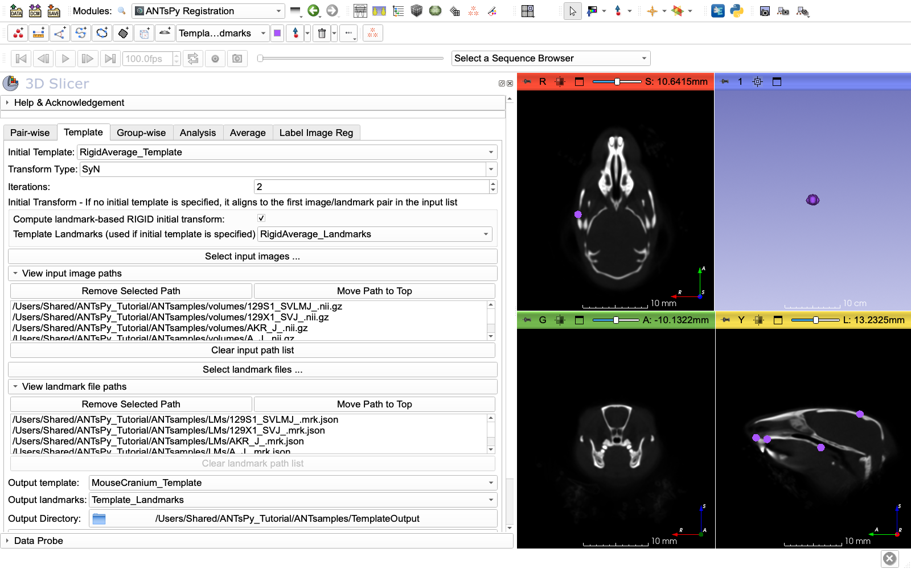

# ANTsPyRegistration Tutorial: Mouse Craniometric Analysis

A comprehensive guide to template building, registration, and Jacobian analysis using the SlicerANTsPy extension.

## Table of Contents
1. [Introduction](#introduction)
2. [Prerequisites](#prerequisites)
3. [Step 1: Obtaining the Data](#step-1-obtaining-the-data)
4. [Step 2: Loading Data into 3D Slicer](#step-2-loading-data-into-3d-slicer)
5. [Step 3: Prepare a Reference Specimen (Crop Volume)](#step-3-prepare-a-reference-specimen-crop-volume)
6. [Step 4: Group-wise Tab - Rigidly Align All Specimens to the Reference](#step-4-group-wise-tab---rigidly-align-all-specimens-to-the-reference)
7. [Step 5: Average Tab - Create an Average Reference Volume](#step-5-average-tab---create-an-average-reference-volume)
8. [Step 6: Template Tab - Build a Population Template](#step-6-template-tab---build-a-population-template)
9. [Step 7: Group-wise Tab - Register All Specimens to the Template](#step-7-group-wise-tab---register-all-specimens-to-the-template)
10. [Step 8: Create a Template Mask for Statistical Analysis (Segment Editor)](#step-8-create-a-template-mask-for-statistical-analysis-segment-editor)
11. [Step 9: Analysis Tab - Jacobian Analysis](#step-9-analysis-tab---jacobian-analysis)
12. [Pair-wise Tab - Register One Image to Another](#pair-wise-tab---register-one-image-to-another)
13. [Troubleshooting](#troubleshooting)
14. [Advanced Topics](#advanced-topics)

---

## Introduction

This tutorial demonstrates a complete morphometric analysis workflow using the **ANTsPyRegistration** module in 3D Slicer. You will:
- Create one canonically oriented sample as a reference
- Build a population-averaged template from mouse microCT scans
- Register individual specimens to the template
- Perform statistical shape analysis using Jacobian determinants
- Compare morphological variation between groups

**Dataset:** Low-resolution mouse head microCT scans from 30 different inbred and hybrid mouse strains, with 45 craniometric landmarks per specimen. Landmarks are necessary to provide an initial alignment, as most automated registration methods fail if the positional difference between two volumes are too large. Most cases you do not need as many landmark to do an approximate alignment, 4-8 are usually enough.

**Biological Context:** Mouse strains exhibit cranial shape variation due to genetic differences. This tutorial shows how to quantify and analyze these differences.

---

## Prerequisites

### Software Requirements

#### 3D Slicer
- Download and install the **latest stable** version of 3D Slicer from [slicer.org](https://download.slicer.org/)

#### SlicerANTsPy Extension 
Install the ANTsPy Extension from the Extension Catalogue

### Hardware Recommendations
We advise to run this tutorial using [MorphoCloudInstances](https://morphocloud.org) as registration operations are memory and compute intensive. Standard MorphoCloud instances (g3.l) provide 60GB of RAM and 16 cores. 
If you plan to use your own computer, we advise using a computer with at least **16G of RAM**. Similarly we advise using a **CPU** with many cores as the registration will benefit from increased parallelism. 
---

## Step 1: Obtaining the Data

### Clone the Repository

Open a terminal (Mac/Linux) or Git Bash (Windows) and run:

```bash
cd ~/Desktop
git clone https://github.com/muratmaga/ANTsamples.git
```

This will create a folder `ANTsamples` with the following structure:

```
ANTsamples/
├── LMs/           # 30 landmark files (.mrk.json)
└── volumes/       # 30 volume files (.nii.gz)
```


### Verify the Data

Check that you have 30 paired files:

```bash
cd ANTsamples
ls volumes/*.nii.gz | wc -l    # Should show: 30
ls LMs/*.mrk.json | wc -l      # Should show: 30
```

### Sample List

The dataset includes these mouse strains (we'll use all 30 for this tutorial):

- **C57BL6_J_** - C57BL/6J (most common laboratory strain)
- **BALB_CJ_** - BALB/cJ 
- **DBA_1J_** - DBA/1J
- **DBA_2J_** - DBA/2J
- **C3H_HEJ_** - C3H/HeJ
- **AKR_J_** - AKR/J
- **129S1_SVLMJ_** - 129S1/SvlmJ
- **FVB_NJ_** - FVB/NJ
- ... and 22 more strains

---

## Step 2: Loading Data into 3D Slicer

### Launch 3D Slicer and Load Sample Volumes

1. Open 3D Slicer
1. Go to `File → Add Data`
2. Click `Choose File(s) to Add`
3. Navigate to `ANTsamples/volumes/`
4. Select these files (hold Ctrl/Cmd to select multiple):
   - `C57BL6_J_.nii.gz`
   - `BALB_CJ_.nii.gz`
   - `DBA_2J_.nii.gz`
5. Click `Open`, then `OK`

### Load Corresponding Landmarks

1. Go to `File → Add Data`
2. Click `Choose File(s) to Add`
3. Navigate to `ANTsamples/LMs/`
4. Select the corresponding landmark files:
   - `C57BL6_J_.mrk.json`
   - `BALB_CJ_.mrk.json`
   - `DBA_2J_.mrk.json`
5. Click `Open`, then `OK`

### Visualize the Data

1. In the **Data** module, you should see:
   - 3 volumes (scalar volumes)
   - 3 markups (fiducial nodes with 45 points each)

2. To view a volume:
   - Click on `C57BL6_J_` in the Data module
   - It will appear in the slice viewers (Red, Yellow, Green windows)
   - Use the mouse wheel to scroll through slices
   - Use the **3D** view to see the full volume

3. To view landmarks:
   - In the **Markups** module, select `C57BL6_J__1` from the dropdown (a landmark file loaded after a volume with the same name gets the suffix `_1`)
   - Landmarks will appear as small spheres on the skull
   - Adjust visibility/size in the Display section if needed


### Understanding the data better

- None of the samples are oriented canonically; slice planes to not correspond to anatomical planes.
- Landmarks are in millimeters (mm)
- Each specimen has 45 anatomical landmarks on the skull

---

## Step 3: Prepare a Reference Specimen (Crop Volume)

Before building the template, we need to prepare a reference specimen that will serve as the initial template. This involves reorienting the specimen to align with anatomical planes and creating an average from rigidly aligned samples.

### Why Use a Reference Specimen?

Using a reference specimen (rather than starting from scratch) has advantages and disadvantages:

**Advantages:**
- Faster convergence during template building
- More anatomically meaningful starting point
- Easier to interpret results in consistent anatomical orientations

**Disadvantages:**
- **Shape bias:** The final template may retain some shape characteristics of the reference specimen
- **Size bias:** Initial size of the reference influences the template
- **Asymmetry bias:** If the reference has asymmetries, these may persist
- **Selection bias:** Choosing one strain over others introduces systematic bias

**Best Practice:** To minimize bias, we'll create an average of rigidly aligned specimens rather than using an actual specimen from our dataset as references. This provides a reasonable starting point while reducing individual specimen bias.

### Reorient a Reference Specimen

We'll use the **NZBWF1_J_** specimen as our initial reference and reorient it so the major axes align with anatomical planes.

#### Load the Reference Specimen

0. Reset the scene to remove other data.
1. `File → Add Data`
2. Select `ANTsamples/volumes/NZBWF1_J_.nii.gz` and `ANTsamples/LMs/NZBWF1_J_.mrk.json`
3. Click `Open`, then `OK`. The landmarks are loaded as `NZBWF1_J__1`, because the volume already has the name `NZBWF1_J_`.

#### Open the Crop Volume Module

1. In the module search bar, type "Crop"
2. Select **Crop Volume**
3. Set **Input volume** to `NZBWF1_J_`, expand **Reorient volume** and click **Initialize**. This creates a transform, `Reorient_NZBWF1_J_`, and rotation handles in the slice and 3D views.
4. Rotate the volume with the handles until the anatomical planes are aligned with the slice views.

For detailed instructions, see the [CropVolume tutorial](https://github.com/SlicerMorph/Tutorials/blob/main/Slicer_Modules/Crop_Volume/Readme.MD#using-cropvolume-to-simulatenously-reorient-and-resample-your-data).


#### Reorient the Landmarks

**Important:** Do this before you apply the reorientation. Applying it deletes the `Reorient_NZBWF1_J_` transform, and the landmarks must be moved with the same transform.

1. Open the **Transforms** module and select `Reorient_NZBWF1_J_` as the **Active Transform**
2. Under **Apply transform**, move the landmarks (`NZBWF1_J__1`) to the **Transformed** list
3. Click **Harden transform** to make it permanent

#### Apply Reorientation

1. In **Crop Volume**, click **Apply** under **Reorient volume**. The rotation is written into the volume, and the `Reorient_NZBWF1_J_` transform is removed.
2. Resample the volume onto the anatomical axes: set **Input ROI** to **Create new ROI**, open the menu next to **Fit to Volume** and choose **Align to world axes + Resize**, click **Fit to Volume**, then click the main **Apply**.
3. The reoriented volume appears in the scene with the **cropped** suffix (`NZBWF1_J_ cropped`)
4. Verify in slice viewers that anatomical planes are aligned with slice views.
5. Save the result: Right-click `NZBWF1_J_ cropped` → Export to file
   - Save as `ANTsamples/NZBWF1_J_reoriented.nii.gz`
6. Save the landmarks (`NZBWF1_J__1`) as `NZBWF1_J_reoriented.mrk.json` in the same folder.


---

## Step 4: Group-wise Tab - Rigidly Align All Specimens to the Reference

Now we'll register all specimens to the reoriented reference using rigid registration. This brings them into a common space without changing their shape. We'll use the **Group-wise** registration tab to process all specimens at once.

### Open ANTsPyRegistration Module - Group-wise Tab

1. In the module search bar, type "ANTsPy"
2. Select **ANTsPyRegistration**
3. Click the **"Group-wise"** tab

### Configure Rigid Registration Settings

1. **Template:** Select `NZBWF1_J_reoriented`
   - This is your reoriented reference specimen
   - All other specimens will be aligned to this

2. **Transform Type:** Select `Rigid`
   - Only rotation and translation, no scaling or deformation
   - Preserves the original shape and size of each specimen

3. **Input directory:** Click the folder icon
   - Navigate to `ANTsamples/volumes/`
   - Select the `volumes` folder
   - This will process all .nii.gz files in this directory

4. **Output Directory:** Click the folder icon
   - Create a new folder: `ANTsamples/RigidAligned/`
   - Select it
   - All rigidly aligned volumes will be saved here

5. **Output transforms as:** Select `Composite (single file)` or `Separate files`
   - Either option works for rigid transforms since there will be only one output file.
   
6. **Output:** Check these boxes:
   - ☑ **Forward Transform** - Saves the rigid transformation
   - ☐ **Inverse Transform** - Not needed for this step, as all linear transformations (rigid, similarity, affine) are invertable.
   - ☑ **Transformed Volume** - **REQUIRED** - This is what we need for averaging

### Configure Landmark-based Initial Transform

To ensure accurate rigid alignment:

1. Check ☑ **"Compute landmark-based RIGID initial transform"**

2. **Template Landmarks:** Select `NZBWF1_J_reoriented` landmarks
   - These are the landmarks for your reoriented reference

3. **Landmarks directory:** Click folder icon
   - Navigate to `ANTsamples/LMs/`
   - Select the `LMs` folder
   - The module automatically matches landmarks to volumes by basename

4. ☑ **Save volume aligned LMs** (REQUIRED)
   - **Must check this** to save transformed landmarks
   - These are essential for creating averaged landmarks in Step 5
   - Creates files with `-transformed.mrk.json` suffix
   - Without these, you cannot compute the average landmark positions for the averaged image.


### Run Group-wise Rigid Registration

1. Click **"Register"**

2. **What happens:**
   - Each volume in the input directory is rigidly registered to `NZBWF1_J_reoriented`
   - This will result in every transformed volume having the same orientation and image dimensions and resolution as the reference image. 
   - Landmark-based rigid transform is computed first for initialization
   - Final rigid registration refines the alignment
   - Outputs are saved to `ANTsamples/RigidAligned/`

3. **Progress:**
   - Button text: "Group registration in progress"
   - 30 specimens will be processed sequentially
   - **Time estimate:** 5-15 minutes total (~10-30 seconds per specimen)
   - Much faster than deformable registration!

4. **Completion:**
   - Button returns to "Register"
   - Check the output directory for results

### Verify Outputs

Navigate to `ANTsamples/RigidAligned/` and you should see:

**For each specimen:**
- `[specimen]-forward.h5` - Rigid transform file
- `[specimen]-transformed.nii.gz` - **Rigidly aligned volume** (required for averaging)
- `[specimen]-transformed.mrk.json` - **Transformed landmarks** (required for averaging)

**Total:** 30 rigidly aligned volumes + 30 transformed landmark sets ready for averaging


### Verify Rigid Alignment

1. Load the reference: `File → Add Data → NZBWF1_J_reoriented.nii.gz`
2. Load several rigidly aligned volumes from `ANTsamples/RigidAligned/`:
   - `C57BL6_J_-transformed.nii.gz`
   - `BALB_CJ_-transformed.nii.gz`
   - `DBA_2J_-transformed.nii.gz`

3. In the **Data** module:
   - Toggle visibility between reference and aligned volumes
   - They should be in the same position and orientation
   - Individual shape differences should be clearly visible
   - No warping or deformation (only rotation/translation)

---

## Step 5: Average Tab - Create an Average Reference Volume

Now we'll create an average of all rigidly aligned specimens. This becomes our unbiased initial reference volume to initialize the iterative template building procedure.

### Open ANTsPyRegistration Module - Average Tab

1. In the **ANTsPyRegistration** module
2. Click the **"Average"** tab

### Configure Average Settings

1. **Input directory:** Click the folder icon
   - Navigate to `ANTsamples/RigidAligned/`
   - Select the folder containing all rigidly aligned volumes
   - The module will automatically find all .nii.gz files in this directory

2. **Output Volume:** Click the dropdown
   - Select **"Create new Volume"**
   - It will create a node called `Volume`
   - Rename it to `RigidAverage_Template` (click on the name to edit)

### Run Averaging

1. Click **"Compute Average"**

2. **What happens:**
   - The module loads all .nii.gz files from the input directory
   - Computes the voxel-wise mean across all volumes
   - Creates the output averaged volume
   - **Time estimate:** 1-2 minutes depending on image size

3. **Completion:**
   - The averaged volume `RigidAverage_Template` appears in the Data module
   - Verify it loaded correctly by displaying in slice viewers


### Save the Average Template

1. Right-click `RigidAverage_Template` in the Data module
2. Select **"Export to file..."**
3. Save as `ANTsamples/RigidAverage_Template.nii.gz`

### Create Average Landmarks (REQUIRED)

**Critical:** You must average the landmark positions to match your averaged volume. There is no tool in ANTsPy extension to do that. We will use a simple python script to do this in Slicer.

1. **Load all transformed landmark files:**
   - `File → Add Data`
   - Navigate to `ANTsamples/RigidAligned/`
   - Select all 30 `*-transformed.mrk.json` files
   - Click `Open`, then `OK`

2. **Average the landmarks using Python:**
   - Go to **Python Interactor** (View → Python Interactor)
   - Run this script:

```python
import numpy as np
import slicer

# List all loaded landmark nodes (the transformed ones from RigidAligned folder)
# Adjust these names to match what was loaded (typically specimen_-transformed)
landmarkNames = [
    "129S1_SVLMJ_-transformed",
    "129X1_SVJ_-transformed",
    "AKR_J_-transformed",
    "A_J_-transformed",
    "B6AF1_J_-transformed",
    "B6D2F1_J_-transformed",
    "BALB_CBYJ_-transformed",
    "BALB_CJ_-transformed",
    "BTBR_T_Itpr3tf_j_-transformed",
    "C3H_HEJ_-transformed",
    "C3H_HEOUJ_-transformed",
    "C57BL6_J_-transformed",
    "C57BL_10J_-transformed",
    "C57BL_6NJ_-transformed",
    "C57L_J_-transformed",
    "CAF1_J_-transformed",
    "CAST_EIJ_-transformed",
    "CB6F1_J_-transformed",
    "CBA_CAJ_-transformed",
    "CBA_J_-transformed",
    "DBA_1J_-transformed",
    "DBA_2J_-transformed",
    "FVB_NJ_-transformed",
    "MRL_MPJ_-transformed",
    "NOD_SHILTJ_-transformed",
    "NU_J_-transformed",
    "NZBWF1_J_-transformed",
    "NZW_LACJ_-transformed",
    "SJL_J_-transformed",
    "TALLYHO_JNGJ_-transformed"
]

# Get landmark nodes
markupNodes = [slicer.util.getNode(name) for name in landmarkNames]

# Get point arrays
pointArrays = [slicer.util.arrayFromMarkupsControlPoints(node) for node in markupNodes]

# Verify all have same number of points
numPoints = [arr.shape[0] for arr in pointArrays]
if len(set(numPoints)) != 1:
    print(f"ERROR: Not all landmark sets have same number of points: {set(numPoints)}")
else:
    print(f"All {len(pointArrays)} landmark sets have {numPoints[0]} points")
    
    # Compute average
    avgPoints = np.mean(pointArrays, axis=0)
    
    # Create new markup node
    avgMarkups = slicer.mrmlScene.AddNewNodeByClass('vtkMRMLMarkupsFiducialNode', 'RigidAverage_Landmarks')
    
    # Add averaged points
    for i in range(avgPoints.shape[0]):
        avgMarkups.AddControlPoint(avgPoints[i])
    
    print(f"Average landmarks created: RigidAverage_Landmarks with {avgPoints.shape[0]} points")
```

3. Save the averaged landmarks:
   - Right-click `RigidAverage_Landmarks` in Data module
   - Export to file → `ANTsamples/RigidAverage_Landmarks.mrk.json`

**Verify:** The averaged landmarks should have 45 points (same as each individual specimen) and be positioned at the mean location of all specimens' landmarks.

### Discussion: Reference Specimen Bias

**Important considerations:**

1. **Shape bias is reduced but not eliminated:**
   - The rigid average reduces bias from any single specimen
   - However, if your sample is not representative of the full population, bias remains
   - Example: If all specimens are adult males, the template won't represent females/juveniles

2. **The reference affects final template geometry:**
   - Template building is iterative, but initial geometry influences convergence
   - Very different initial references may lead to slightly different final templates
   - For most analyses, this effect is small if you use 2+ iterations

3. **Alternative: No initial template:**
   - Setting "Initial Template" to `None` it uses the first sample in your pool as the reference. We don't advise doing that except for testing purposes. 
 
**For this tutorial:** Using a rigid average provides a good balance between computational efficiency and minimizing bias.

---

## Step 6: Template Tab - Build a Population Template

**Overview:** Template building creates an average shape representing your population using deformable registration. We'll use the original unaligned volumes as the input volumes, and use the landmarks to bring them into alignment with the reference, then run **2 iterations** of template refinement. At the end of the first step module will calculate a new template, and start the second iteration using that template as the reference. 

**TO DO: Explain why we are not using the output of our rigid registration (-transformed volumes) as input to this procedure. Effects of doing image resampling multiple times etc...

### Open the ANTsPyRegistration Module

1. In the module search bar (top left), type "ANTsPy"
2. Select **ANTsPyRegistration**
3. Go to the **Template** tab

### Configure Template Building Settings

#### A. Initial Template

- **Initial Template:** Select `RigidAverage_Template`
  - This is the averaged volume we created from rigidly aligned specimens
  - Using this provides a better starting point than a specific sample.
  - Reduces computational time and improves convergence
  
#### B. Transform Type

- **Transform Type:** Select `SyN` (Symmetric Normalization)
  - This is a deformable registration that can capture shape differences
  
#### C. Number of Iterations

- **Iterations:** Set to `2`
  - Each iteration refines the template
  - More iterations = better template but longer computation time
  - 2-3 iterations are typically sufficient

### Select Input Images

1. Click **"Select input images..."**
2. A file browser opens
3. Navigate to `ANTsamples/volumes/`
4. Select **all 30 .nii.gz files**:
   - Click the first file
   - Scroll down, hold Shift, click the last file
   - Or use Ctrl+A (Cmd+A on Mac) to select all
5. Click **Open**

**View Input Image Paths:**
- Click the **"View input image paths"** collapsible button
- You should see all 30 file paths listed
- Verify the order is correct
- Use **"Remove Selected Path"** or **"Move Path to Top"** if you need to adjust
- **"Clear input path list"** removes all files

### Configure Landmark-based Initial Transform

This ensures specimens are aligned to the reference before template building begins.

1. Check ☑ **"Compute landmark-based RIGID initial transform"**

2. Click **"Select landmark files..."**

3. Navigate to `ANTsamples/LMs/`

4. Select **all 30 .mrk.json files** (same order as volumes)
   - The order must match your volume files!
   - First volume → first landmark file, etc.

5. Click **Open**

**Verify landmark selection:**
- Click **"View landmark file paths"** to expand
- Check that you have 30 landmark files
- Ensure the basenames match the volume files
  - Example: `C57BL6_J_.nii.gz` ↔ `C57BL6_J_.mrk.json`

**Important Note:** The module will validate this for you. If there's a mismatch in count or basenames, you'll get a clear error message when you try to run.

6. **Template Landmarks:** Select `RigidAverage_Landmarks`
   - These are the average landmark positions we created
   - Used if you provide an initial template volume
   - Helps with landmark-based initialization

### Configure Output Settings

1. **Output template:**
   - Click the dropdown
   - Select **"Create new Volume"**
   - It will create a node called `Template`
   - You can rename it if desired (e.g., `MouseCranium_Template`)

2. **Output landmarks:**
   - Click the dropdown
   - Select **"Create new MarkupsFiducial"**
   - Creates `Template_Landmarks` node
   - This will contain the average landmark positions

3. **Output Directory:**
   - Click the folder icon
   - Navigate to `ANTsamples/` (or create a new folder like `ANTsamples/TemplateOutput/`)
   - Select the folder
   - This is where all intermediate files and transforms will be saved

### Run Template Building

1. Click **"Run Template Building"**

2. **What happens:**
   - Initial alignment: Each specimen is rigidly aligned to the first specimen using landmarks
   - Iteration 1: All specimens are registered to the specified template, and then the template is updated
   - Iteration 2 (and subsequent iterations): Re-registrat the samples to the updated template
   - Calculate the final template.
   - Output files are saved to the output directory

3. **Progress monitoring:**
   - Button text changes to "Template building in progress"
   - Console output shows registration progress (View → Python Interactor)
   - **Time estimate:** 10-30 minutes depending on your computer
     - Per specimen: ~30 seconds to 2 minutes
     - 30 specimens × 2 iterations = 60 registrations

4. **Completion:**
   - Button returns to "Run Template Building"
   - Template volume appears in the Data module
   - Template landmarks appear in the Markups module

### Visualize the Template

1. In the **Data** module, find your template volume (e.g., `MouseCranium_Template`)
2. Click the eye icon to show it in the viewers
3. In the **Markups** module, select `Template_Landmarks`
4. The template represents the average cranial shape of all 30 mouse strains
5. Review for anatomical detail. You can try increasing the number of iterations. 





### Save the Template

1. Right-click the template volume in the Data module
2. Select **"Export to file..."**
3. Save as `MouseCranium_Template.nii.gz` in your project folder

4. Do the same for template landmarks:
   - Right-click `Template_Landmarks`
   - Save as `Template_Landmarks.mrk.json`

---

## Step 7: Group-wise Tab - Register All Specimens to the Template

Now we'll register all individual specimens to the template and save the deformation fields (needed for Jacobian analysis). These deformations are going to be used to calculate systematic localized shape difference between groups. 

### Open the Group-wise Tab

Click the **"Group-wise"** tab

### Configure Registration Settings

#### A. Select Template

- **Template:** Select your template volume from the dropdown
  - If you just created it: select `MouseCranium_Template` (or whatever you named it)
  - If you saved and reloaded: use `File → Add Data` to load it first

#### B. Transform Type

- **Transform Type:** Select `SyN`
  - Must match what you saved as the output of the  template building
  - SyN provides deformable registration

#### C. Input Directory

- **Input directory:** Click the folder icon
- Navigate to `ANTsamples/volumes/`
- Select the `volumes` folder
- This will process all .nii.gz files in this directory

#### D. Output Directory

- **Output Directory:** Click the folder icon
- Create a new folder: `ANTsamples/GroupRegistration/` (or similar)
- Select it
- All output transforms and volumes will be saved here

#### E. Output Transform Options

- **Output transforms as:** Select `Separate files`
  - Creates individual forward and inverse transform files
  - **Required for Jacobian analysis** to isolate deformable component
  - Composite transforms include affine component of the deformation that can mask subtle shape differences

**Why separate files?**
- Jacobian analysis should use only the deformable (warp) component
- Composite transforms combine affine + deformable transformations
- The affine component (global scaling/rotation) can dominate and obscure local shape variations
- Separate files allow you to use only the forward warp for statistical analysis

**Understanding the output structure:**

When you select "Separate files", ANTs creates a multi-step transformation for each specimen:

1. **Forward affine component** (`*-1forwardAffine.mat`):
   - Global alignment (rotation, translation, scaling, shearing)
   - Applied first to roughly align specimen to template
   - Small file (a few hundred bytes)
   - Example: `C57BL6_J_-1forwardAffine.mat`

2. **Forward deformable warp** (`*-0forwardWarp.nii.gz`):
   - Local, non-linear deformations
   - Captures shape differences after global alignment
   - Large image file (a displacement vector for every voxel of the template; about 100 MB for this data)
   - **This is what we use for Jacobian analysis**
   - Example: `C57BL6_J_-0forwardWarp.nii.gz`

3. **Inverse transform** (`*-0inverseAffine.mat` and `*-1inverseWarp.nii.gz`) - Optional:
   - Reverses the forward transform
   - Useful for mapping results back to original specimen space
   - The warp is the same size as the forward warp
   - Example: `C57BL6_J_-0inverseAffine.mat`, `C57BL6_J_-1inverseWarp.nii.gz`

**Files per specimen:**
- If you check **only Forward Transform**: 2 files (1 affine + 1 forward warp)
- If you check **both Forward and Inverse**: 4 files (forward affine and warp + inverse affine and warp)

**For 30 specimens:**
- Forward only: 60 files total (30 affines + 30 forward warps)
- Forward + Inverse: 120 files total

The numbers (0, 1) give the position of each file in the list of transforms that ANTs returns. ANTs applies such a list from the last to the first: for the forward transform, the affine (1) first, then the deformable warp (0).

#### F. Select Outputs to Save

Check the boxes for what you want:

- ☑ **Forward Transform** - **REQUIRED** for Jacobian analysis (deformable component)
- ☐ **Inverse Transform** - Optional, but suggested (useful for mapping results back to specimen space)
- ☑ **Transformed Volume** - Optional, but suggested (useful to verify registration quality)

**Important:** You MUST save forward transforms for Jacobian analysis!

### Configure Initial Transform (Landmark-based)

To improve registration accuracy:

1. Check ☑ **"Compute landmark-based RIGID initial transform"**

2. **Template Landmarks:** Select `Template_Landmarks` from the dropdown
   - These are the average landmarks you created during template building

3. **Landmarks directory:** Click folder icon
   - Navigate to `ANTsamples/LMs/`
   - Select the `LMs` folder
   - The module will automatically match landmarks to volumes by basename

4. ☑ **Save volume aligned LMs** (Optional)
   - Check this to save the transformed landmarks
   - Useful for validation and quality control
   - Creates files with `-transformed.mrk.json` suffix


### Run Group Registration

1. Click **"Register"**

2. **What happens:**
   - Each volume in the input directory is registered to the template
   - Landmark-based rigid transform is computed first
   - Then deformable registration (SyN) is applied
   - Outputs are saved to the output directory

3. **Progress:**
   - Button text: "Group registration in progress"
   - 30 specimens will be processed sequentially
   - **Time estimate:** 15-45 minutes total (~30-90 seconds per specimen)

4. **Completion:**
   - Button returns to "Register"
   - Check the output directory for results


### Verify Outputs

Navigate to `ANTsamples/GroupRegistration/` and you should see:

**For each specimen (example for C57BL6_J_):**
- `C57BL6_J_-1forwardAffine.mat` - Affine transform component
- `C57BL6_J_-0forwardWarp.nii.gz` - **Forward deformable warp** (used for Jacobian analysis)
- `C57BL6_J_-0inverseAffine.mat` and `C57BL6_J_-1inverseWarp.nii.gz` - Inverse transform (if you enabled inverse transforms)
- `C57BL6_J_-transformed.nii.gz` - Registered volume (if you checked that option)
- `C57BL6_J_-transformed.mrk.json` - Transformed landmarks (if you checked that option)

**Total files:**
- 30 forward affine transforms (.mat files)
- 30 forward warps (.nii.gz files) - **These are used for Jacobian analysis**
- 30 inverse affines and 30 inverse warps (if selected)
- 30 transformed volumes (if selected)
- 30 transformed landmarks (if selected)

### Quality Control

To verify registration quality:

1. Load the template in Slicer: `File → Add Data → MouseCranium_Template.nii.gz`
2. Load a few transformed volumes: 
   - `C57BL6_J_-transformed.nii.gz`
   - `BALB_CJ_-transformed.nii.gz`
   - `DBA_2J_-transformed.nii.gz`

3. In the **Data** module:
   - Toggle visibility between template and transformed volumes
   - They should be well-aligned
   - Anatomical features should overlap


4. Use the **Markups** module to check landmark alignment:
   - Load template landmarks and a few transformed landmark sets
   - They should be close to each other

---

## Step 8: Create a Template Mask for Statistical Analysis (Segment Editor)

Before performing Jacobian analysis, we need to create a mask that defines the anatomical region of interest. This restricts the statistical analysis to biologically relevant structures (skull and mandible) and excludes background, soft tissue, and other elements.

**Why create a mask?**
- **Reduces computational load:** We don't analyze every voxel in the image
- **Focuses on relevant anatomy:** Only skull and mandible for craniometric analysis
- **Improves statistical power:** Multiple comparison correction is less severe with fewer voxels
- **Excludes artifacts:** Background noise and reconstruction artifacts are excluded
- **Biological relevance:** We're interested in bone shape, not soft tissue or air

### Load the Template

1. If not already loaded: `File → Add Data`
2. Select `MouseCranium_Template.nii.gz`
3. Click `Open`, then `OK`

### Open Segment Editor Module

1. In the module search bar, type "Segment"
2. Select **Segment Editor**

### Create New Segmentation

1. **Segmentation:** Click the dropdown
2. Select **"Create new Segmentation"**
3. A new segmentation node appears in the scene

4. **Source geometry:**
   - Click the dropdown
   - Select `MouseCranium_Template`
   - This ensures the segmentation matches the template geometry

### Segment the Skull and Mandible

We'll use semi-automatic and manual tools to define the cranium and mandible.

#### Method 1: Threshold-based Segmentation (Faster)


1. **Add a new segment:**
   - Click **"Add"** button
   - Name it "Skull_Mandible"
   - Choose a color (e.g., yellow)

2. **Use Threshold effect:**
   - Select **"Threshold"** from the Effects list
   - Adjust the threshold sliders to capture bone:
     - Drag the minimum slider until skull/mandible appears
     - Drag the maximum slider to exclude very bright artifacts
     - **Tip:** Start with automatic threshold, then refine manually
   - Click **"Apply"**

3. **Clean up the segmentation:**
   - **Islands effect:**
     - Select **"Islands"**
     - Choose "Keep largest island"
     - Click **"Apply"**
     - This removes small disconnected pieces
   
   - **Smoothing effect:**
     - Select **"Smoothing"**
     - Choose "Median" method
     - Kernel size: 3-5 voxels. The kernel is entered in mm, so multiply by the voxel size: for this data (0.141 mm voxels), 0.5-0.7 mm
     - Click **"Apply"**
     - This reduces noise and stair-stepping


4. **Remove unwanted structures:**
   - If soft tissue, nasal turbinates, or other elements are included:
   - Use **"Scissors"** effect:
     - Select "Scissors"
     - Choose "Erase inside" or "Erase outside"
     - Draw around regions to remove
     - Click **"Apply"**
   
   - Use **"Paint"** effect for manual refinement:
     - Select "Paint"
     - Adjust sphere brush size
     - Hold Shift to erase, regular click to add
     - Paint in each slice view to refine boundaries

#### Method 2: Manual Segmentation (More Control)

If automatic threshold doesn't work well:

1. **Use "Draw" effect:**
   - Select **"Draw"** from Effects
   - Draw around the skull outline in each slice
   - Work through Red, Yellow, and Green slice views
   - Time-consuming but very accurate

2. **Use "Level Tracing":**
   - Select **"Level Tracing"**
   - Click points around the boundary
   - It traces edges between points
   - Faster than manual drawing

3. **Combine with "Fill between slices":**
   - Segment every 5-10 slices manually
   - Use **"Fill between slices"** effect to interpolate
   - Review and refine interpolated slices

### Verify the Segmentation

1. **Toggle visibility:**
   - Click the eye icon next to the segment
   - Verify it covers skull and mandible only
   - Check in all three slice views

2. **Use 3D view:**
   - The segmentation appears as a 3D surface
   - Rotate to check coverage
   - Look for holes or included unwanted structures

3. **Adjust transparency:**
   - In Segment Editor, adjust opacity slider
   - Overlay on the template volume to verify accuracy

### Refine Specific Regions

**Include:**
- ✅ Cranium (all skull bones)
- ✅ Mandible (lower jaw)
- ✅ Zygomatic arches
- ✅ Occipital region

**Exclude:**
- ❌ Nasal turbinates (thin internal structures)
- ❌ Teeth (if analyzing cranial shape only)
- ❌ Soft tissue
- ❌ Background and air
- ❌ Cervical vertebrae (if visible)

**Tip:** The goal is to include the bony structures relevant to your morphometric question while excluding everything else.

### Export Segmentation as Label Map

1. In **Segment Editor**, click **"Segmentations"** button (or go to Segmentations module)

2. In the **Segmentations** module:
   - Select your segmentation, and rename it `Template_Mask-label` (the exported file is named after the segmentation, and the `-label` suffix makes Slicer load the file as a label map)
   - Under **"Export/Import"** section
   - Click **"Export to files"**

3. Configure export:
   - **Destination:** Choose `ANTsamples/`
   - **File format:** Select "NRRD" or "NIfTI"
   - The file is saved as `Template_Mask-label.nrrd` (or `.nii.gz`)
   - Click **"Export"**

**Alternative export method:**
1. Right-click the segmentation in Data module
2. Select **"Export visible segments to binary labelmap"**
3. This creates a labelmap node
4. Right-click the labelmap → Export to file
5. Save as `Template_Mask-label.nrrd`


### Load the Mask for Analysis

1. `File → Add Data`
2. Select `Template_Mask-label.nrrd`
3. The mask appears as a labelmap volume (the `-label` in the file name checks **LabelMap** in the Add Data options)
4. Verify it loaded correctly by displaying it

**The mask is now ready to use in Jacobian analysis!**

---

## Step 9: Analysis Tab - Jacobian Analysis

Jacobian determinant analysis quantifies local volume changes (expansion/contraction) between each specimen and the template. We'll compare two groups of mouse strains, restricting analysis to the skull and mandible mask we just created.

### Prepare Group Assignment

Since you'll provide a CSV file later, we'll use a random split for now.

#### Create a Covariate Table

1. Create a text file: `ANTsamples/covariates.csv`

2. Add this content (random group assignment):

```csv
ID,group
129S1_SVLMJ_,A
129X1_SVJ_,B
AKR_J_,A
A_J_,B
B6AF1_J_,A
B6D2F1_J_,B
BALB_CBYJ_,A
BALB_CJ_,B
BTBR_T_Itpr3tf_j_,A
C3H_HEJ_,B
C3H_HEOUJ_,A
C57BL6_J_,B
C57BL_10J_,A
C57BL_6NJ_,B
C57L_J_,A
CAF1_J_,B
CAST_EIJ_,A
CB6F1_J_,B
CBA_CAJ_,A
CBA_J_,B
DBA_1J_,A
DBA_2J_,B
FVB_NJ_,A
MRL_MPJ_,B
NOD_SHILTJ_,A
NU_J_,B
NZBWF1_J_,A
NZW_LACJ_,B
SJL_J_,A
TALLYHO_JNGJ_,B
```

3. Save the file

**Note:** When you provide your real CSV file later, replace this with your actual groupings. The CSV must have:
- A column named `ID`: the specimen name (e.g. `C57BL6_J_`) or the name of its warp file (e.g. `C57BL6_J_-0forwardWarp.nii.gz`). Rows are matched to the files by this ID, so their order does not matter.
- Column 2: `group` (categorical factor)
- Optional: Additional columns for covariates (age, sex, etc.)

Alternatively, **Generate new covariate table template** (in the **Regression** section of the Analysis tab) writes a table with one row per input file, with the file names as IDs, for you to fill in.


### Open the Analysis Tab

1. In **ANTsPyRegistration** module
2. Click the **"Analysis"** tab

### Configure Jacobian Analysis Inputs

#### A. Registration Output Directory

- **Registration Output Directory:** Click folder icon
- Navigate to `ANTsamples/GroupRegistration/`
- Select the folder containing your registration outputs

#### B. Filename Pattern

- **Filename end pattern:** Keep the default, `forwardWarp.nii.gz`
  - This matches the forward deformable warp files from group registration
  - The module will find all files ending with this pattern
  - Example: finds `C57BL6_J_-0forwardWarp.nii.gz`, `BALB_CJ_-0forwardWarp.nii.gz`, etc.
  - **Important:** We use only the deformable component (the forward warp), NOT the composite or affine transforms
  - This isolates local shape changes from global scaling/rotation effects


#### C. Template Volume

- **Template Volume:** Select your template from the dropdown
  - `MouseCranium_Template` (or whatever you named it)
  - If not loaded: `File → Add Data` to load it first

#### D. Template Mask (Required)

- **Template Mask:** Select `Template_Mask-label` from the dropdown
  - This is the skull/mandible segmentation we created in Step 8
  - Restricts analysis to biologically relevant bone structures
  - Excludes background, air spaces, and soft tissue
  - **Critical:** Without a mask, analysis includes irrelevant voxels and wastes computation
  - If you skipped Step 8, go back and create the mask now

### Load Input Images

The module needs to know which transform files correspond to which specimens.

1. Click the **"View Input Image List"** collapsible button

2. The list should auto-populate with files matching your pattern

3. Verify you see 30 files listed

If the list is empty:
- Double-check the directory path
- Verify the filename pattern (`forwardWarp.nii.gz`)
- Make sure forward warp files exist in that directory
- Ensure you selected "Separate files" (not "Composite") during group registration

### Configure Regression Analysis

Expand the **"Regression"** section.

#### Import Covariates Table

1. Expand **"Import Covariates table"**
2. **Select path to covariates table:** Click the folder icon
3. Navigate to `ANTsamples/covariates.csv`
4. Select the file

The module will read your CSV and extract factor variables.

#### Set Regression Formula

1. **Rformula for regression:** Enter:
   ```
   log_jacobian ~ group
   ```

   **Explanation:**
   - `log_jacobian` - dependent variable (computed by ANTs)
   - `~` - regressed on
   - `group` - your factor variable from the CSV
   - This tests if group A and B differ in local volume

   **Advanced formulas:**
   - `log_jacobian ~ group + age` - Include age as covariate
   - `log_jacobian ~ group * sex` - Test interaction effects
   - `log_jacobian ~ C(group, Treatment('A'))` - Set reference group

2. **Analysis Cache:** Click folder icon
   - Select a location to save results: `ANTsamples/JacobianCache.pkl`
   - This saves the analysis so you can reload it later without recomputing
   - Useful for trying different visualizations

### Run Jacobian Analysis

1. Click **"Run Image Regression"**

2. **What happens:**
   - Jacobian determinant maps are computed from each deformation field
   - Log transformation is applied (log_jacobian)
   - Statistical regression is performed at each voxel
   - Results are saved to the cache file

3. **Progress:**
   - This is computationally intensive
   - **Time estimate:** 5-15 minutes depending on image size and CPU
   - Watch the Python console for progress messages

4. **Completion:**
   - Button becomes available again
   - Results are cached and ready for visualization

### Generate Statistical Maps

Expand the **"Image Generation"** section.

#### Configure Output Image

1. **Effect Image:** Select **"Create new ScalarVolume"**
   - This will create a volume with the effect of the factor (its regression coefficient, a difference in log-Jacobian) at the voxels where it is significant, and 0 elsewhere
   - Defaults to name `EffectImage`
   - Rename if desired (e.g., `MouseCranium_Effect_GroupComparison`)

2. **Analysis Cache:** Click folder icon
   - Select `ANTsamples/JacobianCache.pkl` (the file you just created)
   - This loads the pre-computed analysis

3. **Factor:** Select `group[T.B]`
   - This is the effect of group B compared with group A (the reference group)
   - If you had multiple factors, you'd choose which one to map

4. **Apply FDR correction:** Leave checked
   - Checked: a voxel is significant when its FDR-corrected q-value is below 0.05
   - Unchecked: when its uncorrected p-value is below 0.05

#### Generate Images

1. Click **"Generate Output Images"**

2. **What happens:**
   - Voxels where the groups differ significantly are found
   - The effect image is created and appears in the Data module
   - The status bar reports the number of significant voxels

#### Why the FDR Correction Matters

Generate the image twice, once with **Apply FDR correction** unchecked (name it e.g. `EffectImage_uncorrected`) and once checked (`EffectImage_FDR`). With the random grouping of this tutorial, 2,283 of the 100,276 voxels in the mask have an uncorrected p-value below 0.05, but none has a q-value below 0.05 (the smallest is 0.915). The groups do not differ, yet a test at p < 0.05 repeated at a hundred thousand voxels finds thousands of "significant" voxels by chance alone. The FDR correction accounts for the number of tests, and nothing survives it.


### Visualize Results

#### View the Effect Image

1. In the **Volumes** module:
   - Select your effect image (e.g., `EffectImage_uncorrected`)

2. **Interpretation:**
   - **Positive values:** group B has locally larger volume than group A (expansion)
   - **Negative values:** group B has locally smaller volume than group A (contraction)
   - **0:** not significant, or outside the mask

#### Create a Threshold Map

To see the significant regions:

1. Go to **Segment Editor** module
2. Create a new segmentation, with the effect image as **Source volume**
3. Use **Threshold** effect twice:
   - A segment for positive effects: set range from just above 0 (e.g. 0.000001) to the maximum, click "Apply"
   - A segment for negative effects: set range from the minimum to just below 0 (e.g. -0.000001), click "Apply"
4. This creates maps of the regions where group B is larger (expansion) and smaller (contraction)


*The uncorrected effect image, thresholded into voxels where group B is larger (red, 875 voxels) and smaller (blue, 1,408 voxels). With the FDR correction the effect image is empty.*

#### Overlay on Template

1. In **Data** module:
   - Load both template and effect image
2. In **Volumes** module:
   - Set template as background
   - Set the effect image as foreground
   - Adjust foreground opacity slider

#### Generate 3D Visualization

1. Go to **Volume Rendering** module
2. Select your effect image
3. Click the eye icon to enable rendering
4. Adjust **Shift** slider to set threshold
5. Change colormap to highlight significant regions

### Export Results

Save your analysis results:

1. **Effect image:**
   - Right-click in Data module → Export to file
   - Save as `MouseCranium_Effect_GroupAvsB.nii.gz`

2. **Analysis cache:**
   - Already saved as `JacobianCache.pkl`
   - Can reload for future analyses

3. **Screenshots:**
   - Use Slicer's screenshot feature: Ctrl+Shift+G (Cmd+Shift+G on Mac)
   - Or module menu → Screen Capture

### Interpretation Guidelines

**Jacobian Determinant Values:**
- **J > 1**: Local expansion relative to template
- **J = 1**: No volume change
- **J < 1**: Local contraction relative to template

**Log-Jacobian (used in regression):**
- **log(J) > 0**: Expansion
- **log(J) = 0**: No change
- **log(J) < 0**: Contraction

**Effect image:**
- The value at a voxel is the difference in log-Jacobian between the groups (group B minus group A), shown only where it is significant
- With **Apply FDR correction**, significant means q < 0.05 (5% FDR); without it, uncorrected p < 0.05

**Example Biological Interpretation:**
If the effect image shows positive values (significant after FDR correction) in the frontal region, group B has relatively larger frontal bones than group A.

---

## Pair-wise Tab - Register One Image to Another

### Using an Existing Transform as the Initial Transform

The **Pair-wise** tab can start a registration from a transform that is already in the scene, instead of computing one from landmarks. This is useful when the two specimens are far apart to begin with, and when another tool has already produced an alignment: a previous registration, ALPACA, or FastModelAlign.

1. Make sure the transform is loaded in the scene (**Data** module)
2. Open the **Pair-wise** tab and set **Fixed Image** and **Moving Image**
3. Check ☑ **Initial Transform**
4. Select ◉ **Use existing transform:** and pick the transform node
5. Set **Transform Type** as usual and click **Run Registration**

**Pick the last node of a chain.** Tools that align in several steps leave a chain of transforms in the scene - FastModelAlign, for example, leaves `<name>_scaling` → `<name>_rigid` → `<name>_deformable` - and only the last node carries the complete alignment. The module follows the whole parent chain of the node you select, so selecting the leaf is correct; selecting a node in the middle initializes the registration with only part of the alignment. Check the **Data** module if you are not sure which node is the leaf.

**Linear and non-linear transforms are handled differently.** A linear transform (rigid, similarity, affine) is passed to ANTs as-is. A non-linear one - a thin plate spline, a grid transform, or any chain that contains one - is first flattened into a displacement field sampled on the **fixed image** grid, because ANTs cannot read the transform types Slicer writes for those.

**Displacement field downsampling** controls the resolution of that field. The field holds one vector per voxel of the fixed image, so at micro-CT resolution it becomes large: a 0.1 mm scan of a mouse skull produces a field of several hundred MB, which is slow to write and to read back.

- **1.0** (default) - the field matches the fixed image resolution. Most accurate, largest field.
- **2.0 to 4.0** - recommended when the initial transform is a smooth, landmark-driven warp. A factor of 2 makes the field 8 times smaller, a factor of 4 makes it 64 times smaller. In testing, a landmark warp resampled at a factor of 4 reproduced the original transform to about 0.002 mm, far below one voxel.
- Leave it at 1.0 when the initial transform carries fine local detail, such as the output of a previous deformable registration.

The control is only active for **Use existing transform**, since a landmark-based initial transform does not need it. The **Label Image Reg** tab has the same control, where the field is sampled on the fixed label image instead.

**The inverse transform is not available with a non-linear initial transform.** ANTs can only produce an inverse when every part of the registration can be inverted, and a displacement field cannot be inverted analytically. If you select an **Inverse Transform** output in this case, the registration still completes and the forward transform and the resampled volume are correct, but the inverse output node is left empty and a message explains why. Use a linear initial transform if you need the inverse.

---

## Troubleshooting

### Issue: "Number of images doesn't match number of landmarks"

**Cause:** Mismatch between selected image files and landmark files.

**Solution:**
1. Check the "View input image paths" and "View landmark file paths" lists
2. Ensure you have the same number of files in each list (e.g., 30 and 30)
3. Verify the order matches - first image corresponds to first landmark file
4. Check basenames match (e.g., `C57BL6_J_.nii.gz` ↔ `C57BL6_J_.mrk.json`)

### Issue: "Landmark file mismatch: Missing matching file for X"

**Cause:** Basename mismatch between volumes and landmarks.

**Solution:**
1. Check the error message - it tells you which file is missing a match
2. Verify landmark file exists with matching basename
3. Check for typos in filenames
4. Ensure consistent naming (underscores, capitalization, etc.)

### Issue: Template building runs but produces poor results

**Possible causes:**
- Initial alignment failed (try checking landmark-based initialization)
- Transform type too restrictive (try SyN instead of Rigid)
- Too few iterations (increase to 3-4)
- Image quality issues

**Solution:**
1. Verify landmarks are correctly placed on all specimens
2. Check that initial rigid alignment worked (use Python console output)
3. Try increasing iterations
4. Visualize intermediate templates in the output directory

### Issue: Registration is very slow

**Causes:**
- Large image dimensions
- High-resolution scans
- Limited CPU resources

**Solutions:**
1. Reduce image resolution: Use **Crop Volume** or **Resample Scalar Volume** modules
2. Close other applications to free up RAM
3. Process fewer specimens initially to test settings
4. Consider using a faster transform type (e.g., Affine before SyN)

### Issue: Jacobian analysis fails or produces unexpected results

**Causes:**
- Incorrect transform file format
- Missing files
- Wrong filename pattern

**Solutions:**
1. Verify all `*-0forwardWarp.nii.gz` files exist in the directory
2. Check the filename pattern matches your files (`forwardWarp.nii.gz`)
3. Ensure you used "Separate files" output (not "Composite") during registration
4. Ensure covariates CSV has correct specimen names (match basenames)
5. Load cache file if previously completed successfully

### Issue: Effect image is empty (all 0)

**Causes:**
- No voxel is significant: expected when the groups do not differ, as with the random grouping of this tutorial after FDR correction
- Analysis hasn't run successfully

**Solutions:**
1. Check the number of significant voxels reported in the status bar after **Generate Output Images**
2. Check if analysis completed (look for cache file)
3. Verify group assignments in CSV are correct
4. Check sample size is adequate (need at least 3-5 per group)
5. Uncheck **Apply FDR correction** to see the uncorrected result, but do not interpret it: see [Why the FDR Correction Matters](#why-the-fdr-correction-matters)

### Issue: "Registration failed with error code 1" when using an existing initial transform

**Cause:** ANTs could not read the transform it was given to start from. Earlier versions of the module wrote every transform node as an ITK `.h5` file, including thin plate spline nodes, whose type the ITK build inside ANTs does not recognize. ANTs reports only the exit code, not the reason.

**Solution:**
1. Update the extension - non-linear transforms are now converted to a displacement field automatically, and an unreadable transform is reported with the actual ITK error instead of an exit code
2. If a transform is still refused, the error message names the file and the reason; check that the selected node still holds a transform (**Data** module)
3. Manual workaround on an older version: **Transforms** module → **Convert to grid transform** using the fixed image as reference, then select the resulting node as the initial transform

### Issue: An existing initial transform aligns the specimens less than expected

**Cause:** A transform node that has a parent carries only part of the alignment on its own. Selecting a node in the middle of a chain initializes the registration with that link alone.

**Solution:**
1. Open the **Data** module and find the transform chain
2. Select the last node of the chain, which carries the complete alignment - for FastModelAlign output that is `<name>_deformable`
3. See [Advanced Topics H](#using-an-existing-transform-as-the-initial-transform)

### Issue: "Transform could not be loaded" error

**Cause:** Incompatible transform file format or corrupted file.

**Solution:**
1. Check that registration completed successfully
2. Verify warp files (`*-0forwardWarp.nii.gz`) are not corrupted (check file sizes > 0)
3. Ensure you selected "Separate files" not "Composite" during group registration
4. Re-run group registration if needed
5. Ensure you're using the correct ANTsPy version

---

## Advanced Topics

### A. Refining Your Template Mask

You can create additional masks for region-specific analysis:

**Example: Neurocranium only (exclude facial bones)**

1. Load the template in Slicer
2. Go to **Segment Editor** module
3. Load your existing skull mask
4. Use **Scissors** effect to remove facial region
5. Export as `Template_Mask_Neurocranium-label.nrrd`
6. Use this mask in Jacobian analysis to focus on braincase only

**Example: Left vs Right side analysis**

1. Create two masks by splitting the existing mask at midline
2. Use **Scissors** with "Erase outside" to keep only one side
3. Export as `Template_Mask_Left-label.nrrd` and `Template_Mask_Right-label.nrrd`
4. Run separate analyses to compare asymmetry between groups

**Example: Regional masks**

Create masks for specific bones:
- Frontal bone only
- Parietal bones only  
- Zygomatic region only
- Mandible only (exclude cranium)

This allows region-specific hypothesis testing.

### B. Multi-level Covariates

For more complex experimental designs:

```csv
specimen,group,sex,age
C57BL6_J_,A,M,8
BALB_CJ_,A,F,10
DBA_2J_,B,M,9
...
```

Regression formula examples:
```
log_jacobian ~ group + sex + age
log_jacobian ~ group * sex
log_jacobian ~ C(group) + age + sex
```

### C. Batch Processing Scripts

For processing large datasets, consider Python scripting.

#### Batch Rigid Alignment Script
Below is a script to rigidly align all specimens to the reference. You will need to manipulate some of the parameters (such as volumesDir) to match paths on your system. The easist way to edit and use these scripts, is installing the `ScriptEditor` extension to Slicer and copy and pasting the code into it. Then you can change things directly in the Slicer and directly execute the code with a simple keystrokes (CMD/CTRL+Enter). [See the tutorial for ScriptEditor for more details](https://github.com/SlicerMorph/Tutorials/blob/main/ScriptEditor/README.MD)

```python
import os
import slicer

# Configuration
volumesDir = "/path/to/ANTsamples/volumes"
landmarksDir = "/path/to/ANTsamples/LMs"
outputDir = "/path/to/ANTsamples/RigidAligned"
referenceVolume = "NZBWF1_J_reoriented"
referenceLandmarks = "NZBWF1_J_reoriented_landmarks"

# Get list of volume files
volumeFiles = [f for f in os.listdir(volumesDir) if f.endswith('.nii.gz')]

# Get module logic
logic = slicer.modules.antspyregistration.widgetRepresentation().self().logic

# Get reference nodes
fixedVolume = slicer.util.getNode(referenceVolume)
fixedLandmarks = slicer.util.getNode(referenceLandmarks)

for volFile in volumeFiles:
    basename = os.path.splitext(os.path.splitext(volFile)[0])[0]
    
    # Skip reference
    if basename == "NZBWF1_J_reoriented":
        continue
    
    print(f"Processing {basename}...")
    
    # Load moving volume
    movingVolPath = os.path.join(volumesDir, volFile)
    movingVolume = slicer.util.loadVolume(movingVolPath)
    
    # Load moving landmarks
    landmarkFile = basename + ".mrk.json"
    landmarkPath = os.path.join(landmarksDir, landmarkFile)
    movingLandmarks = slicer.util.loadMarkups(landmarkPath)
    
    # Create output nodes
    outputTransform = slicer.mrmlScene.AddNewNodeByClass('vtkMRMLTransformNode', 
                                                          f'{basename}_rigidTransform')
    outputVolume = slicer.mrmlScene.AddNewNodeByClass('vtkMRMLScalarVolumeNode',
                                                       f'{basename}_rigidlyAligned')
    
    # Set up registration parameters
    # (This is pseudo-code - actual API may differ)
    params = {
        'fixedVolume': fixedVolume.GetID(),
        'movingVolume': movingVolume.GetID(),
        'outputTransform': outputTransform.GetID(),
        'outputVolume': outputVolume.GetID(),
        'transformType': 'Rigid',
        'useInitialTransform': True,
        'initialTransformType': 'landmarks',
        'fixedLandmarks': fixedLandmarks.GetID(),
        'movingLandmarks': movingLandmarks.GetID()
    }
    
    # Run registration
    # logic.runRegistration(params)  # Actual method depends on module implementation
    
    # Save outputs
    outputVolPath = os.path.join(outputDir, f'{basename}_rigidlyAligned.nii.gz')
    slicer.util.saveNode(outputVolume, outputVolPath)
    
    # Clean up
    slicer.mrmlScene.RemoveNode(movingVolume)
    slicer.mrmlScene.RemoveNode(movingLandmarks)
    
    print(f"  Saved: {outputVolPath}")

print("Batch processing complete!")
```

**Note:** The exact API for programmatic ANTs registration may vary. Check the module documentation or examine the module's Python code for the correct method signatures.

### D. Exporting Results for External Analysis

You can export Jacobian maps for analysis in R, Python, or FSL:

1. Save the effect image as NIfTI (.nii.gz)
2. Extract voxel values using **Quantification** modules
3. Export to CSV for statistical software
4. Use template mask to extract ROI values

### E. Visualization with Volume Rendering

Create publication-quality 3D visualizations:

1. **Volume Rendering** module
2. Select the effect image
3. Adjust preset: "CT-AAA" or create custom
4. Modify color/opacity transfer functions
5. Use **ROI** to crop display
6. Adjust view angle and lighting
7. **Screen Capture** for figures

### F. Validating Registration Accuracy

Use landmarks to compute registration error:

```python
import numpy as np

# Get fixed and moving landmarks (after registration)
fixedPoints = slicer.util.arrayFromMarkupsControlPoints(fixedMarkups)
movingPoints = slicer.util.arrayFromMarkupsControlPoints(movingMarkups)

# Compute Euclidean distances
errors = np.sqrt(np.sum((fixedPoints - movingPoints)**2, axis=1))

print(f"Mean error: {np.mean(errors):.2f} mm")
print(f"Max error: {np.max(errors):.2f} mm")
```

### G. Alternative Registration Strategies

**For different biological questions:**

- **Rigid only:** For specimens with same shape, different orientation
- **Affine:** For size normalization without shape changes  
- **SyNRA:** Rigid + Affine + SyN (comprehensive)
- **SyNCC:** SyN with cross-correlation metric (for similar intensities)

**Landmark-based registration only:**
- Use **Fiducial Registration Wizard** module for TPS or affine
- Faster but less detailed than image-based

---

## Summary

You've completed a full morphometric analysis pipeline:

1. ✅ **Obtained data** from GitHub repository (30 mouse specimens)
2. ✅ **Prepared reference specimen** by reorienting to anatomical axes
3. ✅ **Created rigid average** from all specimens to minimize bias
4. ✅ **Built a population template** using landmark-initialized, iterative registration
5. ✅ **Registered all specimens** to the template with deformable transforms
6. ✅ **Created anatomical mask** to focus analysis on skull and mandible
7. ✅ **Performed Jacobian analysis** to identify regions of significant group differences
8. ✅ **Visualized results** as statistical maps and 3D renderings

### Key Files Created

- `NZBWF1_J_reoriented.nii.gz` - Reference specimen aligned to anatomical axes
- `RigidAverage_Template.nii.gz` - Average of rigidly aligned specimens
- `RigidAverage_Landmarks.mrk.json` - Average landmark positions
- `MouseCranium_Template.nii.gz` - Final population-averaged template
- `Template_Mask-label.nrrd` - Skull and mandible mask for statistical analysis
- `GroupRegistration/*-1forwardAffine.mat` - Affine transform components
- `GroupRegistration/*-0forwardWarp.nii.gz` - Deformable warp fields (used for Jacobian analysis)
- `GroupRegistration/*-transformed.nii.gz` - Registered volumes
- `JacobianCache.pkl` - Cached statistical analysis
- `EffectImage.nii.gz` - Group differences at the significant voxels

### Next Steps

- Replace random groupings with your real experimental design CSV
- Create anatomical masks for region-specific analysis
- Test different covariates and interactions
- Export data for external statistical analysis
- Generate publication-quality figures

### Resources

- **SlicerANTsPy Documentation:** [GitHub](https://github.com/SlicerMorph/SlicerANTsPy)
- **ANTs Documentation:** [ANTs Wiki](https://github.com/ANTsX/ANTs/wiki)
- **3D Slicer Training:** [Slicer Documentation](https://slicer.readthedocs.io/)
- **SlicerMorph:** [slicermorph.github.io](https://slicermorph.github.io/)

### Citation

If you use this workflow in your research, please cite:

- **3D Slicer:** Fedorov A., et al. (2012). 3D Slicer as an image computing platform for the Quantitative Imaging Network. *Magnetic Resonance Imaging*, 30(9), 1323-1341.
- **ANTs:** Avants B.B., et al. (2011). A reproducible evaluation of ANTs similarity metric performance in brain image registration. *NeuroImage*, 54(3), 2033-2044.
- **SlicerMorph:** Rolfe S., et al. (2021). SlicerMorph: An open and extensible platform to retrieve, visualize and analyse 3D morphology. *Methods in Ecology and Evolution*, 12(10), 1816-1825.

---

**Tutorial Version:** 1.1  
**Last Updated:** July 31, 2026  
**Questions?** Open an issue on the SlicerANTsPy GitHub repository
