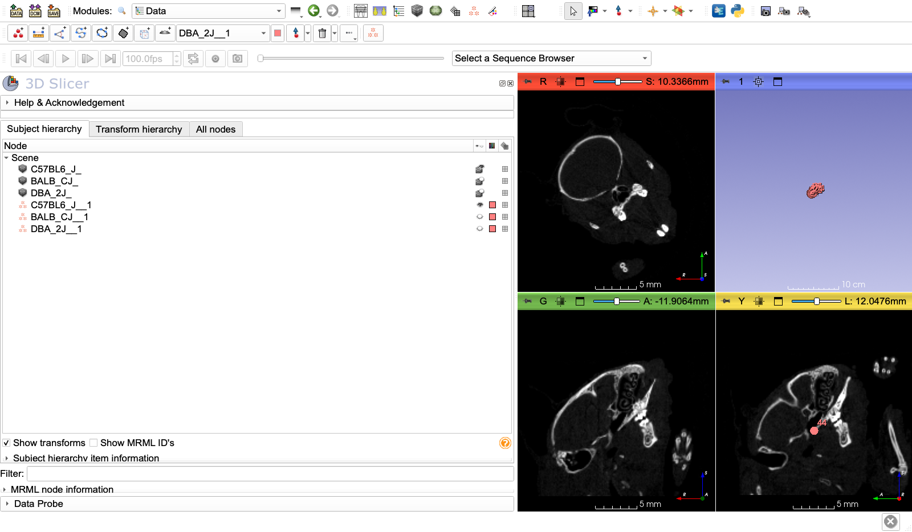
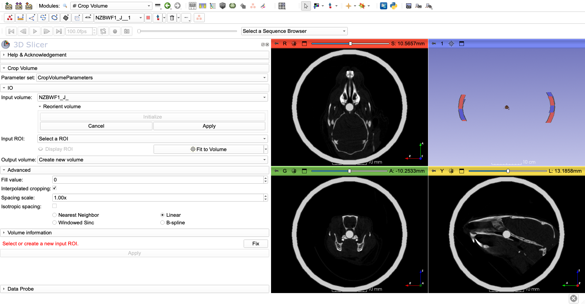
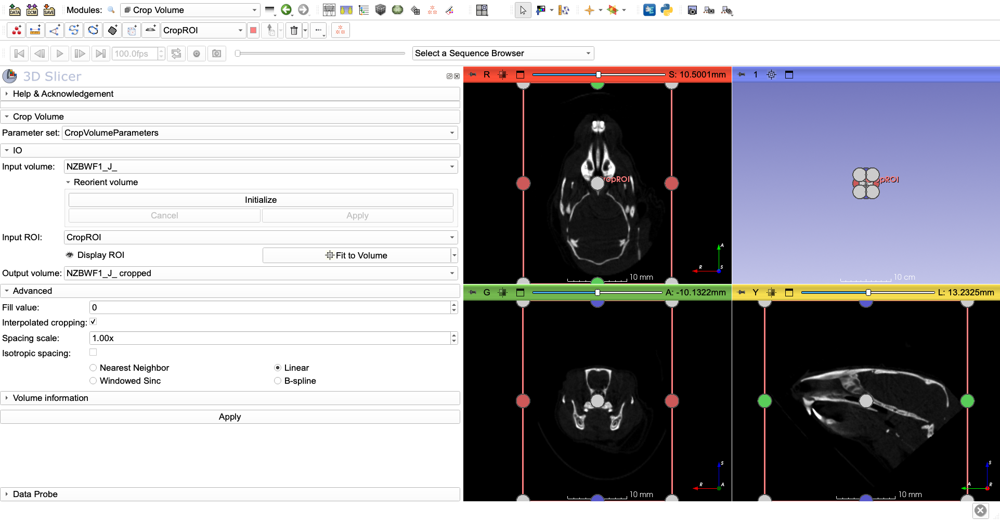

# ANTsPy-I: Data and reference specimen

A guide to template building, registration and Jacobian analysis using the **ANTsPy Registration** module of the SlicerANTsPy extension. The tutorial is in eight parts, one for each tab of the module, in the order they are used:

1. [ANTsPy-I: Data and reference specimen](README.md)
2. [ANTsPy-II: Group-wise tab, rigid alignment to the reference](Groupwise_rigid.md)
3. [ANTsPy-III: Average tab, an average reference volume](Average.md)
4. [ANTsPy-IV: Template tab, building a population template](Template.md)
5. [ANTsPy-V: Group-wise tab, registering all specimens to the template](Groupwise_template.md)
6. [ANTsPy-VI: Analysis tab, template mask and Jacobian analysis](Analysis.md)
7. [ANTsPy-VII: Pair-wise tab, registering one image to another](Pairwise.md)
8. [ANTsPy-VIII: Troubleshooting and advanced topics](Troubleshooting.md)

This part introduces the data and prepares the reference specimen used in the following parts.

---

## Introduction

This tutorial demonstrates a complete morphometric analysis workflow using the **ANTsPyRegistration** module in 3D Slicer. You will:
- Create one canonically oriented sample as a reference
- Build a population-averaged template from mouse microCT scans
- Register individual specimens to the template
- Perform statistical shape analysis using Jacobian determinants
- Compare morphological variation between groups

**Dataset:** Low-resolution mouse head microCT scans from 30 different inbred and hybrid mouse strains, with 45 craniometric landmarks per specimen. Landmarks are necessary to provide an initial alignment, as most automated registration methods fail if the positional difference between two volumes are too large. Most cases you do not need as many landmark to do an approximate alignment, 4-8 are usually enough.

**Biological Context:** Mouse strains exhibit cranial shape variation due to genetic differences. This tutorial shows how to quantify and analyze these differences.

---

## Prerequisites

### Software Requirements

#### 3D Slicer
- Download and install the **latest stable** version of 3D Slicer from [slicer.org](https://download.slicer.org/)

#### SlicerANTsPy Extension 
Install the ANTsPy Extension from the Extension Catalogue

### Hardware Recommendations
We advise to run this tutorial using [MorphoCloudInstances](https://morphocloud.org) as registration operations are memory and compute intensive. Standard MorphoCloud instances (g3.l) provide 60GB of RAM and 16 cores. 
If you plan to use your own computer, we advise using a computer with at least **16G of RAM**. Similarly we advise using a **CPU** with many cores as the registration will benefit from increased parallelism. 
---

## Step 1: Obtaining the Data

### Clone the Repository

Open a terminal (Mac/Linux) or Git Bash (Windows) and run:

```bash
cd ~/Desktop
git clone https://github.com/muratmaga/ANTsamples.git
```

This will create a folder `ANTsamples` with the following structure:

```
ANTsamples/
├── LMs/           # 30 landmark files (.mrk.json)
└── volumes/       # 30 volume files (.nii.gz)
```


### Verify the Data

Check that you have 30 paired files:

```bash
cd ANTsamples
ls volumes/*.nii.gz | wc -l    # Should show: 30
ls LMs/*.mrk.json | wc -l      # Should show: 30
```

### Sample List

The dataset includes these mouse strains (we'll use all 30 for this tutorial):

- **C57BL6_J_** - C57BL/6J (most common laboratory strain)
- **BALB_CJ_** - BALB/cJ 
- **DBA_1J_** - DBA/1J
- **DBA_2J_** - DBA/2J
- **C3H_HEJ_** - C3H/HeJ
- **AKR_J_** - AKR/J
- **129S1_SVLMJ_** - 129S1/SvlmJ
- **FVB_NJ_** - FVB/NJ
- ... and 22 more strains

---

## Step 2: Loading Data into 3D Slicer

### Launch 3D Slicer and Load Sample Volumes

1. Open 3D Slicer
1. Go to `File → Add Data`
2. Click `Choose File(s) to Add`
3. Navigate to `ANTsamples/volumes/`
4. Select these files (hold Ctrl/Cmd to select multiple):
   - `C57BL6_J_.nii.gz`
   - `BALB_CJ_.nii.gz`
   - `DBA_2J_.nii.gz`
5. Click `Open`, then `OK`

### Load Corresponding Landmarks

1. Go to `File → Add Data`
2. Click `Choose File(s) to Add`
3. Navigate to `ANTsamples/LMs/`
4. Select the corresponding landmark files:
   - `C57BL6_J_.mrk.json`
   - `BALB_CJ_.mrk.json`
   - `DBA_2J_.mrk.json`
5. Click `Open`, then `OK`

### Visualize the Data

1. In the **Data** module, you should see:
   - 3 volumes (scalar volumes)
   - 3 markups (fiducial nodes with 45 points each)

2. To view a volume:
   - Click on `C57BL6_J_` in the Data module
   - It will appear in the slice viewers (Red, Yellow, Green windows)
   - Use the mouse wheel to scroll through slices
   - Use the **3D** view to see the full volume

3. To view landmarks:
   - In the **Markups** module, select `C57BL6_J__1` from the dropdown (a landmark file loaded after a volume with the same name gets the suffix `_1`)
   - Landmarks will appear as small spheres on the skull
   - Adjust visibility/size in the Display section if needed





### Understanding the data better

- None of the samples are oriented canonically; slice planes to not correspond to anatomical planes.
- Landmarks are in millimeters (mm)
- Each specimen has 45 anatomical landmarks on the skull

---

## Step 3: Prepare a Reference Specimen (Crop Volume)

Before building the template, we need to prepare a reference specimen that will serve as the initial template. This involves reorienting the specimen to align with anatomical planes and creating an average from rigidly aligned samples.

### Why Use a Reference Specimen?

Using a reference specimen (rather than starting from scratch) has advantages and disadvantages:

**Advantages:**
- Faster convergence during template building
- More anatomically meaningful starting point
- Easier to interpret results in consistent anatomical orientations

**Disadvantages:**
- **Shape bias:** The final template may retain some shape characteristics of the reference specimen
- **Size bias:** Initial size of the reference influences the template
- **Asymmetry bias:** If the reference has asymmetries, these may persist
- **Selection bias:** Choosing one strain over others introduces systematic bias

**Best Practice:** To minimize bias, we'll create an average of rigidly aligned specimens rather than using an actual specimen from our dataset as references. This provides a reasonable starting point while reducing individual specimen bias.

### Reorient a Reference Specimen

We'll use the **NZBWF1_J_** specimen as our initial reference and reorient it so the major axes align with anatomical planes.

#### Load the Reference Specimen

0. Reset the scene to remove other data.
1. `File → Add Data`
2. Select `ANTsamples/volumes/NZBWF1_J_.nii.gz` and `ANTsamples/LMs/NZBWF1_J_.mrk.json`
3. Click `Open`, then `OK`. The landmarks are loaded as `NZBWF1_J__1`, because the volume already has the name `NZBWF1_J_`.

#### Open the Crop Volume Module

1. In the module search bar, type "Crop"
2. Select **Crop Volume**
3. Set **Input volume** to `NZBWF1_J_`, expand **Reorient volume** and click **Initialize**. This creates a transform, `Reorient_NZBWF1_J_`, and rotation handles in the slice and 3D views.
4. Rotate the volume with the handles until the anatomical planes are aligned with the slice views.

For detailed instructions, see the [CropVolume tutorial](https://github.com/SlicerMorph/Tutorials/blob/main/Slicer_Modules/Crop_Volume/Readme.MD#using-cropvolume-to-simulatenously-reorient-and-resample-your-data).



#### Reorient the Landmarks

**Important:** Do this before you apply the reorientation. Applying it deletes the `Reorient_NZBWF1_J_` transform, and the landmarks must be moved with the same transform.

1. Open the **Transforms** module and select `Reorient_NZBWF1_J_` as the **Active Transform**
2. Under **Apply transform**, move the landmarks (`NZBWF1_J__1`) to the **Transformed** list
3. Click **Harden transform** to make it permanent

#### Apply Reorientation

1. In **Crop Volume**, click **Apply** under **Reorient volume**. The rotation is written into the volume, and the `Reorient_NZBWF1_J_` transform is removed.
2. Resample the volume onto the anatomical axes: set **Input ROI** to **Create new ROI**, open the menu next to **Fit to Volume** and choose **Align to world axes + Resize**, click **Fit to Volume**, then click the main **Apply**.
3. The reoriented volume appears in the scene with the **cropped** suffix (`NZBWF1_J_ cropped`)
4. Verify in slice viewers that anatomical planes are aligned with slice views.
5. Save the result: Right-click `NZBWF1_J_ cropped` → Export to file
   - Save as `ANTsamples/NZBWF1_J_reoriented.nii.gz`
6. Save the landmarks (`NZBWF1_J__1`) as `NZBWF1_J_reoriented.mrk.json` in the same folder.



---

## Summary

You've completed a full morphometric analysis pipeline:

1. ✅ **Obtained data** from GitHub repository (30 mouse specimens)
2. ✅ **Prepared reference specimen** by reorienting to anatomical axes
3. ✅ **Created rigid average** from all specimens to minimize bias
4. ✅ **Built a population template** using landmark-initialized, iterative registration
5. ✅ **Registered all specimens** to the template with deformable transforms
6. ✅ **Created anatomical mask** to focus analysis on skull and mandible
7. ✅ **Performed Jacobian analysis** to identify regions of significant group differences
8. ✅ **Visualized results** as statistical maps and 3D renderings

### Key Files Created

- `NZBWF1_J_reoriented.nii.gz` - Reference specimen aligned to anatomical axes
- `RigidAverage_Template.nii.gz` - Average of rigidly aligned specimens
- `RigidAverage_Landmarks.mrk.json` - Average landmark positions
- `MouseCranium_Template.nii.gz` - Final population-averaged template
- `Template_Mask-label.nrrd` - Skull and mandible mask for statistical analysis
- `GroupRegistration/*-1forwardAffine.mat` - Affine transform components
- `GroupRegistration/*-0forwardWarp.nii.gz` - Deformable warp fields (used for Jacobian analysis)
- `GroupRegistration/*-transformed.nii.gz` - Registered volumes
- `JacobianCache.pkl` - Cached statistical analysis
- `EffectImage.nii.gz` - Group differences at the significant voxels

### Next Steps

- Replace random groupings with your real experimental design CSV
- Create anatomical masks for region-specific analysis
- Test different covariates and interactions
- Export data for external statistical analysis
- Generate publication-quality figures

### Resources

- **SlicerANTsPy Documentation:** [GitHub](https://github.com/SlicerMorph/SlicerANTsPy)
- **ANTs Documentation:** [ANTs Wiki](https://github.com/ANTsX/ANTs/wiki)
- **3D Slicer Training:** [Slicer Documentation](https://slicer.readthedocs.io/)
- **SlicerMorph:** [slicermorph.github.io](https://slicermorph.github.io/)

### Citation

If you use this workflow in your research, please cite:

- **3D Slicer:** Fedorov A., et al. (2012). 3D Slicer as an image computing platform for the Quantitative Imaging Network. *Magnetic Resonance Imaging*, 30(9), 1323-1341.
- **ANTs:** Avants B.B., et al. (2011). A reproducible evaluation of ANTs similarity metric performance in brain image registration. *NeuroImage*, 54(3), 2033-2044.
- **SlicerMorph:** Rolfe S., et al. (2021). SlicerMorph: An open and extensible platform to retrieve, visualize and analyse 3D morphology. *Methods in Ecology and Evolution*, 12(10), 1816-1825.

---

**Tutorial Version:** 1.1  
**Last Updated:** July 31, 2026  
**Questions?** Open an issue on the SlicerANTsPy GitHub repository

---

Next: [ANTsPy-II: Group-wise tab, rigid alignment to the reference](Groupwise_rigid.md)
