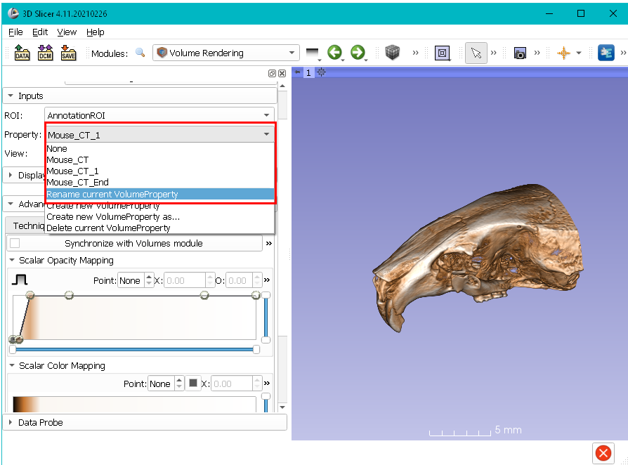
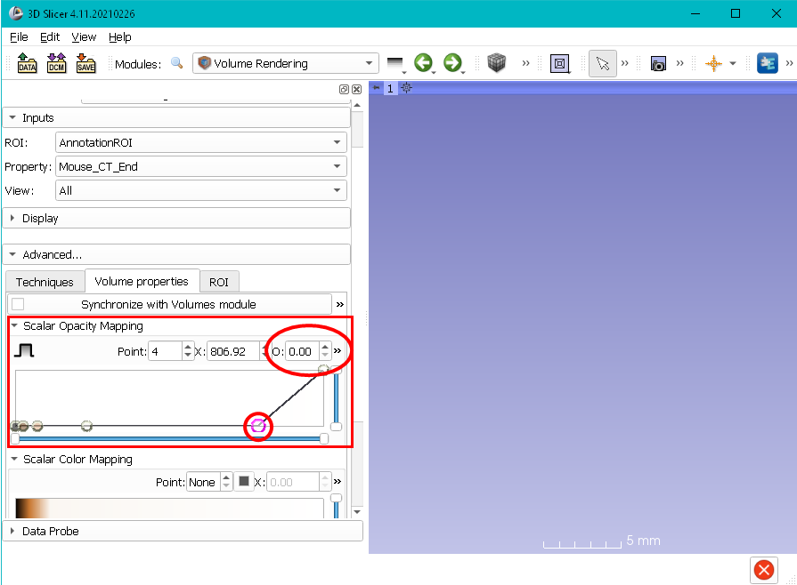
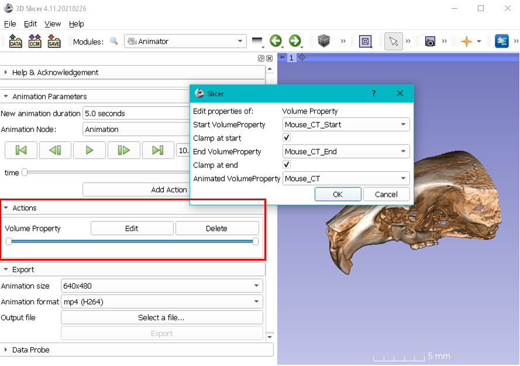
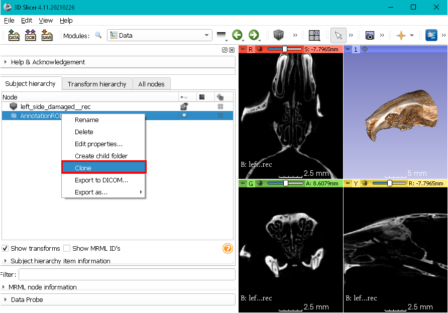
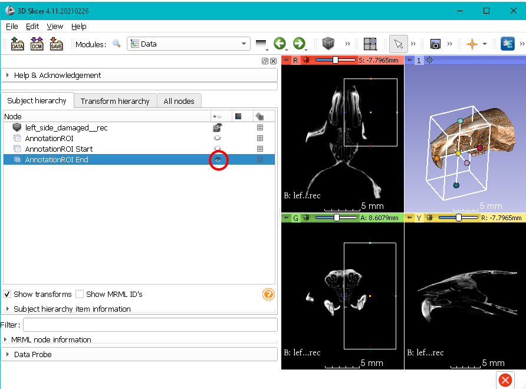
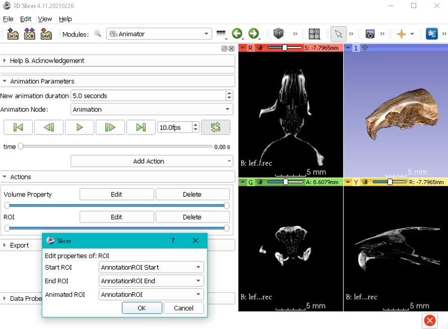
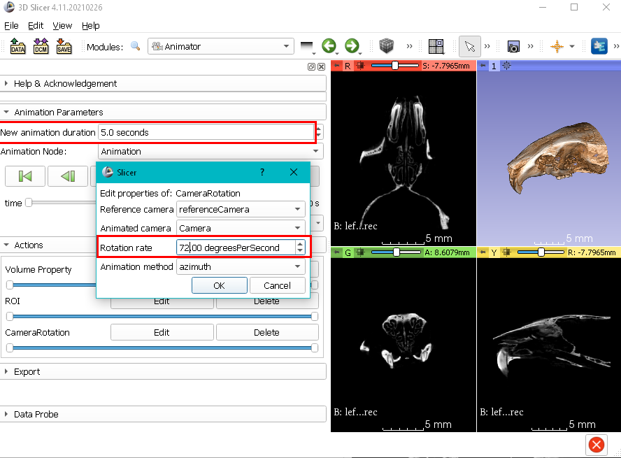

# Animator

The Animator module helps create and export animations in mp4 or GIF format. The animations are created by visualizing a volume and adjusting the rotation, ROI cropping, and rendering properties. Animator module is based on Slicer's `ScreenCapture` module which provides similar, but more limited functionality. For more detail about `ScreenCapture` module [see documentation here](https://www.slicer.org/wiki/Documentation/Nightly/Modules/ScreenCapture).

### One-time setup of Screen Capture module for FFMPEG
To output animations either in animated GIF or in MP4, `Animator` relies on the FFMPEG library, which is provided by the `ScreenCapture` module. While the download and install is automatic for Mac and Windows OSes,  due to licensing, the process needs to be initated by the user. Before using the `Animator`, make sure to switch the `ScreenCapture` module and set the output to **Video**, and then click the **Capture**. You will be prompted whether you would like Slicer to download and install FFMPEG. Accept and wait it for it to finish. This is a process you need to do once, even if you install other versions of Slicer on the computer. Note that in Linux ffmpeg is often included with the operating system as a installable package. If not, you can download the binaries for your specific Linux distribution from https://www.ffmpeg.org/download.html#build-linux. Once you install it, you need to specify the path to the ffmpeg executable in the `ScreenCapture` module 

### Setting up the animator
1. Load the "Bruker/Skyscan mCT Recon sample" dataset from Sample Data module using the ImageStacks or SkyscanReconImport as described in their respective tutorials.
2. Go to Volume Rendering module, and enable the volume rendering for the mouse volume. Choose  "uCT-Skull" from the preset dropdown menu. 
3. If you want to alter the volume property (VP) to your liking (or optimize it for your dataset) do it now. When done, go to "Save Data" and save it as **Mouse_CT.vp**. 

### Volume Property action

4. Reload the Mouse_CT.vp into Slicer twice from where you saved. They will up show as Mouse_CT_1 and Mouse_CT_2 under the Properties section of Volume Rendering module. Use the Rename option to change their names to Mouse_CT_Start and Mouse_CT_End. 

5. At this point all three VPs are identical. Adjust the Mouse_CT_End to be a flat line by clicking on the control points on the Scalar Opacity curve and reducing their Opacity (O) value to 0.

6. Switch to the Animator module. Create a new animation, click "Add Action" choose "Volume Property Action", then click "Edit". Set the Start VP to Mouse_CT_Start, End VP to Mouse_CT_End, and Animated VP Mouse_CT. 

7. Go to the Volume Rendering module and review that the Property is set to "Mouse_CT", not "Mouse_CT_Start" or "Mouse_CT_End".  That's because Start and End are static, reference values. The Animated VP (i.e., Mouse_CT) is what's get calculated based on the Start and End VPs and where the animation is in the timeline for each frame rendered. Unless you set the Property of your Volume Rendering module to the one designated as Animated VP in Animator module, your animation won't work. 

8. Go back to the Animator, and hit the play button. You should see the mouse skull gradually becoming transparent and eventually disappearing. 
IMPORTANT: For the volume property action of the Animator to interpolate properly, the Start and End volume properties have identical number of control points on the Scalar Opacity Map curve. Otherwise, interpolation will fail. The position, opacity values, color assignments of the control points can be modified, as long as there are identical number of control points in Start and End VPs. That's why it is easier to define the initial VP carefully, save and reload/rename it so that you can modify the position, opacity and color of those control points for your End volume property.

### Region of Interest action
Now, you are ready to add Region of Interest (ROI) action, which can be used to gradually slice the specimen in 3D view.

9. Switch to four up view (if you are not already in that). 
10. Go to to the Data module and right click the existing ROI and choose "Clone". Do it one more time. 

11. Rename the cloned ROIs as Start_ROI and End_ROI (right click -> Rename). 

12. Turn the visibility of for the Start_ROI. Then click the End_ROI and set it to a region that is smaller than the full data extend. Turn off its visibility

13. Switch to Animator module, click "Add Action" and choose "ROI Action". Then hit Edit. Similar to Volume Property action, you will set the Start ROI to Start_ROI, End ROI End_ROI, and Animated ROI to AnnotationROI (or whatever it was called when you cloned it in step #2). Again similar to Volume Property you need to make sure the ROI setting of the Volume Rendering module is set to the node specified in the Animated ROI (in this case AnnotationROI), or otherwise your animation won't work.

14. Hit the play button. You should see your specimen being cut through in the plane you chose, while the volume properties are also being changed. 

At this point you have two different actions happening simultaneously, you can play with the time track of individual actions, so you set the place where they begin and end.  

### Rotation Action

15. Click on Add Actions and choose CameraRotationAction. 

16. Click Edit for CameraRotationAction and adjust the axis of rotation, as well as the speed. For example, if your animation length is set to 5 seconds, and you would like to complete a full 360 spin during this time, set the rotation rate to 72 degrees per second. 

### Exporting the Animations
Select one of the rendering preset sizes (from 160x120 to 3820x2160) as **Animation Size**, the output file and format, and the hit **Export**. If you encounter an error about FFMPEF library, make sure that it is correctly installed (e.g., check the FFMPEG executable path specified in `ScreenCapture` module under Advanced tab).

Alternatively, you can output the result of your animation as a sequence of rendered frames, which gives you more control over post-processing of the output (e.g., you can import the sequence into video maker software, enhance contrast, change the timing or add text, music/speech, etc). Once you are satisfied with the animation you created in `Animator`, go to `Screen Capture` module. Change the Animation mode setting to _sequence_. Check the other settings, and click **Capture**.

### Some Example Animations

1. [diceCT scan of E15 mouse fetus displaying it is organs as segmented structures (done in conjunction with MEMOs extenions)](https://app.box.com/s/c7thqagk4zrd3uy4qu2pvm718tvvxvh1)
2. [Adult mouse heart perfused with vascular dye](https://app.box.com/s/1ethu7omtm76jyyndohun7c8upvzb5ho)
3. [Exploding mouse head](https://x.com/SlicerMorph/status/1395569101678940161/video/1)
