# Animator: keyframe animations of 3D scenes

The **Animator** module turns a 3D scene into a video. You set up the view the way you want it at a few moments in time. Animator saves each one as a **keyframe** (a *snapshot* of the scene) and fills in the frames in between, then records the result as an MP4 video or an animated GIF.

A snapshot records:

- the **camera**: viewing direction, position and zoom;
- the **volume rendering** settings (opacity and color);
- the **cropping box** (ROI) of the volume rendering;
- which models, segmentations, markups and volume renderings are **shown**, and their opacity.

Between two keyframes, Animator smoothly changes everything from one snapshot to the next. It can also hold a state, or explode a set of models outward and back.

In Part 1 we make a 10-second animation of a mouse skull: it rotates from a side view to a view from above, is cut open along the midline, and finally fades out. In Part 2, a mouse embryo fades away to reveal its organs, which then explode outward while the camera circles.

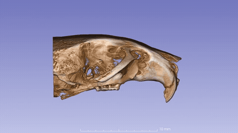

## Before you start: ffmpeg

Animator writes videos with **ffmpeg**, a free video encoder that is not part of Slicer. Set it up once:

- **Windows:** the first time you export, Slicer offers to download ffmpeg. Accept.
- **macOS:** install it with [Homebrew](https://brew.sh): `brew install ffmpeg`.
- **Linux:** install it from your distribution, e.g. `sudo apt install ffmpeg`.

On macOS and Linux, tell Slicer where ffmpeg is. Open the **Screen Capture** module, expand **Advanced**, and set **ffmpeg executable** (e.g. `/opt/homebrew/bin/ffmpeg` on a Mac with Homebrew, `/usr/bin/ffmpeg` on Linux). If ffmpeg is missing when you export, Animator tells you and opens Screen Capture for you.

## Part 1: A skull, rotated, cut and faded

### 1. Load and render the sample data

1. In the **Sample Data** module, under **SlicerMorph**, click **Bruker/Skyscan mCT Recon sample**. Choose a folder for it. It downloads a ZIP file and extracts a folder `png_recon` with 490 image slices of a mouse skull and the scanner's log file.
2. Open the **SkyscanReconImport** module, set **Choose log file from image series** to `png_recon/left_side_damaged__rec.log`, and click **Apply**. The skull is loaded as the volume `left_side_damaged__rec` (444 × 444 × 488 voxels of 0.035 mm). See the [SkyscanReconImport tutorial](../SkyscanReconImport) for details.
3. Open the **Volume Rendering** module, select the volume, and click the eye icon to show it. Choose the **uCT-Skull** preset.

### 2. Set up the output view

What you see in the 3D view is exactly what goes into the video, so first give the view the size of the video. Open the **Animator** module (Modules → SlicerMorph → Utilities → Animator). In **Output Viewer Setup**:

1. Click **Undock 3D Viewer**. The 3D view becomes a separate window.
2. Set its size, in one of two ways:
   - **Type the size** of your video into **Viewer Size**, e.g. **960 × 540** (16:9), or 1920 × 1080 for full HD. The window is locked at exactly that size. Use even numbers.
   - Or **drag the window's edges** to the size and shape you want, then click **Snap to codec-safe size**. It proposes the nearest size whose width and height are multiples of 16 (what H.264 video encodes best), shows how much the aspect ratio changes, and locks the window at that size when you confirm.

   **Output size** now reads *960 × 540 (locked)*. To change the size again, click **↺** next to the size to unlock it.

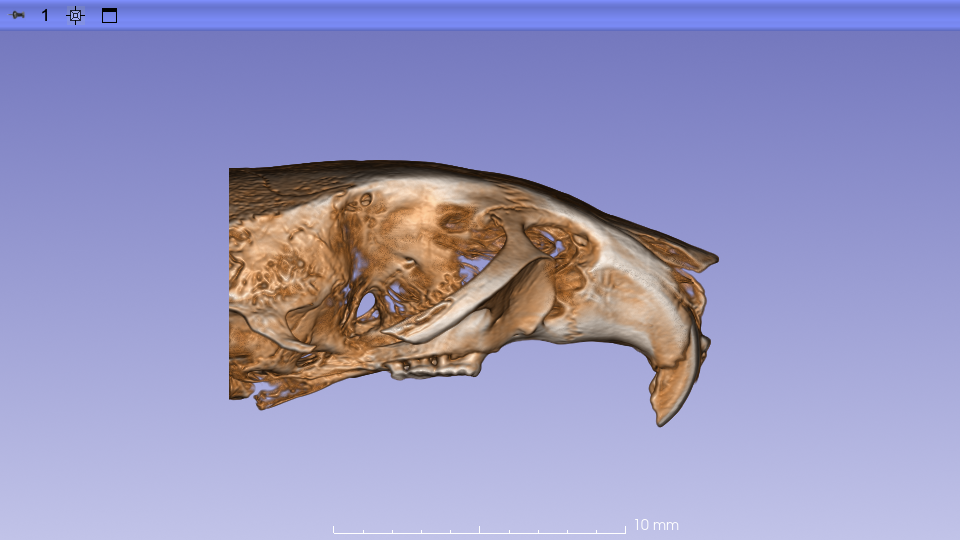

The undocked, locked 3D view. Keep it where you can see it; you will set up each keyframe in it.

### 3. Create the snapshot timeline

In **Animation Parameters**, set **Animation Node** to **Create new Animation**, then click **Create Snapshot Timeline**. **Scene Snapshot** appears under **Actions**, and the snapshot editor opens. It is a separate window, so you can keep working in the 3D view and in other modules while it is open. To reopen it later, click **Edit** next to **Scene Snapshot**.

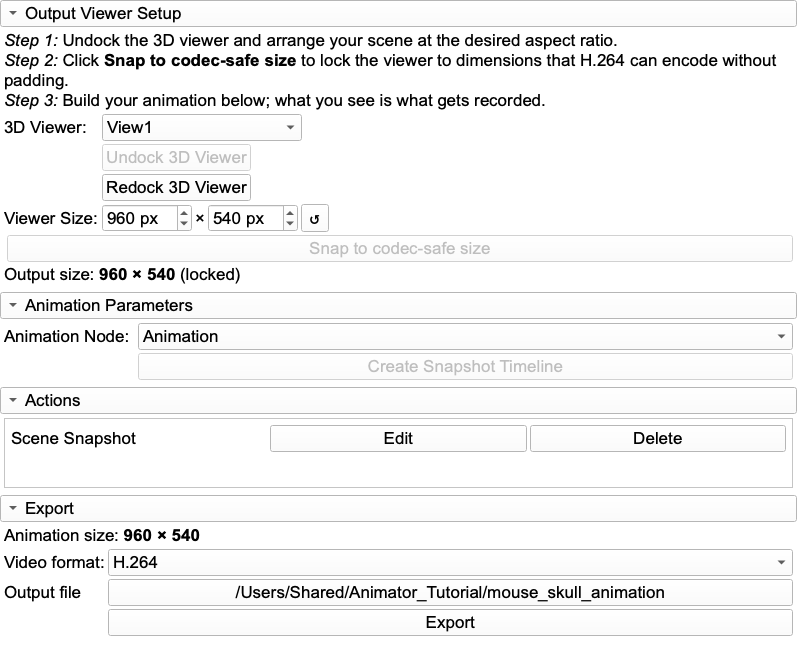

In the editor, set **Timeline span** (the length of the animation) to **10 s**.

### 4. Add keyframes

Each keyframe is made the same way: set up the scene, then click **Capture current state → new keyframe**. Animator saves the snapshot, with a thumbnail, on the timeline. The first keyframe goes at 0 s, the second at the end of the timeline, and later ones halfway between the last keyframe and the end. You can change the time of any keyframe afterwards.

1. **Lateral (0 s).** Rotate the skull in the 3D view to a side view and zoom so that it fills the view. Click **Capture…**. Type `Lateral` as its **Label**.
2. **Dorsal (4 s).** Rotate the skull to a view from above, with the snout at the top. Capture. It lands at 10 s; set its **Time** to **4 s** and its **Label** to `Dorsal`.
3. **Cut (7 s).** In the **Volume Rendering** module, under **Display → Crop**, check **Enable** and click the eye icon next to **Display ROI**. A box with handles appears around the skull. Drag the handle on its side face to the midline, so that half of the skull is cut away. Hide the box again (eye icon), and rotate the view so that you look into the cut. Back in the snapshot editor, capture. It lands halfway, at 7 s. Label it `Cut`.

   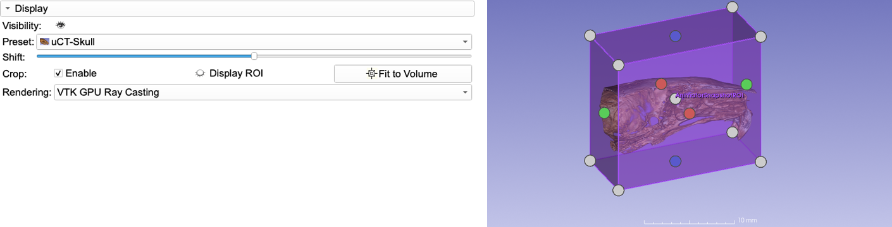

4. **Fade (10 s).** In the **Volume Rendering** module, lower the opacity of the rendering: open **Advanced… → Volume properties** and lower the **Scalar Opacity Mapping** points to about a fifth of their height. Rotate the view a little further and capture. Set its time to **10 s** and label it `Fade`.

The editor now shows the four keyframes:

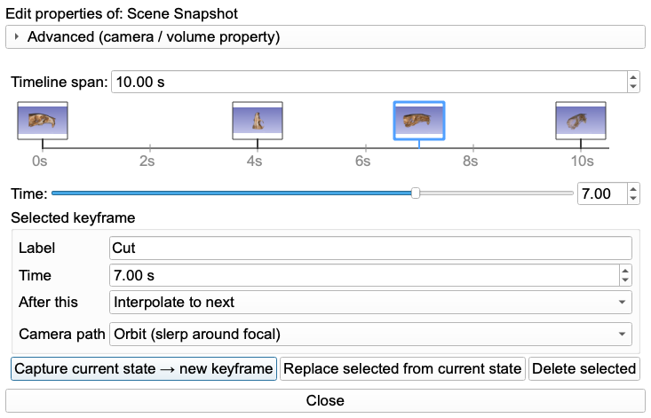

- **Preview:** drag the **Time** slider below the timeline. The scene is set to that moment, so you can check the transitions.
- **Change a time:** drag a thumbnail left or right, or select it and type a new **Time**.
- **Fix a keyframe:** select it, set up the scene, and click **Replace selected from current state**. The time, label and settings are kept.
- **Copy, paste, delete:** right-click a thumbnail.

Here are the four keyframes as they appear in the finished video:

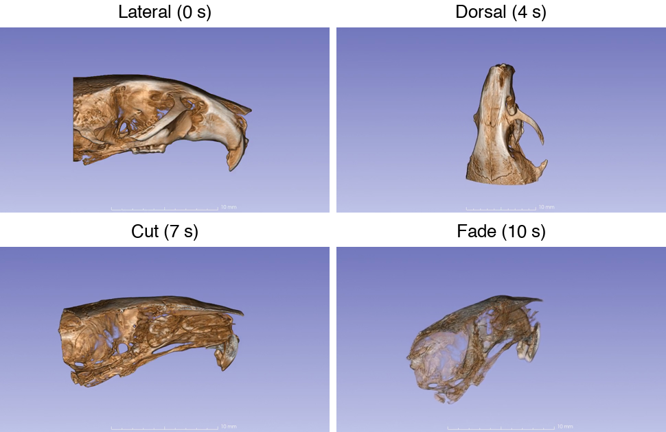

#### What happens between keyframes

For each keyframe, **After this** sets what happens between it and the next one:

- **Interpolate to next** (default): the camera, volume rendering, crop and opacities change smoothly into the next keyframe.
- **Hold until next**: the scene stays as it is until the next keyframe, then switches. Use it to pause on a view.
- **Explode models to next** / **Implode models to next**: models in a folder move outward from their common center (or back in). See [Part 2](#part-2-an-exploded-view).

**Camera path** sets how the camera travels. **Orbit** (the default) circles around the point it looks at, keeping its distance, which is right for turning a specimen. **Linear** moves the camera in a straight line, which suits zooming in or flying past.

#### Which camera and volume property are animated

**Advanced (camera / volume property)** at the top of the editor shows which camera (the 3D view's) and which volume property (the one used by the volume rendering, here `uCT-Skull`) Animator changes. Animator selects them for you; change them only if you render with more than one view or volume.

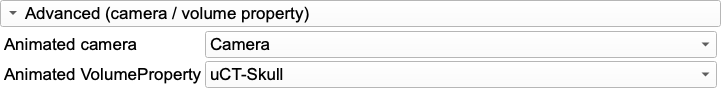

Because the volume property is saved in each keyframe, you can change any part of the rendering between keyframes: opacity, colors, or the window of intensities that is shown.

### 5. Export the video

In **Export**:

1. **Video format:** **H.264** (MP4, plays everywhere). **H.264 (high-quality)** gives larger files with fewer compression artifacts. **Animated GIF** is convenient for slides and web pages but gives much larger files.
2. **Output file:** click the button and choose a location and file name. The extension is added for you.
3. Click **Export**.

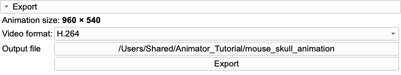

Animator plays through the animation, captures every frame of the 3D view, and passes them to ffmpeg. Our 10-second animation became 600 frames (60 frames per second) and a 1.2 MB MP4 file at 960 × 540. The export took about a minute.

When you are done, click **Redock 3D Viewer** in **Output Viewer Setup** to put the 3D view back into the main window. Save the scene (**File → Save Data**) to keep the animation: the snapshots are saved with it, so you can change the animation and export it again later.

## Part 2: An exploded view

Animator can move a set of models apart and back together. In this example, a contrast-enhanced microCT scan of a mouse embryo is shown as a volume rendering, which fades away to reveal its segmented organs; the organs then fly apart while the camera keeps circling.

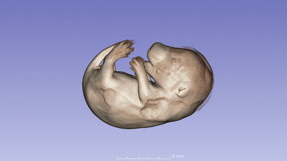

### Get the data

The scan and its segmentation of 50 organs and tissues are published in the MorphoDepot repository [MorphoDepot/mus-musculus-E15](https://github.com/MorphoDepot/mus-musculus-E15) (Maga and Roston, 2026). Download two files:

- The segmentation, `baseline.seg.nrrd` (1.2 MB): open it on the repository page and click **Download raw file**.
- The scan, `E15-Atlas.nrrd` (50 MB): its address is in the repository's `source_volume` file, [E15-Atlas.nrrd](https://js2.jetstream-cloud.org:8001/swift/v1/MorphoDepot-volumes/muratmaga/mus-musculus-E15/E15-Atlas.nrrd).

Drag both into Slicer. The scan is 594 × 1046 × 738 voxels of 0.018 mm.

### Prepare the scene

1. **Models.** Animator explodes models, not segments. In the **Data** module, right-click the segmentation `baseline` and choose **Export visible segments to models**. The 50 models are created in a new folder, `baseline-models`; we renamed it `E15 organs`. Hide the segmentation itself (eye icon), so that only the models show.
2. **Volume rendering.** Show the scan in the **Volume Rendering** module. This is an 8-bit scan, so none of the CT presets fit well. We set the **Scalar Opacity Mapping** (under **Advanced… → Volume properties**) to 0 up to an intensity of 45, then 0.15 at 110, 0.6 at 180 and 0.9 at 255, with a light tan **Scalar Color Mapping**.
3. **Output view.** As in Part 1, create a new Animation node, undock the 3D view and set its size (960 × 540), and click **Create Snapshot Timeline**. Set **Timeline span** to 10 s.

### Keyframes

The organs start fully transparent inside the solid volume rendering, and the two cross-fade. The camera turns about 90–120° between keyframes, so that it circles the embryo without stopping. Keep turning in the same direction: between two keyframes, the orbit takes the shorter way around.

1. **Embryo (0 s).** Set the opacity of all organ models to 0: in the **Models** module, select all 50 models in the list and set **Opacity** to 0. Show a side view. Capture.
2. **Organs (3 s).** Lower the volume rendering's opacity points to 0 and set the models' opacity back to 1. Turn the view by 90°. Capture and set its time to 3 s. Now set **After this** to **Explode models to next**, choose **E15 organs** as **Models folder**, and keep **Explode magnitude** at 2.0x.

   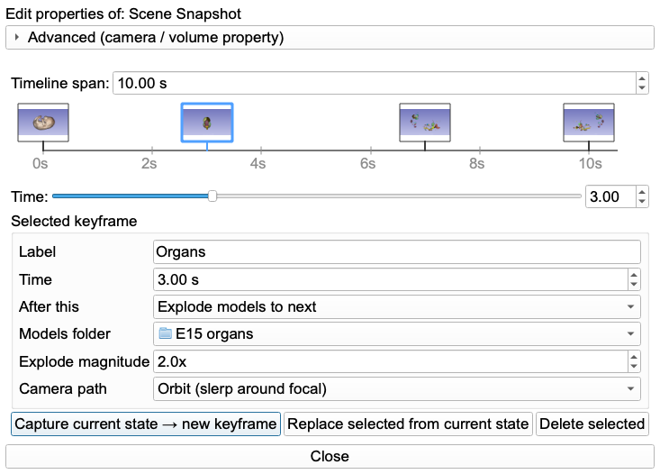

3. **Exploded (7 s).** Turn the view further and zoom out a little, so that the separated organs fit. Capture.
4. **Exploded, turning (10 s).** Turn the view once more and capture, so that the camera keeps circling until the end.

The volume rendering fades and the organs fade in between 0 and 3 s (**Interpolate to next**), then the organs separate between 3 and 7 s, and stay separated to the end. To bring them back together, set **After this** of a later keyframe to **Implode models to next**, with the same folder.

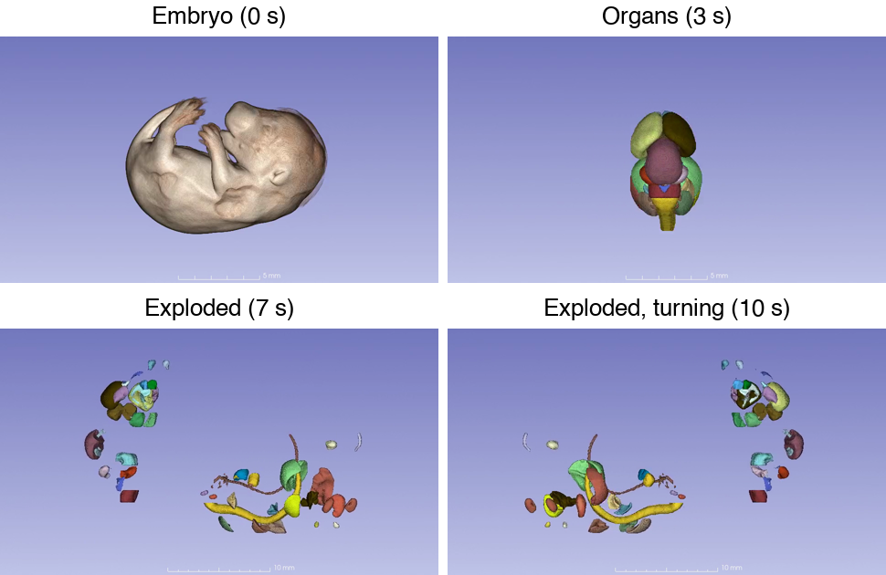

**Explode magnitude** sets how far each model moves away from the common center of all the models in the folder, as a multiple of its distance from that center: at 1.0 each model moves out by its own distance (so its distance doubles), at 2.0 by twice its distance. The models accelerate and slow down smoothly at each end of the segment. The camera, volume rendering and opacities are still interpolated between the same keyframes, but opacities are held during an explode or implode segment.

The exported video is 10 s (600 frames, 1.9 MB at 960 × 540).

## Example animations

1. [diceCT scan of an E15 mouse fetus, showing its organs as segmented structures (made with the MEMOS extension)](https://app.box.com/s/c7thqagk4zrd3uy4qu2pvm718tvvxvh1)
2. [Adult mouse heart perfused with vascular dye](https://app.box.com/s/1ethu7omtm76jyyndohun7c8upvzb5ho)
3. [Exploding mouse head](https://x.com/SlicerMorph/status/1395569101678940161/video/1)

## References

- Maga, A. M., and Roston, R. (2026). MorphoDepot/mus-musculus-E15: MorphoDepot segmentation dataset (v2) [Data set]. Zenodo. https://doi.org/10.5281/zenodo.21816003
