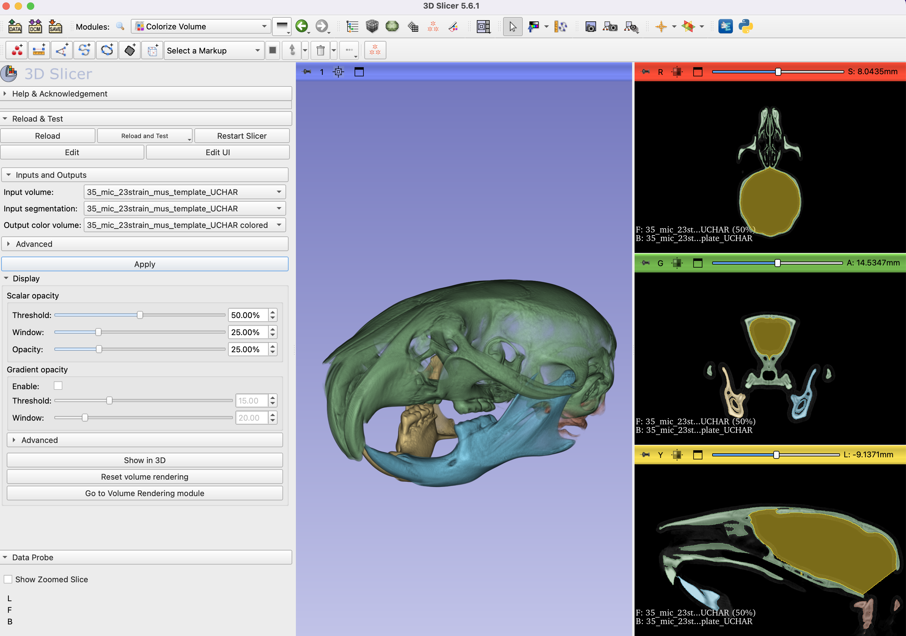

## Colorize Volume
ColorizeVolume is a module available through the `SandBox` extension. It allows you to turn a graycale scalar volume to an RGB volume (aka VectorVolume in Slicer) using its segmentation to map the colors. The resultant RGB volume then can be volume rendered, which provides much more detail compared to the surface rendering of the corresponding segmentation. 

To get started, make sure you have installed the `SandBox` extension and restart your Slicer session. You should also have SlicerMorph installed, if you already don't have it. To use the module you need a scalar volume and a segmentation derived from it. In this tutorial we will be using a mouse CT scan and its segmentation as an example.

## Steps.
1. Hit CTRL+F (Module Finder shortcut) and search from ImportFromURL, or from Module selector navigate to SlicerMorph->Input and Output->ImportFromURL.
2. Paste **https://raw.githubusercontent.com/muratmaga/mouse_CT_atlas/master/data/templates/35_mic_23strain_mus_template_UCHAR.nii.gz** in the URL field. Both File name and Node name fields will be auto-populated. Hit **Import data**. This will automatically download the mouseCT microCT dataset into your scene.
3. In the volume rendering window you may see the mouse head automatically rendered. This is just regular volume rendering of the volume data. You can turn it off, by going to the `Data` module and right-click the visibility (eye) icon, and uncheck **Show in 3D views as volume rendering** option. 
4. Paste **https://raw.githubusercontent.com/muratmaga/mouse_CT_atlas/master/data/templates/35_mic_23strain_mus_template_UCHAR.seg.nrrd** into the URL field, and repeat the same steps. You should now have both a 3D volume and its segmentation. 
5. Hit CTRL+F and search for **ColorizeVolume**
6. You should find, both fields Input Volume and Input Segmentation automatically populated. You can leave the Output Color volume as default, or you can choose to create a new VectorVolume by specifying a name. For tutorial, just leave it as is.
7. We will skip the advanced settings for now, and hit **Apply**. It will take a few seconds for Slicer to generate the RGB volume. 
8. You should now see a mouse head with skull, vertebra and both hemi-mandibles rendered in different colors.

 

9. 
10. You can now start playing with the **Display** tab settings. Try increasing the opacity to make the bones to be more opaque, or use the Threshold/window settings to show more of the contents from the RGB image. At any time to go back to the original settings click the **Reset Volume Rendering** 
11. You can also combine this with the `Lights` module (also available with Sandbox extension). Lights module allows to manipulate the light sources and shadows.

One thing you need to keep in mind that RGB volume will require three times more GPU memory than the original volume. So if you started with a 1GB volume (e.g., 1024x1024x1024, 255 greyscales), the GPU memory consumption for the RGB volume will be 3GB since there are now three different channels. 
