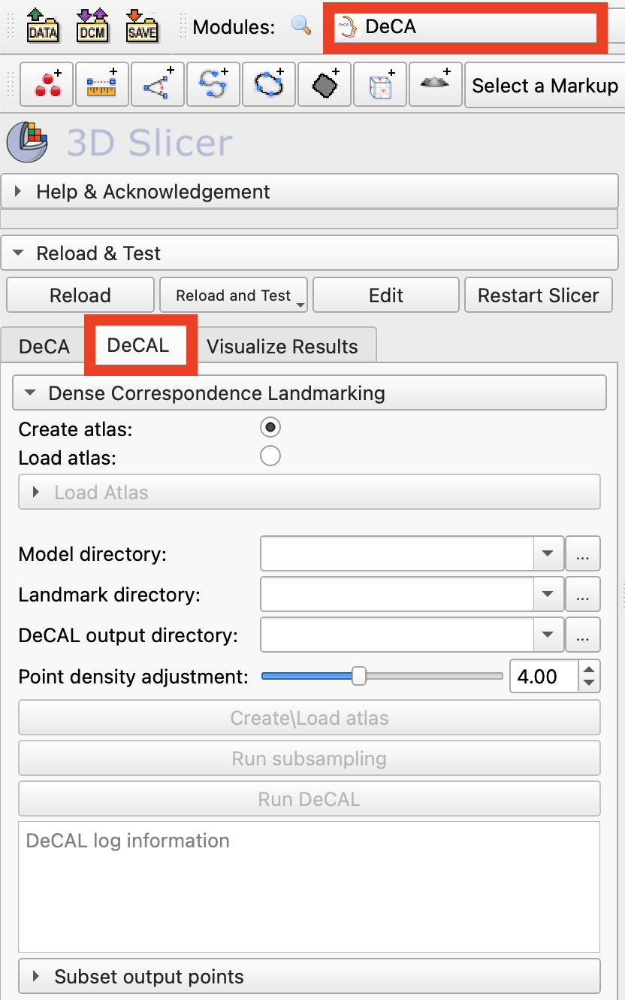
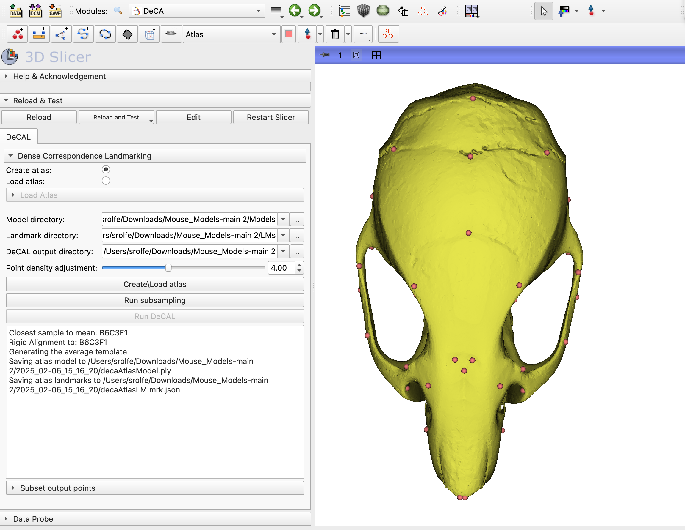
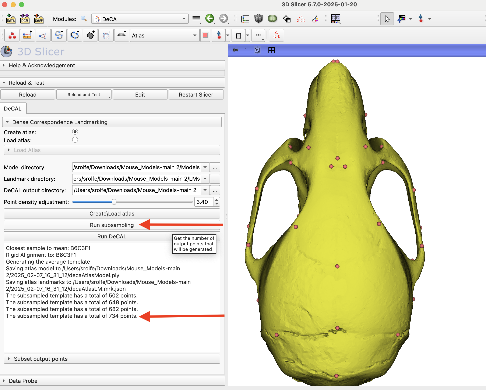
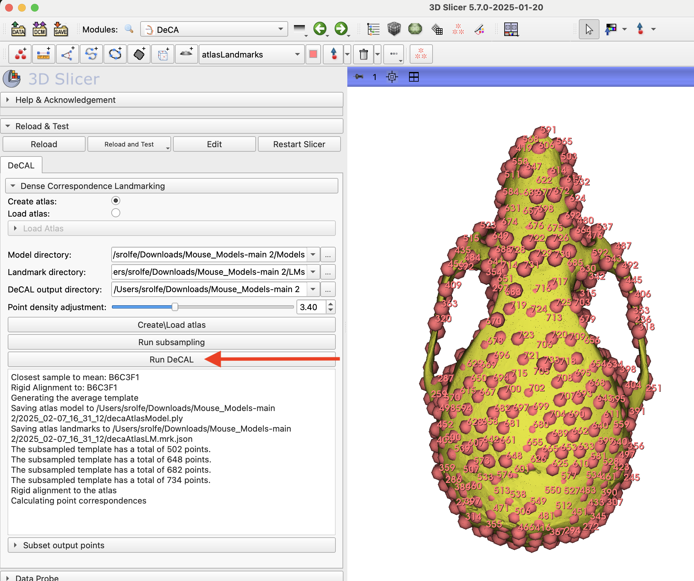
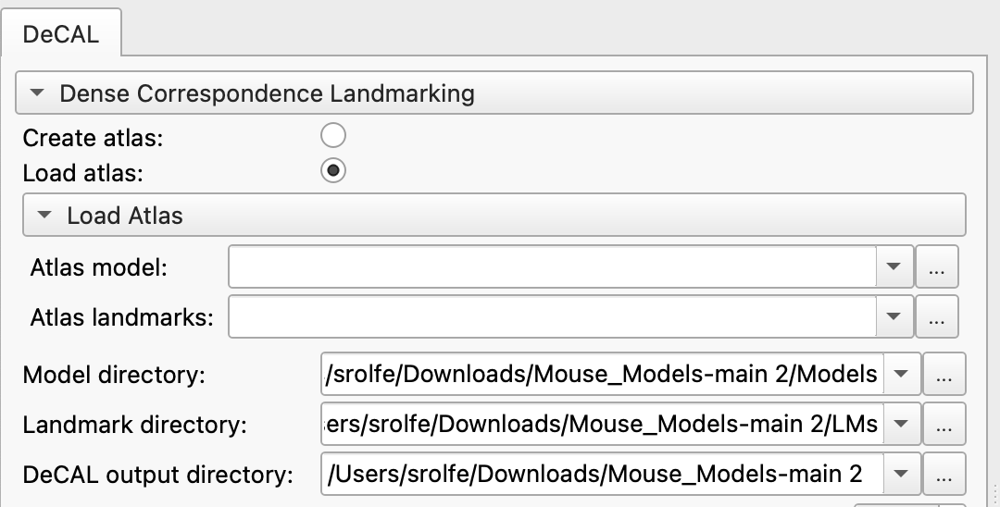
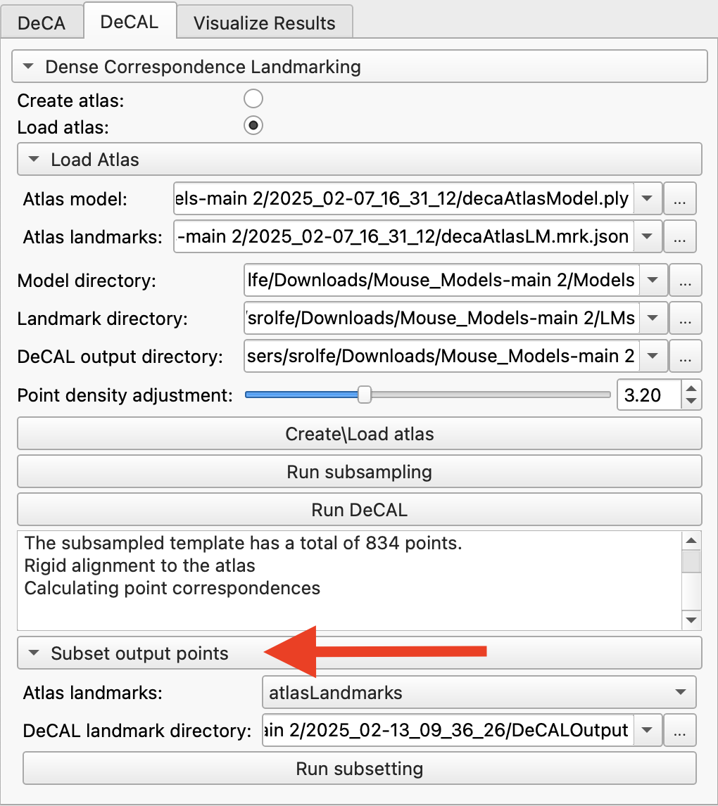
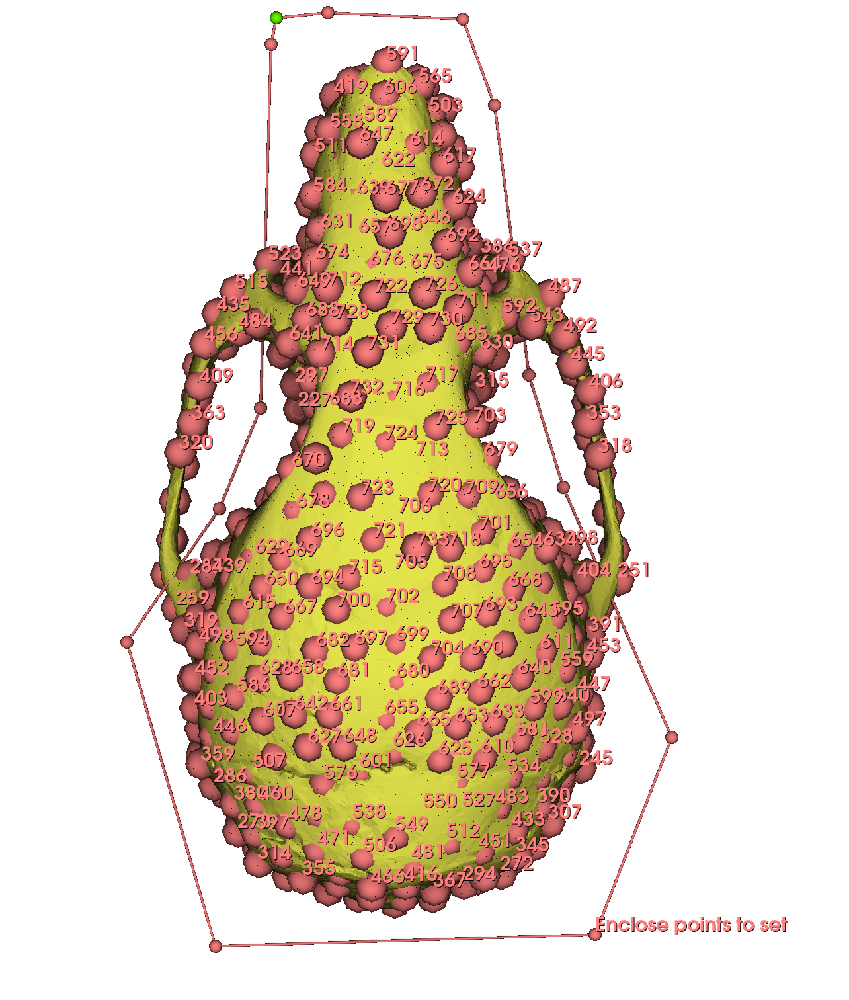

# DeCAL

## Introduction
DeCA is a module for dense surface registration of models that is anchored by manual landmark points. This tutorial will walk you through using the DeCA module's landmarking workflow (DeCAL)to generate a dense set of corresponding pseudo-landmark points for a set of mouse skull models.

## DeCAL Method
The first step in the DeCAL workflow is calculating or loading an atlas model and landmark set that will be used as the index of point correspondences. When running DeCAL for the first time, you can automatically generate an averaged model and landmark set to use for the atlas. When this option is selected, Procrustes analysis will be run to select the specimen that is closest to the Procrustes mean. This specimen will define the connectivity and point number of the averaged atlas. Each specimen in the dataset is warped to this specimen to determine point correspondences across the dataset. The average atlas is calculated by finding the mean point position for each point on the reference specimen. Once an atlas model and landmark points have been generated, they are saved and can be used again if DeCAL is rerun. 

In the second step of DeCAL, a subset of the atlas points are selected to generate an evenly distributed number of pseudolandmark points across the model surface. The spacing of these points is can be adjusted using the point density adjustment slider. Increasing this value will enforce a larger distance between the sampled points, decreasing the total point number. The number of densely sampled output points is reported in the DeCAL log information window. This step can be run multiple times to select the desired number of output points.

Once the number of output points has been selected, DeCAL can be run for the dataset. This step will rigidly align each subject to the atlas, followed by a non-rigid deformable registration. The point correspondences are assigned and the subset of points for each subject that corresponding to the sampled atlas points are saved in the output file.

As a convenience, we also provide an interface to select a subset of the atlas landmarks in the scene, and then run the same subsetting over the DeCAL data directory. This function is useful in cases where there is a spatial region where pseudo-landmarks should not be included.

### Create or load the atlas model and landmarks
1. Download the **Mouse Models** dataset from https://github.com/SlicerMorph/Mouse_Models. The **Models** folder will contain 62 models and the **LMs** folder contains a corresponding landmark file for each model with 51 manually placed landmark points.

2. Search for `DeCA` module in Module Finder (CTRL +F) to switch to the DeCA module. From the module's tabs, select `DeCAL`

3. The first step is to select the source of the atlas used for dense landmarking. For the initial run, we will create an average atlas model and landmark set from the dataset, so check that the `Create atlas` option is selected.

4. Set the `Model directory` to the downloaded folder of mouse models.

5. Set the `Landmark directory` to the downloaded folder of mouse model landmarks.

6. Create a folder where the output files of the DeCAL module will be stored. This will be a top level directory and each run of DeCA will create a new, timestamped folder containing the files and folders that are generated.

5. Set the point density adjustment slider to an initial value. This is a numerical value that allows you to increase or decrease the density of sampling on the model surface, to increase or decrease the number of output landmarks collected. Since this is the first run, leave the slider at the initial value of **4**.

6. Create the atlas by clicking the button `Create\Load atlas`. This step may take a minute or two.

7. In the DeCAL log information window at the bottom of the module, the details of the atlas calculation and location where the atlas model and points will be displayed. When this step is complete, the atlas model and landmarks will be loaded into the scene.

### Subsample the atlas model
8. The point density adjustment slider allows you to change the sampling density of the landmark points on the atlas surface, but it does not provide the exact number of points until the sampling is completed. To check the number of output DeCAL landmark points, click the `Run Subsampling` button.

9. In the DeCAL log information window, check the number of DeCAL points. Use the point density adjustment slider to change the sampling density if needed and click `Run Subsampling` button again to see the updated point number. This step can be repeated until the point number is acceptable.

### Run DeCAL and view output
8. Click the `Run DeCAL` button. This will launch the dense surface alignment of each specimen to the atlas, assignment of point correspondences, and saving of the DeCAL output landmark files. These steps may take a few minutes, depending on the number of models and number of DeCAL points.

9. When this step is complete, open the top level DeCAL output directory. In this folder you will see a timestamped folder for each time DeCAL was run. Open the timestamped folder created during this tutorial. This folder contains the atlas model and landmarks named `decaAtlasModel.ply` and `decaAtlas.mrk.json`. You will see the folders `alignedLMs` and `alignedModels` that contain the models and manual landmarks aligned to the atlas. Lastly, there will be a folder named `DeCALOutput` that contains the output DeCAL landmark file for each specimen and the atlas.

### Merging Fixed and SemiLM 

10. DeCaL output does not contain the fixed landmarks used to align the models. If you want to create a combined dataset that contains both initial fixed LMs and the semiLMs from DeCaL, you can use the **BatchMerge** tab of the SlicerMorph's `MergeMarkups` module. For fixed landmarks, choose the files in the **Aligned LM** folder of the DeCaL output folder you specified in the step #6. For semiLMs, selected the files in the **DeCaLOutput** folder created in Step #9. Note that this folder also contains the landmarks for the atlas model. When merging, make sure to exclude this file. Finally, specify where the merged markup files will be stored and then hit `Merge Fixed and SemiLandmark Nodes` button. 

### Excluding points from the atlas
11. As an optional step, DeCAL provides a convenience function to subset the DeCAL landmark set. This is provided so that pseudolandmarks can be easly removed from The landmarks to include are selected from the atlas landmarks in the scene. To set up the point selection, expand the menu `Subset output points`.

12. The `Atlas landmarks` field should be set to the atlas landmarks set in the scene which will be used to select the point indexes to subset. This is prepopulated when DeCAL is run, but can also be set manually.

13. The `DeCAL landmark directory` should be set to the location where the DeCAL landmarks were saved. This will also be prepopulated at the time DeCAL is run, but can be set manually if needed.

14. In the scene, create a subset of selected points from the atlas point list. Only points in the selected state will be included in the subset point set. The `Markup Editor` or Markups Control Point Table can be used to select and toggle the selection status of each point. For more detail on choosing and toggling the selection status of a subset of points, please see the [MarkupEditor tutorial](https://github.com/SlicerMorph/Tutorials/tree/main/MarkupsEditor)

14. Click the `Run subsetting` button. When this step is complete, open the timestamped folder created for this tutorial in the top level DeCAL output directory. There will now be a new folder `DeCALSubset`. This folder contains a landmark file for each specimen excluding any landmark points that were not in the selection state on the atlas.

### Other Resources
 Rolfe, S. M., and A. Murat Maga. “DeCA: A Dense Correspondence Analysis Toolkit for Shape Analysis.” International Workshop on Shape in Medical Imaging. Cham: Springer Nature Switzerland, 2023.

Rolfe, S. M., Mao, D., & Maga, A. M. (2024). Streamlining Asymmetry Quantification in Fetal Mouse Imaging: A Semi-Automated Pipeline Supported by Expert Guidance. bioRxiv, 2024-10.
