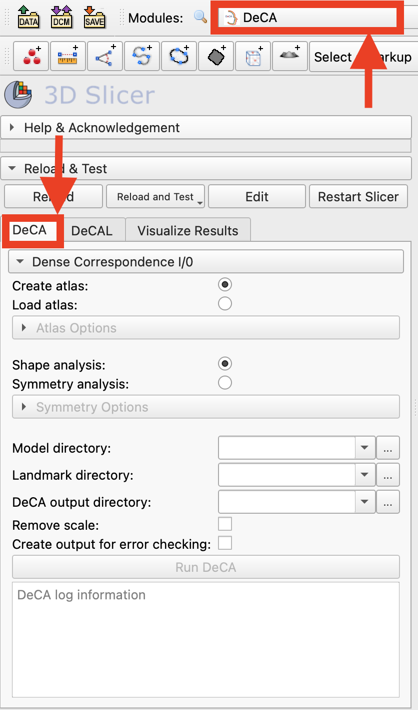
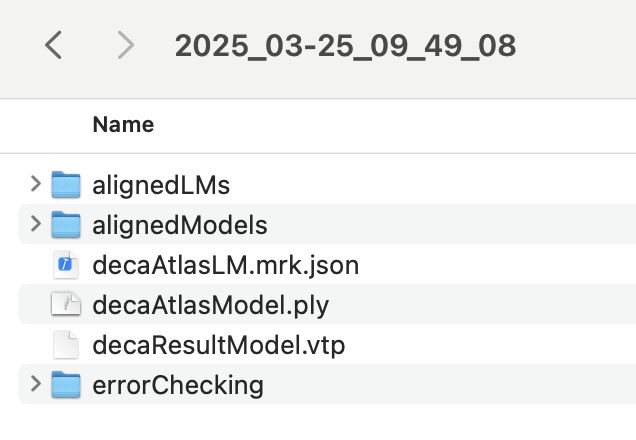
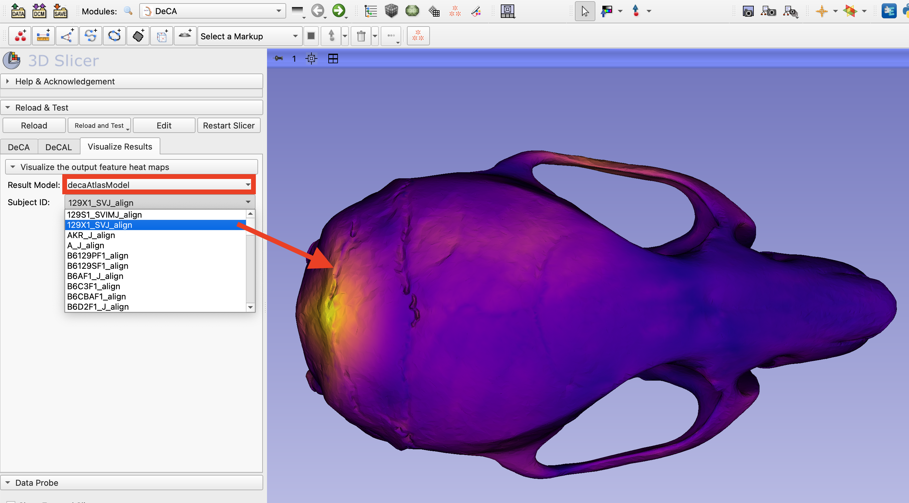
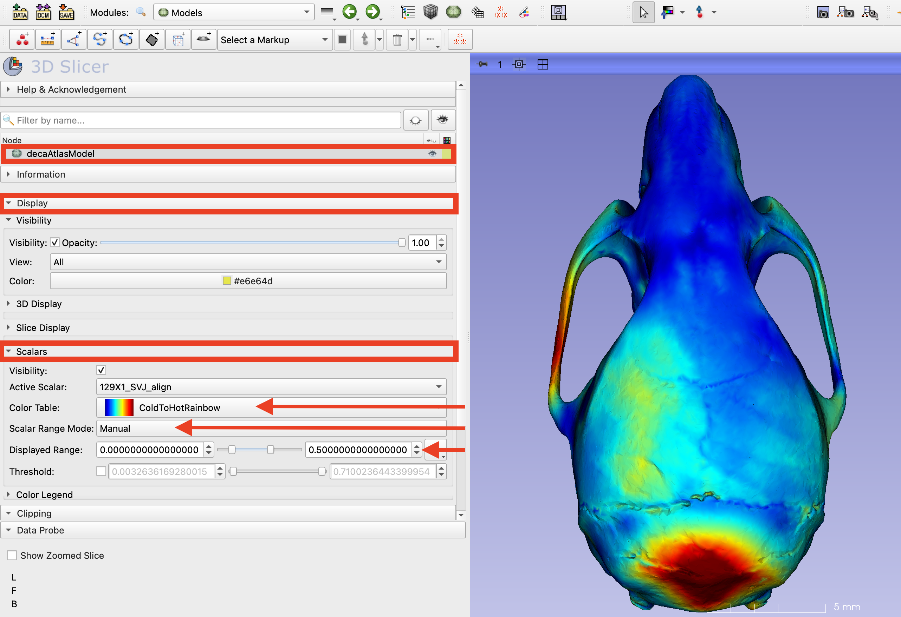
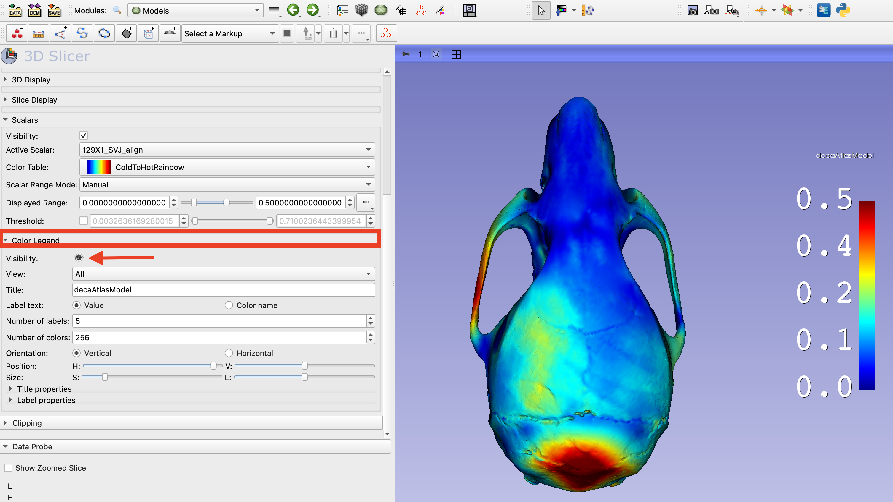

# DeCA

## Introduction
DeCA is a module for dense surface registration of models that is anchored by manual landmark points. This tutorial will walk you through using the DeCA module's to generate an average model from a set of mouse skull models and densly register each specimen to the atlas to find regions of difference.

## DeCA Method
The first step in the DeCA workflow is calculating or loading an atlas model and landmark set that that each model in the dataset will be densly registered to. When running DeCA for the first time, you can automatically generate an averaged model and landmark set to use for the atlas. When this option is selected, Procrustes analysis will be run to select the specimen that is closest to the Procrustes mean. This specimen will define the connectivity and point number of the averaged atlas. Each specimen in the dataset is warped to this specimen to determine initial point correspondences across the dataset. The average atlas is calculated by finding the mean point position for each point on the reference specimen. Once an atlas model and corresponding landmark points have been generated, they are saved and can be used again if DeCA is rerun. 

In the second step of DeCA will rigidly align each subject to the atlas, followed by a non-rigid deformable registration. The point correspondences are assigned and the distance between each atlas point and corresponding point on the target specimen is calculated and stored at that point. Once the correspondences have been calculated, a heat map of distances can be visualized on the atlas model for each individual in the dataset. The pointwise average and standard deviation of the distances over the datasets can also be displayed on the atlas model.

### Create or load the atlas model and landmarks
1. Download the **Mouse Models** dataset from https://github.com/SlicerMorph/Mouse_Models. The **Models** folder will contain 62 models and the **LMs** folder contains a corresponding landmark file for each model with 53 manually placed landmark points.

2. Search for `DeCA` module in Module Finder (CTRL +F) to switch to the DeCA module. From the module's tabs, select `DeCA`

3. The first step is to select the source of the atlas used for dense landmarking. For the initial run, we will create an average atlas model and landmark set from the dataset, so check that the `Create atlas` option is selected in the Dense Correspondence I/O menu.

4. The `DeCA` module can be used to analyze the pointwise magnitude of each individual's shape difference from the computed atlas image or the pointwise magnitude of asymmetry for each individual. In this example, we will be using the module to assess shape difference, so confirm that the `Shape analysis` option is selected in the Dense Correspondence I/O menu.

5. Set the `Model directory` to the downloaded folder of mouse models.

6. Set the `Landmark directory` to the downloaded folder of mouse model landmarks. It is critical that the filenames for the landmarks are identical to their corresponding models, with the exception of the extension, so they can be matched.

7. Create a folder where the output files of the DeCAL module will be stored. This will be a top level directory and each run of DeCA will create a new, timestamped folder containing the files and folders that are generated.

8. The DeCA workflow provides the option to remove scale from the analysis. If this option is selected, all specimens will be scaled to the atlas and the pointwise shape difference will be calculated usign the scaled versions. This option is useful when there are large size differences in the data that are not relevant to the shape change. For this example, remove the scale from the analysis by checking the checkbox "Remove Scale".

9. The DeCA workflow also provides an option to 

10. Run the DeCA workflow by clicking `Run DeCA`. This step can take a few to several minutes, depending on the size of the dataset and whether the atlas is being calculated or loaded in this step.

11. In the DeCA log information window at the bottom of the module, the details of the atlas calculation and location where the atlas model and points will be displayed. When this step is complete, the atlas model and landmarks will be loaded into the scene.

### View the output files

12. When this step is complete, open the top level DeCA output directory. In this folder you will see a timestamped folder for each time DeCA was run. Open the timestamped folder created during this tutorial. This folder contains the atlas model and landmarks named `decaAtlasModel.ply` and `decaAtlas.mrk.json`. The results from the shape analysis are stored in the file named `decaResultModel`. This is a copy of the atlas containing the pointwise shape difference for each specimen and the average difference across the dataset. You also will see the folders `alignedLMs` and `alignedModels` that contain the models and manual landmarks aligned to the atlas. 

### Visualizing the shape difference

13. After running DeCA, the value of the shape differences for each specimen can be visualized as a heatmap on the `decaAtlasModel` that is loaded in the scene. To create an initial visualization, switch to the `Visualize Results` tab of the DeCA module. In the 'Result Model' selector, choose the `decaAtlasModel` just created. Use the `Subject ID` selector to choose the specimen heatmap to display. You can also view the average or standard deviation heatmaps of shape difference over the full dataset.

14. To adjust more display properties of the shape difference heatmaps, switch to the `Models` module. Ensure that the results model, `decaAtlasModel` is the active in the `Models` Node Viewer. To adjust the visualization properties of the heatmap, which is stored as a scalar array, expand the `Display` menu and then the `Scalars` submenu. You can now select a new pre-loaded colormap from the `Color Table` selector. For this example, try `ColdToHotRainbow`. The mapping of shape difference values to colors in the color table is done automatically by default. You can adjust this mapping by setting the `Scalar Range Mode` to manual. Try this and set the `Displayed Range` to 0-0.5.

15. To create a color bar showing the mapped value range, expand the `Color Legend` submenu. Click the eyeball icon in the `Visibility` field to display the colorbar in the 3D view. The properties of the colorbar can also be set using the options in this submenu. The distance values displayed correspond to the physical distance between the corresponding points on the atlas model and the specimen, and will correspond to real world distances if the models are in real world space. If the models had scaling removed, than this distance corresponds to the points on the models scaled to the atlas model.

### Other Resources
 Rolfe, S. M., and A. Murat Maga. “DeCA: A Dense Correspondence Analysis Toolkit for Shape Analysis.” International Workshop on Shape in Medical Imaging. Cham: Springer Nature Switzerland, 2023.

Rolfe, S. M., Mao, D., & Maga, A. M. (2024). Streamlining Asymmetry Quantification in Fetal Mouse Imaging: A Semi-Automated Pipeline Supported by Expert Guidance. bioRxiv, 2024-10.
