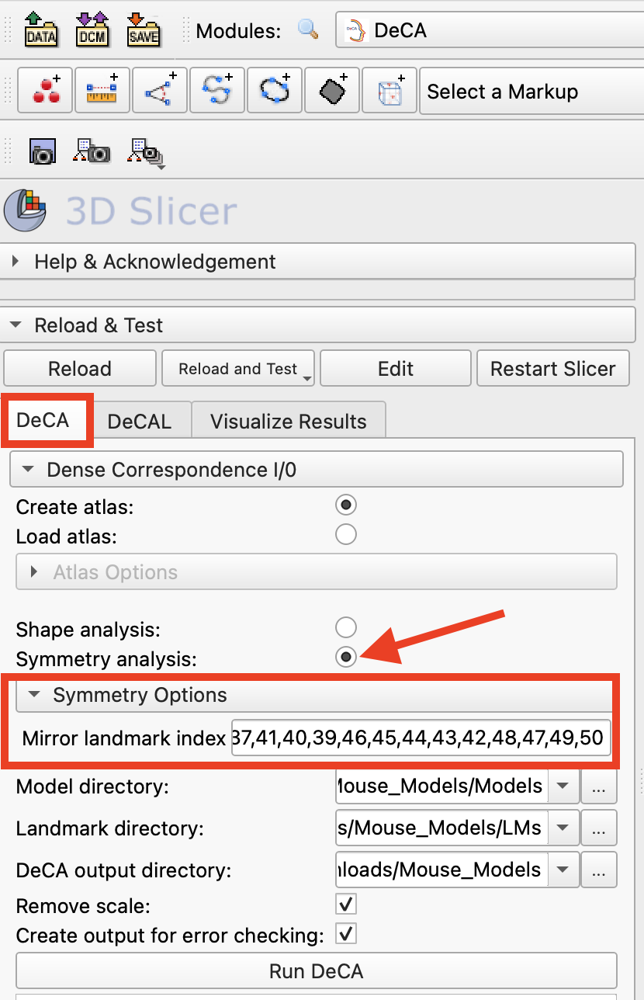
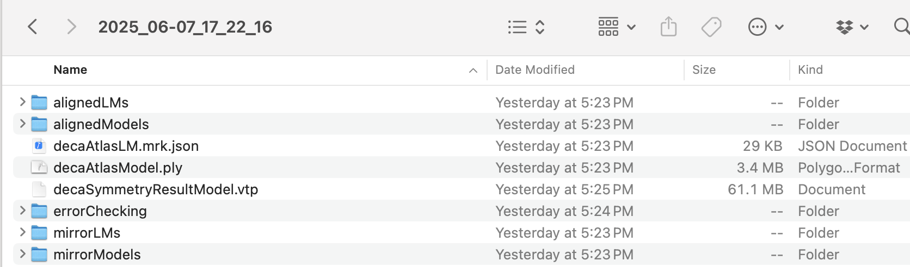
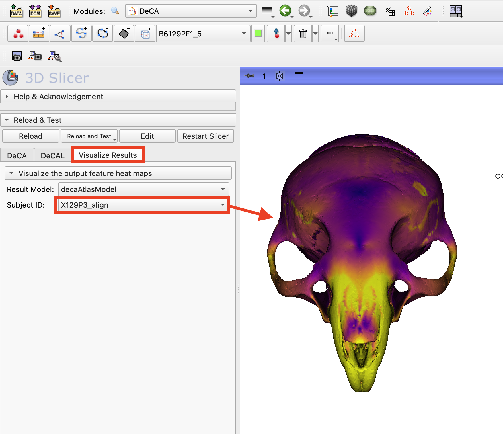
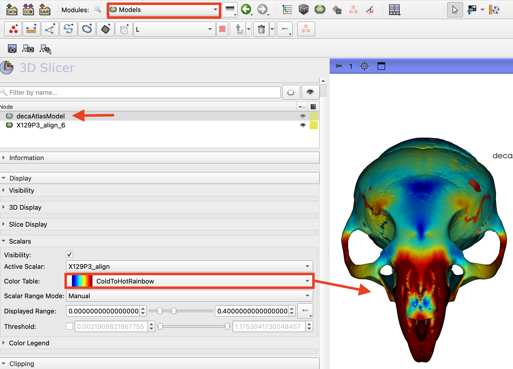
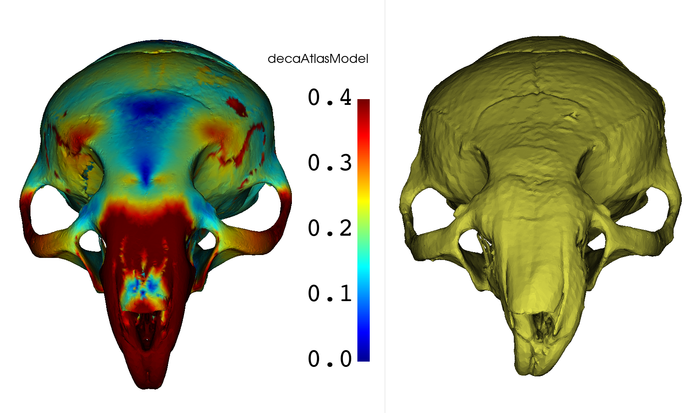

# DeCA Symmetry Analysis

## Introduction
DeCA is a 3D Slicer module for dense surface registration that uses manually placed landmarks to anchor the alignment. This tutorial will guide you through using DeCA to assess asymmetry in a set of mouse skull models.

## DeCA Asymmetry Quantification Method
The process begins by generating an average model from a group of specimens. Each specimen and its mirrored counterpart are then registered to this average model using dense surface correspondence. 

The magnitude of difference between corresponding points on each side is calculated as a measure of asymmetry. These asymmetry values can be visualized as heat maps for individual specimens or the average and standard deviation of the asymmetry magnitudes can be visualized to reveal consistent patterns.

### Create or load the atlas model and landmarks
1. Download the **Mouse Models** dataset from https://github.com/SlicerMorph/Mouse_Models. The **Models** folder will contain 62 models and the **LMs** folder contains a corresponding landmark file for each model with 53 manually placed landmark points.

2. Search for `DeCA` module in Module Finder (CTRL +F) to switch to the DeCA module. From the module's tabs, select `DeCA`

3. The first step is to select the source of the atlas used for dense landmarking. For the initial run, we will create an average atlas model and landmark set from the dataset, so check that the `Create atlas` option is selected in the Dense Correspondence I/O menu.

4. The `DeCA` module can be used to analyze the pointwise magnitude of each individual's shape difference from the computed atlas image or the pointwise magnitude of asymmetry for each individual. In this example, we will be using the module to assess asymmetry, so confirm that the `Symmetry analysis` option is selected in the Dense Correspondence I/O menu.

5. Set the `Model directory` to the downloaded folder of mouse models.

6. Set the `Landmark directory` to the downloaded folder of mouse model landmarks. It is critical that the filenames for the landmarks are identical to their corresponding models, with the exception of the extension, so they can be matched.

7. To set the analysis type to asymmetry, select the option `Symmetry analysis` The `Symmetry Options` menu will now be displayed, with the text field `Mirror landmark index`. This field is needed to define the landmark order for the mirrored landmark lists that will be created for each subject. To support comparison between the original and mirrored models, the order of bilateral paired landmarks will need to be flipped, while midline landmarks order is preserved. The landmark ordering starts at zero and each index number should be separated by a comma. For this dataset, copy and paste the following text into this the `Mirror landmark index` field:
    1,0,6,5,4,3,2,8,7,12,11,10,9,13,14,15,21,22,23,24,25,16,17,18,19,20,26,28,27,30,29,32,31,34,33,36,35,38,37,41,40,39,46,45,44,43,42,48,47,49,50

7. Create a folder where the output files of the DeCAL module will be stored. This will be a top level directory and each run of DeCA will create a new, timestamped folder containing the files and folders that are generated.

8. The DeCA workflow provides the option to remove scale from the analysis. If this option is selected, all specimens will be scaled to the atlas and the pointwise shape difference will be calculated usign the scaled versions. This option is useful when there are large size differences in the data that are not relevant to the shape change. For this example, remove the scale from the analysis by checking the checkbox "Remove Scale".

9. The DeCA workflow also provides an option to create an additional output directory of the models and atlas in the aligned space where the point correspondences are assigned. In this aligned space, the scale of the models is irrelevant, but the alignment between the models should be very close. Any regions that are not aligned well with the model in this space should be addressed by adding additional manual or pseudo-landmark points. To create this output, giving us the option to assess the success of our registration, check the checkbox "Create output for error checking".

10. Run the DeCA workflow by clicking `Run DeCA`. This step can take a few to several minutes, depending on the size of the dataset and whether the atlas is being calculated or loaded in this step.

11. In the DeCA log information window at the bottom of the module, the details of the atlas calculation and location where the atlas model and points will be displayed. When this step is complete, the atlas model and landmarks will be loaded into the scene.

### View the output files

12. When this step is complete, open the top level DeCA output directory. In this folder you will see a timestamped folder for each time DeCA was run. Open the timestamped folder created during this tutorial. This folder contains the atlas model and landmarks named `decaAtlasModel.ply` and `decaAtlas.mrk.json`. The results from the asymmetry analysis are stored in the file named `decaResultModel`. This is a copy of the atlas containing the pointwise shape difference for each specimen and the average difference across the dataset. You also will see the folders `alignedLMs` and `alignedModels` that contain the models and manual landmarks aligned to the atlas. The folders `mirrorLMs` and `mirrorModels` contain the aligned, mirrored models for each specimen. 

    If error checking was selected, a folder named `errorChecking` will contain the atlas and specimen models in alignment space, where the specimens have been deformably warped to the atlas. The overlay of these models can be assessed to troubleshoot any issues with the assignment of point correspondences.

### Visualizing the shape difference

13. After running DeCA, the value of the asymmetry magnitude for each specimen can be visualized as a heatmap on the `decaAtlasModel` that is loaded in the scene. To create an initial visualization, switch to the `Visualize Results` tab of the DeCA module. In the 'Result Model' selector, choose the `decaAtlasModel` just created. Use the `Subject ID` selector to choose the specimen heatmap to display. You can also view the average or standard deviation heatmaps of asymmetry magnitude over the full dataset. In the figure below, the asymmetry values for specimen X129P3 are displayed on the atlas model. Note that the highest values of asymmetry are located on the premaxilla, incisors, and nasal bone.

14. To adjust more display properties of the shape difference heatmaps, switch to the `Models` module. Ensure that the results model, `decaAtlasModel` is the active in the `Models` Node Viewer. To adjust the visualization properties of the heatmap, which is stored as a scalar array, expand the `Display` menu and then the `Scalars` submenu. You can now select a new pre-loaded colormap from the `Color Table` selector. For this example, try `ColdToHotRainbow`. The mapping of shape difference values to colors in the color table is done automatically by default. You can adjust this mapping by setting the `Scalar Range Mode` to manual. Try this and set the `Displayed Range` to 0-0.4. Since we removed scale from the analysis, these values are not identical to the raw asymmetry of each specimen. The measured asymmetry is in the same space as the atlas model, so here the value 0.4 in the colormap 0.4 refers to 0.4mm of asymmetry.

15. To create a color bar showing the mapped value range, expand the `Color Legend` submenu. Click the eyeball icon in the `Visibility` field to display the colorbar in the 3D view. The properties of the colorbar can also be set using the options in this submenu. The distance values displayed correspond to the physical distance between the corresponding points on the atlas model and the specimen, and will correspond to real world distances if the models are in real world space. If the models had scaling removed, than this distance corresponds to the points on the models scaled to the atlas model.

16. To further explore the interpretation of the high values of asymmetry measured for specimen X129P3, we can load the aligned model for that specimen from the DeCA output folder, `alignedModels`. We can see that X129P3 does indeed have visually apparant asymmetry of the premaxilla, incisors, and nasal bone.

### Other Resources
 Rolfe, S. M., and A. Murat Maga. “DeCA: A Dense Correspondence Analysis Toolkit for Shape Analysis.” International Workshop on Shape in Medical Imaging. Cham: Springer Nature Switzerland, 2023.

Rolfe, S. M., Mao, D., & Maga, A. M. (2024). Streamlining Asymmetry Quantification in Fetal Mouse Imaging: A Semi-Automated Pipeline Supported by Expert Guidance. bioRxiv, 2024-10.
