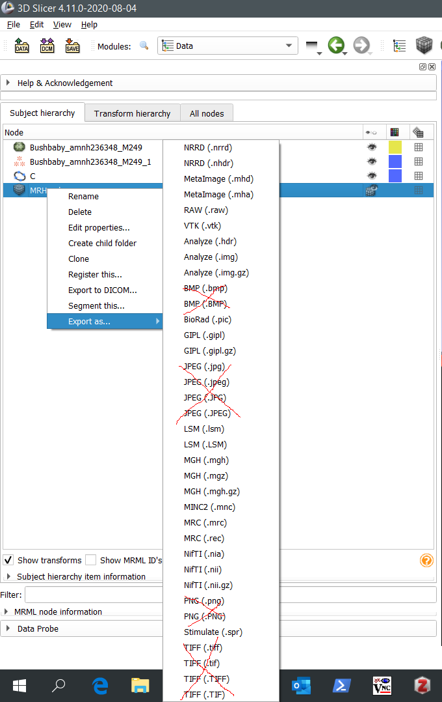
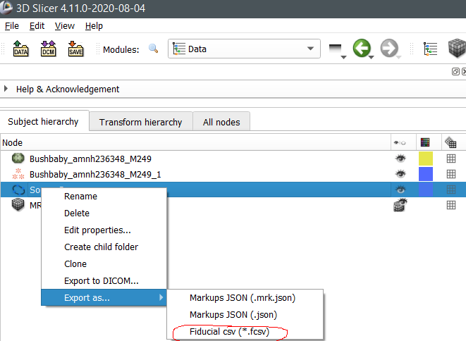
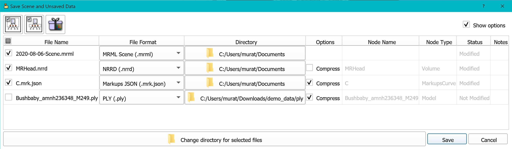

## Export As
`ExportAs` is a SlicerMorph specific plugin for the `Data` module that enables the user to directly save the selected node in one of the support formats with a right-mouse click. 

Note that unlike the built-in **Save As** dialog box, `ExportAs` does **NOT retain states** (e.g., it will not remember the folder where you might have exported the same node previously). For complicated scenes, such as ones that contain multiple volumes, segmentations, 3D models derived from segmentation, measurements of various types, etc you probably want to use the **Save As** dialog box (but read the section **Why ExportAs exists**). However, if you only work on few nodes and mainly interested in one or two of them, `ExportAs` provides a convenient way of saving them. Additionally, `ExportAs` is currently the only way to export curve semi-landmarks in fcsv format (will be covered in detail tomorrow). 

### Why ExportAs exists: 
1. Over the years we observed that new SlicerMorph users find the Slicer's default **Save As** dialog box too confusing, particularly when they have simple tasks (import an 3D model and landmark). 
2. Precisely because **Save As** remembers the previous location of the file, if there is any modification to it, it will overwrite. While there is a warning about existing data, it is easy to overlook this warning when you are saving multiple items at the same time. This may have unwanted consequences. When you are actively segmenting a specimen, if you are constantly overwriting the result of previous segmentation, you will not be able to go back and revisit an earlier stage of a segmentation. Instead, with `ExportAs` user can create his/her own backup scheme and have more explicit control over where the data is being saved. 

### Downside of ExportAs: 
ExportAs does not expose the full functionality of Save As (e.g., there is no way to enable/disable compression for files). Please compare the **Save As** dialog box to the screenshots of `ExportAs` below.  

To use `ExportAs` go to the `Data` module, right click on either a volume, a model or a fiducial node and choose `Export As`, and select one of the formats. The suggested formats as are highlighted in red. 

**Note:** While 3D Slicer lists PNG/BMP/JPG as output options for volumes, it actually doesn't save it. I.e., you cannot save a 3D volume as an image sequence/stack through Slicer. If you choose TIFF format, it will save it as a multi-frame single tiff image. Please always keep 3D volumes in a 3D format (NRRD is Slicer's default format for volumes). [STL is a terrible format and should be avoided.](https://discourse.slicer.org/t/beware-of-the-stl-file-format/7642) Please use OBJ or PLY instead. 

### Volumes

### Models

### Curves

### Save As dialog box for the same scene

### On your own
Try importing re-importing the image stack from the `ImageStacks` tutorial, and then use ExportAs to save it as in the NRRD format. After the export, close the scene and load the NRRD file by draggind and dropping it into Slicer main window. 
