# The `FastModelAlign` module

The `FastModelAlign module` in SlicerMorph is for conveniently testing 3D model registration. Currently, it perfroms rigid and affine registration. The rigid registration involves RANSAC and ICP steps using downsampled pointclouds. The pointcloud-based rigid registration is the foundation of ALPACA automated landmarking (see the [ALPACA publication](https://doi.org/10.1111/2041-210X.13689) and [ALPACA tutorial](https://github.com/SlicerMorph/Tutorials/blob/main/ALPACA/README.md) for more information). The rigid registration functions used in this module are based on the newly developed ITK-based `ALPACA (preview)`. The affine registration is based on the `pycpd` python package. 

## 1. Download sample data
We provided two partial models of the same mountain beaver skull derived from two separate photogrammetric runs as sample data: `partial_photogram_model1.obj` is a partial skull with no bottom, and `partial_photogram_model2.obj` is a partial skull with no top. After installing the SlicerMorph extension, they can be downloaded from the `Sample data module`: clicking the `partial photogrammetry models` button under the `FastModelAlign` tab will download the two sample models to the Slicer cache folder and load them into Slicer automatically (also downloadable here: [SlicerMorph sample data](https://github.com/SlicerMorph/SampleData). The following tutorial are based on these two sample models.

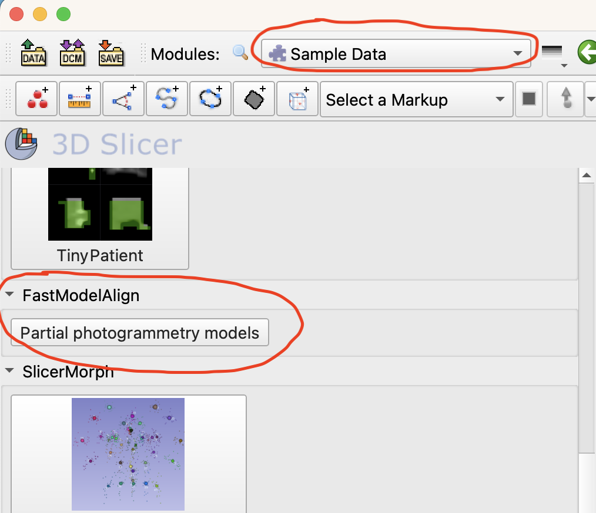

## 2. Specify source, target, and output models
If using the `Sample Data` module, the two partial models should be loaded into Slicer automatically. If downloaded manually, drag and drop the downloaded sample models into 3D Slicer. The two models have distinct sizes because no size reference was provided for the two photogrammetric runs. 

Switch to the `FastModelAlign` module. Select `partial_photogram_model2` from the `Source Model` drop-down menu and `partial_photogram_model1` from the `Target Model` drop-down menu. Also create a model from the `Output registered model` drop-down menu. In this tutorial, the output registered model is named as `test_registration`. Leave the `Skip scaling` unchecked. If checked, the source model will not be scaled to approximate the size of the target model.

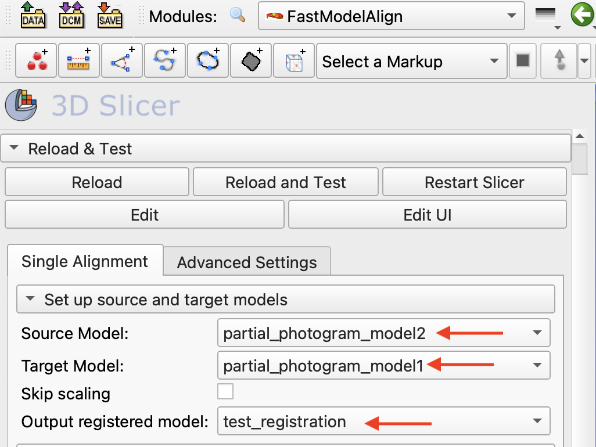

## 3. Run rigid registration
After the three fields in the `Setup source and target models` are populated, the `Testing pointcloud subsampling` and `Run rigid registration` buttons are enabled. 

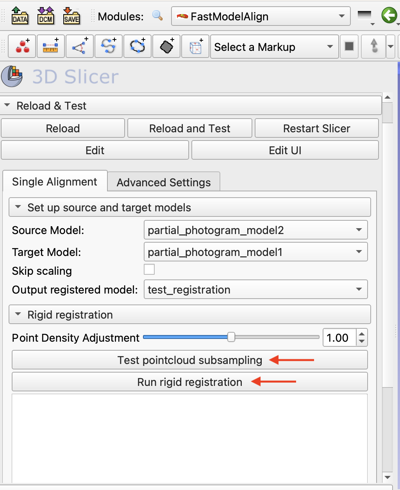

(Optional) Click `Testing pointcloud subsampling` button can show the density of the downsampled source and target point clouds. Adjusting the `Point density adjustment` bar to adjust the number of points in each point cloud. Usually, 4,000 to 6,000 points per point cloud would be optimal.

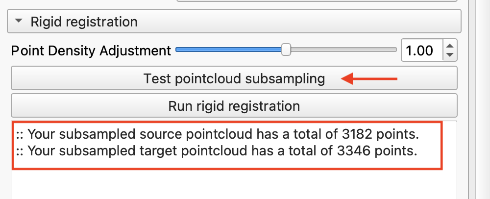

Click the `Run rigid registration` button to rigidly register the source `partial_photogram_model2` to the target model `partial_photogram_model1`. If `Skip scaling` is unchecked, the process first scale the source model to approximate the size of the target model, then rigidly registered the source to the target.After the process is finished, the user specified output model `test_registration` (red) is generated and represents the source model rigidly registered to the target model (yellow). 

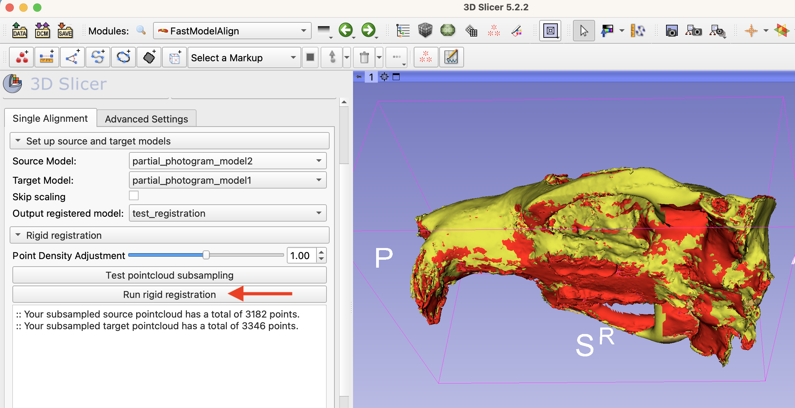

## 4. Investigate and visualize the scaling and rigid transformation process
After running a rigid registration, the module also generates a scaling matrix node named as `partial_photogram_model2_scaling` (source model name plus "_scaling") and a rigid registration matrix node named as `partial_photogram_model2_rigid` (source model name plus "_rigid"), which can be viewed in the data module. This allows users to repeat and visualize the scaling and rigid registration process. The original source model `partial_photogram_model2` is unmodified. **For tutorials of applying, editing, and visualizng transformation in 3D Slicer, please see the official doc: https://slicer.readthedocs.io/en/latest/user_guide/modules/transforms.html.**

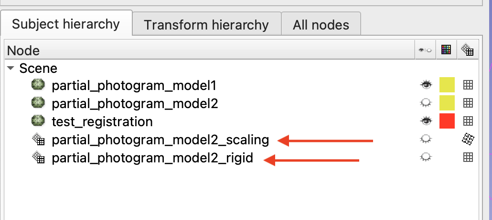

Note that the scaling node is nested under the rigid registration node. This is because the module first performs a scaling transformation for the source model, then performs a rigid registration for the scaled source model. This is equivalent to transforming the scaling matrix by the rigid registration matrix (equivalent to generating a similarity transformation for the source model).

To repeat and vidualize the process of rigid registration after scaling, users can drag the original source model `partial_photogram_model2.obj` (blue) to the scaling node, which has been transformed by the rigid registration node.

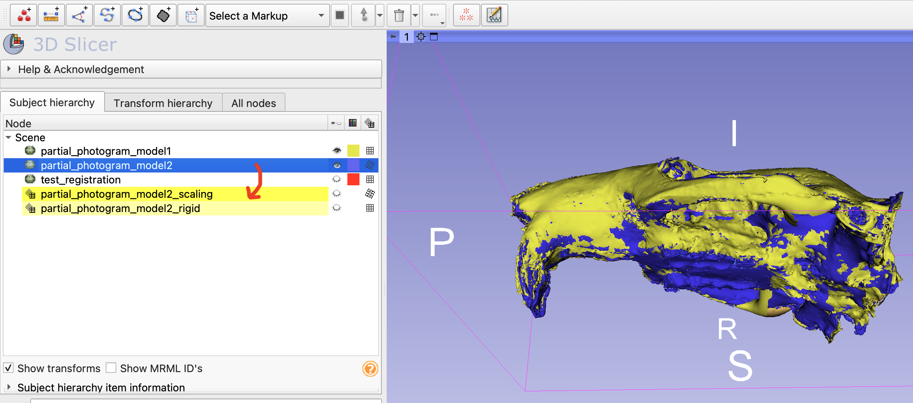

Switch to the Transform hierarchy, users can visualize the hierarchical transformation of the source model node, which is first scaled by the scaling node, then rigidly registered by the rigid transformation node. 

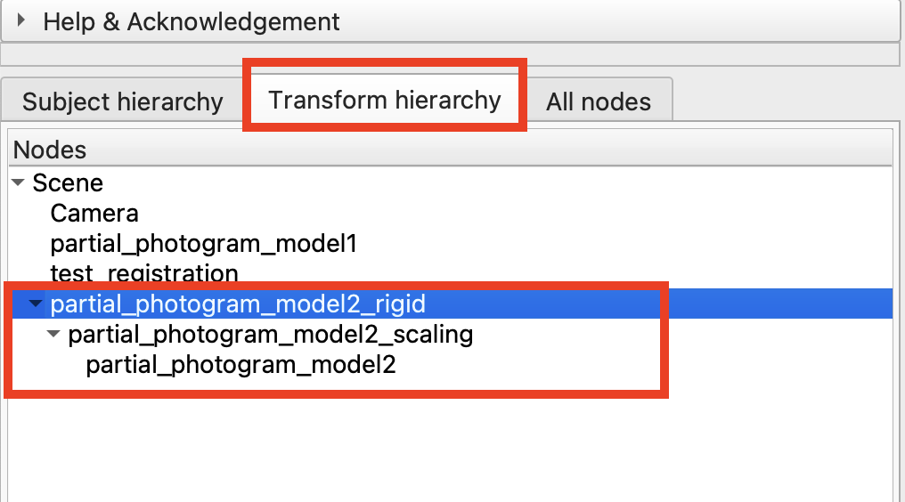

## 5. Run affine registration
After running a rigid transformation, the `Run affine registration` button will be enabled. Click this button will perform an affine deformable transformation for the scaled (if `Scaling optin` is left unchecked) and rigidly registered source model. Therefore, the user defined output model (`test_registration` (red)) is then undergone an affine transformation to match with the target (yellow).

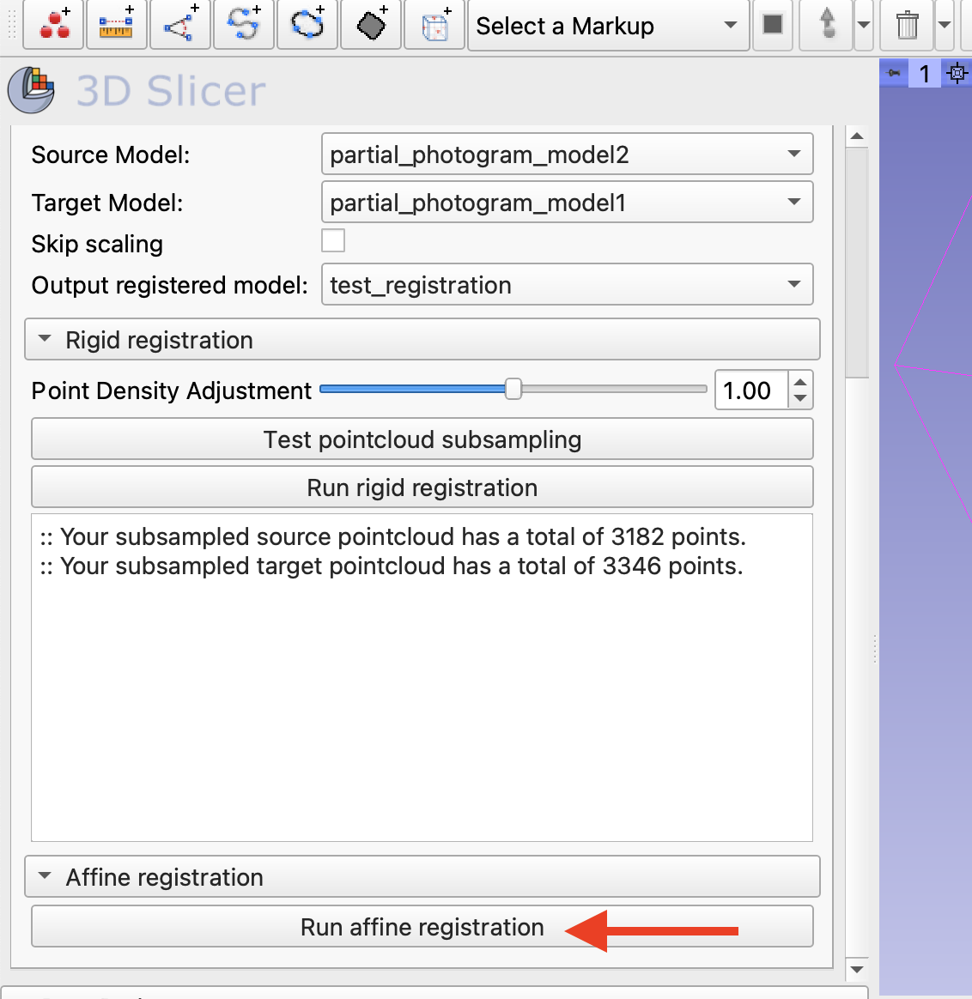

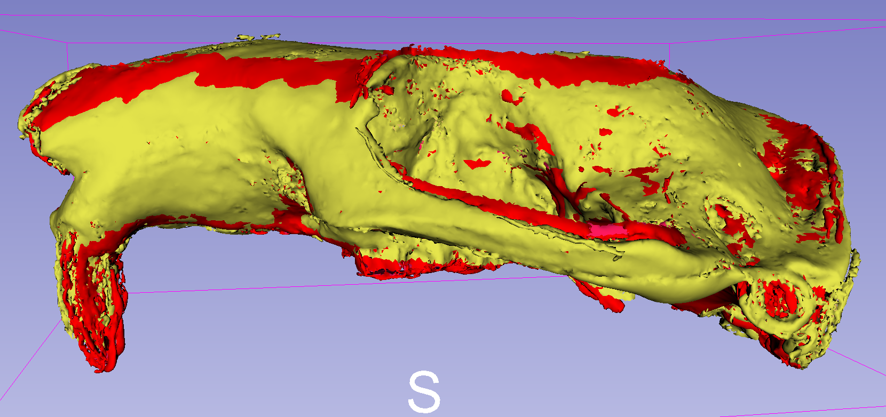

## 6. Investigate and visualize the affine transformation process
After this process, an affine transformation node, named as `partial_photogram_model2_affine` (source model name plus "_rigid"), is generated based on the scaled and rigidly registered model. The `Transform Hiearchy` tab in the Data module shows that the scaling node is under the rigid trasnformation node, which is further nested under the affine transformation node `partial_photogram_model2_affine`. 

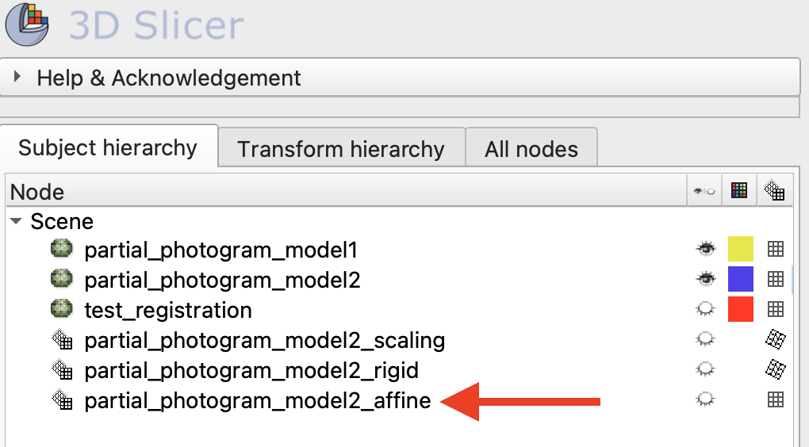 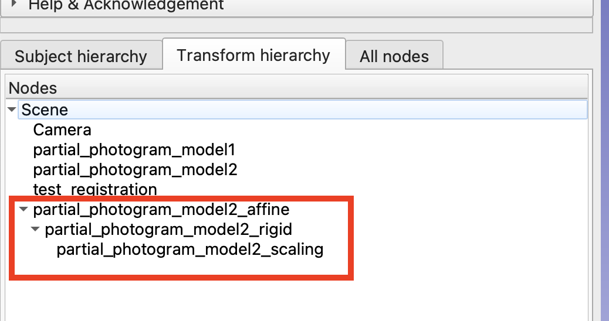

To repeat and visualize the affine registration, users can drag the original untransformed source model `partial_photogram_model2.obj` (blue) into the scaling node `partial_photogram_model2_scaling` for a full sequence of scaling, rigid registration, and affine transformation.

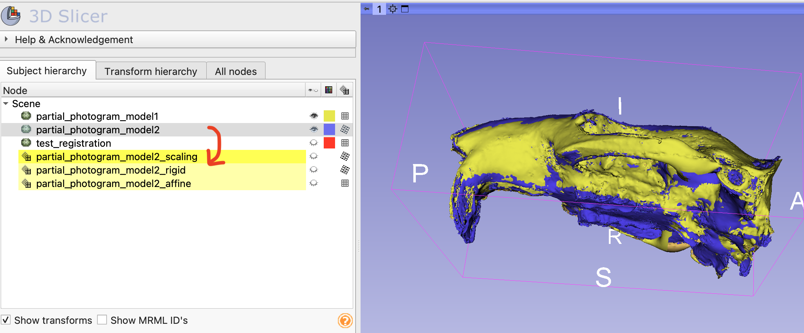 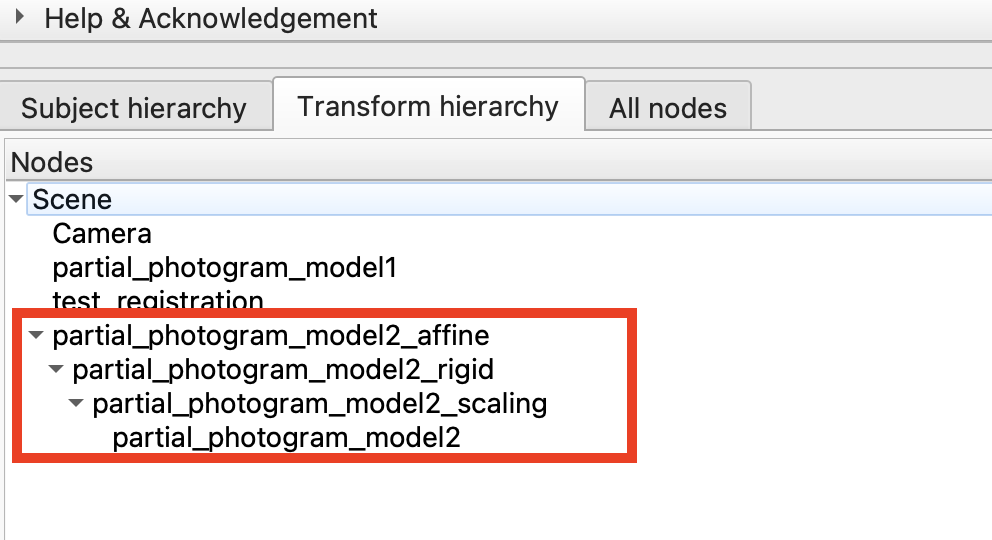

## Parameter settings
Users can adjust the parameter settings under the `Advanced Settings` tab before running each registration step. For settings related to ridgid registration, please refer to the [ALPACA publication](https://doi.org/10.1111/2041-210X.13689).

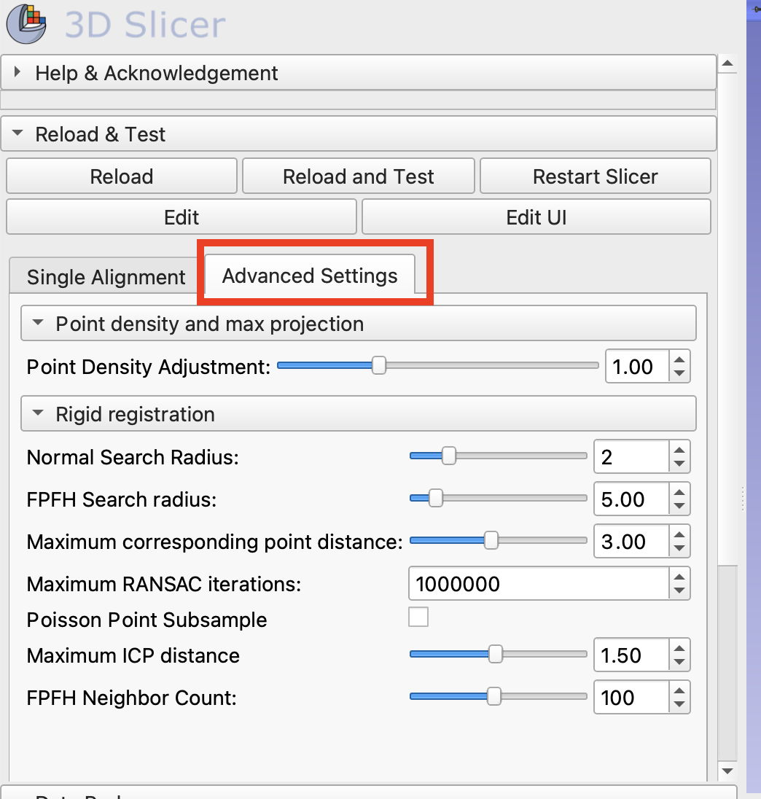

## Reload and test
Click `Reload and Test` will load the two sample models used in this tutorial into Slicer and perform a scaling and rigid registration for the `partial_photogram_model2.obj`.

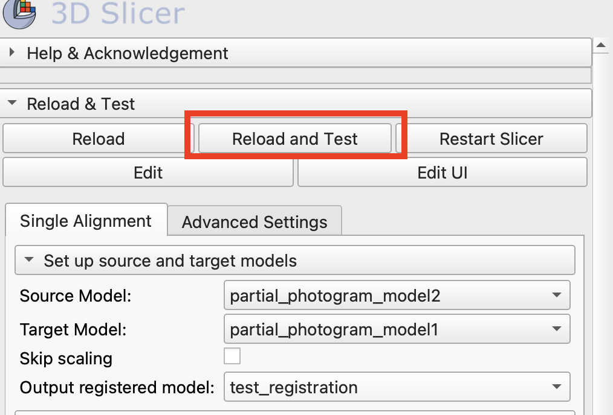

