# Generalized Procrustes Analysis (GPA) Module I

## Basics of GPA Fitting 
This tutorial will walk you through to using the SlicerMorph GPA module to run GPA/PCA on a sample dataset of mouse skull landmarks and will show how to create visualizations of the PC vectors and variance at the landmark points. Instructions on creating an interactive 3D visualization and exporting the GPA module results to R are in the tutorials: [GPA II](../GPA_2/README.md) and [GPA III](../GPA_3/README.md)

### Data Import and GPA Analysis
1. Download the **Mouse Skull Landmarks** from the `Sample Data` module as described in Tutorial 2: Sample Data. Please check the folder contents and note that there are 126 FCSV files. You can drag'n'drop one of the FCSV files into Slicer and see that it contains 55 landmarks (you may need to hit the center field of view button in 3D rendering window). Once you verify your contents hit `CTRL + W` to empty your Slicer scene.

2. Search for `GPA` module. You layout will switch to having two 3D rendering window, a single slice view, a chart view and a table view. The module has three tabs that partition the workflow. The first tab, `Setup Analysis` will load the data and run the GPA/PCA.

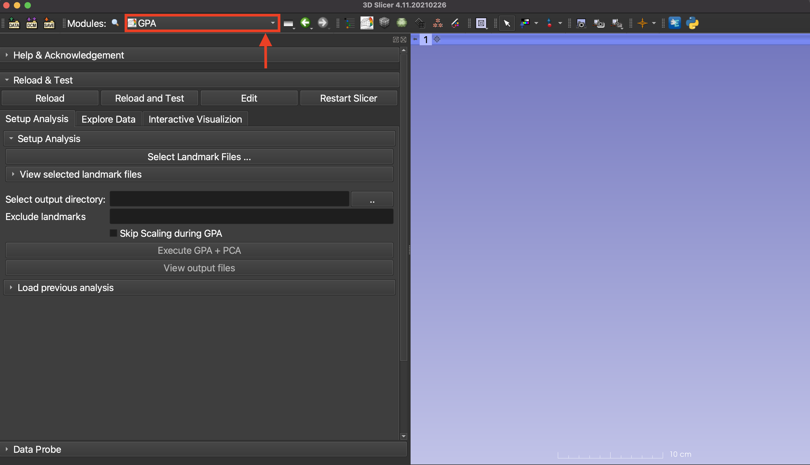

3. Click on the `Select Landmarks..` button next to the `Landmark Folder`. In the file browser pop-up, navigate to your Mouse_Skulls_LMs folder downloaded in step 1. Check that the file selection type is set to FCSV and select all the FCSV files in the folder. Click the `Open` button to confirm the selection. 

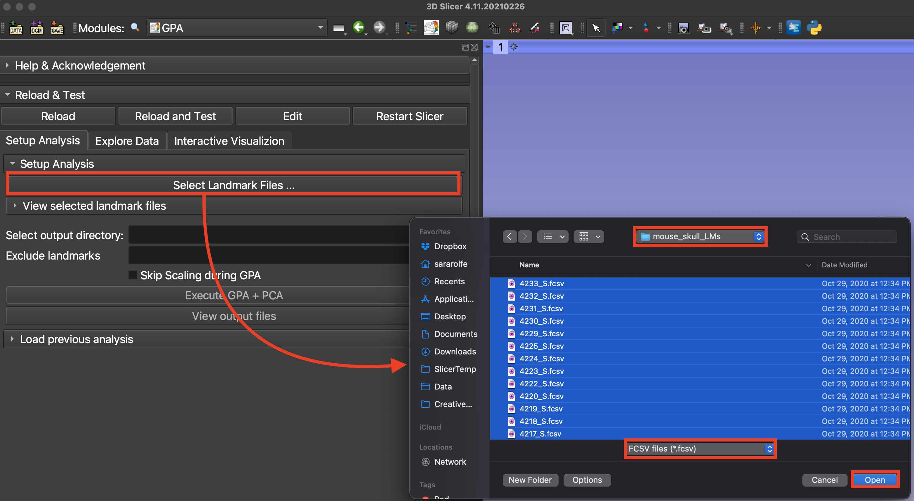

4. In the GPA module, expand the `View selected landmark files` menu. In the file viewer, you will see a list of the file paths for the 126 selected FCSV files. This list can be edited manually when needed to exclude subjects from the analysis.

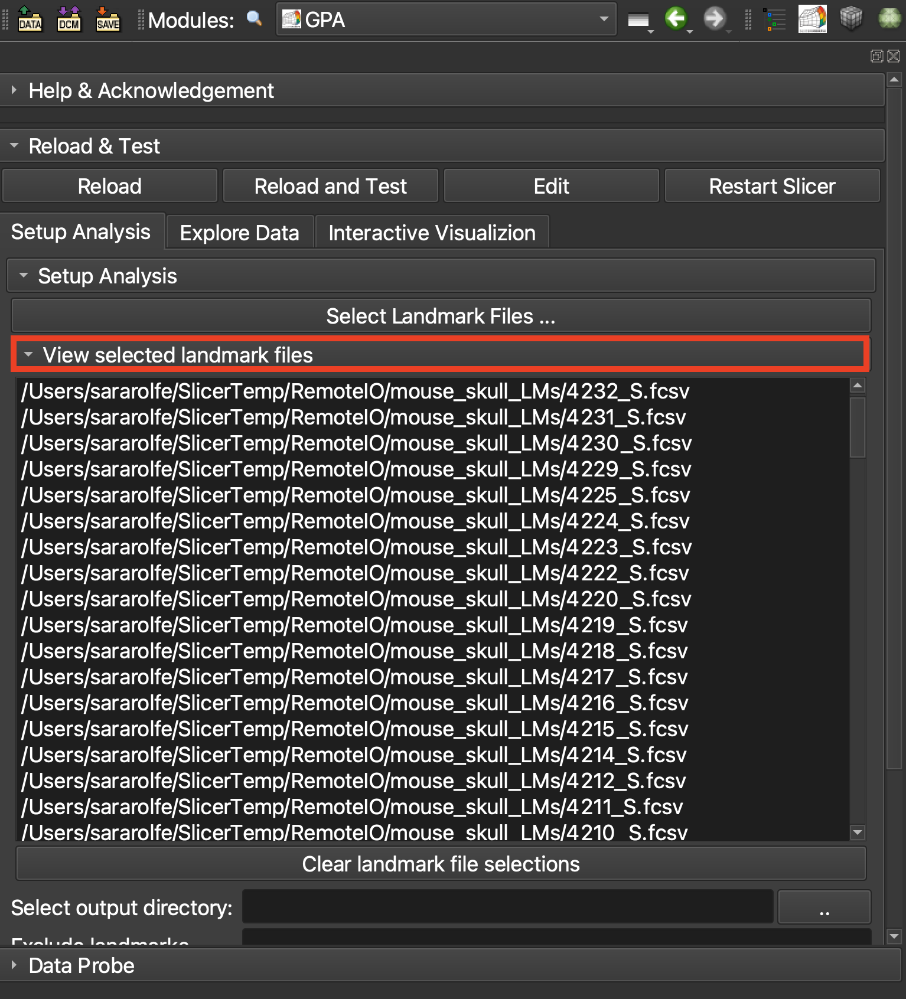 

5. Click on the `..` button next to the `Output Folder` to specify where GPA module will save its out put (choosing the same folder as the previous one is fine). GPA module will create a time-stamped output folder each time you execute an analysis, so the results will not get overwritten. 

6. Do not enter any landmarks to skip, and leave `Skip Scaling during GPA` unchecked, and hit `Execute GPA + PCA`.

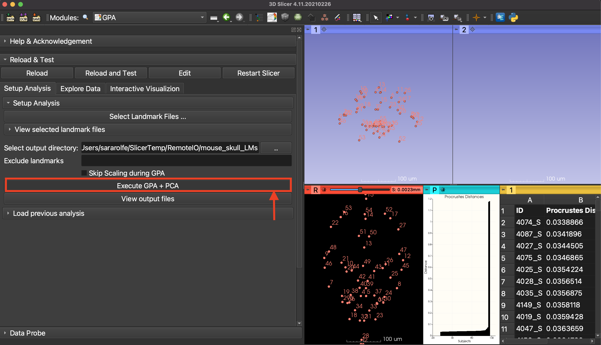

### Viewing the Output Data
7. To view the output from the GPA module, click the `View Output Files` button. This will open the unique results folder created from this run and named with the timestamp from the run time. Note the log file and five CSV files containing the eigenvalues, eigenvectors, mean shape, PC scores, and combined output that contains new procrustes aligned coordinates, centroid sizes and Procrustes distances from the output. If you want to do more specific analysis, these will be files you will import into R/geomorph or other shape analysis packages. T

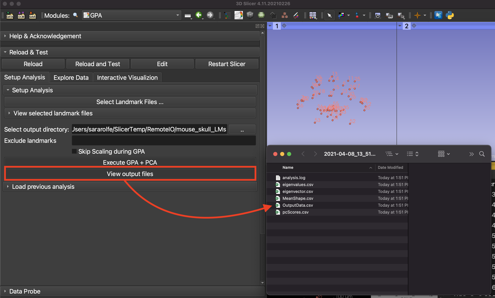

### Generating Plots and Visualizations
8. At this point your Plot and Table window should populate with a histogram-like bar plot of Procrustes Distances, and a table that indicates specimen names sorted by Procrustes Distance. This is a good time to see some unique features of these two windows (such as interaction, being able to zoom in into a plot etc).

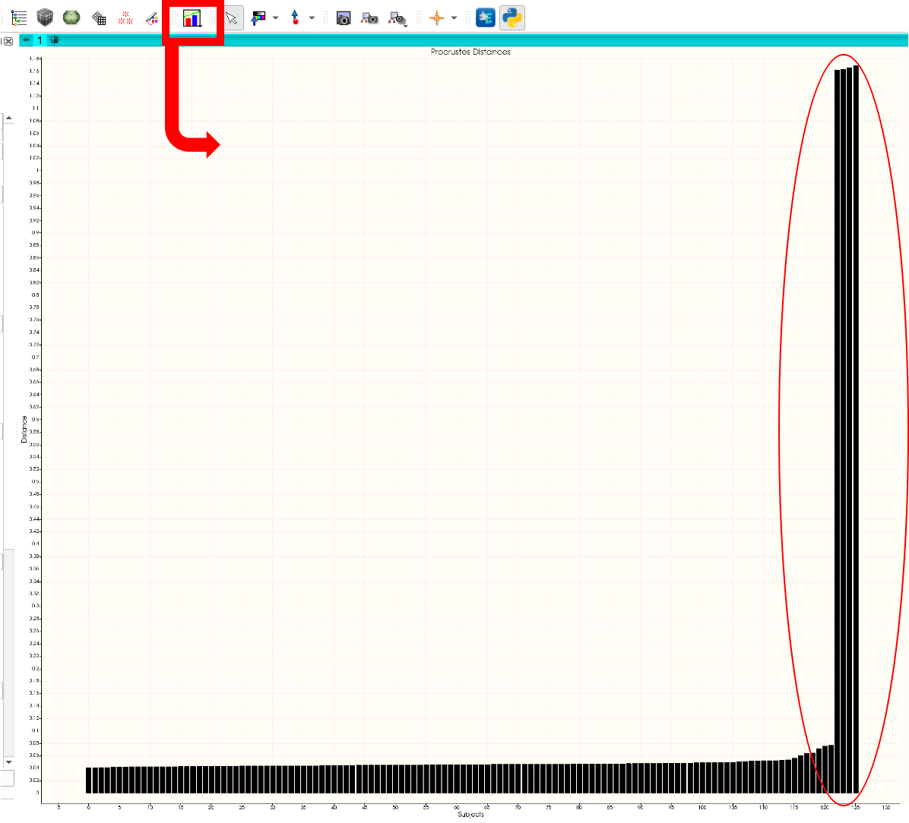

9. Scroll down to the bottom of the Table view to see that there are four specimen with very very high PD values. The shape of the PD plot also indicates there is something very different about these four specimens. 

10. Likewise PCA Scatter plot options displays a suspiciously high variance (~98%) for PC1. Go ahead and choose PC1 for x-axis, PC2 for y-axis and hit `Scatter Plot` button. 

11. Note that plot window now changed to `PCA Scatter Plot` from Procrustes Distance plot. You can enlarge this plot by selecting the "Plot only" layout from the layouts menu. If you expand the Plot window toolbar, you will see a field called Plot Chart that will let you go back and forth between plots created. Go and try switching back to Procrustes Distance plot and back to PCA scatter plot. (Note that if the default data label size is too small for your screen, you can use the Slicer's `Plots` module to modify the aesthetics of the plot. Also the plot window is interactive, you can zoom in and out using the mouse wheel.) 

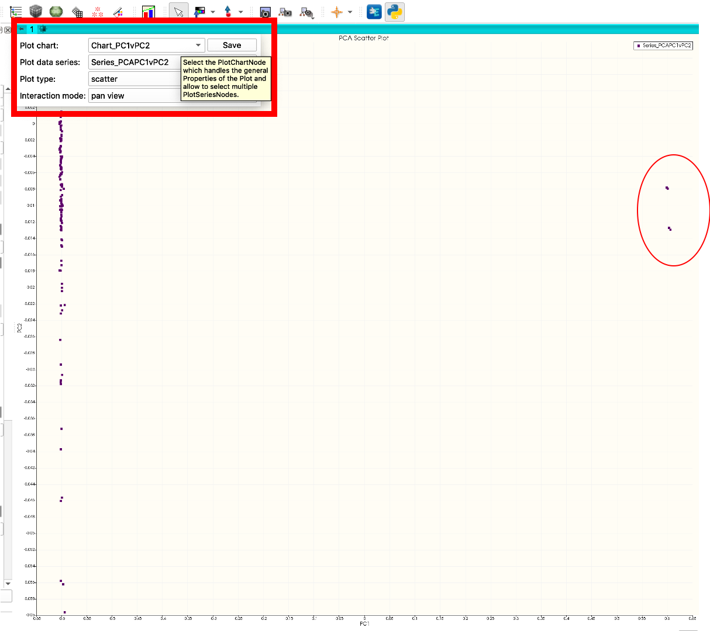

12. Hover over the four data points on the right-hand side of the PC1 axis and note that they are the same four specimens with the highest PD (you will need to zoom in to see them individually). So what is going on?

13. To access further data visualization tools, switch to the `Explore Data` tab of the GPA module. To visualize the PC1 vectors, go to the `Lollipop Plot Options` section and set the Vector One to PC1, then hit the `Lollipop Vector Plot` button. This set will automatically enable landmarks for the estimated mean shape and place eigenvector associated with PC1. By convention, this indicates how mean shape will change along the positive values of the selected PC. You should see that no other vector apart from LM25 is visible, thus PC1 (and almost all shape variation in this dataset) is influenced by LM25. This is a sign off trouble with this dataset. (HINT: If you toggle the `mean shape visibility` on and off, you will be able to see the other vectors.). Interact with the 3D window and note that you can zoom in/out as usual, and rotate. At this point, you can use either Viewport #1 or #2. 

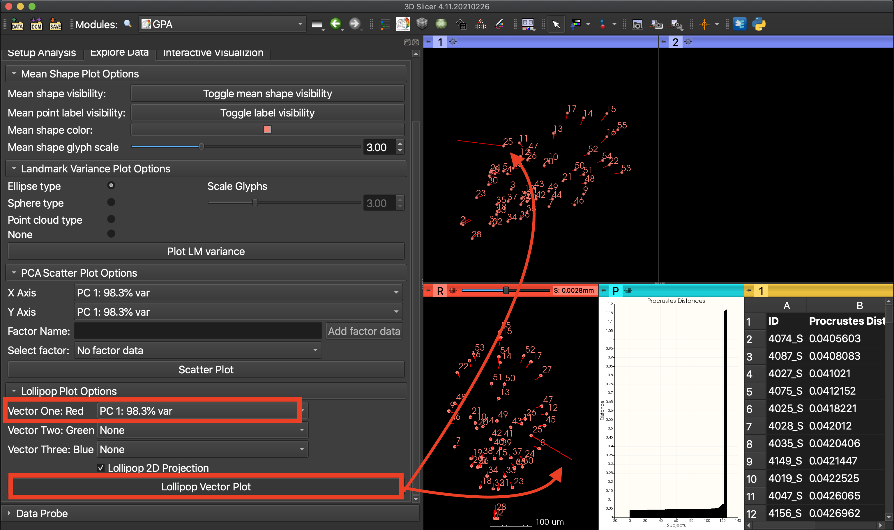

14. To further convince ourselves of the issue, you can get a sense of variance associated with each landmark by plotting them as either spheres (averaged across three dimensions), or ellipse (all axes are independently calculated). You can see that LM25 has variance orders of magnitude larger than the others, and it is pancake like appearance suggest that it is confined to two dimensions. 

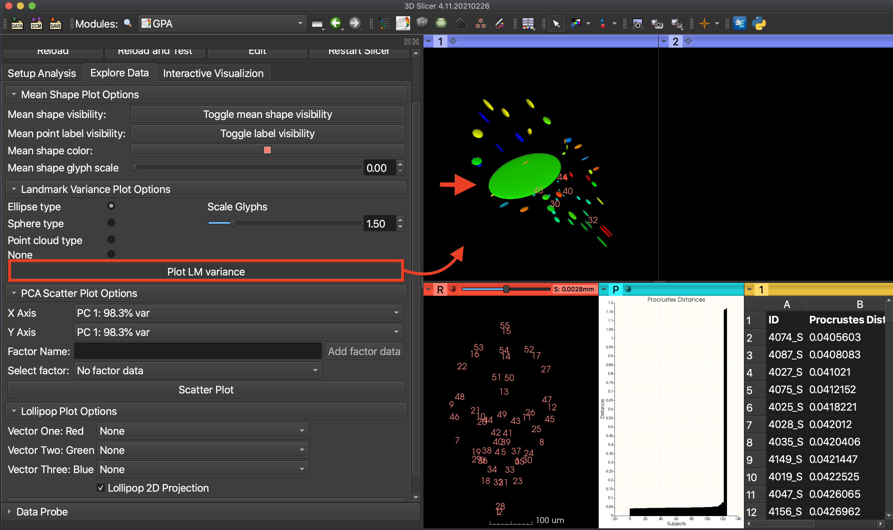

Plotting the point cloud from the landmark variance shows that four points from the landmark 25 cluster were placed at the origin. Clearly LM25 in these four specimens have an issue, and is better left out of the analysis. 

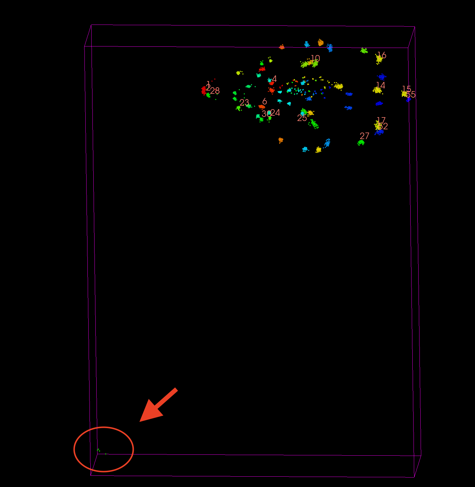

### Excluding points from the Analysis
15. To repeat the analysis without LM25, first we need to clear our scene. Hit the `Reset Scene` button at the bottom of the GPA module and note that everything created by this module is removed. 

16. Now return to the  `Setup Analysis` tab of the module and repeat the step #1 above. It should remember the last folder you open. This time you will enter 25 to `exclude landmarks` field to conduct the analysis without LM25. 

17. Review the outputs and confirm that the Procrustes distance bar plot and PC1xPC2 scatter plot have been updated and no longer show the outliers observed in the previous run. 

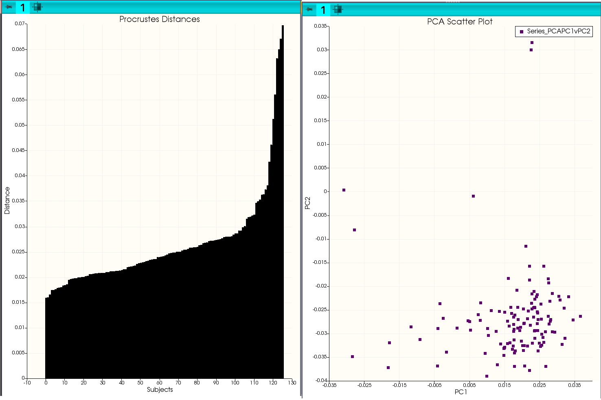

Try things like projecting the results in 2D Slice viewer, which you can switch the plane like in normal slice view you have been viewing. Unfortunately, it doesn't automatically center the field of view like scans we have been loading, thus you need to use your `left` and `middle` mouse clicks to zoom in/out and pan the field of view manually. Trying having more than one PC plotted as lollipop plots etc...

For more information on using the GPA tools, continue with the tutorial: [GPA II](../GPA_2/README.md)

### Other Resources
Videos of GPA tool functionality on the SlicerMorph youtube channel. Note that these show slightly older user interface, but the functionality is identical. 
* [Basic Functionality](https://www.youtube.com/watch?v=FCeZ2J5Uvcw)
* [Realtime exploration of MorphoSpace](https://www.youtube.com/watch?v=hMMR9GChek8&t=2s)
* [Recording the PC warps](https://www.youtube.com/watch?v=gtHqhqaKeCU)
