# Generalized Procrustes Analysis (GPA) I: Setting up and running GPA/PCA

## Introduction

SlicerMorph's **GPA** module runs a Generalized Procrustes Analysis on a set of landmark files and follows it with a Principal Component Analysis (PCA) of the aligned shapes. It then lets you explore the result in Slicer's plot, table and 3D views, and, if you have R installed, fit linear models with geomorph without leaving Slicer.

This is the first of four tutorials on the module:

1. **GPA I (this tutorial):** getting the sample data, setting up the analysis (including covariates), running GPA/PCA, and reading the results: Procrustes distances, PCA scatter plots, landmark variance and lollipop plots.
2. **[GPA II](../GPA_2/README.md):** warping a 3D model of a skull along the PCs, driving the warp from the scatter plot, and exporting animations.
3. **[GPA III](../GPA_3/README.md):** fitting Procrustes linear models (geomorph's `procD.lm`) from within Slicer and visualizing the regression as a shape change.
4. **[GPA IV](../GPA_4/README.md):** sliding semi-landmarks: how to do it in SlicerMorph, and when not to. It uses its own dataset, with semi-landmarks.

GPA I–III use the same dataset, so work through them in order. Everything in this tutorial was done in 3D Slicer 5.12 with the current SlicerMorph extension.

## The tutorial dataset

The **Mouse Skull GPA Tutorial Set** contains:

| File | What it is |
|------|-----------|
| `converted_LMs.zip` | 431 mouse skulls, one landmark file per specimen, 55 landmarks each (`.fcsv` format). |
| `809-3.obj.zip` | A 3D surface model of specimen 809-3's skull (about 55 MB unzipped). We use it in GPA II and III. Its landmarks, `809-3.fcsv`, are already in the landmark folder. |
| `matched_metadata.csv` | A covariate table: one row per specimen, with the columns `ID`, `Sex`, `CrossDirection`, `rs6268443`, `rs3712541`, `rs3676545`. |

> **Where the covariates come from.** `Sex`, `CrossDirection` and the three SNP genotypes (`rs…`) come from the mouse backcross of Maga et al. (2015), a quantitative-trait-locus study of skull shape (A/J × C57BL/6J F1 mice backcrossed to A/J, so every genotype is either `AA` or `AB`). They are real data, but these tutorials use them to show how the covariate tools work, not to analyse that cross. For the biology, see the original paper.

> **About the `.fcsv` format.** The landmarks in this dataset are stored as `.fcsv`, an older Slicer markups format. That is fine for this exercise, because all 55 points are fixed landmarks. **Do not use `.fcsv` for new projects.** It lacks the newer markups features that grid-based and other semi-landmark workflows need in order to work properly. Its plain comma-separated layout is also fragile: a free-text field such as the point description, which GPA reads to decide which points are semi-landmarks ([GPA IV](../GPA_4/README.md)), is easily broken by a stray comma or an editor. Save your landmarks as `.mrk.json`, the current Slicer markups format and the default in SlicerMorph.

## 1. Download the data

1. Open the **Sample Data** module (the first module you see when Slicer starts, or search for it with the module finder, `Ctrl+F` / `Cmd+F`).
2. Scroll down to the **SlicerMorph** category and click **Mouse Skull GPA Tutorial Set**.

   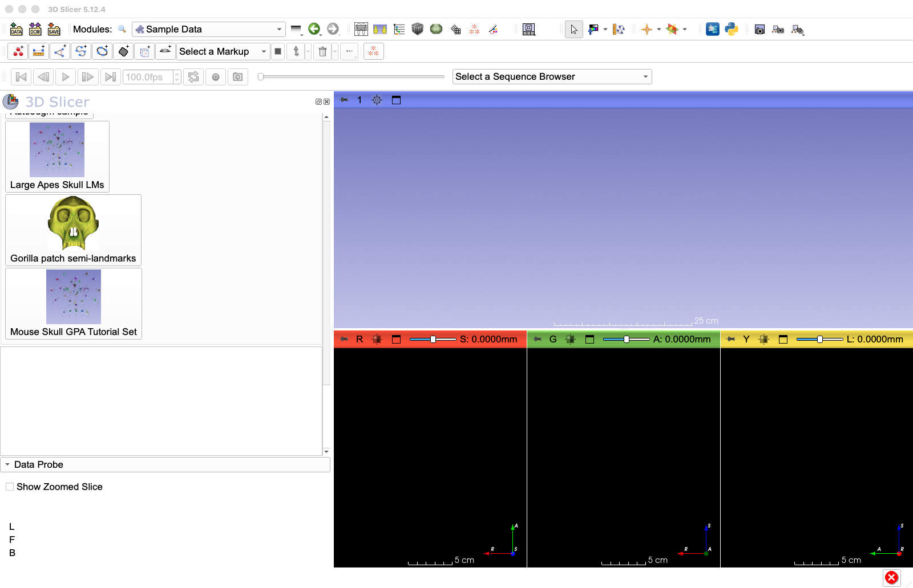

3. Slicer asks for a **Destination Folder**. Pick or create an empty folder (we used one called `GPA_Tutorial`) and click **Open**. The three files are downloaded into it. Nothing is loaded into the scene; this entry only puts the files on your disk.

   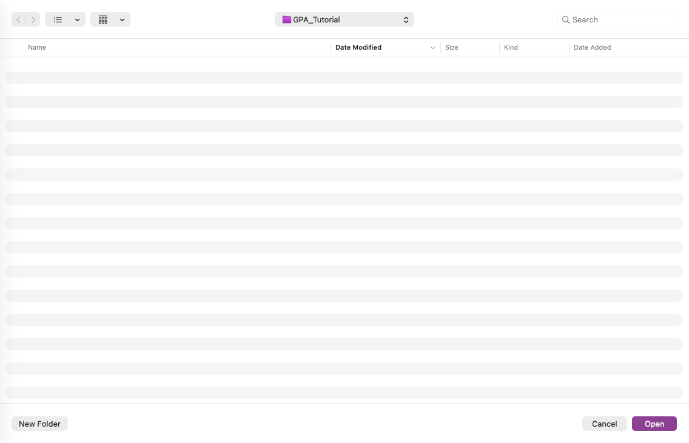

4. Unzip `converted_LMs.zip` and `809-3.obj.zip` (double-click them in Finder or Explorer). You should now have a `converted_LMs` folder with 431 `.fcsv` files, the `809-3.obj` model, and `matched_metadata.csv`:

   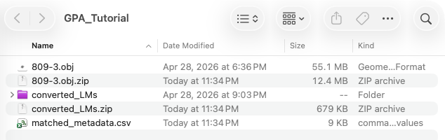

5. If you like, drag one of the `.fcsv` files into Slicer to see what a specimen looks like (55 points). Then press `Ctrl+W` / `Cmd+W` to clear the scene. We always recommend starting GPA from an empty scene, so that nothing left over from earlier work gets in the way.

## 2. Open the GPA module

Find **GPA** with the module finder, or go to **SlicerMorph → Geometric Morphometrics → GPA** in the module menu. The module has four tabs:

| Tab | What it does |
|-----|-------------|
| **Setup Analysis** | Choose landmark files, output folder, options and covariates; run GPA/PCA; reload an earlier run. |
| **Results** | Mean shape, landmark variance, PCA scatter and lollipop plots. |
| **Interactive 3D** | Warp a model or the mean shape along PCs, record animations (GPA II). |
| **Geomorph Linear Regression** | Fit `procD.lm` models in R and warp along the coefficients (GPA III). |

Only **Setup Analysis** is active until you run an analysis.

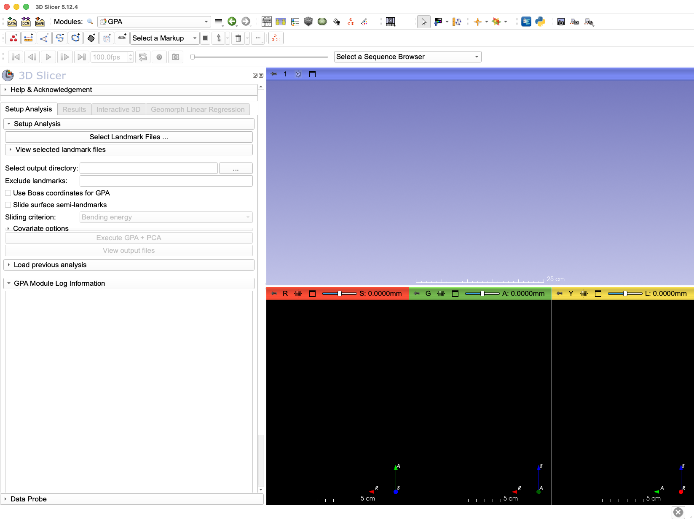

## 3. Select the landmark files

1. Click **Select Landmark Files ...**. In the file browser, go into the `converted_LMs` folder, select every file (`Ctrl+A` / `Cmd+A`) and click **Open**. GPA reads both the legacy `.fcsv` format and the current `.mrk.json` format. For your own data, use `.mrk.json` (see the note on `.fcsv` above).
2. Expand **View selected landmark files** to check the list. It shows the full path of each of the 431 files. It is for information only.
3. To leave a specimen out, simply select the files again without it. **Clear landmark file selections** empties the list.

Every file must have the same number of landmarks, in the same order. GPA cannot compare landmark 12 in one specimen with landmark 12 in another if they mean different things.

## 4. Choose the output folder

Click the **...** button next to **Select output directory** and choose where results should go (we used `GPA_Tutorial/GPA_output`). Every time you run GPA, the module creates a new subfolder named with the date and time (for example `2026-09-23_23_38_47`), so earlier runs are never overwritten.

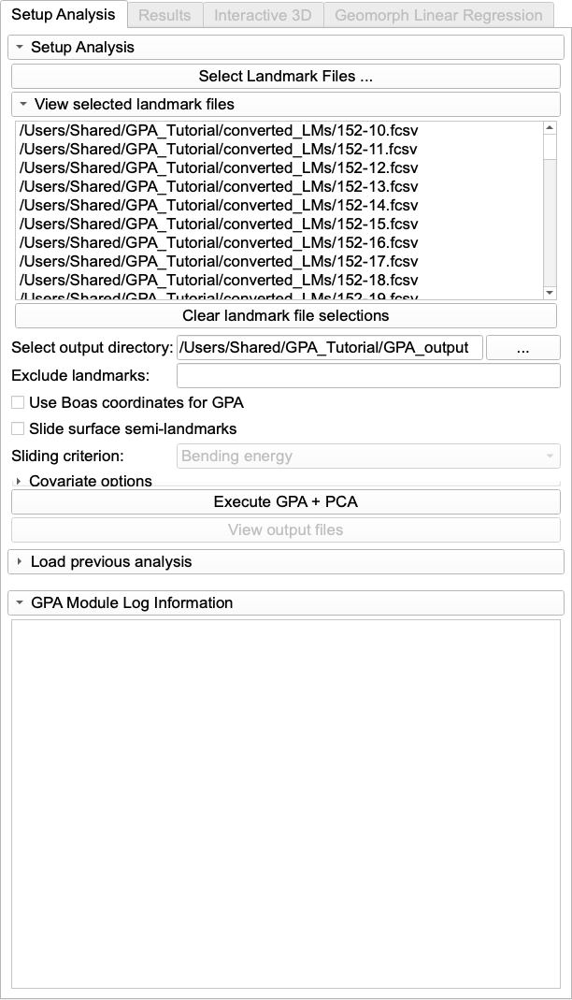

## 5. Analysis options

- **Exclude landmarks:** a comma-separated list of landmark numbers to drop from the analysis (no spaces, e.g. `51,52`). Use it when a landmark is missing or unreliable in part of the sample. The files themselves are not changed.
- **Use Boas coordinates for GPA:** leave this unchecked. When checked, GPA skips the scaling step, so PCA is run on coordinates that still carry size (Boas coordinates). By default, all shapes are scaled to unit centroid size and PCA describes shape only.
- **Slide surface semi-landmarks** and **Sliding criterion:** these only matter if some of your points are semi-landmarks (points whose `description` field is set to `Semi` in the landmark file). They are then allowed to slide along the surface during GPA, using either bending energy or Procrustes distance as the criterion, the same two options as geomorph's `gpagen`. Our tutorial landmarks are all fixed, so leave the box unchecked. Sliding is not a harmless default. [GPA IV](../GPA_4/README.md) covers how to do it and when not to.

## 6. Covariates

Covariates are the extra information you have about each specimen: sex, genotype, population, age, treatment. GPA uses them in two places: to **color the PCA scatter plot** (this tutorial) and as **terms in a linear model** (GPA III). If you plan to do either, set the covariates up now, before running GPA.

### How GPA reads a covariate table

A covariate table is a CSV file with a header row:

```
ID,Sex,CrossDirection,rs6268443,rs3712541,rs3676545
152-1,F,A,AB,AB,AA
152-10,M,A,AB,AA,AB
152-11,M,A,AB,AA,AB
...
```

- **First column = specimen ID.** It must match the landmark file names without the extension (`152-1` for `152-1.fcsv`), with exactly one row per selected file, **in the same order as the selected files**. GPA checks the table row by row against the file list. A typo, a difference in upper/lower case, or a row out of order makes the import fail.
- **One column per covariate**, each with a name in the header row.
- **No empty cells.** Every specimen needs a value for every covariate. If a value is missing, GPA stops and asks whether to continue without covariates.
- **Text versus numbers matters.** A column of text (`F`/`M`, `A`/`B`, `AA`/`AB`) is treated as a **factor**, i.e. a set of groups. Factors can color the scatter plot and enter a model as group effects. A column of numbers is treated as **continuous**. It will not be offered for coloring the plot (GPA shows a warning when you load it), but it can be used in a regression.
- **Size is added for you.** Centroid size is computed during GPA and is always available as `Size` in GPA III. Do not add a size column yourself.

> **Watch out for factors coded as numbers.** If you record sex as `1`/`2`, or genotype as `0`/`1`/`2`, GPA and R will treat that column as a continuous measurement, and a model will fit a straight line through the codes instead of comparing groups. Use text labels (`F`/`M`, `AA`/`AB`/`BB`) for anything that is a group.

### Start from the template (recommended)

For your own data, **always start from the template GPA generates, rather than typing a table from scratch**. The template's ID column is written directly from the files you selected, in the right order. This rules out the most common reasons a covariate import fails: typos in specimen names, differences in upper/lower case (`Mouse_01` vs `mouse_01`), missing or extra rows, and rows in a different order than the files. You only fill in the covariate values.

The template belongs to **the file selection it was made from**. If you later change which landmark files go into the analysis (for example, you leave out a damaged specimen), generate a new template for the new selection, or delete the matching rows from your filled table. A table made for 431 files will not import into an analysis of 427.

1. Expand **Covariate options → Generate new covariate table template**.
2. Type your covariate names in **Factor Names**, separated by commas (e.g. `Sex,CrossDirection`). The **Generate Template** button becomes active once landmark files are selected.

   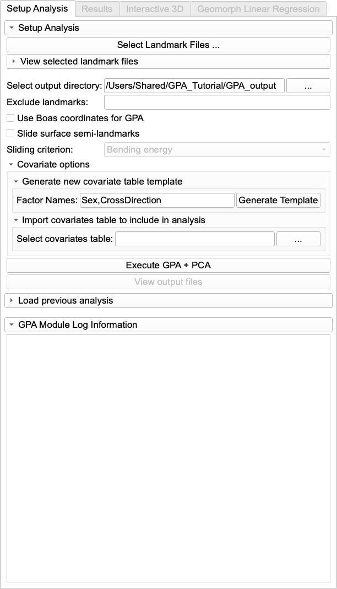

3. Click **Generate Template**. GPA writes a `covariateTable.csv` with the specimen IDs already filled in and empty covariate columns, opens its folder, and puts its path in **Select covariates table**. Fill in the covariate columns (a spreadsheet program is fine, but save as CSV) **without editing, re-sorting or renaming the ID column**, then point **Select covariates table** at the filled file.

   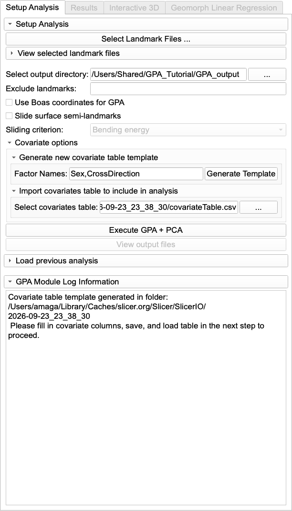

   The template is written inside Slicer's cache folder (the path is shown in the log). **Save your filled copy next to your data**, not in the cache. The cache can be cleared, and you will want this table again.

### Importing the tutorial covariates

Our tutorial set already comes with a filled table, made for exactly this set of 431 files and in the same order. So here we can skip filling in the template. (You have already seen how to generate one above. With your own data, that is the route to take.)

1. Expand **Import covariates table to include in analysis**.
2. Click **...** next to **Select covariates table** and choose `matched_metadata.csv`.


The table is checked when you run the analysis, not when you select it.

## 7. Run GPA + PCA

Click **Execute GPA + PCA**. With 431 specimens this takes a few seconds. The log at the bottom of the module reports what happened:

```
Covariate table loaded and validated
Table contains 5 covariates: Sex CrossDirection rs6268443 rs3712541 rs3676545
Loaded 431 subjects with 55 landmark points.
Scale Factor for visualizations: 0.48378203139039294
Closest sample to mean: 809-3
```

The last line is useful. It names the specimen whose shape is closest to the mean, which makes it a good choice of reference model for GPA II. That is why the tutorial set includes a model of specimen 809-3.

The Slicer layout switches to a GPA-specific one: two 3D views on top (the mean shape is shown in the first), and a slice view, a plot view and a table view below. The other tabs are now active.

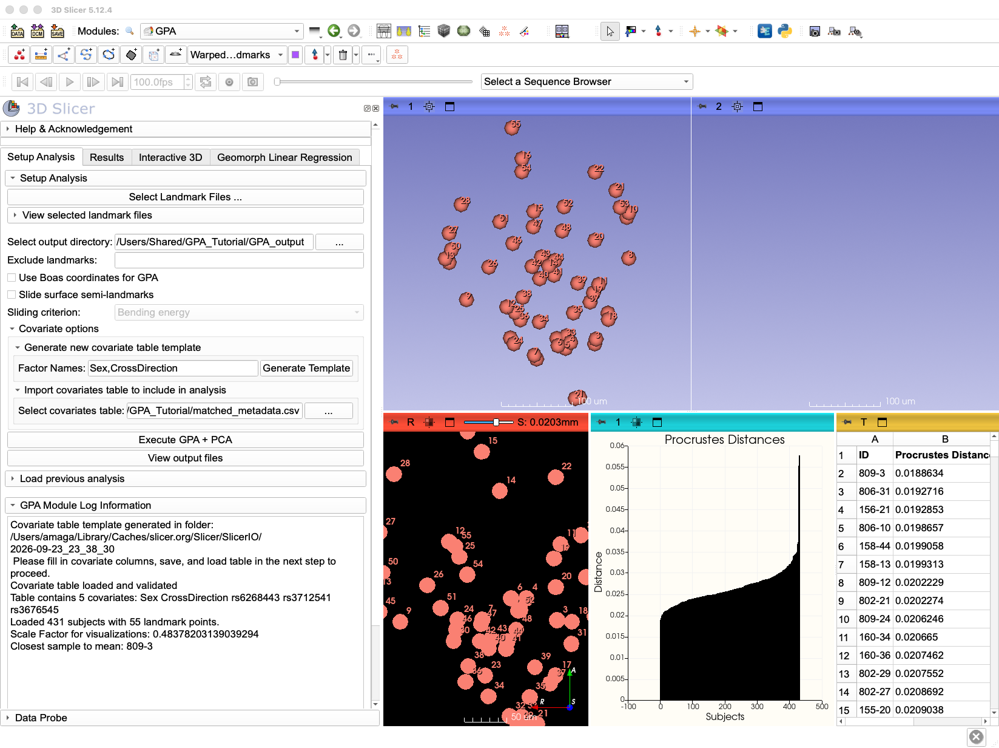

## 8. The output files

Click **View output files** to open the time-stamped results folder:

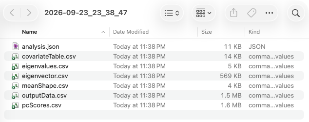

| File | Contents |
|------|---------|
| `analysis.json` | A record of the run: input folder and files, format, number of landmarks, excluded landmarks, Boas option, semi-landmarks, and the names of all other output files. |
| `outputData.csv` | One row per specimen: Procrustes distance to the mean, centroid size, and the Procrustes-aligned coordinates. |
| `meanShape.csv` | The mean (consensus) shape. |
| `pcScores.csv` | Each specimen's scores on every PC. |
| `eigenvector.csv`, `eigenvalues.csv` | The PCA loadings and variances. |
| `covariateTable.csv` | A copy of the covariate table used in this run. |

Everything the module shows you can be rebuilt from these files, and you can reload a run later with **Load previous analysis** (see GPA II). If you want to take the aligned coordinates into your own R scripts, `outputData.csv` has them. For linear models, GPA III shows how to run geomorph directly from Slicer.

## 9. Procrustes distances: look for outliers first

The plot view starts with a bar plot of each specimen's **Procrustes distance** from the mean shape, sorted from smallest to largest. The table view lists the same values by specimen ID. Maximize the plot view with the button in its title bar to see it better.

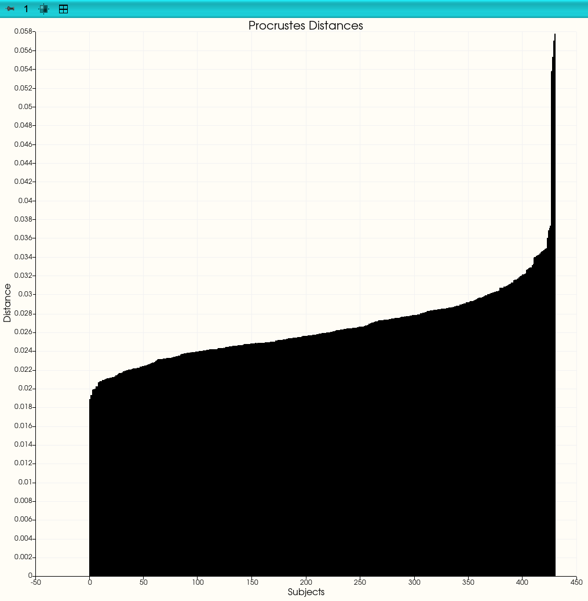

Most skulls sit between about 0.02 and 0.035. At the right end, four specimens jump to about 0.055. Scroll to the bottom of the table to see who they are:

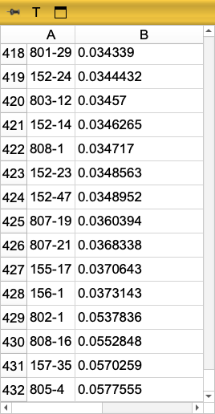

| Specimen | Procrustes distance |
|---------|--------------------|
| 805-4 | 0.0578 |
| 157-35 | 0.0570 |
| 808-16 | 0.0553 |
| 802-1 | 0.0538 |
| 156-1 (next in line) | 0.0373 |

So these four are about 1.5 times further from the mean than the next specimen, and more than twice as far as a typical one. This plot is the first thing to check after every GPA. A specimen that stands apart like this is either a real and unusual shape or, more often, a landmarking problem: a point placed on the wrong structure, left and right swapped, or a scan with the wrong voxel spacing. The module cannot tell you which. That is a question for the original scans. We come back to these four in step 12.

## 10. PCA scatter plots

Switch to the **Results** tab.

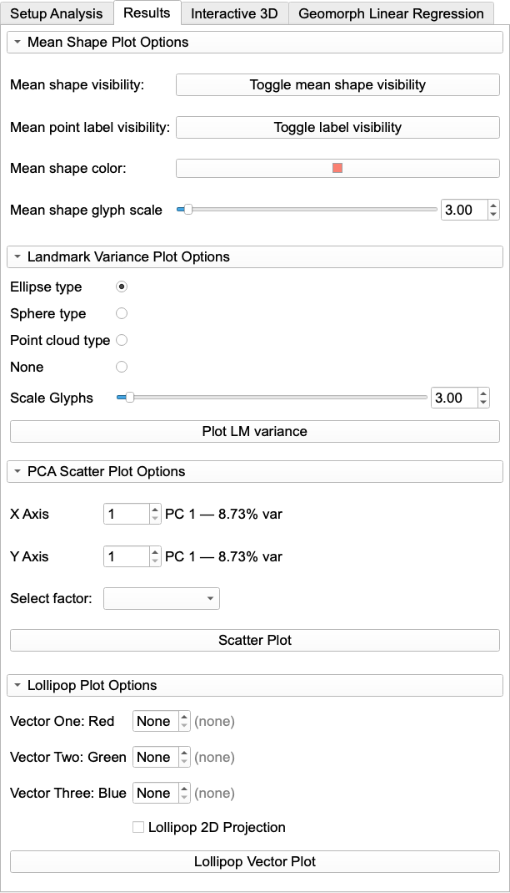

Under **PCA Scatter Plot Options**, choose the PCs for the **X Axis** and **Y Axis** with the number boxes. The percentage of shape variance each PC explains is shown next to it (PC1 8.7%, PC2 6.8%, PC3 5.1%, PC4 4.6% in this dataset). Set X to 1 and Y to 2, leave **Select factor** empty and click **Scatter Plot**.

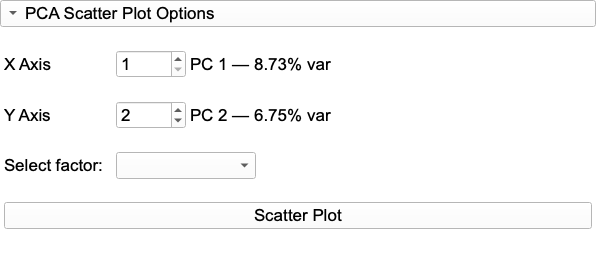

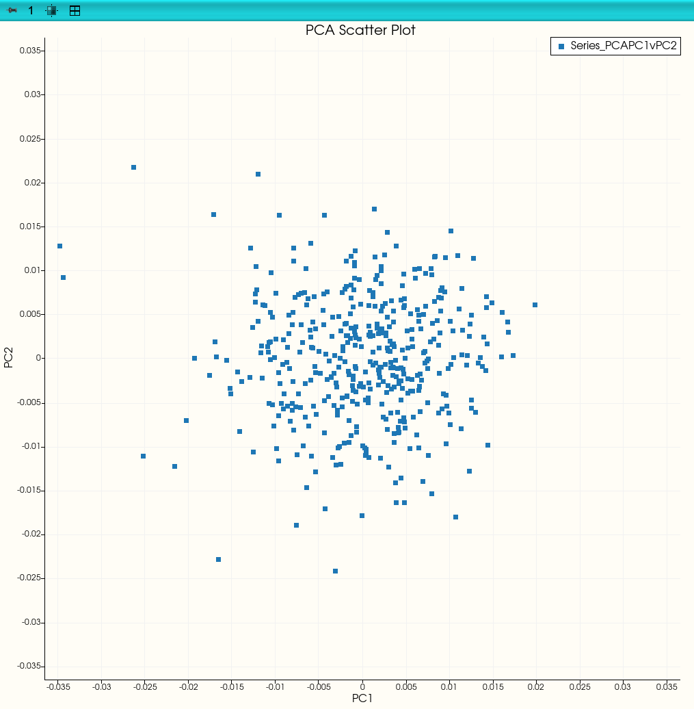

Note how little variance each PC carries. PC1 explains less than 9%, so the variation in this sample is spread over many directions, with no single dominant one. That is typical of a sample from a single species. In the old version of this tutorial, a single bad landmark produced a PC1 with 98% of the variance, which is a clear sign of an error rather than biology.

The plot is interactive: scroll to zoom, and hover over a point to see which specimen it is. The plot view's toolbar lets you switch between the charts GPA has made (Procrustes distances and scatter plots), and the **Plots** module lets you change colors, marker size and fonts.

### Coloring by a factor

Pick a covariate in **Select factor** and click **Scatter Plot** again. Each group gets its own color and a legend.

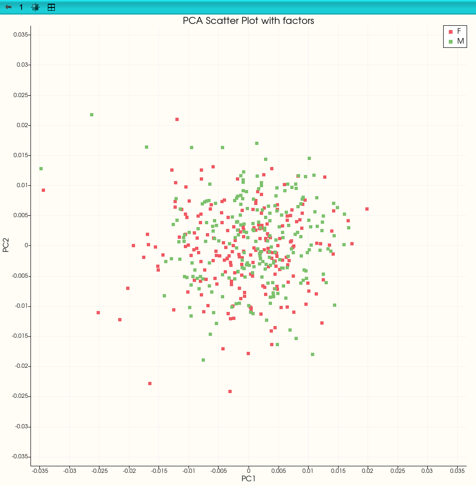

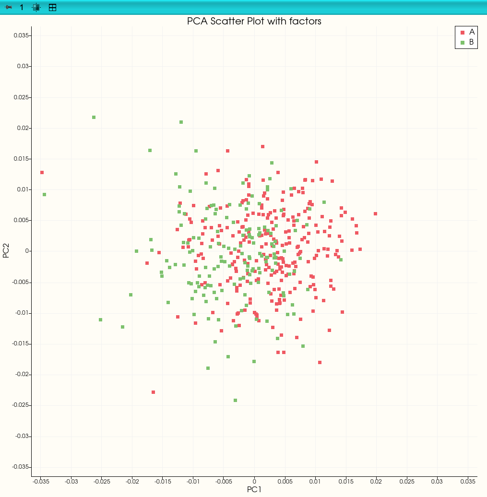

Only text (factor) columns are listed here, for the reason given in step 6. With `CrossDirection`, group B sits mostly on the negative side of PC1. A separation like this is a cue to test the factor formally, which is what GPA III does.

## 11. Seeing shape variation in 3D

The remaining options on the **Results** tab draw in the first 3D view. All of them are placed on the mean shape.

### Mean shape

**Mean Shape Plot Options** toggles the mean-shape landmarks and their number labels, and sets their color and glyph size.

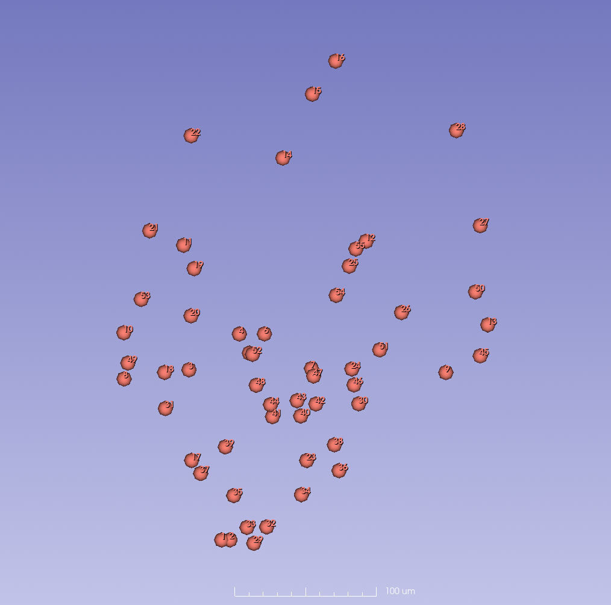

### Landmark variance

**Landmark Variance Plot Options** shows how much each landmark varies across the sample. Choose a type and click **Plot LM variance**:

- **Ellipse type:** one ellipsoid per landmark, with its axes computed separately along each direction. A long, flat ellipsoid means the landmark varies mostly along one direction or in one plane.
- **Sphere type:** one sphere per landmark, sized by the variance averaged over the three axes.
- **Point cloud type:** every specimen's aligned landmark position, colored by landmark. This is the rawest view, and the one where you can spot individual points sitting away from their cluster.
- **None:** removes the variance glyphs.

**Scale Glyphs** makes the glyphs bigger or smaller.

| Ellipse | Sphere | Point cloud |
|---------|--------|-------------|
| 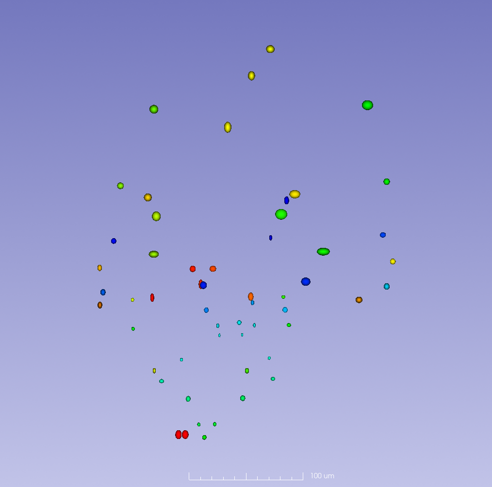 | 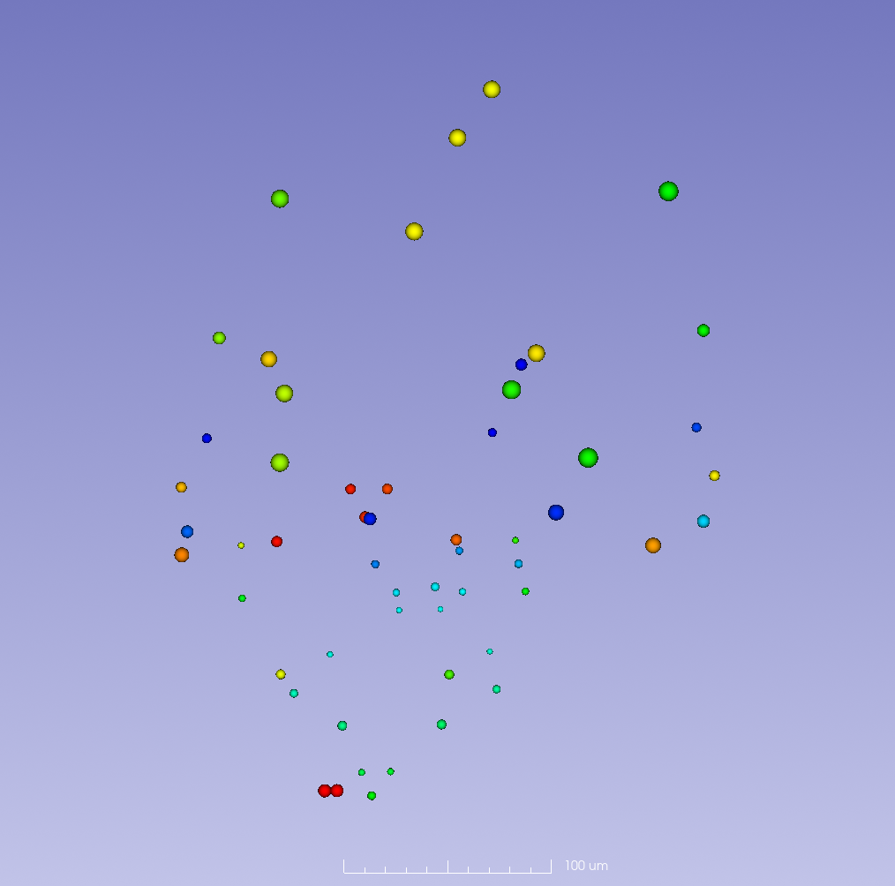 | 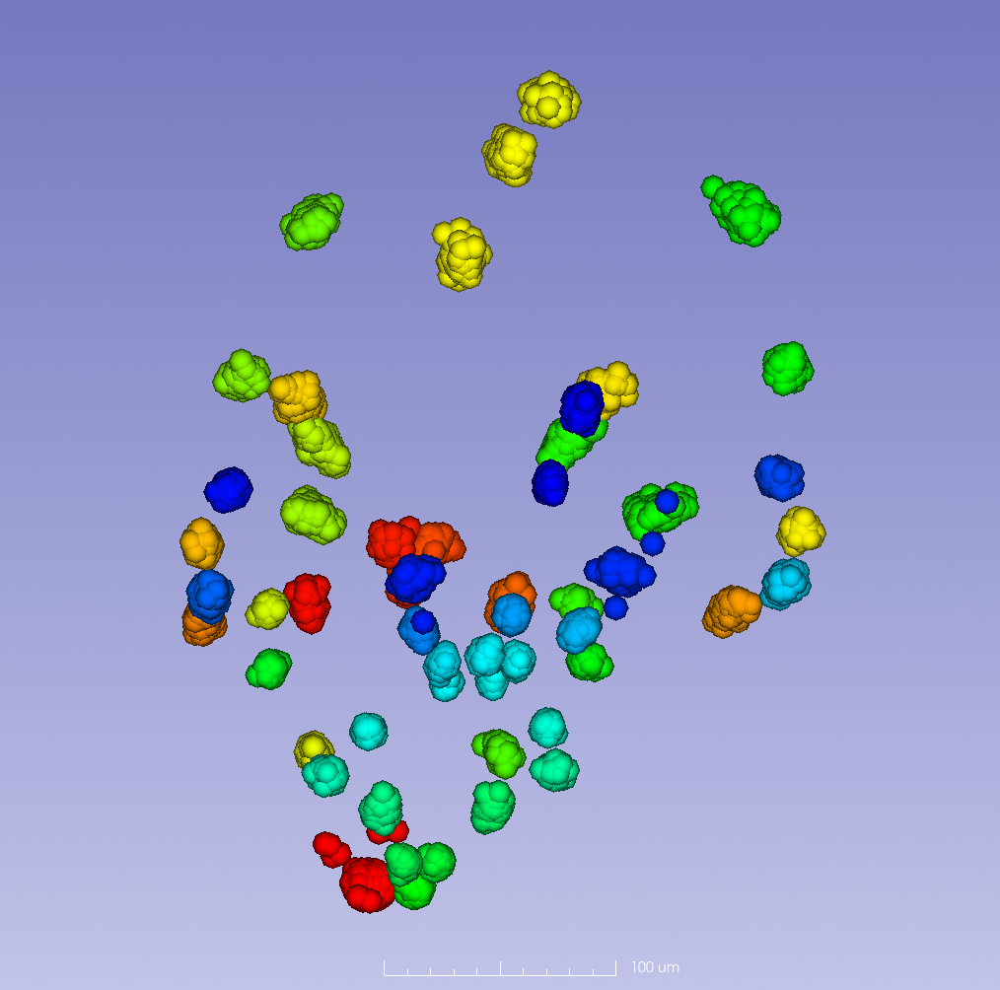 |

Compare the three. The ellipses and spheres summarize, while the point cloud shows every specimen. In the point cloud, a few isolated points sit away from their clusters. Those are the kind of points that push a specimen to the right end of the Procrustes distance plot.

### Lollipop plots

A lollipop plot draws, at each landmark of the mean shape, a line pointing in the direction that landmark moves as you go toward the positive end of a PC. The length shows how far it moves. Under **Lollipop Plot Options**, set **Vector One: Red** to 1 and click **Lollipop Vector Plot**. Up to three PCs can be drawn at once (red, green, blue). **Lollipop 2D Projection** also projects the vectors into the slice view (red), which gives a flat, map-like view of them.

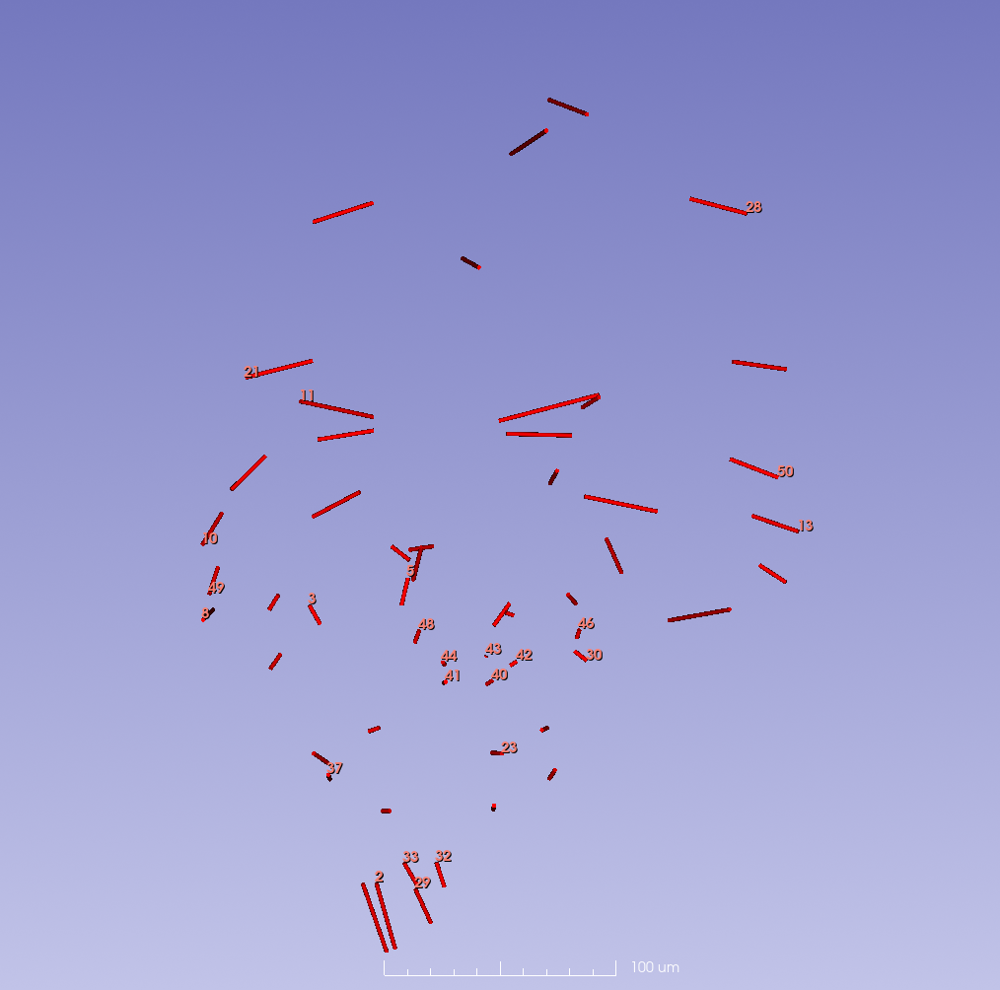

*(Mean-shape glyphs toggled off with **Toggle mean shape visibility** to make the vectors easier to see.)*

For PC1 the longest vectors are at the tip of the snout (landmarks 1 and 2), around the zygomatic arches and at the back of the braincase, so PC1 involves the length of the snout relative to the braincase. GPA II makes this much easier to see. The 3D views are interactive: rotate, zoom (scroll wheel) and pan as in any Slicer 3D view. Note that no single landmark dominates. When one landmark's vector dwarfs all others, suspect a landmarking error at that point before interpreting the PC.

With 55 landmarks, lollipops are hard to read as a whole shape. GPA II shows the same PCs as a deforming skull.

## 12. What to do about the four outliers

Go back to the four specimens from step 9. In this dataset they do not come from one broken landmark: their differences are spread across the whole skull, and three of them (157-35, 808-16, 802-1) are also the most extreme specimens on PC1. So PC1 is pulled partly by these few skulls.

With your own data, work through outliers like this:

1. **Check the landmarks on the original scan or model.** Load the specimen's volume or surface with its landmark file and look for misplaced, swapped or missing points. Most outliers are found here.
2. **If a landmark is wrong in many specimens,** drop it with **Exclude landmarks** and run again, until it can be fixed.
3. **If the specimen itself is the problem** (damaged, a different age class, a scan with the wrong spacing), leave it out by selecting the landmark files again without it, and give the reason in your methods.
4. **If it is a real, correctly landmarked shape, keep it.** Removing real variation because it is inconvenient biases the analysis.

**Exercise:** run GPA again without the four outliers. Reselect the files without them. The covariate table no longer matches, because it was made for all 431 files. Either clear the **Select covariates table** field, or make a copy of `matched_metadata.csv` with those four rows deleted and select that. Then click **Execute GPA + PCA**; the new run goes into its own folder. Compare the Procrustes distance plot and the PC1 variance with the first run. Does PC1 change? Also try excluding a landmark (e.g. `1,2`) to see how the lollipop plot and the variance shares respond.

## Next steps

Continue with **[GPA II](../GPA_2/README.md)** to warp the 809-3 skull model along the PCs and record animations, and then **[GPA III](../GPA_3/README.md)** to fit linear models with the covariates you loaded here. If your own data include semi-landmarks, finish with **[GPA IV](../GPA_4/README.md)** on sliding.

## Reference

- Maga, A. M., Navarro, N., Cunningham, M. L., and Cox, T. C. (2015). Quantitative trait loci affecting the 3D skull shape and size in mouse and prioritization of candidate genes in-silico. *Frontiers in Physiology*, 6, 92. https://doi.org/10.3389/fphys.2015.00092

## Other resources

- [GPA module documentation](https://github.com/SlicerMorph/SlicerMorph/tree/master/Docs/GPA)
- SlicerMorph YouTube channel: [Basic functionality](https://www.youtube.com/watch?v=FCeZ2J5Uvcw) (older interface)
