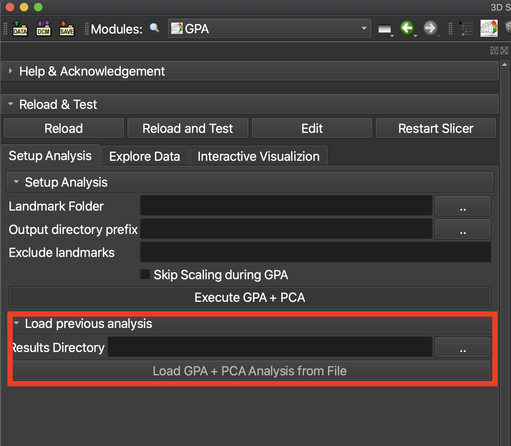
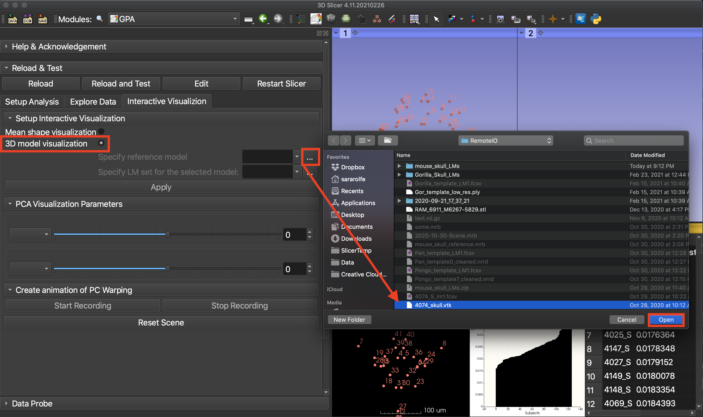
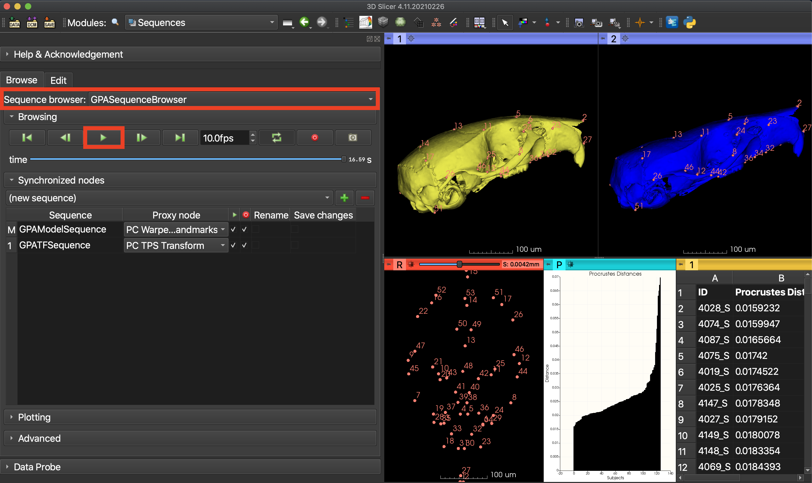
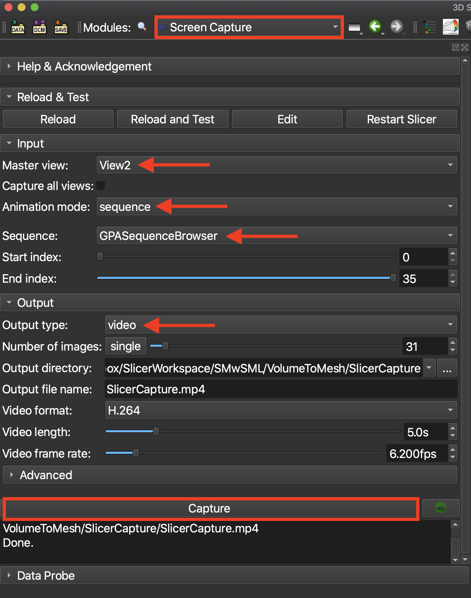
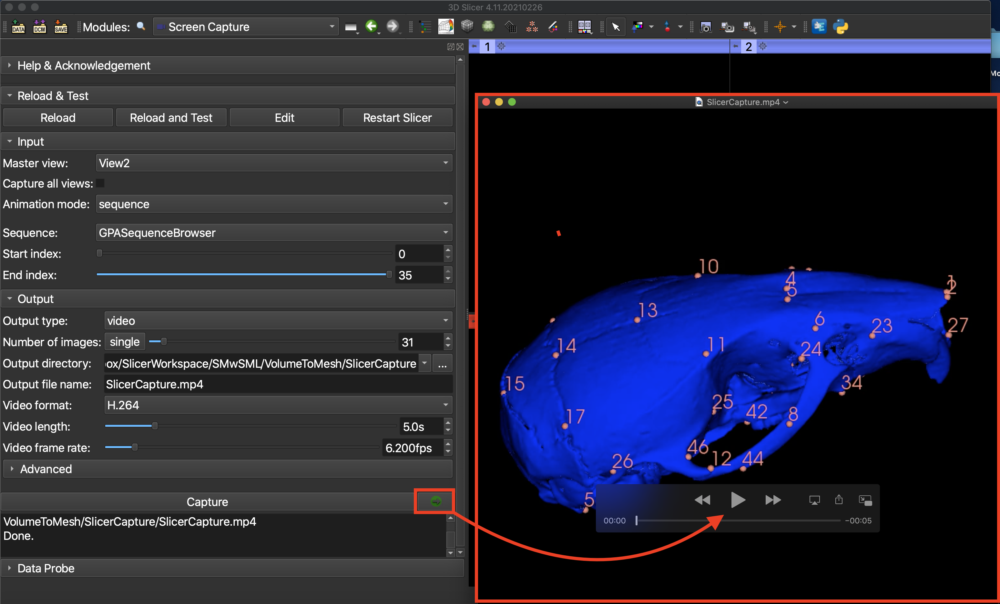

# Generalized Procrustes Analysis (GPA) Module II

## 3D interactive visualization and exporting animations

This tutorial continues the GPA I tutorial. In the previous tutorial, we visualized the output of our PC analysis as series of vectors. With 55 LMs, it might be difficult to interpret what's going on, or judge the relative importance of these vectors. This tutorial shows how to take a `reference model` warped to mean shape or the mean shape itself and create interactive visualizations of the PC deformations. 

1. Follow the tutorial: GPA I to run GPA/PC analysis on the **Mouse Skull Landmarks**. Alternatively, to reload GPA results from an earlier run, expand the `Load previous analyis` menu, click the `..` button next to the `Results Directory` field and browse to the timestamped results directory created by the GPA module.

   

2. Download the `Mouse Skull Reference Model` dataset from the `Sample Data` module.

3. Go back to `GPA` module, switch to the `Setup 3D Visualization` tab and browse to the location of the landmark (FCSV) and model (VTK) files in your cache. Select `Apply`. You will now see a gray  and blue mouse skull in your viewports. Gray represents the mean shape, and blue one represents the mean shape warped along specified PC axes and scores. 

   

4. Go to `PCA Visualization Parameters` and set the first slider to PC1, and start deforming the mean shape along it. Try adding PC2 (or others)

  img src="./images/Picture14.png" width="900">

5. To capture a PC deformation as an animation, go to the 'Create animation of PC Warping' menu and hit 'Start Recording'. Move the PC Sliders to create the deformations that will be in the exported animation. After applying the deformations, hit 'Stop Recording'.

  

6. When the recording is stopped, the Sequences module will automatically open and show the image sequence browser that has been created, titled 'GPASequenceBrowser'. This contains the sequence of images generated during the recording. Select the play button with the green arrow icon to review the images as an animation.

  

7. To export the animation created, use the search bar to switch to the Screen Capture module, which supports video exports. Set the 'Master view' to "'View2' to export only the animation from the PC deformation 3D viewer. Select the 'Animation mode' to 'sequence' to set the sequence browser created in the previous step as the source of the animation and confirm that the sequence titled 'GPASequenceBrowser' is selected. To export as an MP4 format video, go tp the 'Output' menu  and set the 'Output type' to 'video. Confirm the export properties and hit 'Capture' to start the export.

  

8. To view the animation created, you can browse to the output file location specified in the Screen Capture module, or click the button with the green arrow icon next to the 'Capture' button. This will open a popup with the exported animation.

  
  
To learn how to export the results of the GPA module to `R`, continue to the tutorial [GPA III](../GPA_2/README.md).

### [Videos of GPA tool functionality on the SlicerMorph youtube channel:](http://bit.ly/SM_youtube)
