# Generalized Procrustes Analysis (GPA) II: Interactive 3D visualization and animations

## Introduction

In [GPA I](../GPA_1/README.md) we looked at PCs as scatter plots and lollipop vectors. With 55 landmarks, vectors are hard to read as a shape. It is much easier to take a 3D model of a real skull, warp it to the mean shape, and then deform it along a PC while you watch. This tutorial shows how to do that in the **Interactive 3D** tab of the GPA module, how to drive the deformation directly from the PCA scatter plot, and how to record and export the result as an animation.

You need the **Mouse Skull GPA Tutorial Set** and a GPA run from GPA I.

## 1. Reload the earlier analysis (optional)

If you are continuing straight from GPA I, skip to step 2. Otherwise, you do not need to run GPA again. Every run is saved in its time-stamped output folder and can be reloaded:

1. Open the GPA module, expand **Load previous analysis** on the **Setup Analysis** tab.
2. Click **...** next to **Results Directory** and choose the time-stamped folder GPA I created (e.g. `GPA_output/2026-09-23_23_38_47`).
3. Click **Load GPA + PCA Analysis from File**.

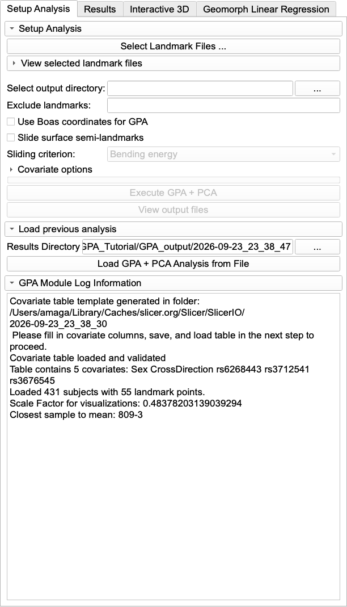

The log confirms the reload (`Loaded 431 subjects with 55 landmark points.` and `Covariate table loaded for results session`). The plots, the Results tab and the covariates come back exactly as they were.

## 2. Set up the interactive visualization

Switch to the **Interactive 3D** tab.

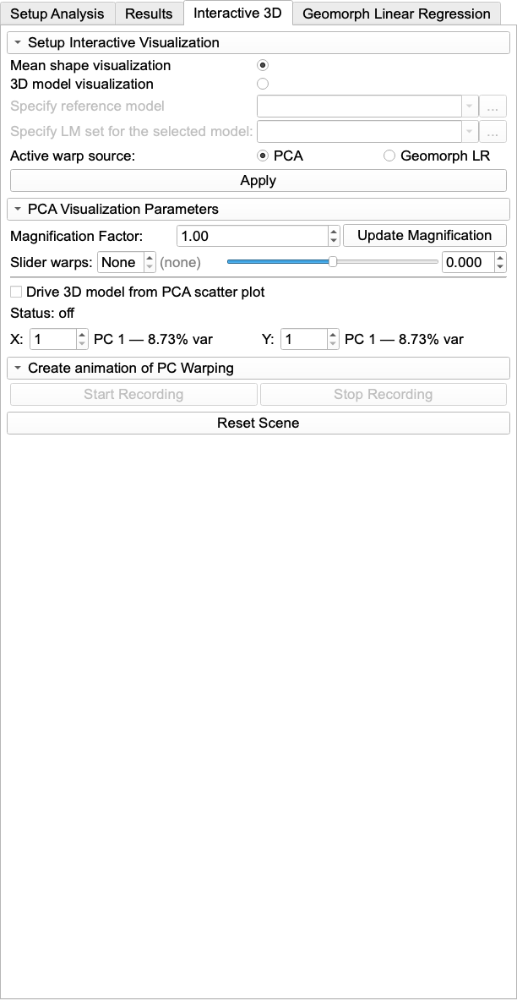

Under **Setup Interactive Visualization** there are two modes:

- **Mean shape visualization:** deforms the mean-shape landmarks only. It needs no model and is useful for a quick look, or when you do not have a surface for your taxon.
- **3D model visualization:** warps a surface model. This is what we use.

Choose **3D model visualization**, then:

1. **Specify reference model:** click **...** and choose `809-3.obj` from the tutorial folder.
2. **Specify LM set for the selected model:** choose `converted_LMs/809-3.fcsv`, i.e. the landmarks placed on that same skull.

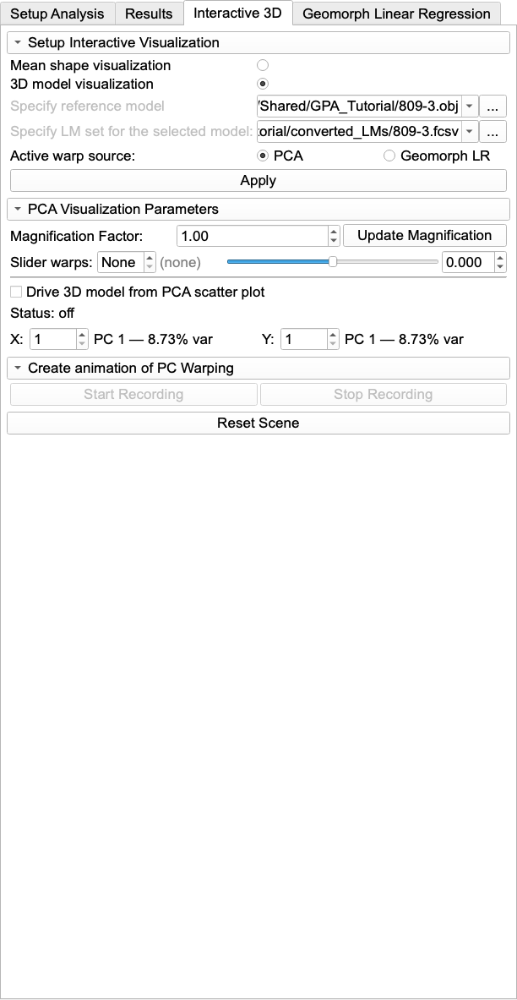

Why specimen 809-3? At the end of the GPA run the log reported `Closest sample to mean: 809-3`. The module warps the reference model onto the mean shape using its landmarks (a thin-plate spline), so the closer the reference is to the mean, the smaller and more trustworthy that first warp is. With your own data, pick the specimen the log names, or one close to it.

Leave **Active warp source** on **PCA** and click **Apply**. Loading and warping the 55 MB model takes a few seconds.

Two skulls appear: in the **first 3D view** (yellow), the reference model warped to the mean shape; in the **second 3D view** (cyan), the copy that the PC sliders will deform. The landmarks travel with each model.

The two 3D views may open zoomed far out, with the skull as a small dot in the middle. Scroll to zoom in, or right-click and drag.

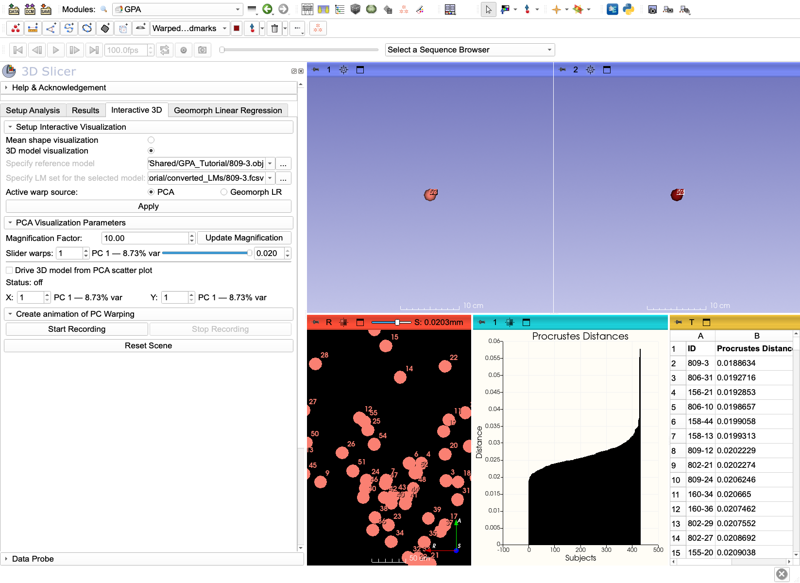

## 3. Warp along a PC

The **PCA Visualization Parameters** section has three controls:

- **Slider warps:** the number box selects the PC (it shows the variance that PC explains).
- **The slider** moves the model along that PC. Its range is the actual range of scores in your sample, so the two ends correspond to the most extreme specimens on that PC. For PC1 in this dataset that is −0.035 to +0.020. The box next to the slider shows the current score. Drag the slider to change it. In the current version, typing a value into the box moves the slider but does not update the model.
- **Magnification Factor:** multiplies the deformation. Type a value and click **Update Magnification**.

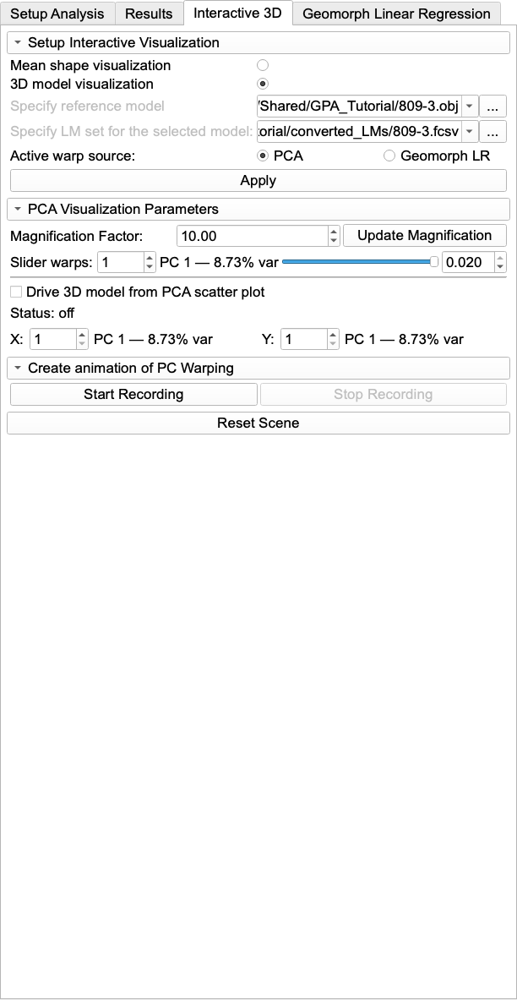

Set the PC to 1 and drag the slider from one end to the other. At a magnification of 1 you will barely see anything change. That is not a malfunction. In this sample the largest landmark displacement along PC1 is about 0.5% of the skull's size, which is typical of variation within one species. This is exactly what **Magnification Factor** is for. Set it to 10, click **Update Magnification**, and drag again.

Here is PC1 at 10x magnification, seen from above (snout up) and from the side:

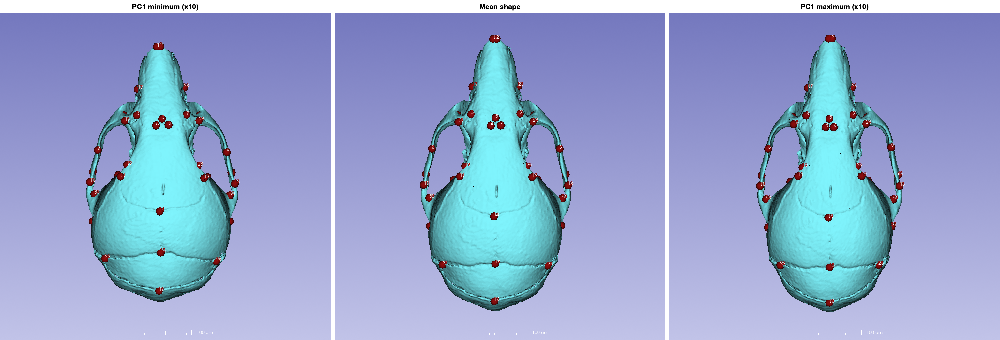

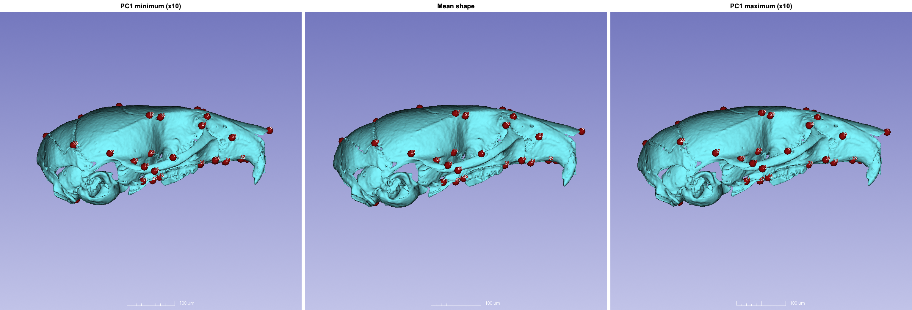

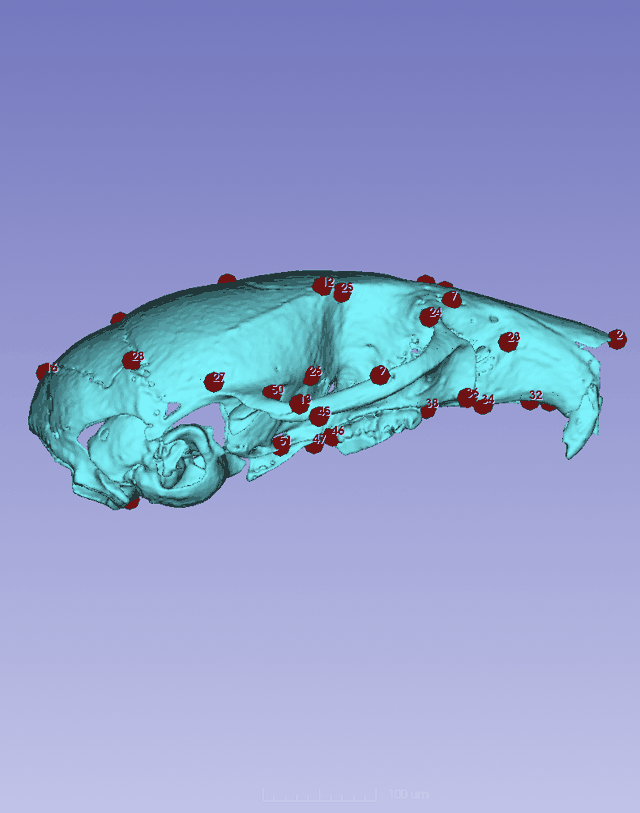

At the negative end of PC1 the skull is shorter, with a taller and rounder braincase. At the positive end it is longer and flatter. This is the same pattern the lollipop plot suggested in GPA I, with the longest vectors at the snout tip and the back of the braincase, but it is far easier to see on a whole skull.

> **Always report the magnification.** A 10x warp is a caricature: it shows the *direction* of shape change clearly, not its size. Say so in any figure you make this way.

Try PC2 and PC3 as well. The views are ordinary Slicer 3D views: rotate the skull to look at it from below or behind, and use the view's pin menu to change background or projection.

## 4. Drive the model from the PCA scatter plot

Instead of one PC at a time, you can move through the PC1/PC2 plane directly:

1. Check **Drive 3D model from PCA scatter plot**. If you have not made a scatter plot yet, one is made for you.
2. Set **X** and **Y** in the row below to the two PCs you want (here 1 and 2). The status line confirms the choice: `Status: ON (X=PC1, Y=PC2) — drag on plot; Shift=H-lock, Ctrl/Cmd=V-lock`.
3. Click and drag inside the scatter plot. A cross-hair cursor follows the mouse, the model in the second 3D view deforms to the shape predicted at that point, and the current scores are shown in the status bar at the bottom right of the Slicer window.

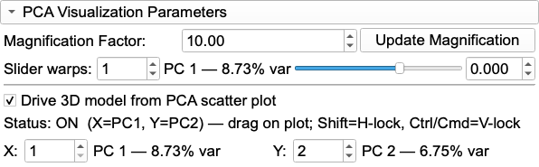

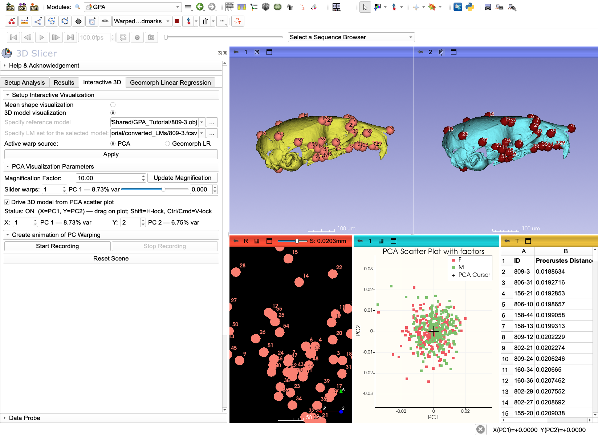

Hold **Shift** while dragging to lock the vertical (PC2) component and sweep along PC1 only, or **Ctrl/Cmd** to lock the horizontal component. Drag the cursor onto one of the outlying specimens from GPA I (for example 157-35, at the far left of PC1) to see the shape the model predicts for it. Uncheck the box when you are done, so that clicking the plot behaves normally again.

The plot is colored by `Sex` here because that was the last factor used.

## 5. Record the deformation as an animation

1. Under **Create animation of PC Warping**, click **Start Recording**.
2. Move the PC slider(s) through the deformation you want to capture. Every change is recorded as a frame. We dragged PC1 from 0 to its maximum, back down to its minimum and back to 0, which gave 41 frames.
3. Click **Stop Recording**.

When you stop, Slicer switches to the **Sequences** module with a new sequence browser, **GPASequenceBrowser**, selected. Press the play button (green arrow) to replay the recording. The same controls are in the sequence toolbar at the top of the window, where you can also set the playback speed and loop.

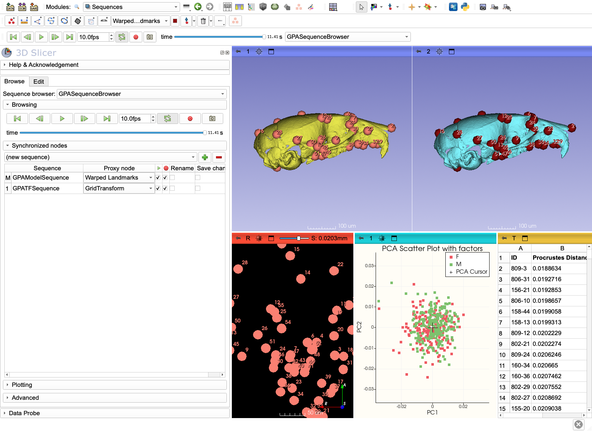

## 6. Export the animation as a video

Slicer's **Screen Capture** module turns the sequence into a video file:

1. Open **Screen Capture** (module finder).
2. **Main view:** `View2`, i.e. the view with the deforming skull. Leave **Capture all views** unchecked.
3. **Capture mode:** `sequence`; **Sequence:** `GPASequenceBrowser`. The start and end index default to the whole recording.
4. **Output type:** `video`; choose the **Output directory** and **Output file name** (we used `PC1_warp.mp4`), **Video format** `H.264`, and a video length or frame rate.
5. Click **Capture**.

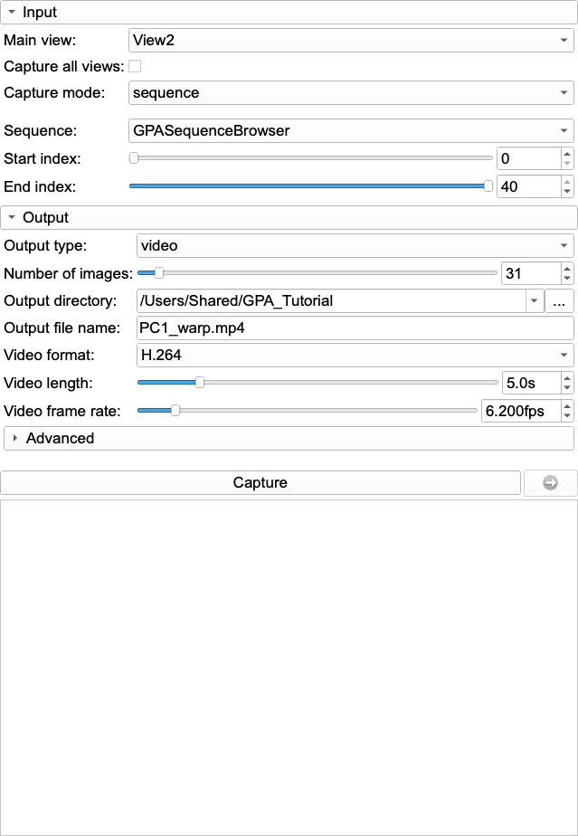

Video export uses the free **ffmpeg** encoder. On Windows, Slicer offers to download it the first time you capture a video. On macOS and Linux, install ffmpeg yourself (e.g. `brew install ffmpeg` on macOS, or your Linux package manager) and set its location under **Advanced → ffmpeg executable**. When the capture finishes, the arrow button next to **Capture** opens the video.

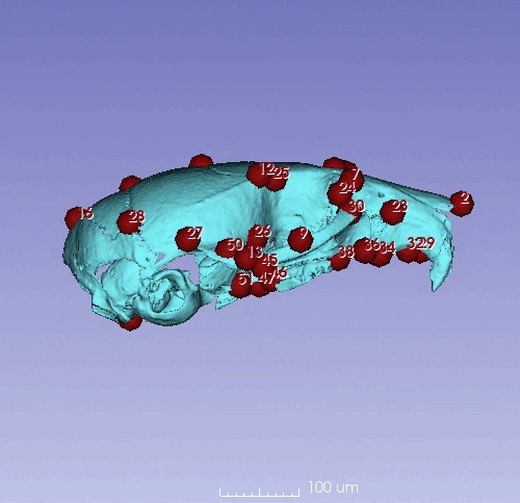

For a figure rather than a video, set **Output type** to `image series` (one PNG per frame) or `lightbox image` (all frames tiled in one image), or use **Capture mode** `single frame` for a high-resolution still of the current view.

## 7. Clean up

**Reset Scene**, at the bottom of the **Interactive 3D** tab, removes everything the GPA module created (models, landmarks, plots, sequences) and clears the module's fields. Use it before starting an unrelated analysis. Your output folders on disk are not touched, so you can always reload a run as in step 1.

## Next steps

Continue with **[GPA III](../GPA_3/README.md)** to test whether size and the covariates affect shape with geomorph's `procD.lm`, and to warp the skull along the fitted regression.

## Other resources

- SlicerMorph YouTube channel: [Realtime exploration of morphospace](https://www.youtube.com/watch?v=hMMR9GChek8&t=2s) and [Recording the PC warps](https://www.youtube.com/watch?v=gtHqhqaKeCU) (older interface, same idea)
- [Screen Capture module documentation](https://slicer.readthedocs.io/en/latest/user_guide/modules/screencapture.html)
