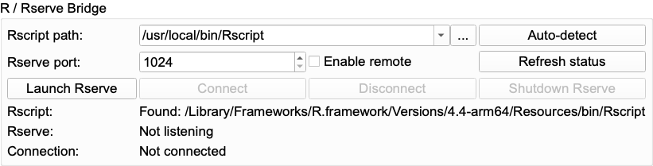
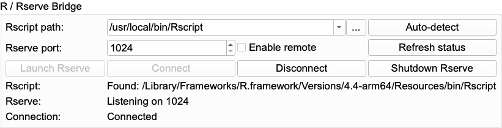
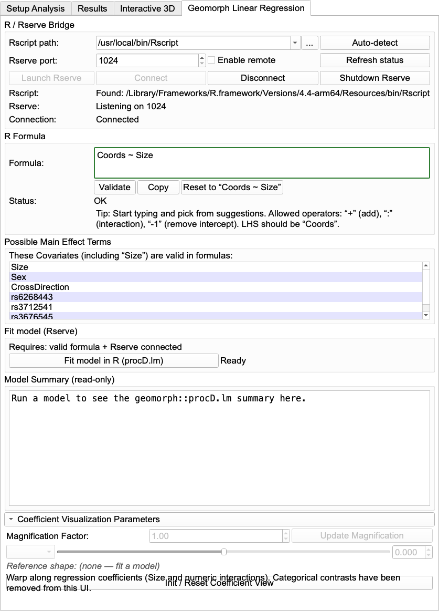
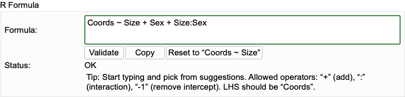
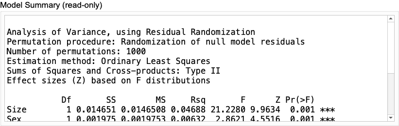
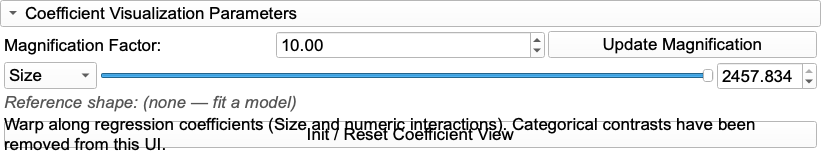
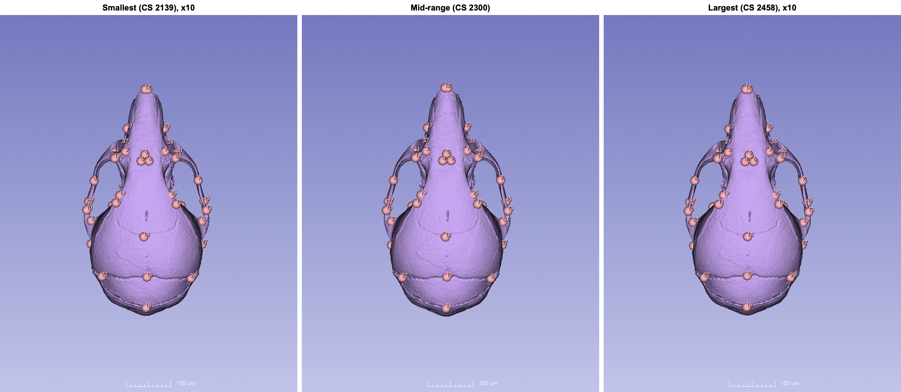
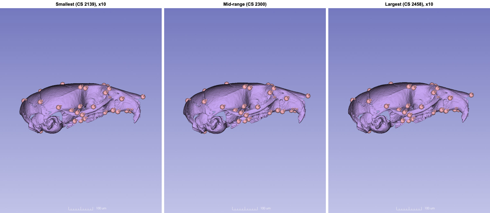
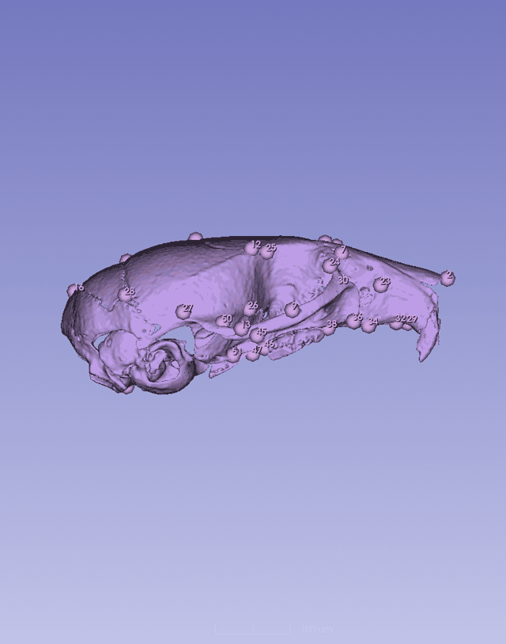
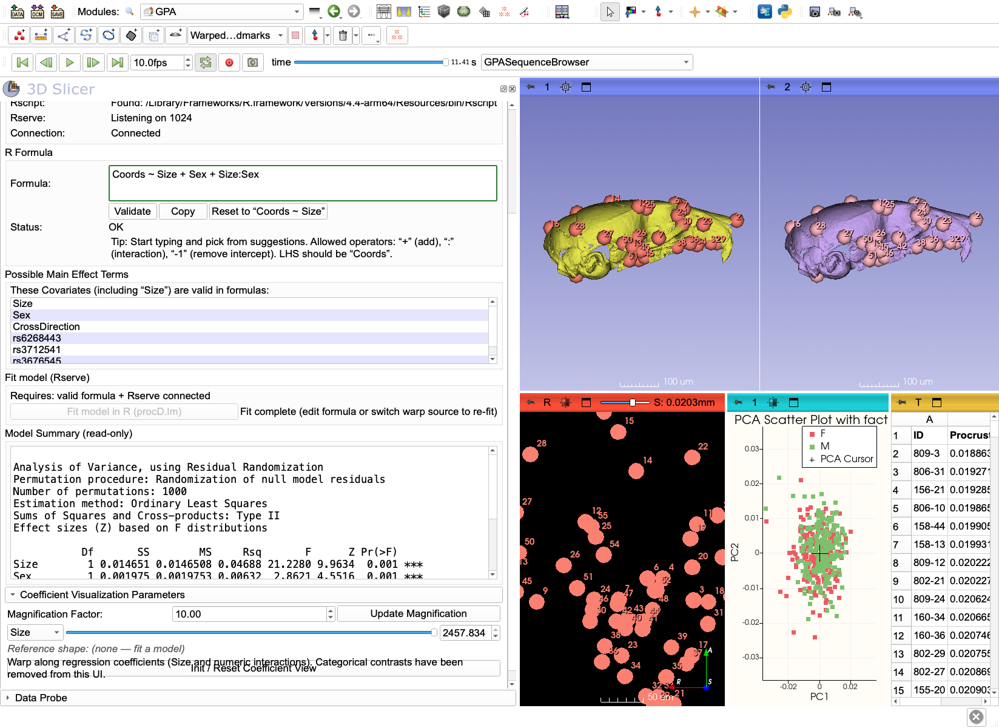

# Generalized Procrustes Analysis (GPA) III: Linear models with geomorph, from within Slicer

## Introduction

A PCA shows where the variation is. It does not tell you whether shape differs between groups, or changes with size. For that, geometric morphometricians fit linear models to the Procrustes coordinates, most often with `procD.lm` from the R package **geomorph** (Baken et al., 2021; Adams et al., 2025), which tests each term by permutation instead of assuming multivariate normality.

Until recently this meant exporting the GPA output, reading it into R, rebuilding the coordinate array and matching covariates by specimen ID. The **Geomorph Linear Regression** tab of the GPA module does all of that for you. It sends the Procrustes coordinates, centroid size and your covariate table to a running R session, fits the model with `procD.lm`, shows the ANOVA table, and lets you warp the 3D skull from GPA II along the fitted regression coefficients. You never leave Slicer, and you do not need to write R code.

In this tutorial we test for **allometry** (shape change with size) and for a difference between the sexes in the mouse skull tutorial set, then warp the skull along the size effect.

> The covariates come from the mouse backcross of Maga et al. (2015) (see [GPA I](../GPA_1/README.md), step 6). This tutorial uses them to show how to run and read a model. It is not a reanalysis of that cross; for the biology, see the original paper.

## What you need

- A GPA run on the **Mouse Skull GPA Tutorial Set** **with the covariate table loaded** ([GPA I](../GPA_1/README.md), step 6). The model can only use covariates that were loaded with the analysis. If you ran GPA without them, run it again with `matched_metadata.csv`, or reload a run that had them.
- For the shape warps in step 4: the 809-3 model set up in the **Interactive 3D** tab ([GPA II](../GPA_2/README.md), step 2).
- **R** (version 4 or later, from [r-project.org](https://www.r-project.org)) with two packages. Install them once, in R or RStudio:

  ```r
  install.packages(c("geomorph", "Rserve"))
  ```

  **Rserve** lets another program (here, Slicer) talk to R over a local network connection. The Python side of the connection (the `pyRserve` and `patsy` packages) is installed into Slicer automatically the first time you open the tab.

## 1. Connect Slicer to R

Open the GPA module, reload your analysis if needed, and switch to the **Geomorph Linear Regression** tab. The **R / Rserve Bridge** box at the top manages the connection:

1. Click **Auto-detect**. The module looks for `Rscript` in the usual places and fills in **Rscript path**. The status line should read `Rscript: Found: ...`. If it is not found, click **...** and point to the Rscript executable of your R installation.
2. Click **Launch Rserve**. This starts a background R session on the port shown under **Rserve port**. The status changes to `Rserve is running on port ...`.
3. Click **Connect**. The status now reads `Connection: Connected`.

| After Auto-detect | After Launch and Connect |
|---|---|
|  |  |

**Refresh status** re-checks all three. **Disconnect** closes the link but leaves R running. **Shutdown Rserve** stops the R session (do this when you are done). Leave **Enable remote** unchecked. It is only needed if R runs on a different computer.

## 2. Write the model formula

The **R Formula** box holds the model, written in R's formula style. It starts as `Coords ~ Size`: shape (the Procrustes coordinates, always called `Coords`) as a function of size.



The rules are short:

- The left side is always `Coords`.
- `+` adds a term (a *main effect*): `Coords ~ Size + Sex`.
- `:` adds an interaction between two terms: `Size:Sex` asks whether the effect of size on shape differs between the sexes.
- `-1` removes the intercept (rarely needed).
- Only the names listed under **Possible Main Effect Terms** are allowed: `Size` plus the columns of your covariate table (`Sex`, `CrossDirection`, `rs6268443`, `rs3712541`, `rs3676545`). Start typing and the box suggests matching names.

`Size` is the **centroid size** that GPA computed for each specimen, in the units of your landmark coordinates. Text columns enter the model as factors (groups) and number columns as continuous variables. This is why GPA I warned you against coding groups as numbers.

Type:

```
Coords ~ Size + Sex + Size:Sex
```

and click **Validate**. The status should read `OK`. A typo, an unknown column name or a disallowed operator is reported here before anything is sent to R. **Copy** puts the formula on the clipboard (e.g. for your notes or methods), and **Reset to "Coords ~ Size"** starts over.



This formula asks three questions at once:

1. Does shape change with size (allometry)? → `Size`
2. Do males and females differ in shape once size is accounted for? → `Sex`
3. Is the size–shape relationship different in the two sexes? → `Size:Sex`

## 3. Fit the model and read the result

Click **Fit model in R (procD.lm)**. The coordinates, sizes and covariates are sent to R, matched by specimen ID, and the model is fitted. For our 431 skulls this took about 4 seconds. The status reads `Fit complete`, and the full `summary()` of the fitted model appears under **Model Summary**:



```
Analysis of Variance, using Residual Randomization
Permutation procedure: Randomization of null model residuals
Number of permutations: 1000
Estimation method: Ordinary Least Squares
Sums of Squares and Cross-products: Type II
Effect sizes (Z) based on F distributions

           Df       SS        MS     Rsq       F      Z Pr(>F)
Size        1 0.014651 0.0146508 0.04688 21.2280 9.9634  0.001 ***
Sex         1 0.001975 0.0019753 0.00632  2.8621 4.5516  0.001 ***
Size:Sex    1 0.000710 0.0007104 0.00227  1.0293 0.2108  0.424
Residuals 427 0.294700 0.0006902 0.94309
Total     430 0.312485

Call: geomorph::procD.lm(f1 = mod, SS.type = "II", data = gdf)
```

How to read it, line by line:

- **The header** records how the model was fitted: 1000 permutations of the residuals (RRPP), ordinary least squares, and **Type II** sums of squares, i.e. each main effect is tested after the other main effects. Report these in your methods.
- **`Rsq`** is the share of total shape variance that each term explains. **`Z`** is the effect size, and **`Pr(>F)`** is the permutation p-value. Look at `Rsq` and `Z` together with the p-value, not the p-value alone. With 1000 permutations, 0.001 is the smallest p-value possible, so it means "smaller than 1 in 1000", not exactly 0.001.
- **`Size`** explains 4.7% of shape variance, with a large effect (Z = 10.0, p = 0.001). So there is clear allometry: larger skulls differ in shape from smaller ones.
- **`Sex`** is also significant (Z = 4.6, p = 0.001), but it explains only 0.6% of the variance. So the effect is detectable with 431 specimens but small, about an eighth of the size effect. Always put the magnitude next to the significance.
- **`Size:Sex`** explains 0.2%, and p = 0.42. So there is no evidence that the allometric slope differs between the sexes. With real data, you would usually drop the interaction and refit `Coords ~ Size + Sex`.
- **`Residuals`** carry 94% of the variance. Most of the shape variation in this sample is not explained by size or sex, which is typical of a sample from a single species.

Try other formulas: edit, **Validate**, **Fit** again. For example `Coords ~ Size + CrossDirection`, or a model with one of the genotype columns. Each fit replaces the previous summary, so copy anything you want to keep.

## 4. See the regression as a shape change

A significant `Size` term says shape changes with size. The **Coefficient Visualization Parameters** section shows *how*, by warping the skull along the fitted coefficient, in the same way GPA II warped it along a PC.

1. Make sure the 809-3 model is set up in the **Interactive 3D** tab (GPA II, step 2).
2. Click **Init / Reset Coefficient View**.
3. Choose **Size** in the drop-down. The slider now runs over the observed range of centroid sizes in your sample (2139 to 2458 here), in real units. The box next to it shows the current size.
4. Drag the slider. The model in the second 3D view becomes the shape the regression predicts for a skull of that size. The **Active warp source** on the Interactive 3D tab switches to **Geomorph LR** automatically, and the warped model changes color. Moving a PC slider switches it back to PCA.



As with the PCs, the change is subtle at its natural scale, so set **Magnification Factor** to 10 and click **Update Magnification**. Here is the predicted shape at the smallest, middle and largest size in the sample:







Even at 10x the allometric change is modest. Smaller skulls have a relatively wider, rounder braincase, and larger skulls a relatively narrower braincase and a longer snout. This is the familiar pattern of cranial allometry in mice, and it matches the small `Rsq` of the `Size` term: size matters, but it explains only a small part of the shape variation in this sample.



The drop-down also lists the other coefficients of the model (`SexM`, `Size:SexM`). The current version is designed for numeric terms (size and numeric interactions), and warps along factor contrasts such as `SexM` should not be used for now.

## 5. Finish

When you are done, click **Shutdown Rserve** to stop the background R session.

## Going further

- **Working in R directly.** Everything the tab does can be repeated in your own R scripts from the GPA output folder: `outputData.csv` has the aligned coordinates and centroid sizes, `covariateTable.csv` the covariates, and the `Call:` line shows the exact `procD.lm` call. Use this when you need models the tab does not offer (nested terms, `lm.rrpp`, phylogenetic models) or pairwise comparisons.
- **Report the model fully:** the formula, Type II sums of squares, the number of permutations, and `Rsq`, `Z` and p for each term, plus the magnification of any warp figure.

## Next steps

If your data include semi-landmarks, continue with **[GPA IV](../GPA_4/README.md)**, on how to slide them in SlicerMorph and when not to.

## References

- Maga, A. M., Navarro, N., Cunningham, M. L., and Cox, T. C. (2015). Quantitative trait loci affecting the 3D skull shape and size in mouse and prioritization of candidate genes in-silico. *Frontiers in Physiology*, 6, 92. https://doi.org/10.3389/fphys.2015.00092
- Adams, D. C., Collyer, M. L., Kaliontzopoulou, A., and Baken, E. K. (2025). geomorph: Software for geometric morphometric analyses. R package version 4.0.10. https://CRAN.R-project.org/package=geomorph
- Baken, E. K., Collyer, M. L., Kaliontzopoulou, A., and Adams, D. C. (2021). geomorph v4.0 and gmShiny: Enhanced analytics and a new graphical interface for a comprehensive morphometric experience. *Methods in Ecology and Evolution*, 12, 2355–2363.
- Collyer, M. L., and Adams, D. C. (2024). RRPP: Linear model evaluation with randomized residuals in a permutation procedure. R package version 2.1.2. https://CRAN.R-project.org/package=RRPP
- Collyer, M. L., and Adams, D. C. (2018). RRPP: An R package for fitting linear models to high-dimensional data using residual randomization. *Methods in Ecology and Evolution*, 9, 1772–1779. https://doi.org/10.1111/2041-210X.13029

Package versions change. When you publish, cite the versions you actually used: run `citation("geomorph")` and `citation("RRPP")` in R to get the current references, and `packageVersion("geomorph")` for the version number.
