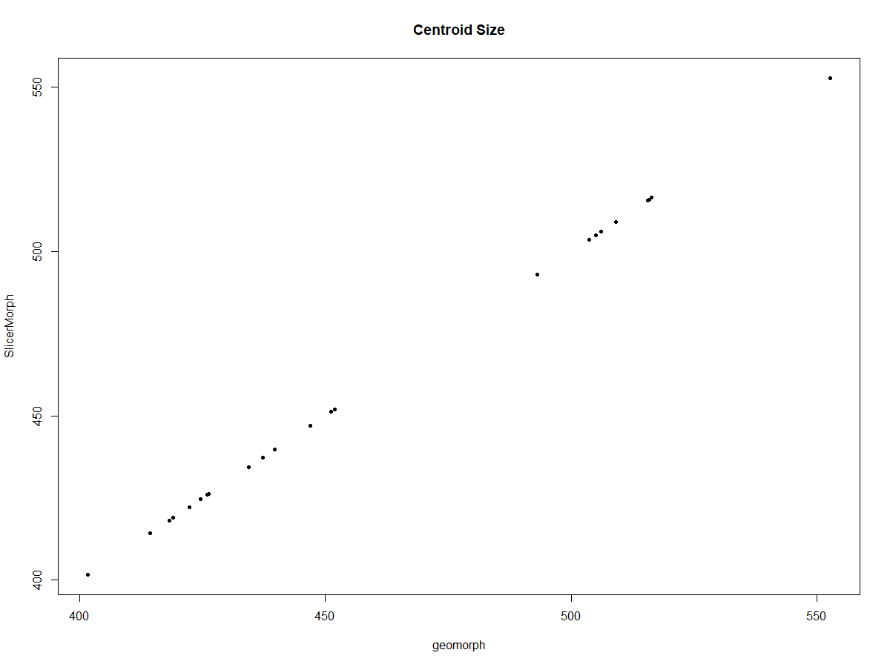
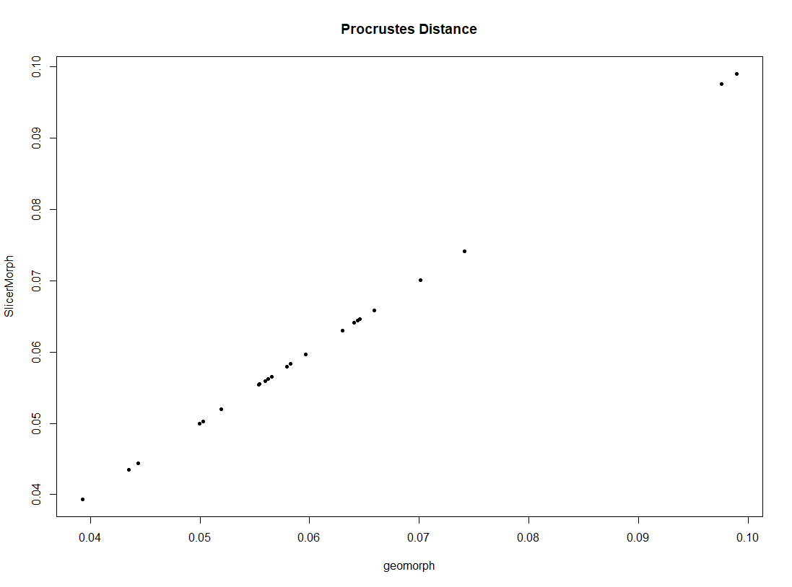
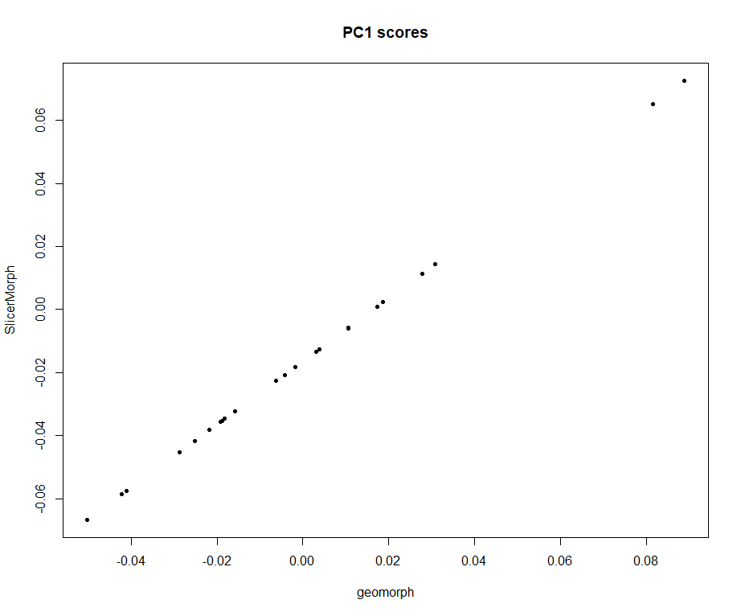
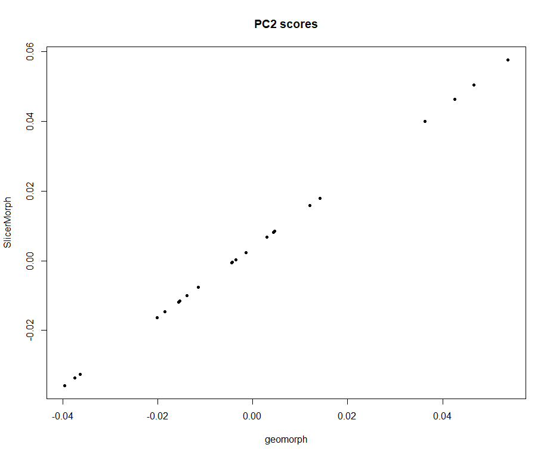

# Generalized Procrustes Analysis (GPA) Module III: Example R Analysis using SlicerMorphR

## Exporting data for Analysis in R using the SlicerMorphR R package
`SlicerMorphR` package contains functions for importing original landmark coordinates from 3D Slicer as well as all the output of the GPA module of `SlicerMorph` extension.

This example will import SlicerMorph data into R and fit an allometric regression model to both raw coordinates as well and SlicerMorph's GPA aligned procrustes coordinates. If you want to follow this tutorials as written, you have to complete these two steps:


### Step 1. Download sample data and run the GPA module. 
To begin, use the GPA module to run GPA/PCA analysis on the Gorilla skull landmark dataset. Remember, `Gorilla Skull Landmarks Only` is  available through the `Sample Data` module. Click on its icon to download, and unzip the contents to a convenient location (e.g., your desktop folder). You can refer to the instructions in [GPA I: Basics of GPA Fitting](../GPA_1/README.md) for details on how to execute the GPA. Please make a note of the output folder you specified in GPA module. This is where the **analysis.json** file is saved. You will need to enter this into the R.


### Step 2. Install and load SlicerMorph and geomorph R packages.
```
install.packages("geomorph")
library(geomorph)
devtools::install_github('SlicerMorph/SlicerMorphR') #Install SlicerMorphR
library(SlicerMorphR)
```


### Step 3. Point to the location of the analysis.log file that was saved by SlicerMorph's GPA module. 
We can do this either via coding the path OR interactively.

```{r load log file}
# coding the path to log file example 
# SM.log.file="/Users/amaga/Desktop/covariate_output/2024-06-24_15_42_13/analysis.json"

# interactively choose log file
SM.log.file <- file.choose()
SM.log <- parser2(SM.log.file)
```
* The `SM.log.file` contains all objects generated by the SlicerMorph's GPA module. These objects are parsed by `parser2()` and stored in` SM.log` list as individual objects. For details, please see the helper file of `parser2()` using `?parser2()`.
```
> head(SM.log)
$input.path
[1] "/Users/amaga/Desktop/Gorilla_Skull_LMs"

$output.path
[1] "/Users/amaga/Desktop/covariate_output/2024-06-24_15_42_13"

$files
 [1] "USNM174715.mrk.json" "USNM174722.mrk.json" "USNM176209.mrk.json" "USNM176211.mrk.json" "USNM176216.mrk.json" "USNM176217.mrk.json" "USNM176219.mrk.json"
 [8] "USNM220060.mrk.json" "USNM220324.mrk.json" "USNM252575.mrk.json" "USNM252577.mrk.json" "USNM252578.mrk.json" "USNM252580.mrk.json" "USNM297857.mrk.json"
[15] "USNM582726.mrk.json" "USNM590942.mrk.json" "USNM590947.mrk.json" "USNM590951.mrk.json" "USNM590953.mrk.json" "USNM590954.mrk.json" "USNM599165.mrk.json"
[22] "USNM599166.mrk.json" "USNM599167.mrk.json"

$format
[1] ".mrk.json"

$no.LM
[1] 41

$skipped
[1] FALSE

```

### Step 4. Read the OutputData.csv and pcScores.csv output by SlicerMorph's GPA module into a data matrix using the file pointers stored in SM.log.
```
SM.output <- read.csv(file = paste(SM.log$output.path, 
                                SM.log$OutputData, 
                                sep = "/"))
                                
SlicerMorph.PCs <- read.table(file = paste(SM.log$output.path, 
                                        SM.log$pcScores, 
                                        sep="/"), 
                              sep = ",", header = TRUE, row.names = 1)
```
* `SM.output` stores all the data from `OutputData.csv `output by the GPA module. These data include Procrustes distances to the mean shape, centroid sizes, and GPA aligned landmark coordinates. 
* `SlicerMorph.PCs` stores all PC scores from `pcScores.csv` output by the GPA module 
```
head(SM.output)
head(SM.log)
```


### Step 5. Check the number of landmarks used in the analysis and extract Procrustes distances to the mean shape
```
PD <- SM.output[,2]
if (!SM.log$skipped) {
  no.LM <- SM.log$no.LM 
  } else {
    no.LM <- SM.log$no.LM - length(SM.log$skipped.LM)
  }
PD
no.LM
```
* `SM.log$skipped` stores whether there is landmark skipped. SM.log$skipped.LM stores the number of landmarks skipped. This tutorial is based on skipping no landmarks. 
* `no.LM <- SM.log$no.LM` stores the number of landmarks. Since no landmark is skipped, `no.LM` should print out `41`. 
* Procrustes distances are located at the second column of the `OutputData.csv`, now stored in `PD <- SM.output[,2]`.


### Step 6. Reformat the GPA aligned coords into 3D LM array and apply sample names
```
Coords <- arrayspecs(SM.output[, -c(1:3)], 
                    p = no.LM, 
                    k = 3)

dimnames(Coords) <- list(1:no.LM, 
                        c("x","y","z"),
                        SM.log$ID)
```
* `Coords <- arrayspecs(SM.output[, -c(1:3)], p = no.LM, k = 3)` accessed all GPA aligned landmark coordinates of all specimens and transformed them into a 3D array `Coords`


### Step 7. Running a regression model between GPA aligned coordiantes and centroids output by the GPA module
We first construct a geomorph data frame withe data imported from SlicerMorph and fit a model to SlicerMorph's GPA aligned coordinates and centroid sizes
```
gdf <- geomorph.data.frame(Size = SM.output$centroid, Coords = Coords)
fit.slicermorph <- procD.lm(Coords ~ Size, data = gdf, print.progress = FALSE)
```
* `SM.output$centeroid` stores the centroid sizes


### Step 8. Read the raw landmark coordinates using the file pointers parsed by `parser2()` and stored in `SM.log`, align them with `gpagen()`, and apply PCA
```
gpa <- gpagen(SM.log$LM)
pca <- gm.prcomp(gpa$coords)
geomorph.PCs <- pca$x
```
* `parser()` accessed the pointers to the raw landmark file locations in the GPA-output `analysis.log` and stored them in `SM.log$LM`.
* geomorph.PCs stores all PC scores


### Step 9. Build the same allometric regression model based on the coordinates aligned in Step 8 and then compare it to the results in Step 7.
```
gdf2 <- geomorph.data.frame(size = gpa$Csize, coords = gpa$coords)
fit.rawcoords <- procD.lm(coords ~ size, data = gdf2, print.progress = FALSE)
```

Due to arbitrary rotations, we cannot compare procrustes coordinates directly, instead we look centroid sizes, procD, PC scores, and allometric regression model summary. 

### Step 10. Calculate each sample's Procrustes distance to the consensus shape because geomorph does not report this.
```
pd <- function(M, A) sqrt(sum(rowSums((M-A)^2)))
geomorph.PD <- NULL
for (i in 1:length(SM.log$files)) 
  geomorph.PD[i] <- pd(gpa$consensus, gpa$coords[,, i])
```
* `geomorph.PD` stores each sample's PD to the consensu shape based on geomorph GPA aligned coordinates

### Step 11. Now we can start to compare procrustes variables.
**1. Centroid Size**
```
plot(gpa$Csize, SM.output$centroid, 
     pch = 20, ylab = 'SlicerMorph', 
     xlab = 'geomorph', main = "Centroid Size")
cor(gpa$Csize, SM.output$centroid)
```
The results should be:
<p align="center">

</p>

```
> cor(gpa$Csize, SM.output$centroid)
[1] 1
```

**2. Procrustes Distance of sample to their respective mean**
```
plot(geomorph.PD, SM.output[,2], 
     pch = 20, ylab = 'SlicerMorph', 
     xlab = 'geomorph', main = "Procrustes Distance")
cor(geomorph.PD, SM.output[,2])
```
The results should be:
<p align="center">

</p>

```
> cor(geomorph.PD, SM.output[,2])
[1] 0.9999999
```

**3. We only plot the first two PCs but correlations reported up to 10.** Keep in mind that PCA signs are arbitrary. 
```
plot(geomorph.PCs[,1], SlicerMorph.PCs[,1], 
     pch = 20, ylab = 'SlicerMorph', 
     xlab = 'geomorph', main = "PC1 scores")

plot(geomorph.PCs[,2], SlicerMorph.PCs[,2], 
     pch = 20, ylab = 'SlicerMorph', 
     xlab = 'geomorph', main = "PC2 scores")

for (i in 1:10) print(cor(SlicerMorph.PCs[, i], 
                            geomorph.PCs[, i]))
```
The results should be:
<p align="left">


</p>

```
> for (i in 1:10) print(cor(SlicerMorph.PCs[, i], 
+                           geomorph.PCs[, i]))
[1] 0.9999999
[1] 1
[1] 1
[1] -1
[1] -0.9999997
[1] 0.9999863
[1] -0.9999906
[1] -0.9999935
[1] -0.999997
[1] -0.9999972
```


**4. Finally, compare allometric regression models from SLicerMorph aligned coordinates to the one that used raw LM coordinates and gpa alignment from geomorph.**
```
summary(fit.slicermorph)

summary(fit.rawcoords)
```
This should print out nearly identical results.
