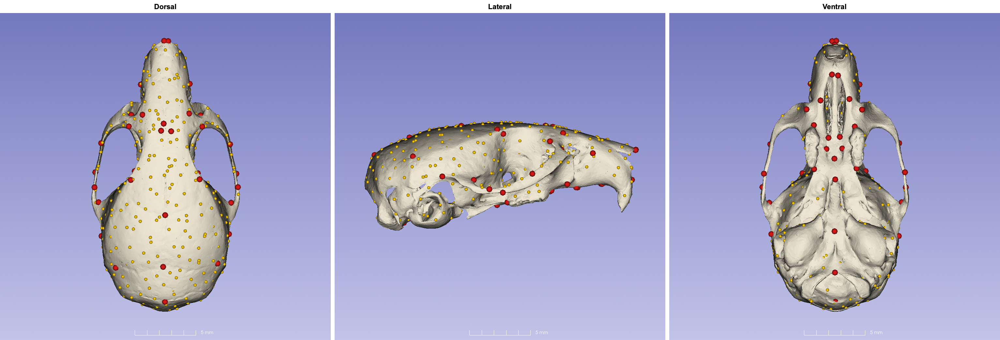
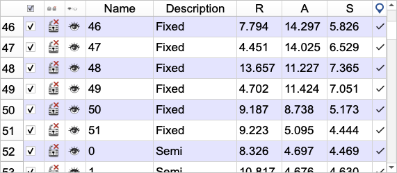
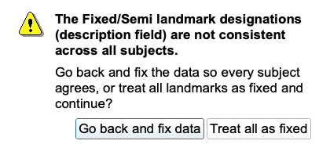
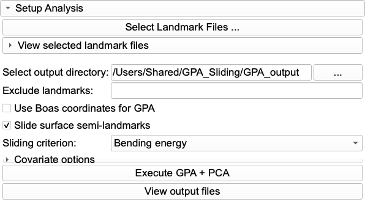
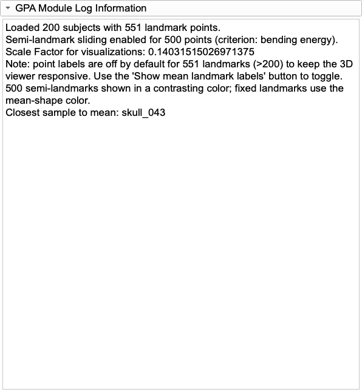
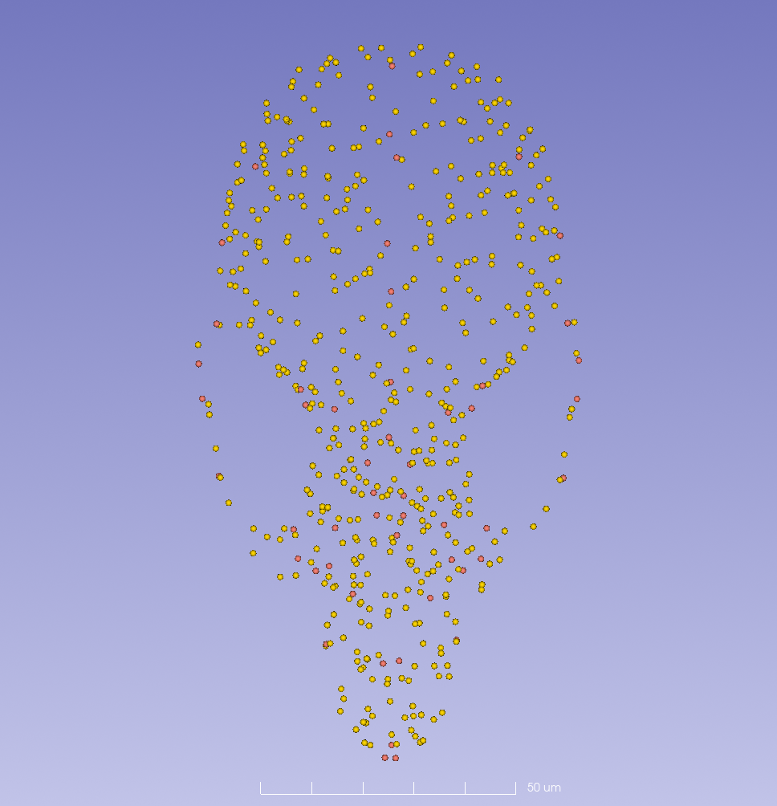
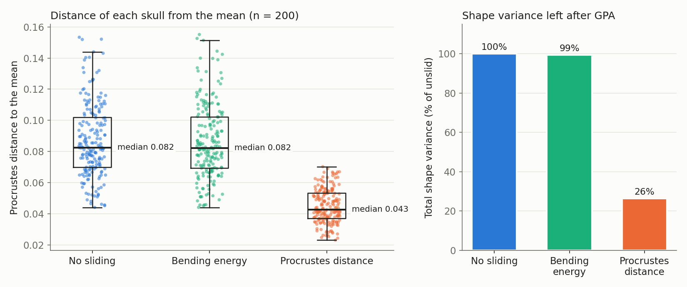
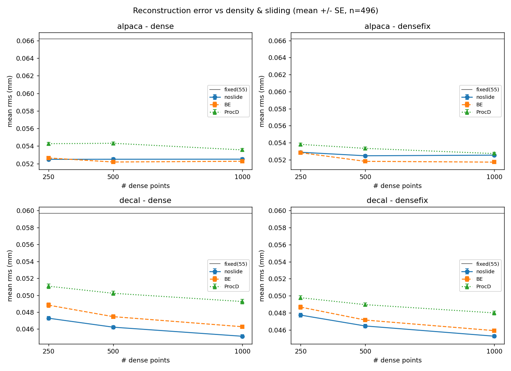
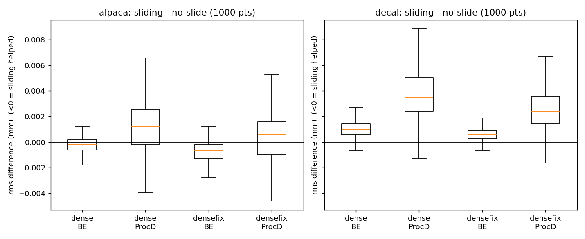

# Generalized Procrustes Analysis (GPA) IV: Sliding semi-landmarks, and when not to

## Introduction

Many structures have too few anatomical landmarks to describe their shape. The cranial vault, articular surfaces and the broad areas of bone between sutures are mostly smooth, so we cover them with **semi-landmarks**: points spread across a surface that stand in for the form between the anatomical landmarks. Tools such as ALPACA, PseudoLMGenerator and DeCA can place hundreds to thousands of them automatically.

A semi-landmark's position *along* the surface is not anatomically defined; only its position relative to the surface is. **Sliding** lets each semi-landmark move tangentially (within the surface) during GPA, until the whole configuration is optimal by some criterion:

- **Bending energy (BE):** the points slide to make the thin-plate-spline deformation from each specimen to the mean as smooth as possible. This is geomorph's default (`ProcD = FALSE`).
- **Procrustes distance (ProcD):** the points slide to make each specimen as close as possible to the mean (`ProcD = TRUE`).

SlicerMorph's GPA module can do both. Its sliding is a line-by-line port of `gpagen()` from the R package **geomorph** (it reproduces geomorph 4.0.10 to machine precision), so a SlicerMorph sliding run and a geomorph sliding run give the same answer.

This tutorial has two halves. **Part 1** shows how to set up and run sliding in SlicerMorph, which is straightforward. **Part 2** is about whether you *should*. Sliding has become a near-universal default, a box that gets ticked without much thought. Our own tests, on 496 real mouse skulls and on synthetic skulls whose true point-to-point correspondence is known, show that sliding can help, do nothing, or do real harm, depending on how good the correspondence already is (Maga 2026). Read Part 2 before you tick the box for your own data.

## The tutorial dataset

We use **200 synthetic mouse skulls**. They were generated with the SkullDeformExplorer module used in Maga (2026): each skull is a deformation of the same template mesh along the principal components of real mouse-skull shape variation, plus a change in size. Each skull has:

- **51 fixed anatomical landmarks** (red below), and
- **500 surface semi-landmarks** (gold), placed with DeCA's landmark-anchored dense correspondence (DeCAL), and merged with the fixed landmarks into one `.mrk.json` file per specimen (551 points).

*The 51 fixed landmarks (red) and 500 semi-landmarks (gold) on the mean skull.*

**Download:** open the **Sample Data** module, scroll to the **SlicerMorph** category and click **Mouse Skull GPA Sliding Tutorial Set**. Choose a destination folder. Slicer saves `GPA_sliding_tutorial.zip` there (about 7 MB) without loading anything into the scene. Unzip it. The `GPA_sliding_tutorial` folder contains `synthetic_skulls/` with the 200 `.mrk.json` files, plus `atlas_model.ply` and `atlas.mrk.json` (the mean skull and its points, used for the figure above).

Keep in mind how these skulls were made: they vary along about ten directions of shape (in our runs, the first ten PCs held 99% of the variance), which is far simpler than real variation. They are a clean teaching set, not a stand-in for your data.

---

## Part 1: How to slide in SlicerMorph

### 1. Mark which points are semi-landmarks

GPA does not guess. A point slides only if its **Description** field is exactly `Semi`. Anything else (`Fixed`, any other text, or an empty description) is treated as a fixed landmark. You can see and edit the field in the **Markups** module: load a specimen, expand **Control points**, and look at the **Description** column.

*In the tutorial files, points 1–51 are `Fixed` and the next 500 are `Semi`.*

Three rules follow from how GPA reads the designation:

1. **Use `.mrk.json`.** It is the current Slicer markups format and keeps the description, point status and markups type reliably. The older `.fcsv` has a description column too, but it is a comma-separated text line, easily broken by an editor or a stray comma, and it lacks the newer markups features that grid-based and other semi-landmark workflows rely on.
2. **The same points must be `Semi` in every file.** The designation is by position: point 60 must be a semi-landmark in every specimen, or in none. If the files disagree, GPA stops and asks what to do:

   

   **Go back and fix data** is almost always the right answer. **Treat all as fixed** runs an ordinary GPA without sliding. The dialog does not say which file is inconsistent, so check the file that was edited most recently, or the one produced by a different tool.
3. **Let the tools write the designation for you.** SlicerMorph's semi-landmark tools set it automatically: **PseudoLMGenerator**, **CreateSemiLMPatches** and **PlaceSemiLMPatches** write `Semi`; **PlaceLandmarkGrid** writes the designation for the grid points it creates; and **MergeMarkups** combines a fixed-landmark file and a semi-landmark file into one, labeling blank descriptions `Fixed` and `Semi` respectively. DeCA's DeCAL uses MergeMarkups for its merged output, which is how the tutorial files were made. After any other tool, or after editing by hand, check the Description column before running GPA.

### 2. Set up and run

1. Open **GPA**, select all 200 files in `synthetic_skulls` with **Select Landmark Files ...**, and choose an output folder, exactly as in [GPA I](../GPA_1/README.md).
2. Check **Slide surface semi-landmarks**, and choose the **Sliding criterion**: **Bending energy** or **Procrustes distance**.
3. Leave **Use Boas coordinates for GPA** unchecked. Sliding works on size-scaled coordinates. If you check both, GPA falls back to scaled GPA and says so in the log.
4. Click **Execute GPA + PCA**.

**Be patient.** Sliding is much slower than an ordinary GPA, and Slicer is unresponsive while it runs (there is no progress bar). On our Mac, the runs on 200 specimens × 551 points took:

| Run | Time |
|-----|------|
| No sliding | 35 s (almost all of it reading the files) |
| Procrustes-distance sliding | 1.5 min |
| Bending-energy sliding | 11 min |

Bending-energy time grows quickly with the number of points, because each iteration solves a thin-plate-spline system of the size of the whole configuration. Try your settings on a subset first.

When it finishes, the log confirms what was done:

On the mean shape, semi-landmarks are drawn in a contrasting color (gold) and fixed landmarks in the mean-shape color, so you can check at a glance that the designation was read as you intended:

Everything else (the output files, Results tab, Interactive 3D, Geomorph Linear Regression) works exactly as in GPA I to III, now on the slid coordinates.

### 3. What exactly the module does

- **Surface sliding only.** Every `Semi` point is treated as a surface semi-landmark. Sliding along curves (geomorph's `curves =` argument) is deliberately not offered. If you need curve sliders, do the superimposition in geomorph.
- **The tangent plane comes from the points, not the mesh.** As in geomorph, each semi-landmark's local plane is estimated from its five nearest neighbouring points in the configuration. The module never sees your surface model. So a slide can move a point slightly *off* the real surface, and the sparser your points, the rougher that plane.
- **Fixed landmarks never slide,** but their aligned coordinates can still change a little, because sliding changes the configuration that is superimposed.
- **Iterations:** sliding and superimposition alternate until the configuration stops changing (tolerance 1e-4) or for at most 10 iterations.
- **Record your criterion yourself.** `analysis.json` records that sliding was on and which points were `Semi`, but in the current version not *which* criterion was used. Write it down with the output folder name.

### 4. Reporting

State which points were slid (number, and how they were placed), the criterion, and cite geomorph alongside SlicerMorph, since the sliding algorithm is theirs (Baken et al. 2021; Adams et al. 2025). Better still, report the result both with and without sliding (Part 2).

---

## Part 2: Should you slide?

### What sliding does to your data: see it for yourself

We ran the tutorial set three times: without sliding, with bending-energy sliding, and with Procrustes-distance sliding. Compare the three output folders:

| | No sliding | Bending energy | Procrustes distance |
|---|---|---|---|
| Median Procrustes distance to the mean | 0.082 | 0.082 | 0.043 |
| Total shape variance (% of unslid) | 100% | 99% | 26% |
| Variance in the first 10 PCs | 98.9% | 99.1% | 86.0% |
| Mean distance a semi-landmark moved (unit centroid size) | — | 0.0005 | 0.0031 |
| Specimen closest to the mean | skull_043 | skull_043 | skull_154 |

**Bending energy** barely changed anything you can see. The semi-landmarks moved on average 0.05% of centroid size, the variance and PCs are almost identical, and the Procrustes distance got slightly smaller in 68% of the skulls. It looks like a mild tidying of the data.

**Procrustes distance** changed a lot. The skulls are suddenly half as far from the mean, and three-quarters of the shape variance is gone. The ten-dimensional structure the skulls were built from now holds only 86% of the variance, the rest smeared over many small dimensions, and even the "most average" specimen changed. It looks like a tighter, cleaner sample.

**Neither of these tells you whether sliding helped.** Sliding minimises its criterion, so the criterion always improves: Procrustes-distance sliding *must* make the Procrustes distances smaller, because that is what it was told to do. A smaller distance is not a better correspondence. Here, the 74% of variance that disappeared is shape variation the skulls actually have, removed by moving points until the skulls agreed. The only way to know whether a slide improved the correspondence is to compare the slid points with their true homologues, which real specimens cannot give you. That is the test we built.

### What the ground truth says

In Maga (2026) we asked the question two ways: on 496 real mouse skulls, scoring each landmark set by how well it rebuilds each skull's scanned surface; and on synthetic skulls whose true point-to-point correspondence is known by construction, scoring each semi-landmark by its distance to its true homologue. We compared two ways of placing dense semi-landmarks: **ALPACA**, which transfers points from a template by point-cloud registration without any landmarks, and **DeCAL**, which anchors the dense correspondence on the anatomical landmarks (like the tutorial set).

**1. On real skulls, sliding never helped a good correspondence, and Procrustes-distance sliding always hurt.**

*From Maga (2026), Fig. 3: surface-reconstruction error (lower is better) for 496 real skulls, by number of dense points, without sliding (blue), with bending-energy (orange) and Procrustes-distance sliding (green). The grey line is the 55-fixed-landmark baseline.*

*From Maga (2026), Fig. 4: the paired change in each skull's error from sliding (below zero = sliding helped), at 1,000 points.*

For DeCAL, bending-energy sliding made reconstruction worse at every density (improving only 8–12% of skulls), and Procrustes-distance sliding worse still (improving 1–11%). For the noisier, landmark-free ALPACA correspondence, bending energy gave a small improvement (84% of skulls at 1,000 dense points plus fixed landmarks). Procrustes distance again made things worse.

**2. Against known correspondence, bending energy helps only a poor correspondence, and more so with more points.** On the synthetic skulls, ALPACA's points started about 0.20 mm from their true homologues. Bending-energy sliding moved them closer in 43%, 68% and 82% of specimens at 250, 500 and 1,000 points. Procrustes-distance sliding moved them *about 0.20 mm further away* at every density, improving **not one** of the 500 skulls.

**3. Well-spread anatomical landmarks remove the need to slide.** Holding DeCAL's dense points at about 500 and thinning the anatomical anchors:

| Anchoring landmarks | Bending-energy sliding improved | Verdict |
|---|---|---|
| 8, spread over the skull | 66% of specimens | helps |
| 13, spread | 60% | helps |
| 20, spread | 51% | no effect |
| 27, spread | 46% | no effect |
| 34, spread | 39% | harms |
| 27, **clustered in one region** | 69% | helps |

The crossover sits between about 20 and 27 well-spread landmarks. The clustered control shows that it is the *coverage* of the anchors that matters, not their number: 27 landmarks bunched in one region leave the correspondence poor enough for sliding to help, while the same 27 spread over the skull leave nothing for sliding to fix. Procrustes-distance sliding harmed every configuration in this experiment too.

### So what should you do?

Match the sliding decision to the correspondence you already have. For the single-population studies where automated dense landmarking is used most:

- **Dense points anchored on many, well-spread anatomical landmarks** (DeCAL with the usual landmark set, or roughly 20 or more landmarks covering the whole structure): **do not slide.** The landmarks have already set the correspondence, and sliding can only disturb it. The tutorial set is in this category.
- **Anchors that are few (fewer than about 20) or clustered in one region:** the correspondence is weaker, and **bending-energy sliding helps.**
- **A landmark-free dense set** (e.g. ALPACA or another template transfer, no anatomical landmarks): **slide with bending energy.** This is the case where sliding does what it was meant to do, and the benefit grows with the number of points.
- **You have anatomical landmarks and want to fill in between them:** do not slide an ALPACA set; use DeCAL from the start. It turns your landmarks into a better dense correspondence than sliding can recover.
- **Never slide with the Procrustes-distance criterion.** In every condition we tested, real or synthetic, it pulled specimens toward the mean and moved points away from their true positions, erasing the variation the analysis is meant to measure.

And whatever you decide, **decide it**, instead of leaving the box ticked by habit:

1. Know where your semi-landmarks came from and how good that correspondence is likely to be.
2. Run the analysis with and without sliding, and compare them as in the table above. If a conclusion depends on sliding, say so.
3. Treat a smaller Procrustes distance or "less noise" after sliding as a property of the criterion, not as evidence that sliding worked.

These rules come from one population of laboratory mice and synthetic skulls built from it. That is the common setting for automated dense landmarking, but across genera or wider phylogenetic ranges, where correspondence is harder to establish, the balance may change. There, test rather than assume.

### Exercise

1. Run the tutorial set with **Procrustes-distance** sliding and open the **Results** tab. Compare the Procrustes distance plot and the PC variance shares (next to the PC selectors) with the unslid run.
2. In **Interactive 3D**, load `atlas_model.ply` with `atlas.mrk.json` as the reference, and warp along PC1 in the unslid and the Procrustes-distance run (see [GPA II](../GPA_2/README.md)). Does the Procrustes-distance run still show the same shape change?

## References

- Adams, D. C., Collyer, M. L., Kaliontzopoulou, A., and Baken, E. K. (2025). geomorph: Software for geometric morphometric analyses. R package version 4.0.10. https://CRAN.R-project.org/package=geomorph
- Baken, E. K., Collyer, M. L., Kaliontzopoulou, A., and Adams, D. C. (2021). geomorph v4.0 and gmShiny: Enhanced analytics and a new graphical interface for a comprehensive morphometric experience. *Methods in Ecology and Evolution*, 12, 2355–2363.
- Bardua, C., Felice, R. N., Watanabe, A., Fabre, A.-C., and Goswami, A. (2019). A practical guide to sliding and surface semilandmarks in morphometric analyses. *Integrative Organismal Biology*, 1(1), obz016. https://doi.org/10.1093/iob/obz016
- Gunz, P., Mitteroecker, P., and Bookstein, F. L. (2005). Semilandmarks in three dimensions. In D. E. Slice (Ed.), *Modern Morphometrics in Physical Anthropology* (pp. 73–98). Kluwer/Plenum.
- Maga, A. M. (2026). To slide or not to slide, that is the question: an evaluation of dense semilandmarks and their sliding in automated 3D geometric morphometrics using real data and simulations. *bioRxiv*. https://doi.org/10.64898/2026.08.28.747867
- Perez, S. I., Bernal, V., and Gonzalez, P. N. (2006). Differences between sliding semi-landmark methods in geometric morphometrics, with an application to human craniofacial and dental variation. *Journal of Anatomy*, 208(6), 769–784. https://doi.org/10.1111/j.1469-7580.2006.00576.x
- Rolfe, S. M., and Maga, A. M. (2023). DeCA: A Dense Correspondence Analysis Toolkit for Shape Analysis. In *Shape in Medical Imaging (ShapeMI 2023)*, LNCS 14350, pp. 259–270. Springer. https://doi.org/10.1007/978-3-031-46914-5_21
- Porto, A., Rolfe, S., and Maga, A. M. (2021). ALPACA: A fast and accurate computer vision approach for automated landmarking of three-dimensional biological structures. *Methods in Ecology and Evolution*, 12(11), 2129–2144. https://doi.org/10.1111/2041-210X.13689
