# Grid-based landmarking
This tutorial describes how to create a series of grid patches using the `PlaceLandmarkGrid` module that can be combined into a set of labeled manual landmarks and semi-landmarks using the `MergeMarkups` module.

To use this method, you will need a 3D model(s) and its accompanying set of fixed landmarks. For this tutorial download the mouse skull models and landmarks posted here: [mouse skull sample data](https://github.com/SlicerMorph/Mouse_Models/tree/newModels/newModels).

----

## PlaceLandmarkGrid
This module can be used to generate, visualize, and interactively edit square patches of semi-landmarks by specifying four corner points on a model. A template grid with a user-specified number of semi-landmark points is registered to the corner points via a thin-plate-spline deformation and the vertices of the sampling grid are projected to the surface of the model along the normal vector of the patch at that point. 

The corners of the grid can be selected using two different methods.
1. Placing a new landmark point
2. Selecting the position from an existing landmark point.

This tutorial will demonstrate both methods. After placement of the grids, the `PlaceLandmarkGrid` module will be used to merge the patches together into a single landmark node and remove overlapping points.

### Place grid by placing points in the scene
1. Open to the `PlaceLandmarkGrid` module. If this is the first time you have opened it, you will need to wait for a short time while necessary Python libraries are installed. Load `A_J_Skull.fcsv` and `A_J_Skull.ply` from the sample data folder `newModels` into Slicer.
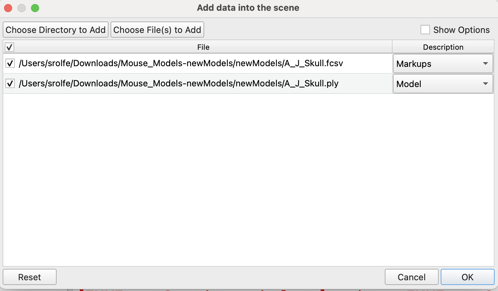

2. In the parameters section, select the model `A_J_Skull`. This is the model that the semi-landmark points will be snapped to. The active patch shows the grid which can currently be modified. Right now it should be empty since there are no active grids in the scene. Set the resolution of the grid to `7` to create a 7x7 grid of points. This value can also be changed after placement. Click `Create a new grid` to initiate placement of the first grid.

3. In this example, we will be creating and merging two grid patches that connect landmarks: 15-28-12-14 and 13-16-11-17. With grid placement initiated, place grid corner points for the first set of landmarks, as shown below.
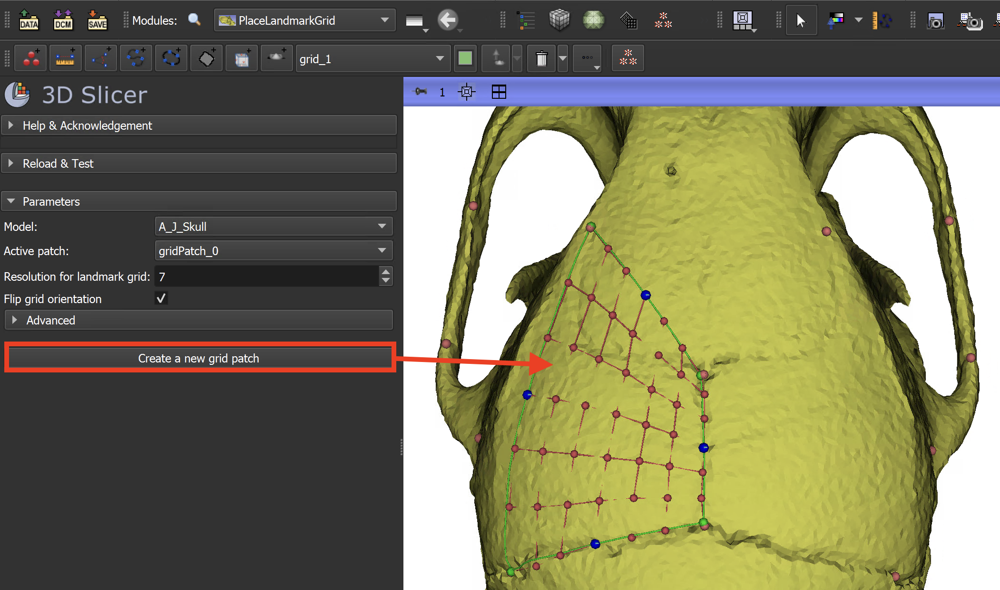

4. Open the `Data` module to see the data nodes created after the four grid points have been placed. A folder with the name of the grid patch will contain the following:
    * 4 point list nodes for the corner points
    * 4 point list nodes for the mid-points between corner points
    * 4 line nodes for each grid edge
    * a grid node containing the semi-landmark points
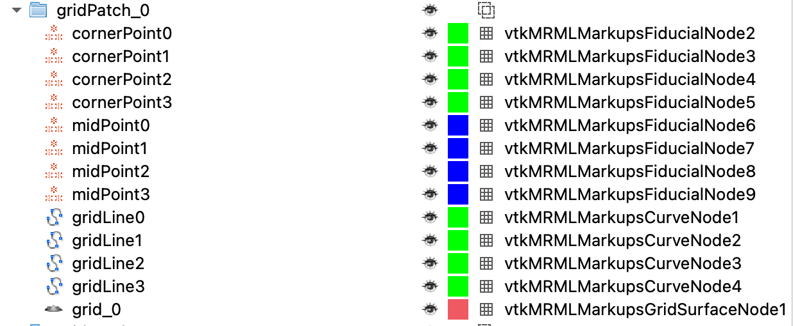

5. If necessary after placement, the following steps may be taken to improve the regularity and positioning of the semi-landmark grid points:
    * Adjust the grid corner points to overlap with the landmark points
    * Adjust the midpoints of the grid (shown in blue) and check that they are on the surface of the model. The size of the points can be increased from the `Markups` menu to make this step easier. Note that changing the position of the grid corners will update these point positions back to the default location at the midpoint between grid corners.
    * Expand the advanced parameters and adjust the values. The maximum projection distance specifies the maximum search distance used to project a point to the surface, as a percentage of the image length. This value may need to be decreased in cases where there are multiple structures in an image and the points from one stucture are being projected to a more external surface. Changing the smoothing parameters of the grid relaxation can help improve the performance when the mesh surface contains noise or holes
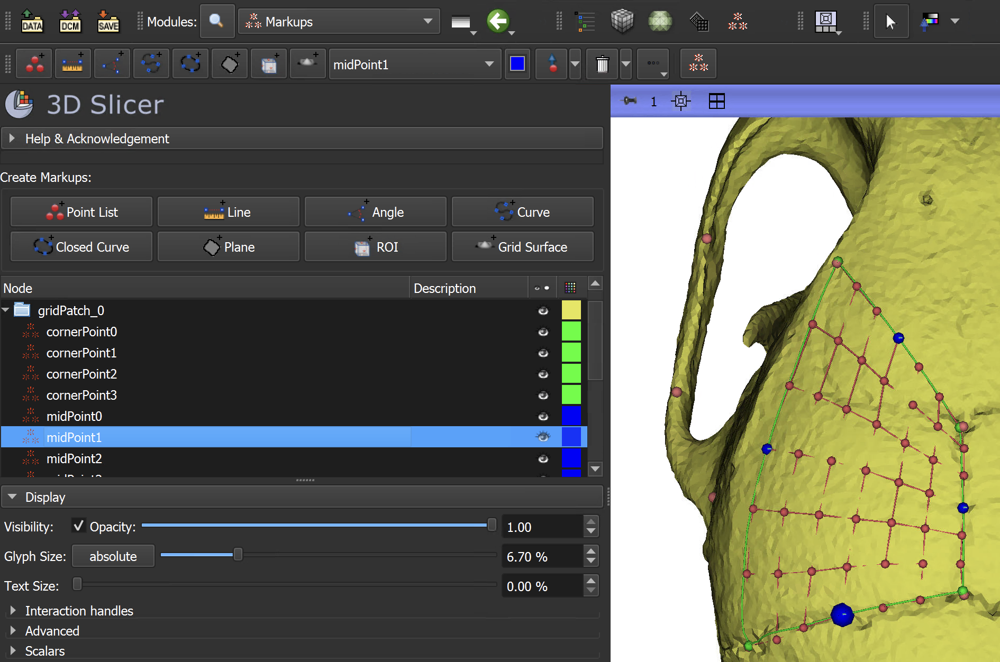

6. Place the second grid connecting the landmark points 15-22-11-14.
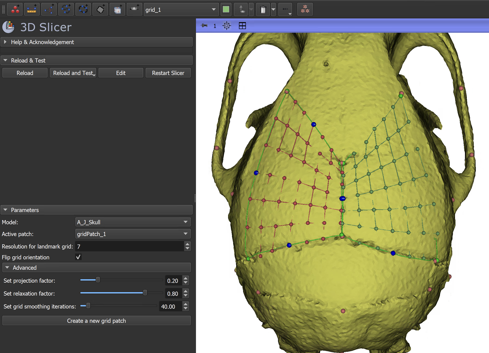

7. The grid placed for these points will likely require some adjustments Follow the procedures in step 4 to adjust the grid after initial placement if needed. The image below shows improved sampling regularity when the midpoint at the top of the grid is adjusted.
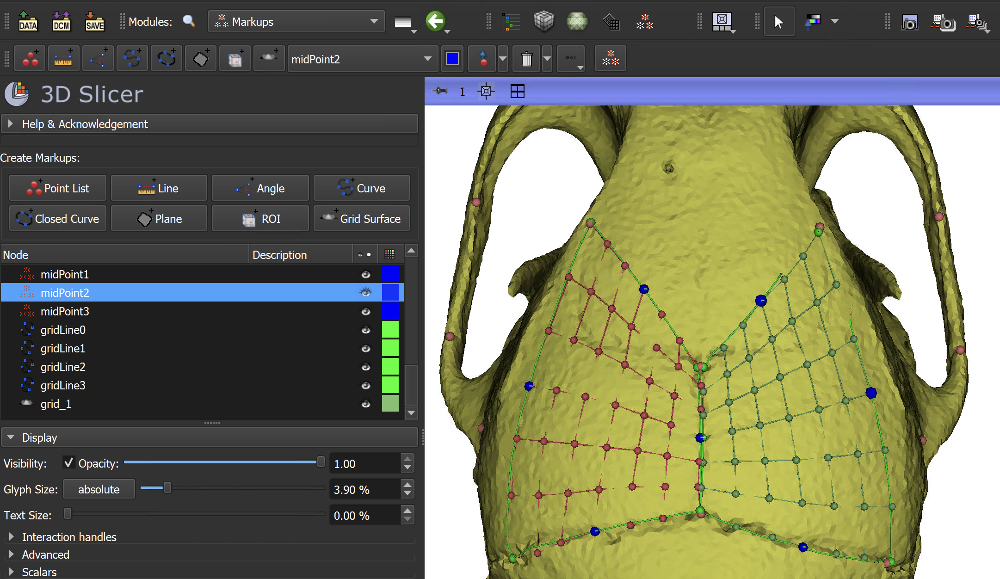

8. If the parameters of the first grid need to be adjusted after placement of the second grid, reset `Active patch` to `gridPatch_0` to fix the position of `gridPatch_1` and return `gridPatch_0` to an interactive state.

### Place grid by selecting existing landmark positions
1. Switch to the `Data` module and delete the folders for the two grid patches created in the previous step. Return to the `PlaceLandmarkGrid` module.
2. Click the button: `Place a new grid patch from existing points`.
3. Right click on the existing manual landmark point 15. From the context menu that appears, select `Add point to grid.`

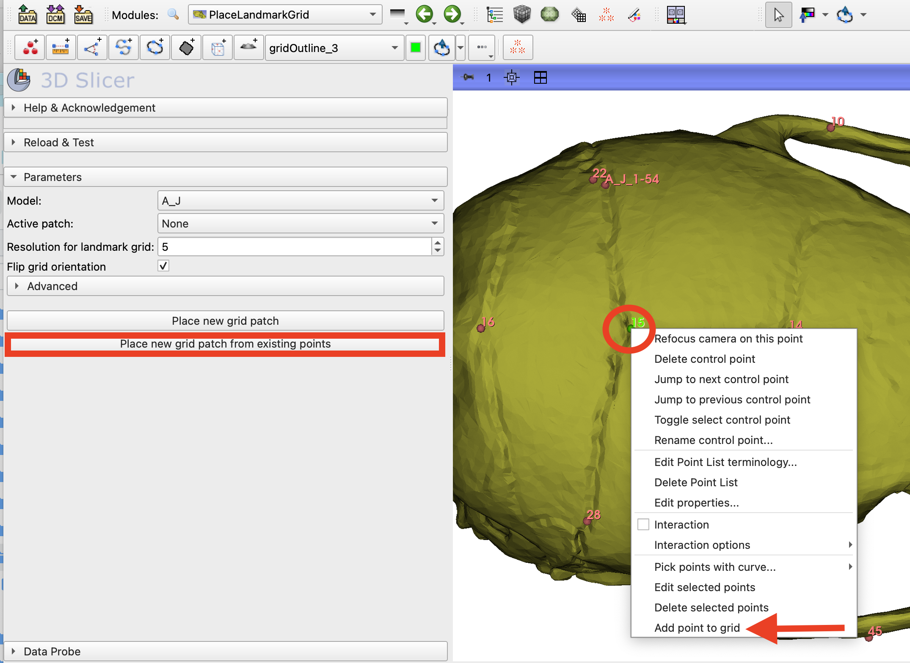

4. Repeat step 3 for the landmark points: 28, 12, 14.
   
5. After the 4 point has been selected confirm the patch placement and adjust the grid parameters if needed.

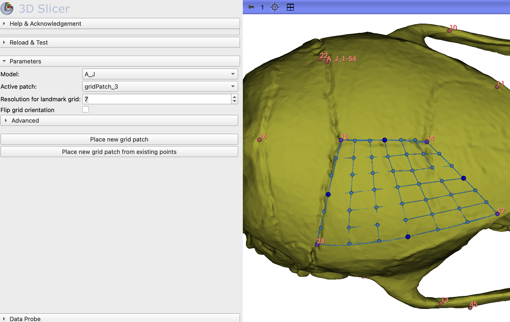

6. Repeat steps 2-5 to create a grid patch connecting landmark points 15-22-11-14.

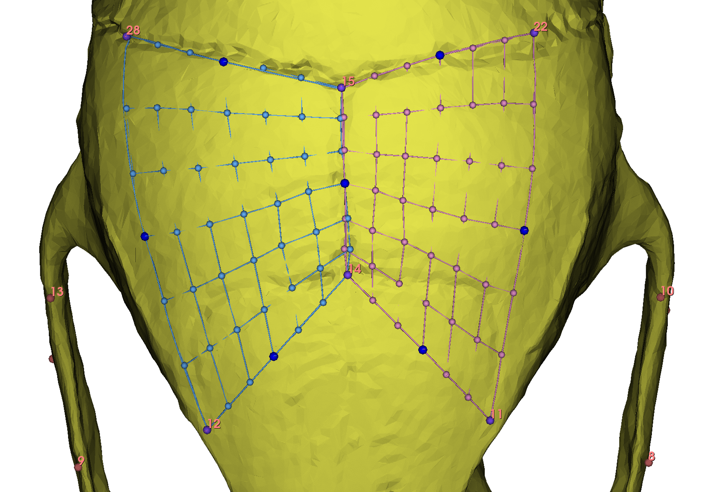

### Using MergeMarkups to export a single landmark file
After generating patches of semilandmarks, these will need to be combined into a single landmark file for analysis or transfer to other specimens. In this example we will merge the two landmark grids with the manual landmark set using the `MergeMarkups` module. The manual landmarks will be labeled `Fixed` and the semi-landmark points will be labeled `Semi` so they can be handled appropriately in subsequent analysis.

1. Open the `MergeMarkups` module. Switch to the last tab, labeled `Merge Landmark Grids`.

2. There are two types of file viewers. The first will show only Markups Grids and the second will show all Point Lists in the scene. In the Grid Viewer, select the two Markups Grids to be merged. All nodes created using the `PlaceLandmarkGrid` module will be within a folder with the grid name, so expand these folders if needed to see the Markups Grid node types.
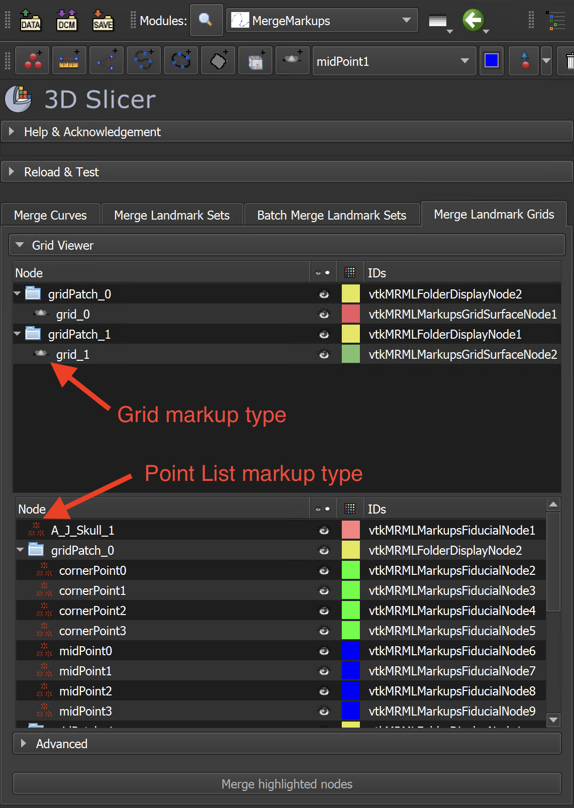

3. In Point List viewer, select the manual landmark Point List that will be merged with the Markups Grid semi-landmarks. In this example it will be named `A_J_Skull`. With these Markups Grid and Point List nodes selected, click the `Merge highlighted nodes` button.
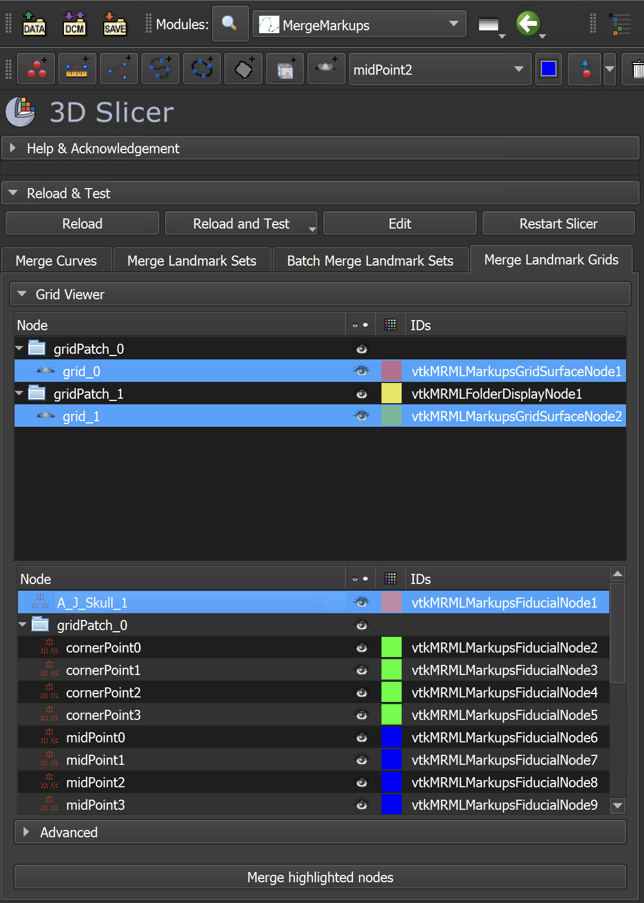

4. A new node, labeled `mergedGridMarkupsNode` will be created. Open the Python Console to view the output of the merge process. The number of each catagory of landmark is reported. For the above example, the final, merged Point List should contain: 96 total landmark points, 51 fixed landmark points, and 85 semi-landmark points. View this merged node in the `Markups` module to see the point type listed in the control point description field.
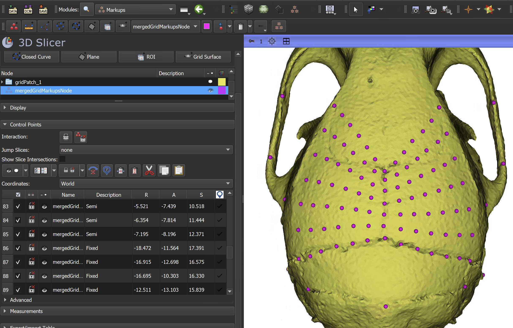

5. Open the `Data` module. Right click on the merged node and select `Export to file` to save a copy of the output.

----

### Repeat placement for other samples

Follow the procedure above to create the same two patches for the remaining specimens in the `newModels` folder. Verify that the number of fixed and semi-landmarks in the final node is consistent.

