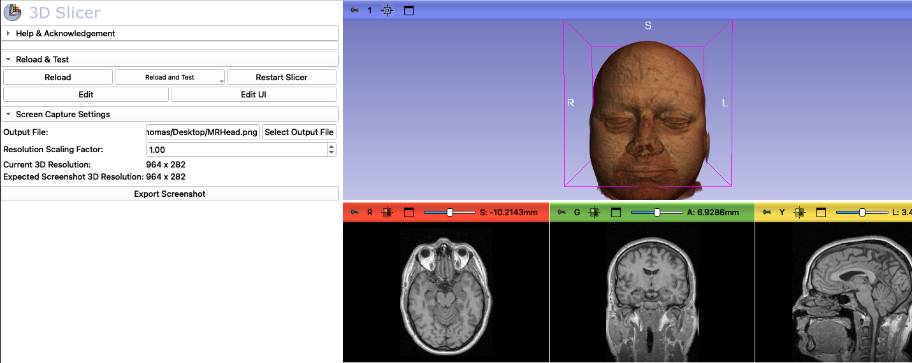

# HiResScreenCapture Module for SlicerMorph

This module is a part of the SlicerMorph extension for 3D Slicer, designed to capture high-resolution screenshots of 3D views within the application. This module is only available for Slicer versions 5.7 or higher, as it relies on some  changes in core Slicer functionality.

## Usage

1. **Open SlicerMorph:** Launch 3D Slicer and open the SlicerMorph module.

2. **Configure 3D Viewer:** Load the data you would like to render in high-resolution, adjust color, transparency and all other visual properties (i.e., hide the bounding box, or orientation labels, decide to present the scale bar or not) and the orientation you would like to capture. 
   
3. Find the **HiResScreenCapture** from the Module selector `SlicerMorph->Utilities->HiResScreenCapture` or use CTRL/CMD+F and search for it.

4. **Configure 3D Viewer Size (Optional but Recommended):**
   - Click **"Undock 3D Viewer"** to open the 3D viewer in a separate window
   - Resize the undocked window to set the exact aspect ratio and dimensions you want for your final screenshot
   - The viewer size will be preserved even after capture, allowing you to capture multiple screenshots with the same dimensions
   - Click **"Redock 3D Viewer"** when you're done to return the viewer to its original layout
   - You can also adjust the viewer size by maximizing the 3D viewer pane within Slicer without undocking

5. **Configure Screenshot Settings:**
   - **Scaling Factor**: Use the spin box to set the resolution scaling factor (range: 0.1 to 100.0). This multiplies both the viewer dimensions and the rendering quality.
   - **Viewer Size**: Displays the current X and Y dimensions of the 3D viewer (shows "custom" if undocked)
   - **Output Size**: Shows the final output resolution after applying the scaling factor. For example, for a 10" wide print at 600 DPI, you need an output X dimension of 6000px. Adjust the scaling factor and viewer size to achieve your target resolution.
   - **Output File**: Specify the path to save the screenshot. Type the path directly or click `Select Output File` to browse. Supported formats: PNG, BMP, JPG, JPEG, TIFF.
 
6. **Capture Screenshot:** Click `Export Screenshot` to capture the screenshot with the specified settings. If the viewer was not previously undocked, it will be temporarily undocked for capture and automatically redocked afterward.

7. **Example Output:**

[Molar, 14530x12560 px](https://js2.jetstream-cloud.org:8001/swift/v1/SampleData/Rendering/molar.png)

[Mouse Turbinates, 12200x12928 px](https://js2.jetstream-cloud.org:8001/swift/v1/SampleData/Rendering/Turbinates.png)

## Key Features

- **Undock/Redock Workflow**: Undock the 3D viewer to precisely control aspect ratios and dimensions for your screenshots
- **High Scaling Factors**: Support for scaling factors from 0.1x to 100x the viewer size
- **Multiple Output Formats**: Save screenshots in PNG, BMP, JPG, JPEG, or TIFF formats
- **Real-time Size Preview**: View current viewer dimensions and output resolution before capture
- **Automatic Layout Management**: Viewer automatically redocks after capture (unless manually undocked beforehand)

## Tips

- For best results, undock the 3D viewer first and resize it to your desired aspect ratio before capturing
- The scaling factor affects both resolution and rendering quality - higher values produce sharper, more detailed images
- If you need multiple screenshots with the same dimensions, keep the viewer undocked between captures
- The output resolution is calculated as: Viewer Size × Scaling Factor

## Known Issues

- HiResScreenCapture only works with single 3D layouts
- Occasionally, dimensions of the output file might be slightly different than the displayed value 