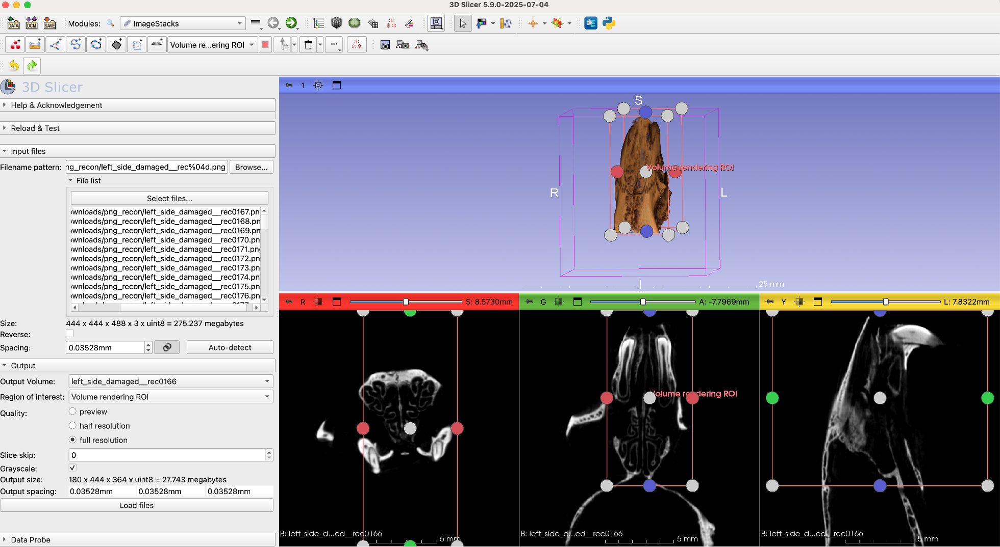

## ImageStacks
ImageStacks is a SlicerMorph module to import non-DICOM image sequences (TIF/PNG/JPG/BMP) into 3D Slicer. It provides additional features such as only loading a subset of the data using ROI, downsampling, skipping slice(s) along the Z plane, and reversing the stack order. While there is an auto-detect feature for the voxel spacing, most 2D formats do not correctly specify this. You are expected to check the detected value, and enter the correct voxel spacing, if necessary. 

Imagestacks also optionally converts 16 (or higher) bit data to 8 bit. This is disabled by default. Shrinking the original dynamic range (e.g., 65535 gray values) to 8 bit (256 gray values) will have consequences. The only time we suggest you consider the conversion, is when you are working with a dry (skeletonized) bones but the data is presented in 16 bit. Because in that case your data consists only of bone and air, and because intensity values of different types of bones are quite similar, 256 gray values are likely to be enough.   

**Important Note:** Not entering the correct voxel spacing value for your dataset at the import time is the most common mistake new users make. Keep in mind all other quantitative calculations, as well as your segmentations will depend on you specifying the correct image geometry. 

To use the `ImageStacks` module in SlicerMorph, first go to the `Sample Data` module and download the **Bruker/Skyscan mCT Recon Sample.** If you are not familiar with the `Sample Data` module or how to find where Slicer downloads files, please review the tutorials for [`Sample Data`](https://github.com/SlicerMorph/Tutorials/tree/main/SampleData) and [`SlicerMorph Preferences`](https://github.com/SlicerMorph/Tutorials/tree/main/MorphPrefs). 

Then find the `ImageStacks` under **SlicerMorph->Input and Output** module menu folder and:

1. Click the **Browse...** button and select a *PNG* file in the folder you just unzipped.

2. Image spacing in this dataset is provided in the accompanying left_side_damaged__rec.log file as 35.28 micron. Enter this value as 0.03528 as the **default unit in Slicer is millimeters**. Note that you only enter one voxel spacing value. That's because most microCT dataset are isotropic (i.e., they have same resolution in all three axes). If your dataset has **anisotropic** resolution, click the lock button to unlock the enter different values for all three planes. You can also try to click the **auto detect** button for Slicer to try to recover spacing information from the files. Go ahead and try this on dataset. You will see that the program will erroneously report the value as **1.0mm**. That's because 2D formats (JPG/PNG/TIFF/BMP) often does not retain this information correctly. And if you import the data with this value, your dataset will have the incorrect geometry. Therefore, make sure you validate the auto-detected value independently (from logs, or other metadata). Go ahead and re-enter the correct spacing value of 0.03528mm manually. 
3. Leave the **Output Volume** blank, which will use the filename prefix. Altneratively, you can choose to create a new volume name. 
4. To preview a low resolution version of your file make sure the **preview** quality option is selected and click **Load Files** and see that all three slices viewers contain a low resolution version of our data.
5. To visualize what the specimen looks like, go to `Data` module and drag and drop  **left_side_damaged__rec** into the 3D viewer. You may need to hit the cross hairs and push pin directions (red boxes) to center your rendered image in the 3D widow.

Notice that the resultant rendering show the damage to the zygomatic arch in the **right side** of the specimen. Curiously, the specimen is named **Left side damaged**. 

Indeed you can check what the real specimen looks like by going to the link below, and confirm that it is indeed the left zygomatic arch that is missing. 

<a href="https://app.box.com/s/zvs162oja7tzszesmygnqs15t631y15m/file/701653679714"> **Picture of the specimen in the sample stack** </A>

This is a standard problem of using 2D image stacks to convey volumetric data. There is no convention of what the **top** of the stack versus **bottom** of the stack is. It is all relative and depends on the scanner vendors' convention. To mitigate this issue, `ImageStacks` offers a **Reverse** option, which basically flips the stack ordering and -in this case- corrects this mirroring. 

This is a common problem across 3D visualization programs, when image sequences are used to present 3D data. Because of this, it is very important to have independent confirmation of import procedure. Look for asymmetrical structures on your specimen and confirm that they appear on the correct side in the 3D rendering. After a successful import (correct volume geometry, and specimen orientation) you should immediately save your data in a proper 3D volume format, like NRRD, that will retain this information each time you load the data. 

Once you have reversed your image and you want to visualize the full resolution version of your entire file you can go back to the `ImageStacks` module, change the quality from **preview** to **full resolution**

### Using ROI with Image Stacks

Let's say you have a large file and you only want to visualize a portion of the total scanned volume at full resolution, such as only segmenting the braincase of the mouse. If the file is too large, loading the full resolution volume and then using cropping the volume to the specific region we need will be slow. Instead, we can import a low resolution version of the data (like we already did), and then adjust the ROI on this low-resolution volume and reimport the data with these new constraints. For large (5GB+) datasets this will always be faster than the first option described. To try this:

1. Go to the `volume rendering` module and turn on the `Display ROI` option (alternatively you can use the Markups toolbar to place a new ROI). Then modify the ROI to only contain the region you would like to import (in this case just the snout).  

Now go back to the `ImageStacks` module and:

2. Set a new **Output Volume**. If you don't do that, it will overwrite the one you j
3. Click the **Region of Interest** button and choose the ROI you have created (in my case it is called VolumeRendering_ROI) from the drop down menu
4. Adjust the **Quality** to Full Resolution (if not already set)
 

Notice that the slice views show only the volume in the region of interest and are now full resolution. If you have an articulated specimen (e.g., a full body scan of a fish), and you want to segment only the skull (or a specific region), this is a trick you can use to reduce the memory consumption. Segmentation may require 6-10X more memory compared to your volume size (if `ImageStacks` reports estimated memory usage is 2GB, then you may need up to 20GB in memory to segment the data in full resolution). 

If you have DICOM stacks, please note that you should use the [DICOM module](https://github.com/SlicerMorph/Spr_2021/blob/main/Day_1/DICOM/DICOM.md)

### Further exploration

1. Try importing the same volume with different ROI under different names. Observe that they retain their correct spatial relationships with respect to the full volume. That's because slicer retains the correct spacing and necessary offset values for the origin, so that these partial datasets still line up with the full image. 
2. Try drag and dropping one slice from the folder where the data sits into Slicer. (HINT: When asked whether you want to use ImageStacks to import data, say yes)
3. Try using the `ImageStacks` tool to import any data you might have or downloaded from the MorphoSource. 
