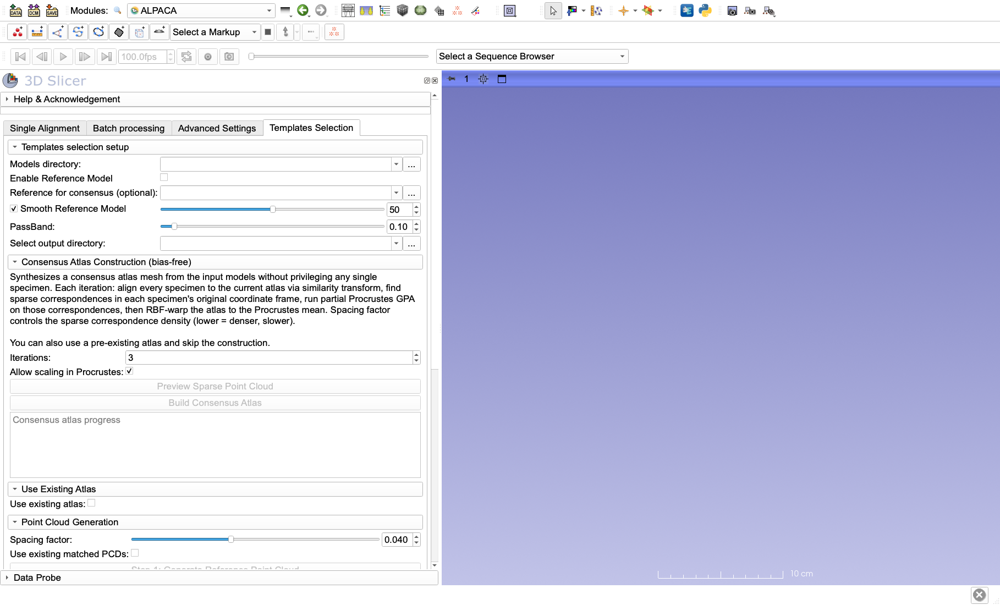
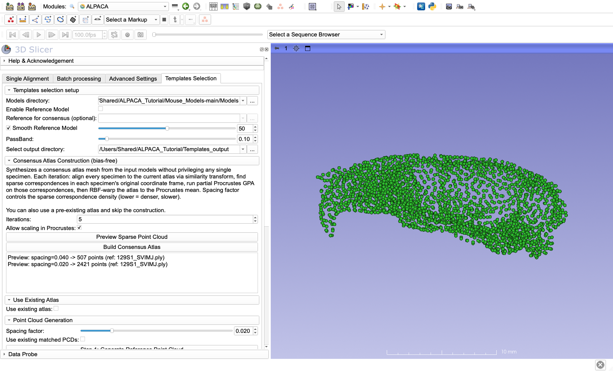
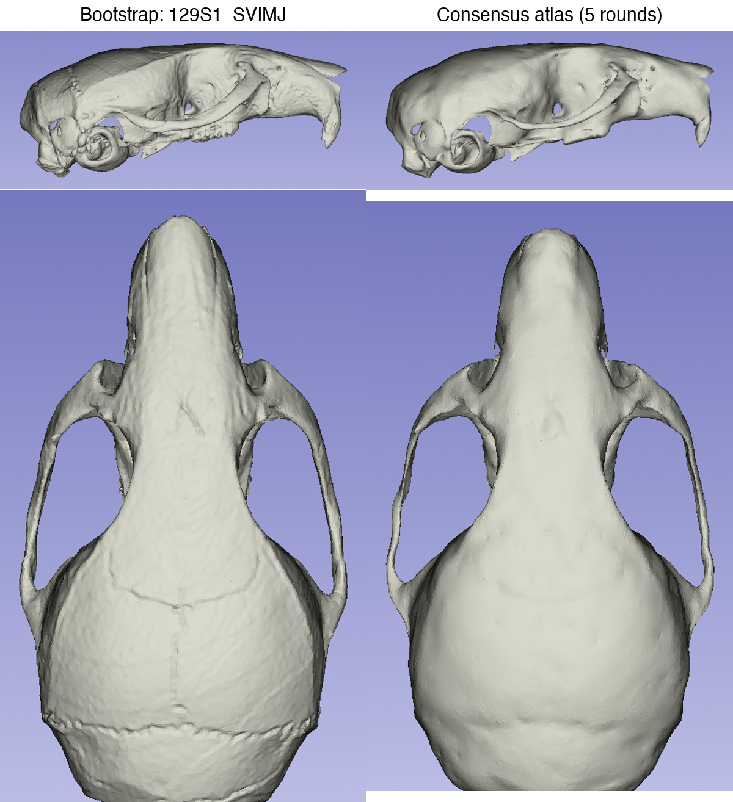
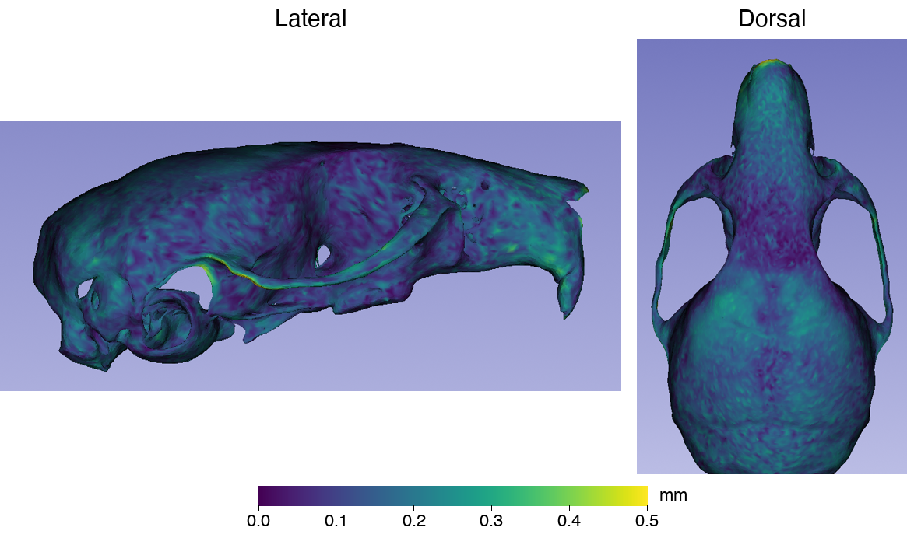

# ALPACA II: Building a consensus atlas

## Introduction

Multi-template landmarking ([MALPACA](MALPACA.md)) needs a few specimens to serve as templates, and they should cover the variation in your sample. The **Templates Selection** tab of ALPACA picks them for you: it places a common set of points on every specimen, runs a GPA and PCA on those points, and chooses the specimens closest to the centers of K-means clusters in that shape space ([ALPACA III](K-means_templates_selection.md)).

To place those common points, the procedure needs a starting shape. Before 2026 this was a single specimen, chosen by the user or simply the first file in the folder. Its points were copied onto every other specimen. That choice is arbitrary, and it matters: an unusual specimen leaves its mark on the points, on the shape space built from them, and in the end on which templates get picked (Maga, 2026). With a large new dataset you often cannot tell in advance which specimens are unusual.

The **consensus atlas** removes this dependence. Instead of using one specimen, ALPACA builds an average skull from the whole sample, in a few rounds:

1. Start from any specimen (the *bootstrap*), lightly smoothed.
2. Place a sparse set of points on it, and find the corresponding points on every specimen after aligning each specimen to it (rotation, translation and scale only).
3. Average those points across specimens (a Procrustes mean).
4. Warp the current atlas surface to that mean shape.
5. Repeat from step 2 with the warped atlas.

After each round the atlas is less like the bootstrap specimen and more like the sample average. On the 62 mouse strains we use here, the atlas settled within three to five rounds whichever specimen started it. Compared with a single specimen as the reference, it cut the effect of that choice on pairwise shape distances by about 60%, and it made the K-means template picks more consistent (Maga, 2026).

In this tutorial we build a consensus atlas from all 62 skulls in Mouse_Models. In [ALPACA III](K-means_templates_selection.md) we use it to select templates.

## What you need

- The **Mouse_Models** data, downloaded and extracted as described in [ALPACA I](../ALPACA/README.md#get-the-sample-data). Only the `Models` folder is needed here.
- Time. Building the atlas aligns every specimen to the atlas once per round, so it takes a while: about an hour and a half for our 62 skulls and 5 rounds, on a recent laptop. Plan to let it run.

## 1. Set up the input and output

Open the **ALPACA** module and switch to the **Templates Selection** tab.



Under **Templates selection setup**:

- **Models directory:** the `Models` folder of Mouse_Models. It must contain only the specimens you want in the atlas (`.ply`, `.stl`, `.obj`, `.vtk` or `.vtp` files).
- **Select output directory:** an empty folder for the results. We used `/Users/Shared/ALPACA_Tutorial/Templates_output`.
- **Enable Reference Model** / **Reference for consensus (optional):** chooses the bootstrap specimen. If you leave it unchecked, the first model in the folder is used (alphabetically, here `129S1_SVIMJ`). Because the atlas moves away from the bootstrap in the first rounds, which one you pick matters little, so we leave it unchecked.
- **Smooth Reference Model** (on, 50 iterations, **PassBand** 0.10): smooths the bootstrap model once before the first round. The atlas keeps the mesh of the bootstrap model throughout, so without smoothing the bootstrap's fine surface detail (for example its sutures) would appear unchanged in the final atlas, although no other specimen shares it. Keep the defaults.

## 2. Choose the density of the correspondence points

The **Spacing factor** sets how many points are placed on the atlas in each round. Smaller values give more points: more detail, but slower. It is in the **Point Cloud Generation** section further down the tab, and the same slider is used again in ALPACA III, so check its value before each step.

To see what a value gives, set it and click **Preview Sparse Point Cloud** in the **Consensus Atlas Construction** section. The points are shown in the 3D view and their number in the box below. On our bootstrap specimen:

| Spacing factor | Points |
|---|---|
| 0.04 (default) | 507 |
| 0.02 | 2,421 |

We followed Maga (2026) and built the atlas with **0.02** (about 2,000–2,500 points), which captures the shape of the skull in more detail. We will use the coarser 0.04 later for template selection.

## 3. Build the atlas

In **Consensus Atlas Construction (bias-free)**:

- **Iterations:** the number of rounds. The default is 3; we used **5**, as in Maga (2026). See [Did it settle?](#did-it-settle) below for how to tell whether your data need more.
- **Allow scaling in Procrustes:** leave it checked, so that differences in overall size do not dominate the average shape.



Click **Build Consensus Atlas**. Slicer responds only sluggishly while the atlas is built; do not close it. Progress is written to the box below the button. For our 62 skulls it took 89 minutes: 14–17 minutes per round, and 13 minutes for a final pass.

When it is done, the box shows the log of the whole build. For each round it lists the specimens it aligned and a summary like this:

```
Bootstrap reference (default, first model): 129S1_SVIMJ.ply
  Reference pre-smoothed (50 Taubin iters, passBand=0.1)
--- Consensus iteration 1/5 ---
  Sparse control points: 2409;  atlas vertices: 86709
  ...
  Collected correspondences from 62 specimens
  Partial Procrustes mean computed (62 specimens)
  Wrote .../consensus_atlas_iter00.ply
  [timing] iter 1 total: 981.6s
```

Check that **Collected correspondences from** reports all your specimens in every round. A lower number means some specimens were dropped.

The number of control points changes a little from round to round (2,409 in the first, 2,191 in the final pass), because the points are placed afresh on the updated atlas each time.

### Did it settle?

The atlas keeps the same mesh through all the rounds, so the change between rounds can be measured vertex by vertex. We did this outside the module, using the files the build saves (see below): after removing any overall shift and rotation between two consecutive atlases, we took the root mean square distance between their vertices.

| Step | Change (mm) |
|---|---|
| bootstrap → smoothed bootstrap | 0.063 |
| smoothed bootstrap → round 1 | 0.110 |
| round 1 → round 2 | 0.058 |
| round 2 → round 3 | 0.044 |
| round 3 → round 4 | 0.046 |
| round 4 → round 5 | 0.038 |
| round 5 → final | 0.037 |

The first round moves the atlas most, as it leaves the bootstrap specimen behind. After that the changes level off at about 0.04 mm, a small fraction of a skull about 23 mm long. This remaining change is the noise of re-placing the points each round, not further convergence, which is why more rounds do not help. Maga (2026) saw the same pattern on this dataset for all 62 choices of bootstrap specimen.

## 4. Look at the result

When the build finishes, the final atlas is loaded into the scene as `consensus_atlas`. The output folder has a time-stamped subfolder, `consensus_atlas_<date>_<time>`, with:

- `reference_smoothed.ply`: the smoothed bootstrap specimen.
- `consensus_atlas_iter00.ply` … `consensus_atlas_iter04.ply`: the atlas after each round.
- `consensus_atlas.ply`: the final atlas, after one more round on top of the last iteration. This is the one to use.

Here is the bootstrap specimen next to the final atlas, from the side and from above:



The atlas is recognizably a mouse skull, but it is not the bootstrap specimen. It is smoother, and the sutures of the bootstrap (clearly visible on its braincase) are gone. The map below shows how far each point of the atlas ended up from the matching point of the bootstrap, after removing any overall shift and rotation (median 0.15 mm, 95% of the surface within 0.29 mm):



The atlas differs from the bootstrap everywhere, most on the braincase, the zygomatic arches and the tip of the snout. Those are differences between this one strain and the average of the 62.

The atlas is not the skull of any specimen: it is a synthetic average. Check it anyway. It should look like a plausible skull of your group, without folds, holes or spikes. If it does not, the rigid alignment of some specimens has probably failed. Look for specimens that are very different from the rest, damaged, or in a very different orientation.

## How many specimens should go into the atlas?

Here we used the whole sample, 62 skulls. With a large study you do not have to. The atlas is a scaffold for finding corresponding points, not a precise estimate of the population mean, and it settles quickly. Maga (2026) found that a specimen left out of the atlas was represented about as well as one included in it.

What matters more than the number is **balance**. The atlas is an average, so it is pulled towards whatever dominates the sample. In a test on 81 great ape skulls (38 gorillas, 30 orangutans, 13 chimpanzees), the atlases agreed closely, but the shape space built from them depended on the starting specimen, and a smaller balanced subset (five males and five females per species) did better than the full, unbalanced sample (Maga, 2026).

A practical approach for a large study:

1. Build the atlas from a small subset that spans the main sources of variation in your sample (groups or species, both sexes if they differ, the range of sizes), with similar numbers in each.
2. Add specimens group by group and look at the atlas each time. When adding more no longer changes it, the subset is large enough.
3. Use that atlas for template selection and landmarking of the whole sample.

For samples of very different forms, for example several species with very different faces, a fully automatic average may not be anatomically sensible. Pilot such cases carefully.

## Using an atlas you already have

A finished atlas can be reused. In [ALPACA III](K-means_templates_selection.md), check **Use existing atlas** and point **Existing atlas path** to `consensus_atlas.ply`. You can use any other reference mesh the same way.

## Next step

Continue with [ALPACA III](K-means_templates_selection.md) to select MALPACA templates with the atlas.

## References

- Maga, A. M. (2026). A new reference-invariant consensus template generation method in ALPACA. *bioRxiv*. https://doi.org/10.64898/2026.05.29.728799
- Zhang, C., Porto, A., Rolfe, S., Kocatulum, A., and Maga, A. M. (2022). Automated landmarking via multiple templates. *PLOS ONE*, 17(12), e0278035. https://doi.org/10.1371/journal.pone.0278035
- Porto, A., Rolfe, S., and Maga, A. M. (2021). ALPACA: A fast and accurate computer vision approach for automated landmarking of three-dimensional biological structures. *Methods in Ecology and Evolution*, 12(11), 2129–2144. https://doi.org/10.1111/2041-210X.13689
