# K-means multi-template selection tutorial
This is an optional step before running `MALPACA` in `SlicerMorph`. This tutorial shows how to run the K-means multi-template selection module for selecting multiple specimens as templates for `MALPACA`. The procedure starts from extracting point clouds with matching points across the whole sample. It then runs Generalized Procrustes Analysis on these point clouds to export a full set of PC scores as the raw data of the K-means clustering algorithm. The number of clusters is user-defined. Each specimen that is closest to the center of a K-means generated cluster is selected as a template. 

### Step 1. Download sample data.
Download sample data here: https://github.com/SlicerMorph/mouse_models. Extract the files. If you are using SlicerMorph Cloud, it will be in /home/docker/sample_data/Mouse_Models

### Step 2. Specify files and directories
Switch to the “Templates Selection” tab (yellow). In the `Templates Selection Setup` collapsible section, specify entries to enable buttons in the following sections
* `Models Directory` (red): specify the folder that contains the original 3D models in “. ply” format. If you have downloaded the mouse models repository from github, this would be the contents of the `Models` folder. 
* `Select output directory` (blue): specify the folder for storing all the output of the k-means templates selection.

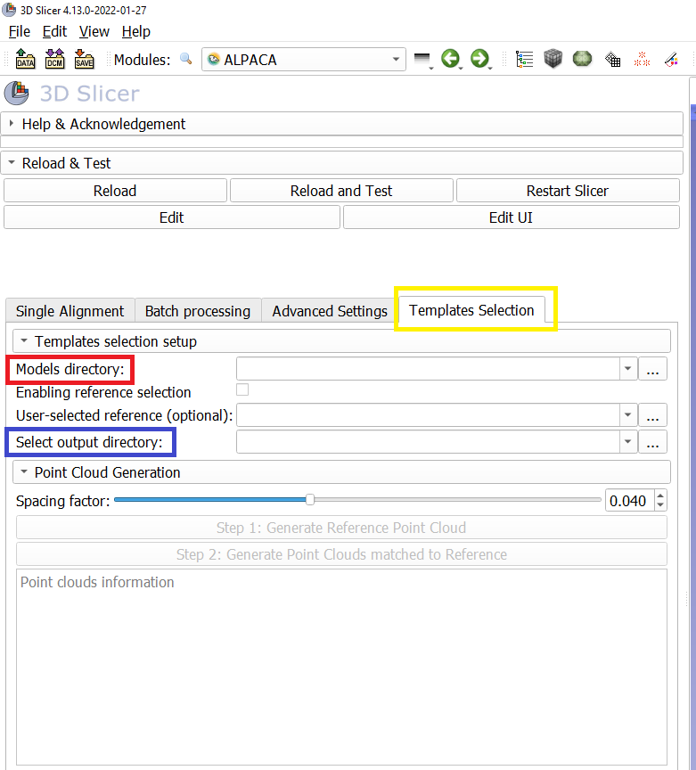

* (Optional) Checking the `Enabling reference selection` checkbox (red) will enable `User-selected reference` entry. This allows users to select a specimen in the `Models Directory` (red arrow) as the reference for registering specimens as well as generating downsampled point clouds with point-to-point correspondence. 
  * If this checkbox is unchecked or no specific reference is selected, the first specimen in the `Models Directory` folder will serve as the reference by default.

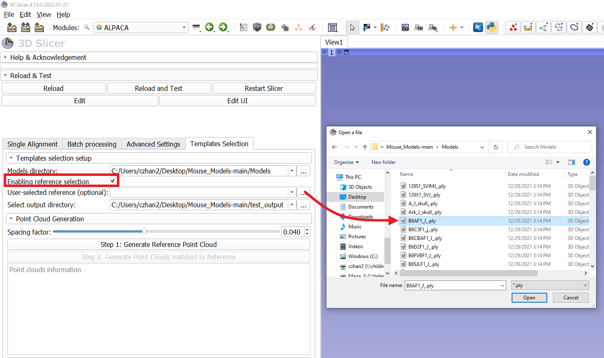

### Step 3. Generating downsampled point clouds with point-to-point correspondence.
* Specify a `Spacing factor` value using the slider (red) or simply input a value in the box at the right side (Fig. S13). This value determines how sparse the downsampled reference point cloud will be. The larger the spacing factor value, the sparser the point cloud will be. For new samples, this requires some experimentation on user’s end (See explanation in next steps). For mouse sample spacing of 0.03 is suggested
* Click the `Step 1: Generate downsampled reference pointcloud button (blue)`. After the downsampled reference point cloud is generated, the box below (green) will display information about the name of the reference model and the number of points in the reference point cloud. The `Step 2: Generate Point Clouds matched to Reference` button will also be enabled. 

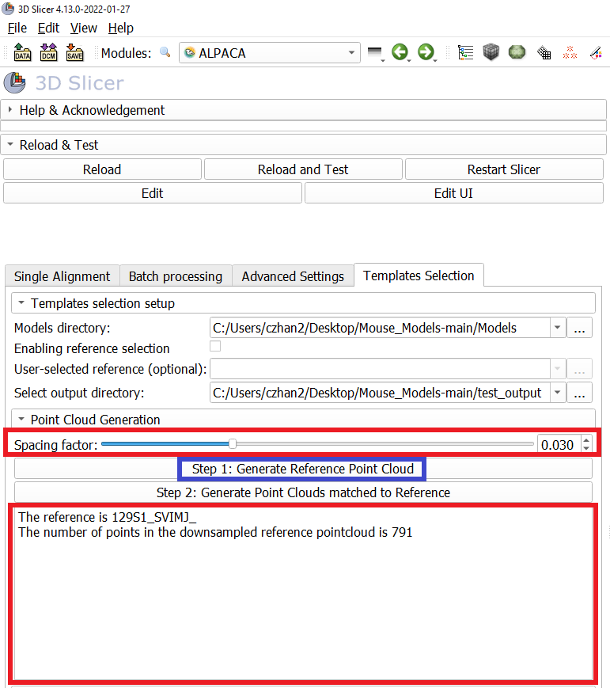

* Click the `Step 2: Generate Point Clouds matched to Reference` button (red). This will extract point clouds from each target specimen listed in the “Models directory” based on the reference. 

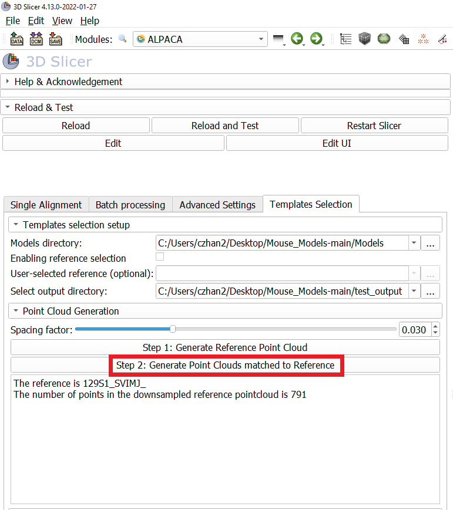

  *  It will also created a time-stamped folder in the directory specified in `Select output directory` in Step 1 so that results from different runs will not overwright each other. The extracted point clouds with point-to-point correspondence will be stored in `fcsv` format as landmark files in a folder called `matching_point_clouds` within the just created time-stamped folder. 

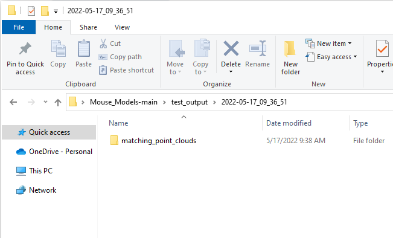

  * Note that occasionally a point in the target may be repeatedly fetched if it is equally close to multiple points in the reference point cloud. Consequently, the number of unique points in a target will be smaller than that of the reference.
  * Since the number of points in a point cloud is usually large, having a few redundant points are unlikely to significantly impact results of morphometric analysis. Thus, the error threshold that measures the number of redundant points in a target point cloud is set up as 1%. For example, if the reference has 800 points and the number of unique points in the target is 793, the result will be suggested as acceptable (the error rate does not exceed the 1% threshold). 
  * The box below the “Generate matching point clouds” button displays information about the number of unique points in generated point clouds, including specimens with number of unique points smaller than that of the reference and whether their error rates exceed the threshold. 
  * Users can opt to ignore the warning when some point clouds have error rates exceeding 1%. If not, they can try increasing the spacing factor to achieve sparser point clouds or check possible deficiencies in the original models.   

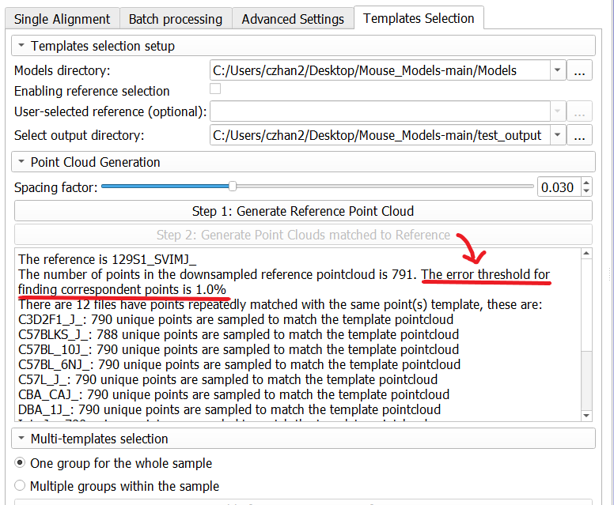
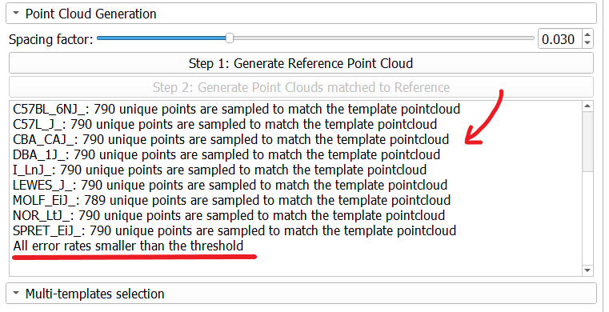

### Step 4. Specify whether there are multiple groups within the sample in the `Multi-template selection` section.
* Check `One group for the whole sample` (red arrow) if no pre-known groups exist within the sample or users do not want to divide the sample into groups. In this case, the user-input `Number of templates per group` (blue) is the number of templates for the whole sample. 

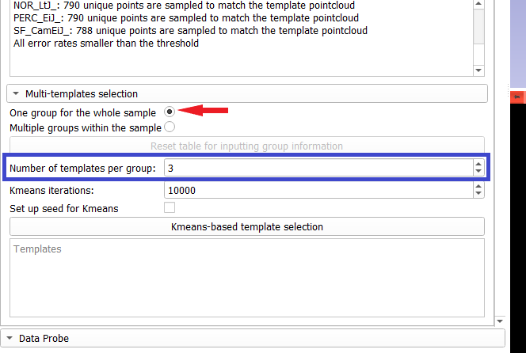

* Check the `Multiple groups within sample `(green arrow) if for dividing a sample into multiple groups based on prior knowledge. By checking this option:
  * A table for manually entering group labels for each specimen will be generated (right). A K-means algorithm will be executed per group to select a user-defined number of templates specified in `Number of Templates per group` (blue).
  * The `Reset table for inputting group information` button (yellow) will be enabled. Click it to reset the group information table.

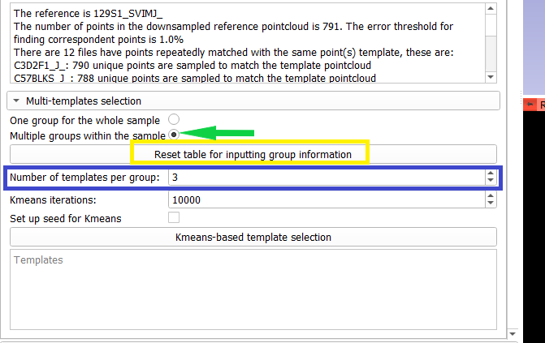
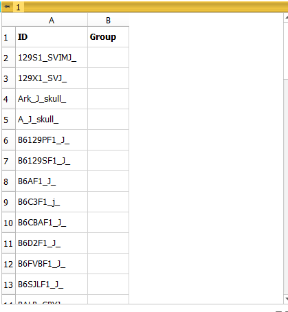

### Step 5. Set up number of iterations (red) and a seed (optional) blue) for K-means algorithm.
* The default number of K-means iterations is 10,000. Iteration number can be increased for consistent results of K-means. 
* For ensuring reproducibility, users can set up a seed for K-means by checking the `Set up seed for K-means` box (blue). However, this may also influence other random-based functions in 3D Slicers. Therefore, for running other 3D Slicer modules, it is recommended to open a new Slicer session. 

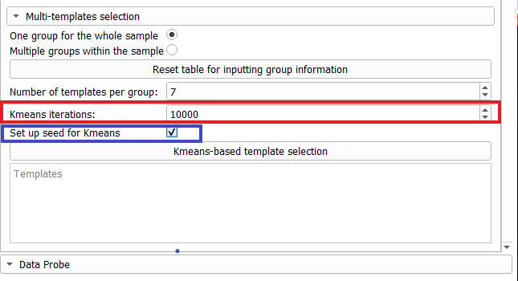

### Step 6. Select templates when no group identity is entered (i.e., one group for the whole sample)
Let us first set up the `Number of templates` as `7` and choose the `One group for the whole sample` option.  Also check `Set up seed for kmeans` for reproducible results.

Click `Kmeans-based template selection` button (red) will execute K-means algorithm for multi-template selection. This function is based on the output point clouds in Step 2. The display box (yellow) below shows specimens selected as the templates. 

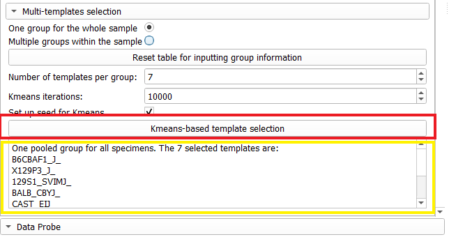

* The models selected as templates will also be saved in the folder called `kmeans_selected_templates` in the same time-stamped folder as the extracted point clouds. 

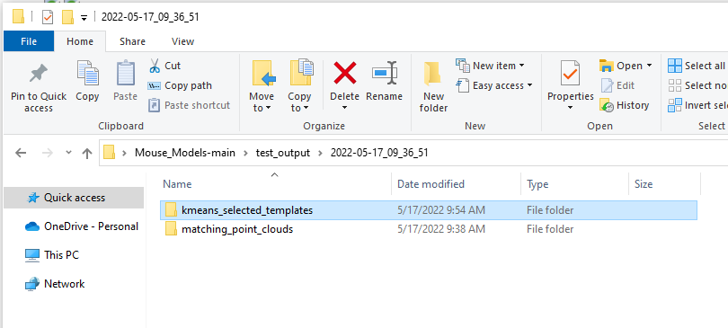

* A plot of PC1 and PC 2 based on a Generalized Procrustes Analysis of the point cloud data will also be displayed. Specimens are black squares. Templates are light color, diamond-shaped points that overlay the squares. 

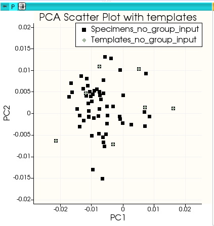

### Step 7. Select template with group identify entered (i.e., multiple groups within the sample)
We can then change the `Number of templates per group` as `2` and check the `Multiple groups within the sample `option (green arrow). Also check `Set up seed for kmeans` for reproducible results. Enter the group identity at the second column `Group` of the table. If we only specify 3 groups from the sample as `a`, `b`, and `c`, the program will select 6 specimens as templates.
* The display box (yellow) will show selected templates for each entered group. 

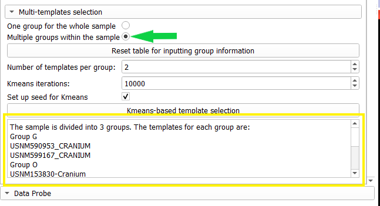
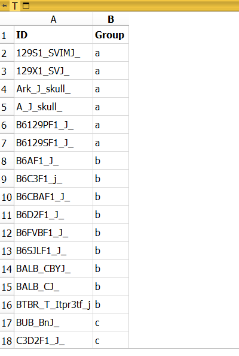

* The models selected as templates will be saved in the folder called `kmeans_selected_templates_multiGroups` in the same time-stamped folder as the extracted point clouds. 

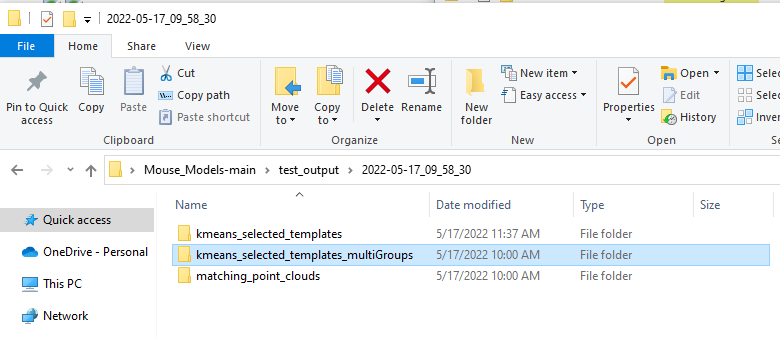

* The PC plot will also display specimens in each user-defined group in a unique color. 

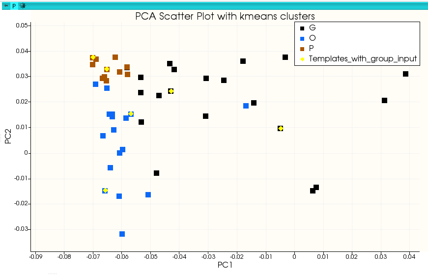

