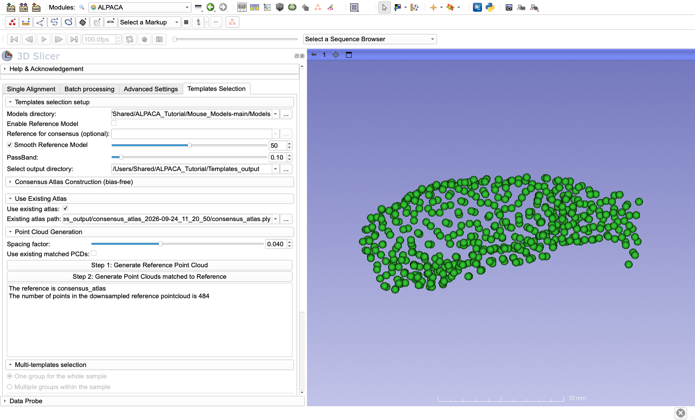
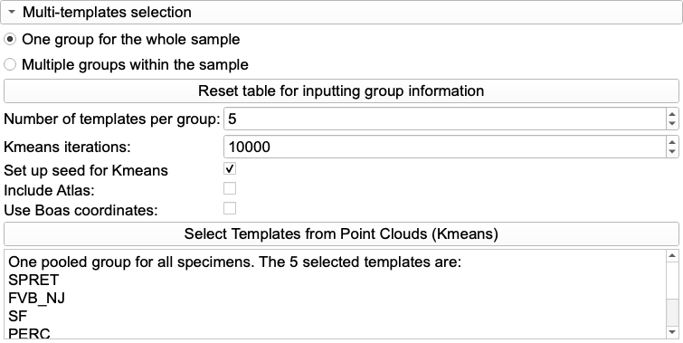
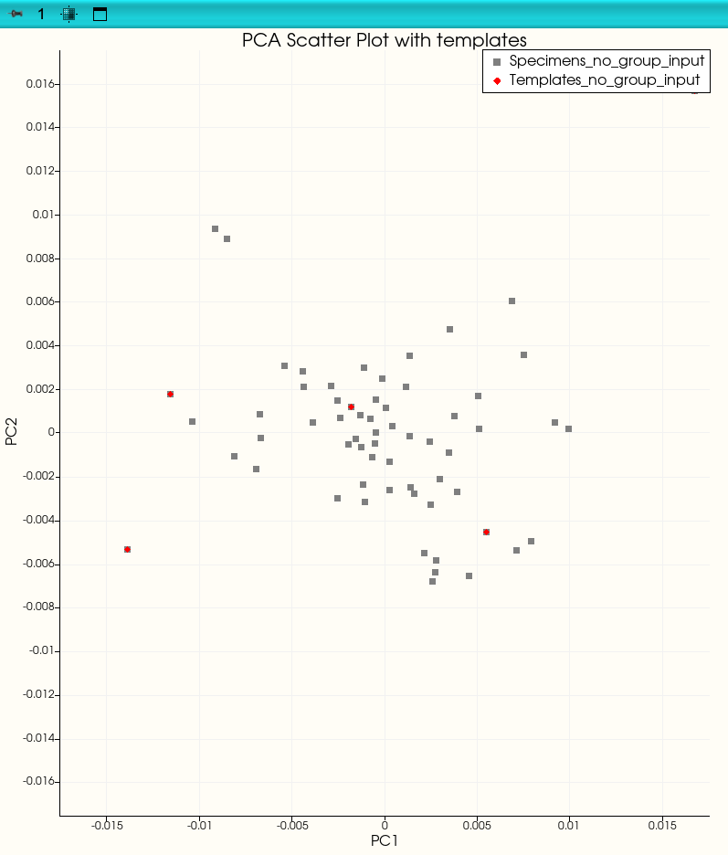
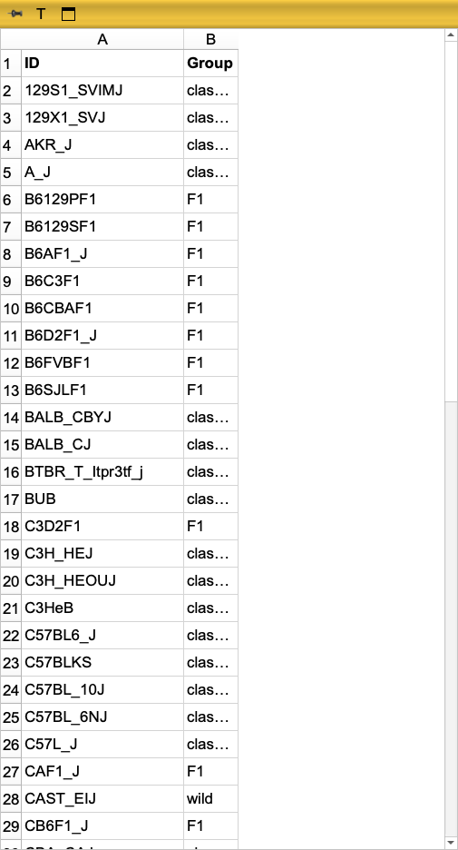
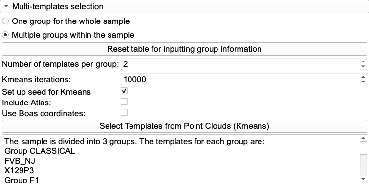
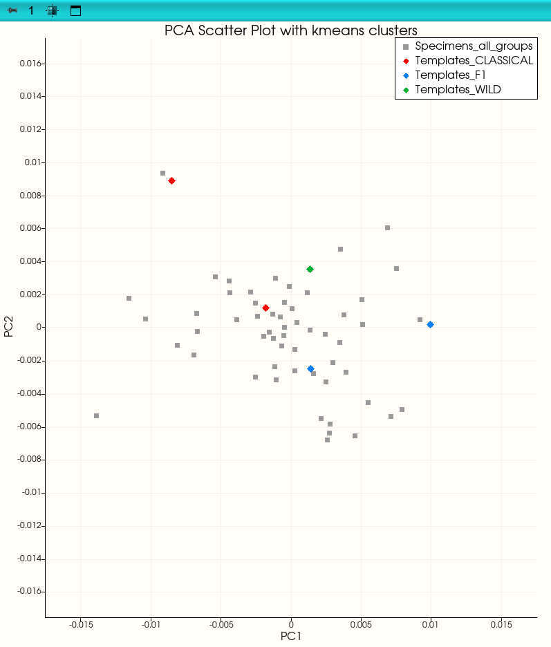
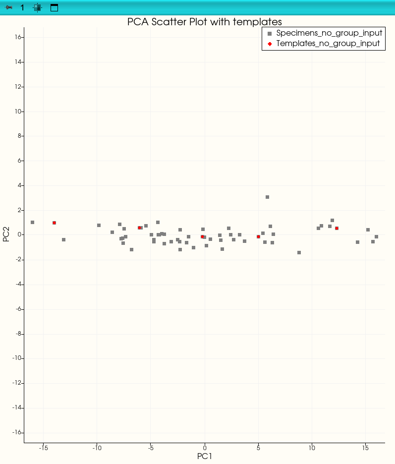

# ALPACA III: Selecting templates with K-means

## Introduction

MALPACA ([ALPACA IV](MALPACA.md)) landmarks every target with several templates and takes the median of their estimates. It works best when the templates cover the range of shapes in the sample (Zhang et al., 2022). If you do not know in advance which specimens to use, the **Templates Selection** tab picks them for you:

1. **Point clouds in correspondence.** A sparse point cloud is placed on a reference, here the consensus atlas from [ALPACA II](Consensus_atlas.md). Every specimen is aligned to the reference, and for each reference point the closest point on the specimen is taken. The result is the same number of points, in the same order, on every specimen. These are geometric *pseudo-landmarks*: they correspond by position, not by anatomy, which is enough to compare overall shape.
2. **Shape space.** The point clouds go through a Generalized Procrustes Analysis (GPA) and a PCA, as in [GPA I](../GPA_1/README.md).
3. **Clusters.** K-means clustering on all PC scores divides the sample into as many clusters as you want templates. In each cluster, the specimen closest to the cluster center becomes a template.

The reference in step 1 matters: with a single specimen as the reference, the points, the shape space and the picks all depend on which specimen it was. With the consensus atlas, the picks became much more consistent (Maga, 2026).

> **Version note.** This tutorial describes SlicerMorph from late September 2026 on ([PR #494](https://github.com/SlicerMorph/SlicerMorph/pull/494)). If **Select Templates from Point Clouds (Kmeans)** stops with an error, or there is no **Use Boas coordinates** checkbox, update SlicerMorph in the Extensions Manager. Earlier versions always selected templates in form space (the box checked, see step 4).

## What you need

- The **Mouse_Models** data ([ALPACA I](../ALPACA/README.md#get-the-sample-data)).
- The consensus atlas from [ALPACA II](Consensus_atlas.md) (`consensus_atlas.ply`). You can also run this tutorial without an atlas: the reference is then a single specimen, which brings back the bias the atlas removes.

## 1. Set up

Open **ALPACA** → **Templates Selection**. In **Templates selection setup**, set **Models directory** to the Mouse_Models `Models` folder and **Select output directory** to a folder for the results (we used the same `Templates_output` folder as in ALPACA II).

If you built the atlas in this Slicer session, it is used automatically. Otherwise, as here, open **Use Existing Atlas**, check **Use existing atlas**, and set **Existing atlas path** to `consensus_atlas.ply` in the time-stamped folder from ALPACA II. The **Consensus Atlas Construction** section collapses, since you do not need it.

## 2. Place the point cloud on the atlas (Step 1)

In **Point Cloud Generation**, set **Spacing factor** to **0.04** (the default). If you built the atlas with 0.02 in ALPACA II, the slider is still at 0.02, so change it. At 0.04 the cloud has about 500 points: enough to describe the shape of the skull, and fast to compute.

Click **Step 1: Generate Reference Point Cloud**. The cloud appears in the 3D view, and the box below reports the reference and the number of points:

On our atlas, 484 points.

## 3. Find the corresponding points on every specimen (Step 2)

Click **Step 2: Generate Point Clouds matched to Reference**. Each specimen is aligned to the atlas and the matching points are saved. For our 62 skulls this took 12 minutes.

The results go to a new time-stamped folder in the output directory, e.g. `Templates_output/2026-09-24_12_53_56/matching_point_clouds/`. It holds one `.mrk.json` file per specimen, plus `consensus_atlas_atlas.mrk.json`, the atlas's own cloud.

The box then reports how well the matching worked. A point on the specimen can be the closest point to two reference points, so a specimen can end up with fewer *unique* points than the reference. A few duplicates do not matter. The box lists any specimen that loses more than 1% of the points; if one does, check its alignment, or try a larger spacing factor. For our sample, every specimen kept all 484 points.

To repeat the selection later without redoing Steps 1 and 2, check **Use existing matched PCDs** and point to a `matching_point_clouds` folder.

## 4. Select templates for the whole sample

In **Multi-templates selection**:

- **One group for the whole sample.**
- **Number of templates per group:** 5.
- **Kmeans iterations:** keep 10000.
- **Set up seed for Kmeans:** check it. K-means starts from random cluster centers, so without a fixed seed two runs can pick different templates. The seed makes the result repeatable. It fixes the random numbers of the whole Slicer session, so restart Slicer before other work that relies on randomness.
- **Include Atlas:** leave unchecked. The atlas has no manual landmarks, so it cannot be a template, and it should not count as a specimen in the shape space.
- **Use Boas coordinates:** leave unchecked (the default, as in the GPA module). See [Shape or form?](#shape-or-form) below.

Click **Select Templates from Point Clouds (Kmeans)**. The first click takes a few seconds longer while the GPA code loads.

The five templates are listed in the box: **SPRET, PERC, SF, FVB_NJ** and **B6129PF1**. A scatter plot of the first two PCs of the point clouds replaces the 3D view. Specimens are gray squares, and the templates are red. Hover over a point to see its name.

Three of the five templates are wild-derived strains (SPRET, PERC and SF), although only 12 of the 62 strains are wild-derived. This is K-means working as intended: wild-derived mice are genetically much more diverse than the classical laboratory strains, and their skulls cover more of the shape space. SPRET (*Mus spretus*) is a different species altogether, and sits far from everything else. Templates are chosen to span the variation, not in proportion to the number of specimens.

The two PCs shown are only for a quick look. K-means uses all of them (61 here).

**Nothing is copied.** The module only names the templates. To use them in MALPACA, copy their model and landmark files into template folders ([ALPACA IV](MALPACA.md), step 1). Note the names somewhere, or copy the text from the box.

## 5. Select templates within groups

If your sample has groups known in advance (species, populations, sexes, treatments) you may want templates from each group, rather than letting the largest group decide. The 62 strains fall into three groups:

- **Classical inbred strains** (38), e.g. A_J, BALB_CJ, C57BL6_J.
- **F1 hybrids** of two classical strains (12), the names with `F1`, e.g. B6C3F1.
- **Wild-derived inbred strains** (12): CAST_EIJ, CZECHII, LEWES, MOLF, MOLG, PERC, PWD, PWK, SF, SKIVE, SPRET and WSB.

Select **Multiple groups within the sample**. A table appears with one row per matched point cloud. Type each specimen's group in the **Group** column (the names are up to you; upper and lower case count as the same group). Leave the `consensus_atlas_atlas` row empty unless **Include Atlas** is checked. **Reset table for inputting group information** clears the table.

Set **Number of templates per group** to **2** and click **Select Templates from Point Clouds (Kmeans)** again. K-means now runs separately within each group:

| Group | Templates |
|---|---|
| Classical | FVB_NJ, X129P3 |
| F1 | B6FVBF1, NZBWF1_J |
| Wild-derived | SPRET, CZECHII |

The plot shows each group's templates in their own color:

SPRET is in the top right corner, hidden under the legend.

## Shape or form?

By default, the GPA scales every point cloud to the same size, so K-means clusters on **shape** alone. With **Use Boas coordinates** checked, the GPA keeps size (Boas coordinates, as in the GPA module), and K-means clusters on shape and size together, i.e. on **form**.

The two give different templates. On our 62 skulls, 5 templates for the whole sample:

| | Templates |
|---|---|
| Shape (default) | B6129PF1, FVB_NJ, PERC, SF, SPRET |
| Form (Boas coordinates) | C57BL_6NJ, DBA_1J, LG, NZW_LACJ, PWK |

In form space the first PC explains 89% of the variance and is simply skull size. The plot from the same run with the box checked shows it: the specimens lie along one axis, and the templates are spread from small to large skulls.

 In shape space they are spread across differences in proportions, which is why the distinct wild-derived skulls are picked.

Which one to use depends on your sample. ALPACA scales the template to each target during alignment, but it still has to deform the template onto the target, and that works best when the two are similar. If size and shape both vary a lot, and size differences come with shape differences (allometry), templates that span form cover the sample well. If sizes are similar, or you care about spanning shape variation, use the default. Maga (2026) selected templates in form space.

## How many templates?

There is no fixed rule. More templates cover the sample better but cost time: MALPACA runs one full ALPACA per template and per target, so the run time grows in proportion to the number of templates. Start with a handful (we used five), check the accuracy on a few specimens with manual landmarks ([ALPACA IV](MALPACA.md), step 4), and add templates only if it helps. Use groups when you know the sample is structured and want each part represented.

## Next step

Continue with [ALPACA IV](MALPACA.md) to landmark specimens with the templates selected here.

## References

- Zhang, C., Porto, A., Rolfe, S., Kocatulum, A., and Maga, A. M. (2022). Automated landmarking via multiple templates. *PLOS ONE*, 17(12), e0278035. https://doi.org/10.1371/journal.pone.0278035
- Maga, A. M. (2026). A new reference-invariant consensus template generation method in ALPACA. *bioRxiv*. https://doi.org/10.64898/2026.05.29.728799
