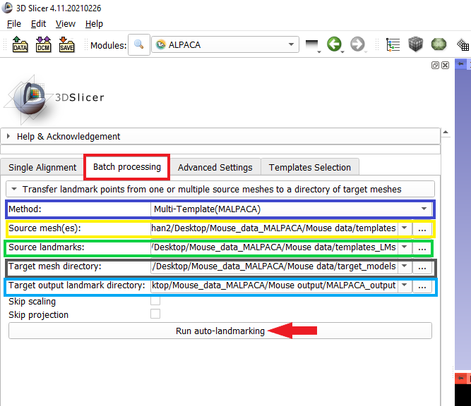
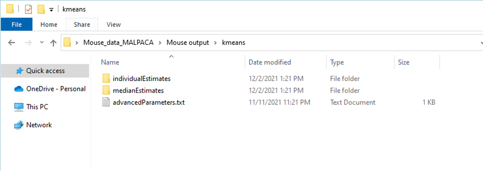
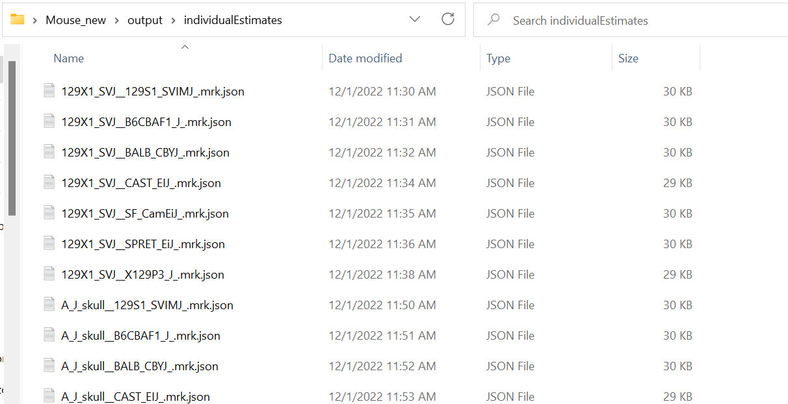
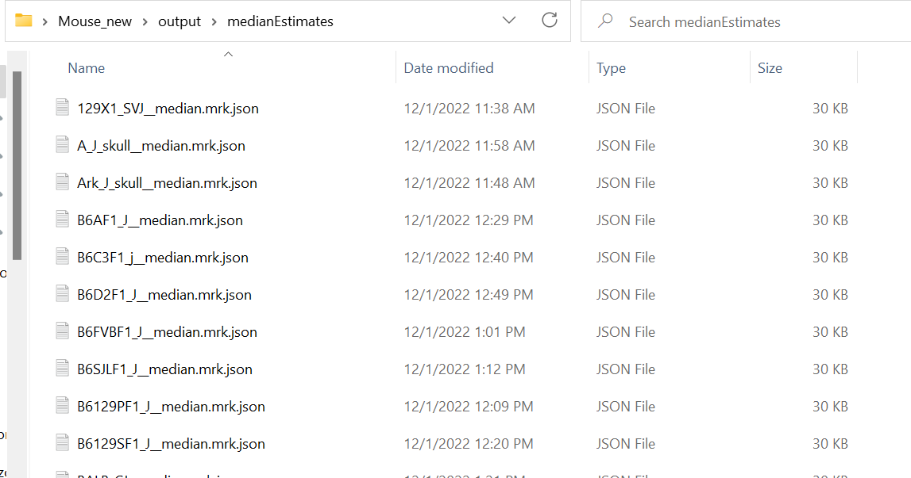

# Executing Multi-Template ALPACA (MALPACA) 
This tutorial contains instructions for executing the multi-template ALPACA (MALPACA) pipeline for automated landmarking that can accomodate large morphological disparity within a sample. The MALPACA pipeline is essentially performing multiple independent ALPACA runs, each of which based on a single template. It then calculate the median from the results of all these ALPACA runs as the final output of landmark estimates. The same parameter setting of ALPACA applies to MALPACA. For tutorials of how to run ALPACA and , please refer to: https://github.com/SlicerMorph/Tutorials/blob/main/ALPACA/README.md. 

Download sample data here: https://github.com/SlicerMorph/mouse_models. Extract the files.

### Step 1. Switch to the ALPCA module in 3D Slicer and choose the Batch Processing tab (red). 
In the `Method` entry (dark blue box in the picture below), select the `Multi-Template (MALPACA)` option from the dropdown menu.

### Step 2. Select required input and output directories (see the picture above).
* In the `Source model(s)` entry (yellow), select the folder that contains the templates (ply format). 
  * **If you are uncertain about which specimens to be used as templates, you may use the accompanied k-means multi-template selection method (see [kmeans templates selection tutorial](https://github.com/SlicerMorph/Tutorials/blob/main/MALPACA/K-means_templates_selection.md)).**
  * If you have used the K-means method to select templates, you can select the dirctory that contains the output templates. 
* In the `Source landmarks` entry (green), select the folder that contains the manual landmark files for the selected templates. The file names of the template model and landmark files must be identical. **The format of the landmark files should be either 'mrk.json' or 'fcsv'. The 'mrk.json' format is recommended.**
* In the `Target model directory` entry (dark grey), select the folder that contains the target models (ply format). These are the specimens that will be landmarked by the MALPACA pipeline.
* In the `Target output landmark directory` (light blue), select the folder for storing the MALPACA output landmark files (mrk.json format) of the target specimens.
* Optional settings
  * `Skip scaling` (blue arrow): skip scaling for the rigid registration
  * `Skip projection` (green arrow): skip projecting estimated landmarks to the surface of the target models
  * `Replication Analysis` (grey arrow): check this option to allow replicating ALPACA/MALPACA using the same setting and sample. When this option is checked, the following entry `Number of Replications` will be enables for inputing the number of replication. Each replication will be saved in a separate folder in the `Target output landmark directory`.

### Step 3. Click the `Run auto-landmarking` button (red arrow) to execute the MALPACA pipeline (see the picture above).
Slicer may appear to be in a “no response” condition. This is because the MALPACA is executing, so do not forcing closing the Slicer program.

### Step 4. See MALPACA output (see the picture below).
Open the target output landmark directory specified in Step 7 that stores the MALPACA output landmark files.
* The `advancedparameters.txt `file stores the MALPACA settings.
* The `individual estimates` folder contains landmarks estimated by each individual template stored in the mrk.json format.

* Each file name's prefix specifies the target specimen, while its postfix specifies the template that is used for landmarking this specimen. For example, the file name`129X1_SVJ_B6CBAF1` suggests that the estimated landmarks of the specimen 129X1_SVJ is derived from using the template B6CBAF1. See the picture below.

* The `medianEstimates` folder contains the final output of the MALPACA pipeline (mrk.json format). Each landmark file name has a suffix `_median`, suggesting it is the median of all the landmark estimates derived from each template.

