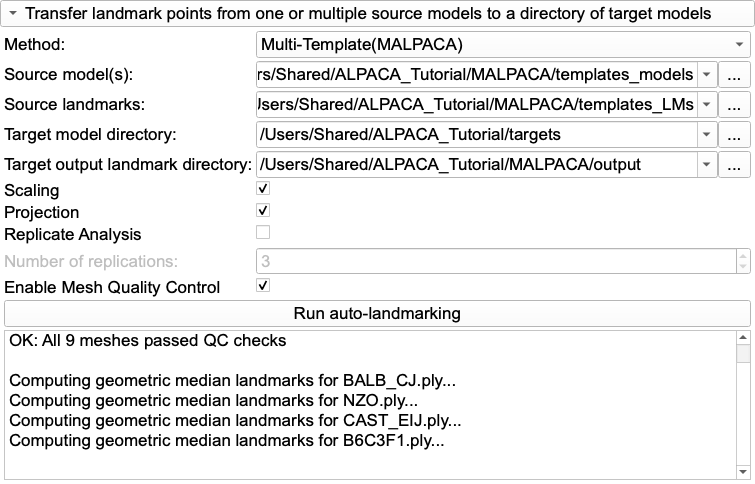
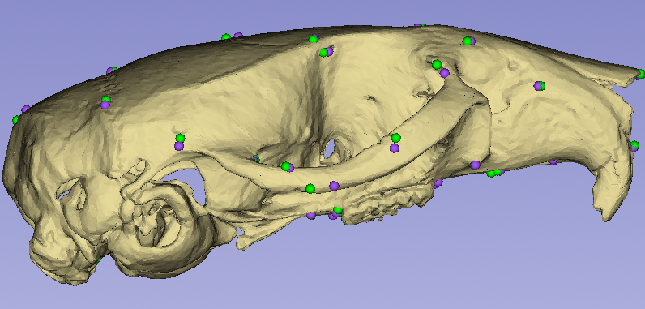

# ALPACA IV: Multi-template landmarking (MALPACA)

## Introduction

A single template works well for targets that look like it. The further a target is from the template, the more the deformable registration has to do, and the larger the landmark errors tend to be. **MALPACA** (multi-template ALPACA) runs ALPACA once per template on every target, and combines the estimates landmark by landmark, taking the **median** of each coordinate. One template that fits a target badly does not pull the median much, and with templates spread across the sample, every target has some templates that are close to it (Zhang et al., 2022).

MALPACA uses the same settings as ALPACA (the **Advanced Settings** tab), so tune them first on a single pair ([ALPACA I](../ALPACA/README.md)).

## What you need

- The **Mouse_Models** data ([ALPACA I](../ALPACA/README.md#get-the-sample-data)).
- A set of templates: specimens that have manual landmarks. We use the five selected for the whole sample in [ALPACA III](K-means_templates_selection.md): **SPRET, PERC, SF, FVB_NJ** and **B6129PF1**. If you already know which specimens to use, for example one from each group in your study, you can skip ALPACA II and III.
- The `targets` folder from [ALPACA I](../ALPACA/README.md#part-2-batch-processing-with-one-template), with four skulls: B6C3F1, BALB_CJ, CAST_EIJ and NZO. None of them is a template. All of them have manual landmarks, which lets us measure the error.

## 1. Put the templates in folders

MALPACA takes two folders: one with the template models, one with their landmarks. Make two new folders (we called them `templates_models` and `templates_LMs`) and copy into them:

| `templates_models` | `templates_LMs` |
|---|---|
| `SPRET.ply` | `SPRET.mrk.json` |
| `PERC.ply` | `PERC.mrk.json` |
| `SF.ply` | `SF.mrk.json` |
| `FVB_NJ.ply` | `FVB_NJ.mrk.json` |
| `B6129PF1.ply` | `B6129PF1.mrk.json` |

from `Mouse_Models-main/Models` and `Mouse_Models-main/LMs`.

The two folders must match exactly: every model needs a landmark file with the same name (only the extension differs), and there must be nothing else in them. Do not point **Source landmarks** at the full `LMs` folder. MALPACA checks this before it starts and lists any file without a partner.

## 2. Set up the batch

On the **Batch processing** tab:

1. **Method:** `Multi-Template(MALPACA)`. The two source fields now ask for folders instead of files, and are cleared.
2. **Source model(s):** the `templates_models` folder.
3. **Source landmarks:** the `templates_LMs` folder.
4. **Target model directory:** the `targets` folder.
5. **Target output landmark directory:** an empty folder for the results.
6. Leave **Scaling**, **Projection** and **Enable Mesh Quality Control** checked.

## 3. Run

Click **Run auto-landmarking**. The mesh check runs first (`OK: All 9 meshes passed QC checks`: 5 templates and 4 targets). Then every target is landmarked with every template. The box reports each target as it is finished:

That is 20 ALPACA runs here, and it took 43 minutes, about 11 minutes per target. The time grows with the number of templates times the number of targets, so estimate it from a small test before you start a large run.

If a run is interrupted, start it again with the same folders. Targets that already have a median file are skipped.

## 4. The output

The output folder contains:

- `individualEstimates/`: one file per target and template, named `<target>_<template>.mrk.json`, e.g. `NZO_SPRET.mrk.json`, the NZO landmarks estimated from the SPRET template. Twenty files here.
- `medianEstimates/`: the final estimates, two per target:
  - `<target>_median.mrk.json`: the median of the template estimates, coordinate by coordinate. **This is the MALPACA result.**
  - `<target>_geomedian.mrk.json`: the geometric median, the point with the smallest total distance to the template estimates, per landmark. It is even less affected by a single far-off estimate. (In current versions of SlicerMorph the geometric median is not computed correctly, and this file is a copy of the median. Computed correctly, it agreed with the median within 0.005 mm in this example.)
- `advancedParameters.txt`: the templates, targets and every setting used.

The landmark files are ordinary `.mrk.json` files: drag them into Slicer to view them, or analyze them in the [GPA module](../GPA_1/README.md).

## 5. Is it better than one template?

All four targets have manual landmarks, so we can measure each estimate's error: the RMSE between the estimated and the manual landmarks, in mm (as in [ALPACA I](../ALPACA/README.md), step 6). The first column is the single-template run from ALPACA I (A/J as the template). The next five are the individual MALPACA templates, read from `individualEstimates`. The last is the MALPACA median.

| Target | A/J alone | SPRET | PERC | SF | FVB_NJ | B6129PF1 | **MALPACA median** |
|---|---|---|---|---|---|---|---|
| B6C3F1 | 0.26 | 0.43 | 0.44 | 0.45 | 0.23 | 0.23 | **0.19** |
| BALB_CJ | 0.36 | 0.44 | 0.50 | 0.49 | 0.25 | 0.24 | **0.23** |
| CAST_EIJ | 0.35 | 0.32 | 0.38 | 0.46 | 0.33 | 0.31 | **0.26** |
| NZO | 0.35 | 0.42 | 0.45 | 0.54 | 0.34 | 0.34 | **0.28** |

Three things to notice:

- **The median is better than every single template, for every target.** It is also better than the best template for that target, which you would not know in advance without manual landmarks.
- **Single templates vary a lot.** The three wild-derived templates (SPRET, PERC, SF) are the least accurate for these four targets, all laboratory or F1 mice except CAST_EIJ. Yet including them did not hurt: a median is little affected by estimates that disagree with the majority, and for CAST_EIJ, a wild-derived target, SPRET was the second-best single template.
- **The largest remaining errors are at a few landmarks**, mainly landmark 47 (0.70–0.97 mm in three targets). A landmark that is hard for every template will stay hard. Check such landmarks by hand.

Here are the MALPACA median (purple) and the manual landmarks (green) on NZO, the target with the largest error:

This is a small example: four targets, with the error measured against one person's landmarks. For a real study, landmark a few specimens by hand that were not used as templates, and compare, as here, before you run MALPACA on the whole sample.

## Troubleshooting

**"Source Files Mismatch".** The template model and landmark folders do not match. The message lists the models without landmarks and the landmarks without models. Every model needs a landmark file with the same name, e.g. `SPRET.ply` and `SPRET.mrk.json`; names are case-sensitive on some systems.

**Mesh QC fails.** A model is empty, has invalid (NaN or infinite) coordinates, or does not load. Re-export it from its source, or remove it from the folder. You can turn the check off, but then a bad mesh can stop the batch partway.

**Slicer does not respond during the run.** That is expected; do not close it. Watch the output folder fill up instead.

## References

- Zhang, C., Porto, A., Rolfe, S., Kocatulum, A., and Maga, A. M. (2022). Automated landmarking via multiple templates. *PLOS ONE*, 17(12), e0278035. https://doi.org/10.1371/journal.pone.0278035
- Porto, A., Rolfe, S., and Maga, A. M. (2021). ALPACA: A fast and accurate computer vision approach for automated landmarking of three-dimensional biological structures. *Methods in Ecology and Evolution*, 12(11), 2129–2144. https://doi.org/10.1111/2041-210X.13689
