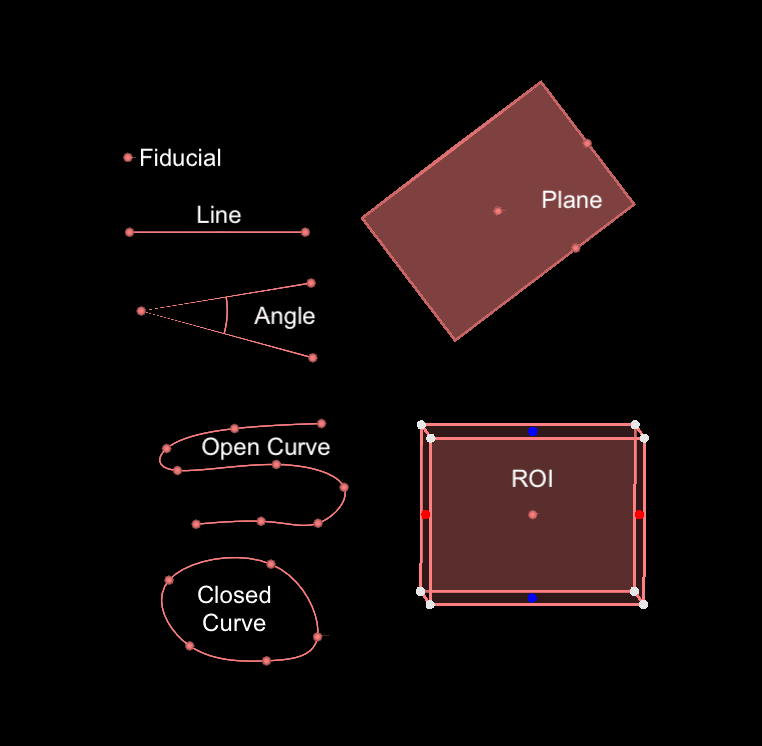
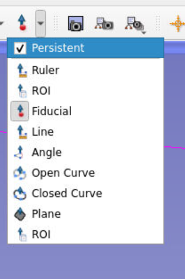
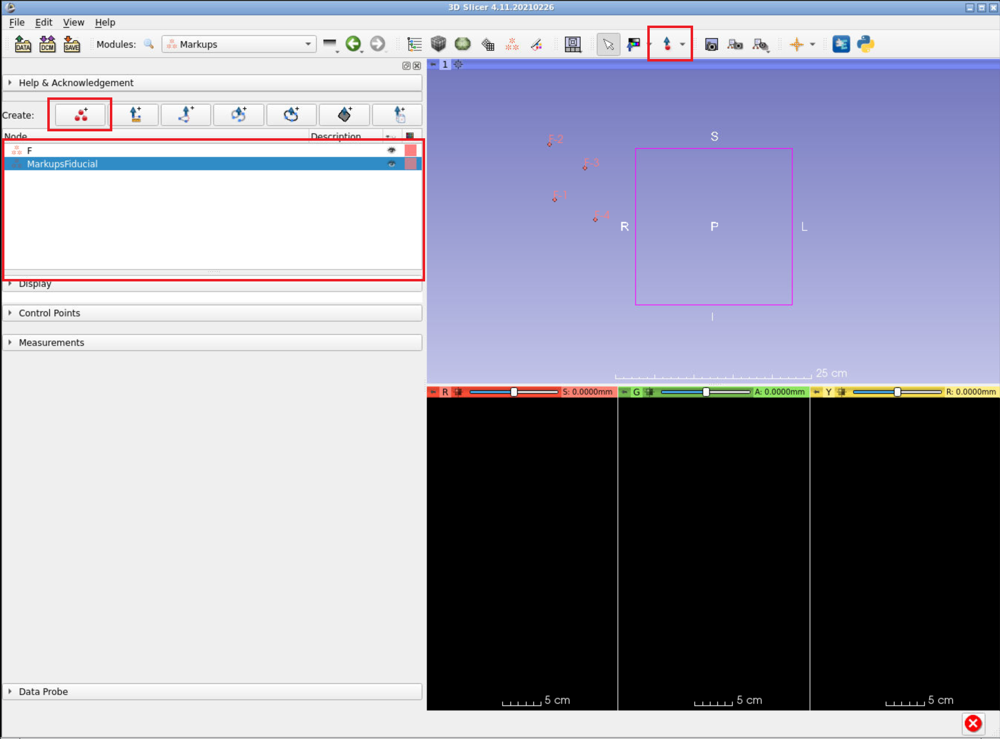
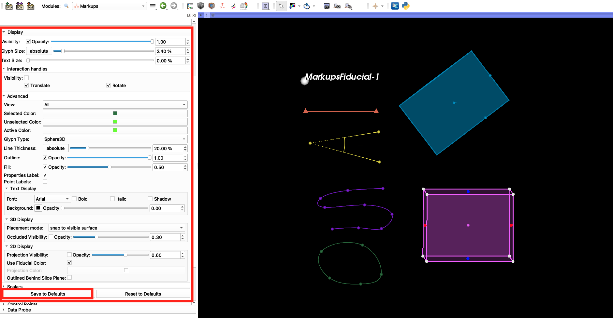
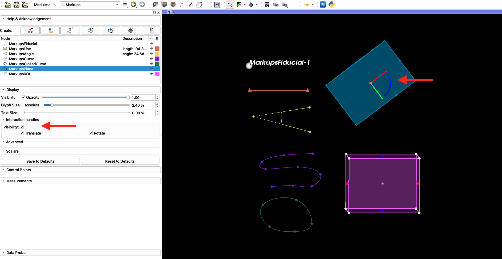
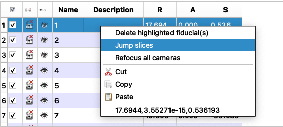
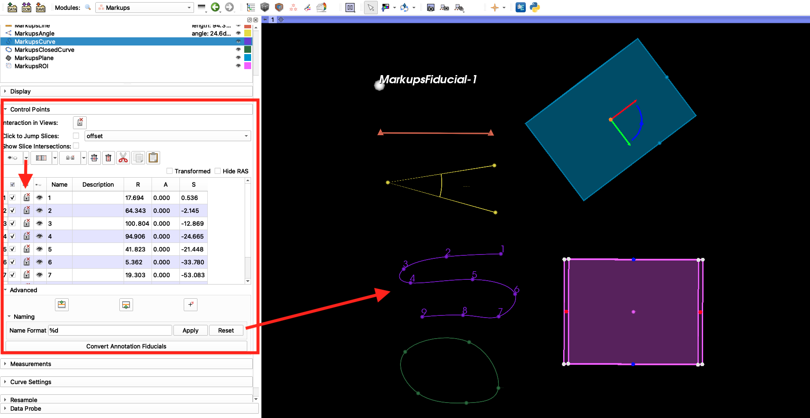
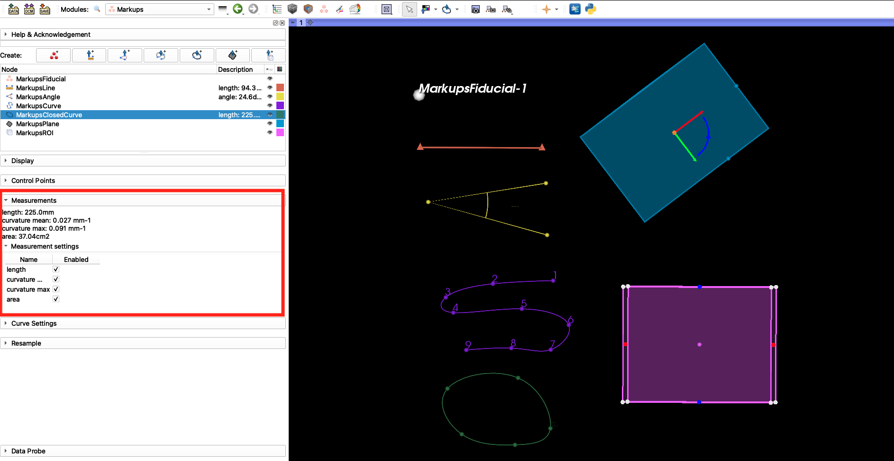

# Introduction to the Markups module
The Markups module is used to create and edit markups and adjust their display properties. This tutorial defines the different markup types, explains how to place and organize markups, adjust display properties, and view measurements. 

-----

### Markup types

**Fiducials:**
Place a single landmark point.

**Lines:**
Sequentially place two points, creating a line between them.

**ROI:**
Place two points sequentially that specify corners of a rectangular cube defining the region of interest. The size and shape of the rectangle can be adjusted after placement.

**Angles:**
Place three points sequentially. This forms two vectors where the second point placed is the vertex. The angle beween the two vectors is displayed.

**Open and closed curves:**
Sequentially place points. A curve will be fit to the points and updated as additional points are added. If the closed curve is selected, the first and last points placed will be connected. 
* By default, curve fitting is done using Spline function. Other alternatives are: Linear, Polynomial, or Shortest-distance on a surface. Curve Type function can be adjusted under **Curve Settings** section of the `Markups` module.  

**Planes:**
Click two points to define a line, for the 3rd point move perpendicular to the line defined by the line and you should see a rectangular plane appearing. 

-----

### Markup placement
  * Slicer has three mouse modes: Translate/Rotate, Adjust Window/Level, and Place. 
  * The icons in the mouse mode toolbar at the top of the main GUI allow to switch between these modes.
  
 
  * Translate/Rotate mode (white arrow icon) is the default interaction mode. This mode allows interaction with loaded data (pan, zoom, rotate)
  * Adjust Window/Level mode (multicolored box icon) controls the Window/Level for the volume in slice views (red/green/yellow or axial, coronal, sagittal). 
  * Place mode (red circle with blue arrow icon) allows to place one object then switches modes back to Transform mode. Fiducial is the default object. 
    * Place mode can be made persistent by clicking the checkbox in the mouse mode toolbar.
  
  
  * If there is no active Markup node, one will be created with the first placement. Curve points and fiducials will be added to the active Markup node, if one exists.

----

### Organizing your Markups
Markups can be accessed and manipulated using the `Markups` module. 

* New markups can be created using the buttons in the **Create** menu, at the top of the `Markups` module. 
  * **Note** that the placement icon in the mouse controls on the top bar creates a new markups node if there is no markup node in the scene or the selected markup node is not matching to the placement type. 
 * If you want to add new points to an existing node, select the node from list in the `Markups` module, and use placement icon. 
 * If you want to create a new set of landmarks, you can create a new Markup node using the buttons in the **Create** menu  
 * Creating a new markups node changes the mouse mode automatically to placement mode for that node type. 
 * In practice, you should create markup nodes for different sets (e.g., Skull_LMs, Mandible_LMs, etc). Any set of landmarks that you will analyze indepedently should have its own MarkupFiducial node.
 

----

### Display 

* In the **Display** menu (click the arrow to expand this section), you can set the visibility, opacity, glyph and text size of a markup node. Depending on the markup type, you can also change the line color, thickness, font type, 2D and 3D display properties.
* Once you find an optimal settings for our screen resolution and sample size, you can hit the **Save to Defaults** button, and Slicer would remember these settings in your future sessions. You can click to **Reset to Defaults** to go back to the Slicer's default size. Expand and explore the **Advanced** tab for additional options. 

* If you want to translate (move) or rotate the entire node (all control points together), you can use **Interaction handles** setting from **Display** menu by enabling the **Visible** checkbox. 3 orthogonal vectors (the directions depends on the configuration of the markup node in space) and rotation arcs appear in 3D and 2D views at the center of your control points. Using the vectors, you can translate the node (all points); and using the arcs, you can rotate the node. Rotation may not be sensitive enough if interaction handles are too small. The size of the interaction handles is controlled by the Glyph Size option of the Markups node. Interaction handles are especially useful for Planes: you can "move" a plane without changing its normal vector.

----

### Control Points

* In the **Control Points** menu, use the table to adjust visibility, labels, and position of individual fiducials points. Because there is no undo for markups actions, when you are actively landmarking, we suggest setting the lock icon so that you don't accidentally grab an already placed LM and modify it.
* You can copy/paste/delete control points across fiducial nodes by highlighting the rows (use ctrl to select multiple rows), as if in a regular spreadsheet.
* You can right click and use **Click to Jump Slicess** option to see where the fiducial is in slice views. This is a very useful feature, if you are landmarking directly on the 3D volume (e.g., a CT scan) as oppose to a 3D model. 

* The **Advanced** section of the **Control Points** menu allows you to move highlighted control points up or down in the list. You will find this feature useful when you miss a landmark in the sequence, and place it later.  
  * The **Name Format** field allows you to modify the fiducial labels in bulk. Current convention of %N-%d means that landmarks are named by the node name (e.g., MarkupsFiducial) followed by the (-) sign and the number indicating the sequence they are landmarked. If you want a shorted label, you can just switch to %d and hit apply to rename the existing ones. The subsequent fiducials will follow this format.

----

### Measurements

* In the **Measurements** menu, you can calculate different statistics for different markup nodes. One of the useful statistics is the length of open/closed curves and area of a plane or a closed curve. 

----

## Links to Learn More: 
* [Markups documentation from 3D Slicer](https://slicer.readthedocs.io/en/latest/user_guide/modules/markups.html)
