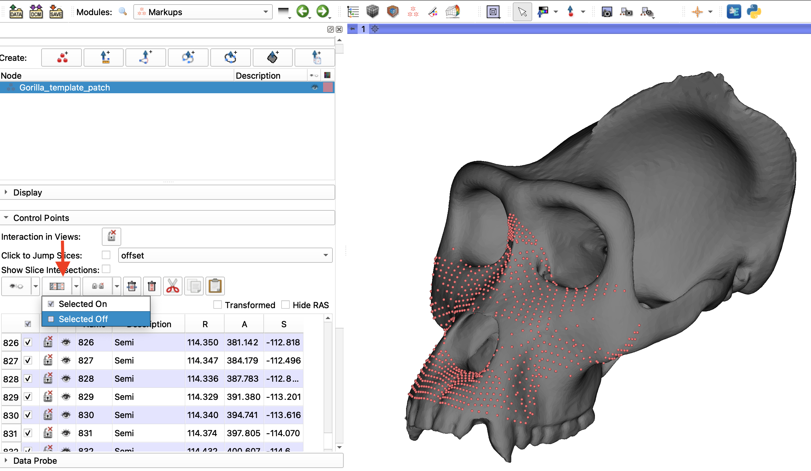
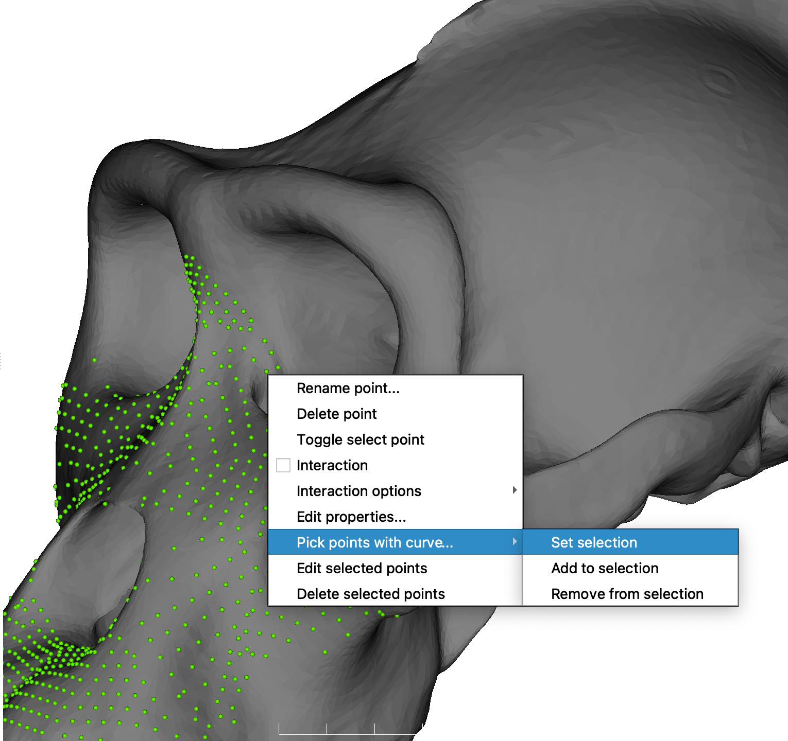
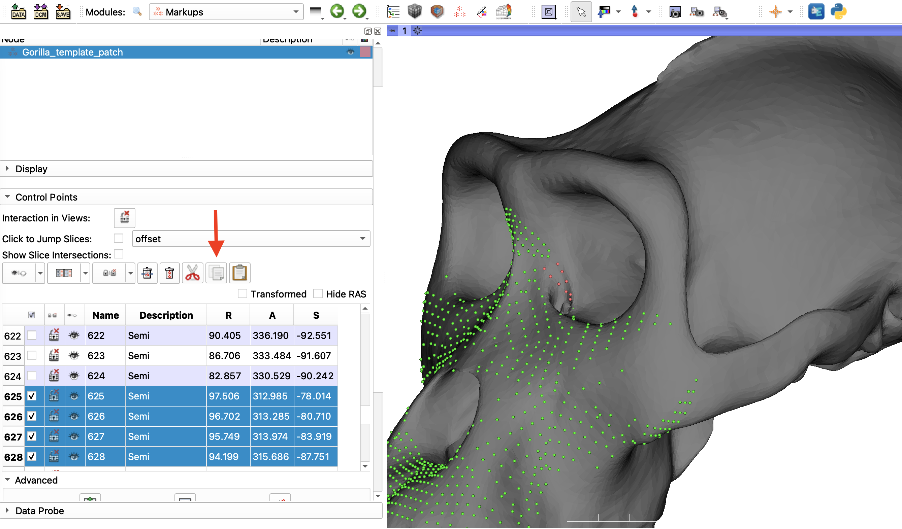
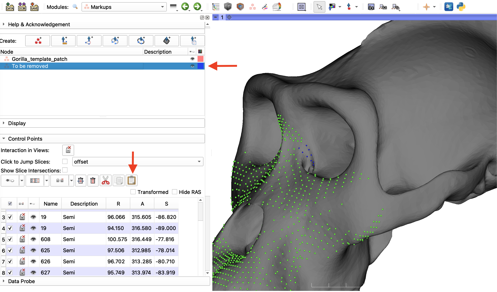

# MarkupEditor
This tutorial explains how to edit a set of landmarks using the right-click context menu when you hover over a fiducial in the 3D viewer and right-click on it. This is a SlicerMorph specific function and in this example we are using the Gorilla Skull Reference Model from the SlicerMorph tab of the `Sample Data` module and editing the semi-landmark patches created in the [Patch-based landmarking tutorial](https://github.com/SlicerMorph/Tutorials/tree/main/Patch-based%20landmarking). 

This function is particularly useful for: 
   * Editing semi-landmarks and pseudo-landmarks generated using tools such as the `CreateSemiLMPatches` and `PseudoLMGenerator`
   * Subsetting a set of landmarks for integration and/ or modularity analyses

----

1. After loading your mesh and points into the scene, go to the `Markups` module, click on the markups node you want to modify and click the arrow to make the **Control Points** menu visable and make sure all the points are unselected using the *select points* button. 

2. Hover over to one of the points you like to remove and right-click to bring the context menu and choose **Pick Points with a curve -> Set Selection** options. And outline the patch of landmarks you want to remove using the provided curve tool.

3. See that selected points have changed color (You may want to review the Markup modules display option to see how colors are decided). Again hover over with your mouse to one of the selected points, right-click and choose **Edit Selected Points**. Then go to `Markups` module and expand the control points. If you scroll down on the list, you will see a number of rows highlighted in blue and they have a checkmark next to them (selected state). We can now copy/paste/delete these individual points. For this exercise click the copy button.

4. Now scroll to the top the `Markups` module and create a blank fiducial node and rename it to something like **To_be_removed** and set it is color to something distinct. While making sure this is the active fiducial node, go down to control points (which should be blank), and hit the paste button and see that the LMs we selected in step 2 are now in their own list. 

