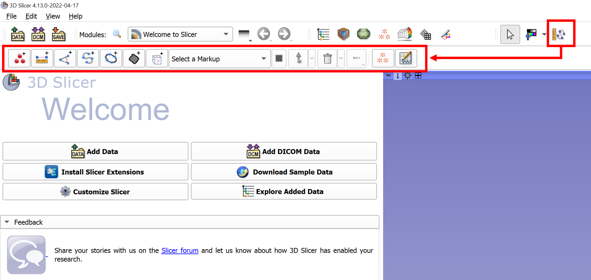
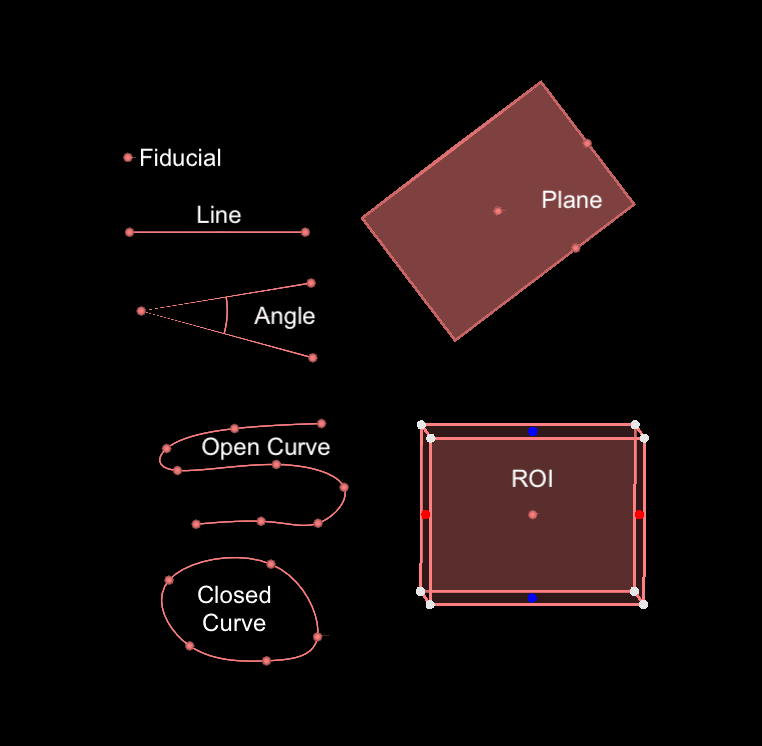
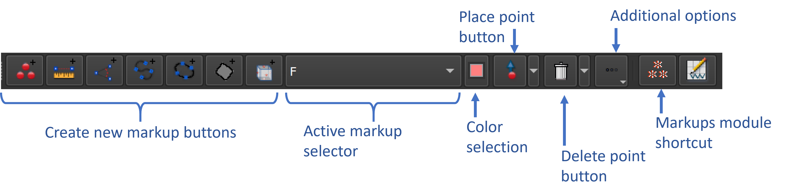
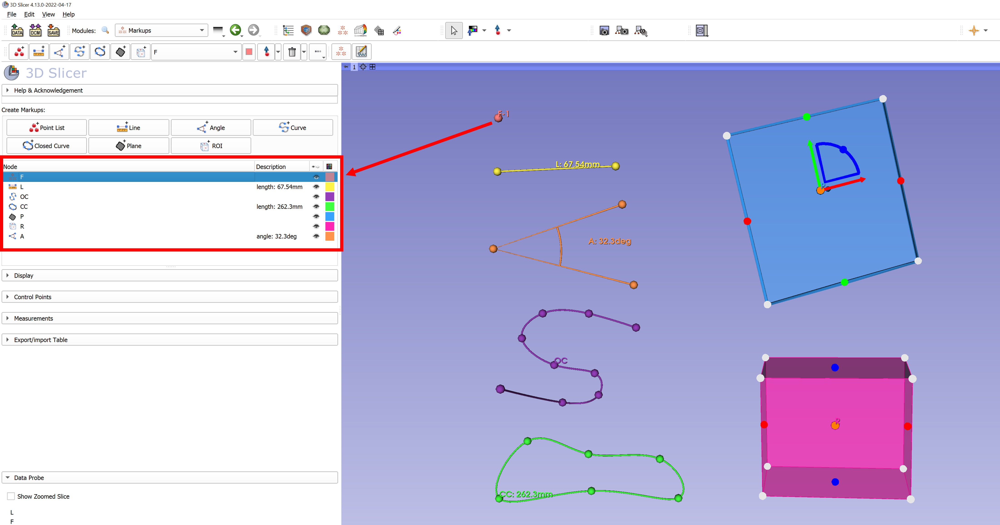
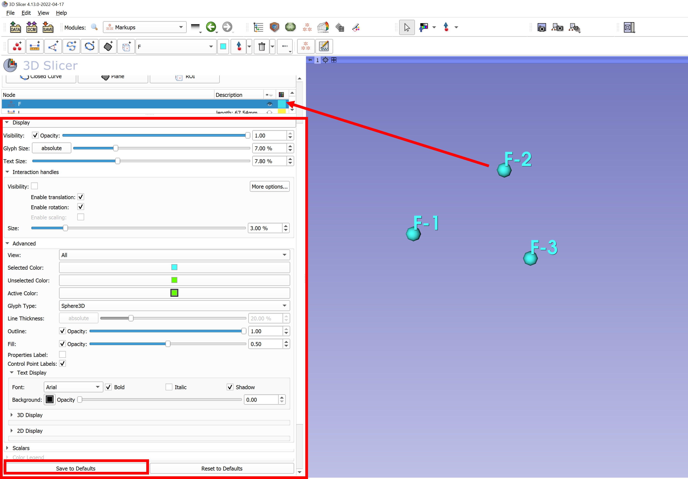
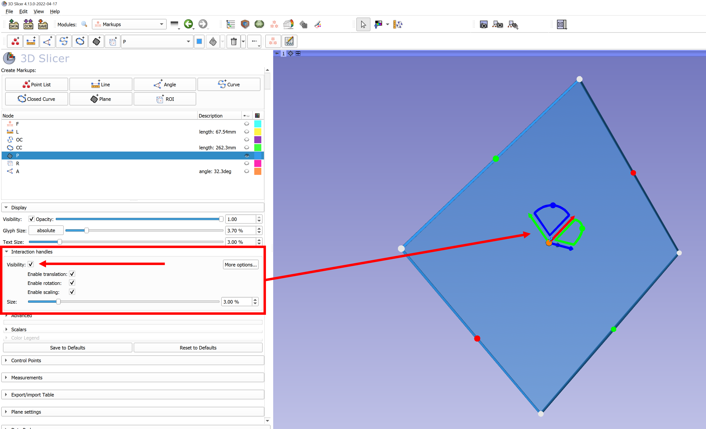
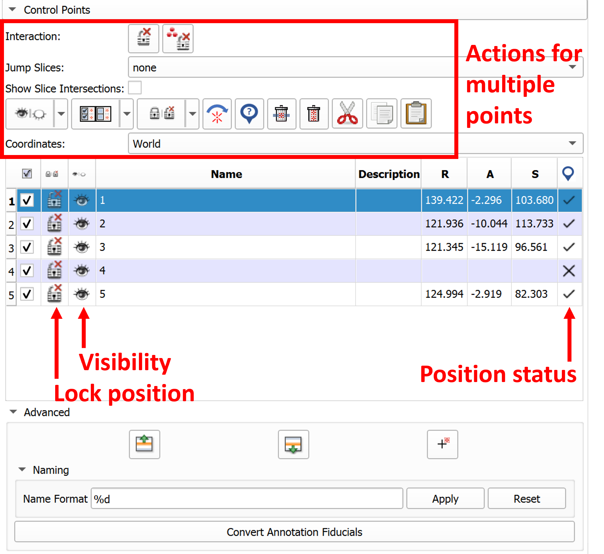
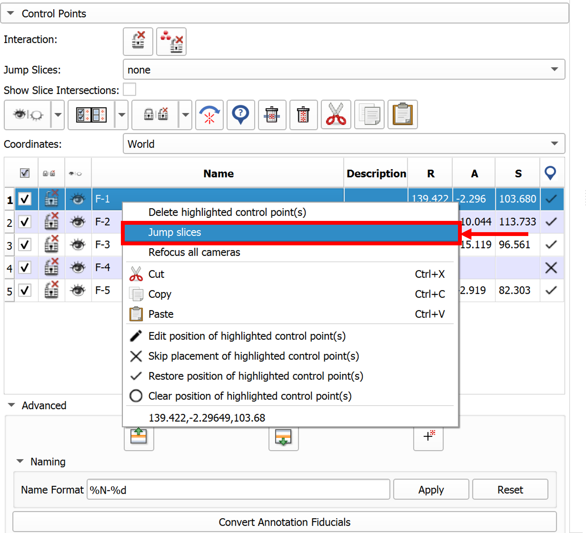
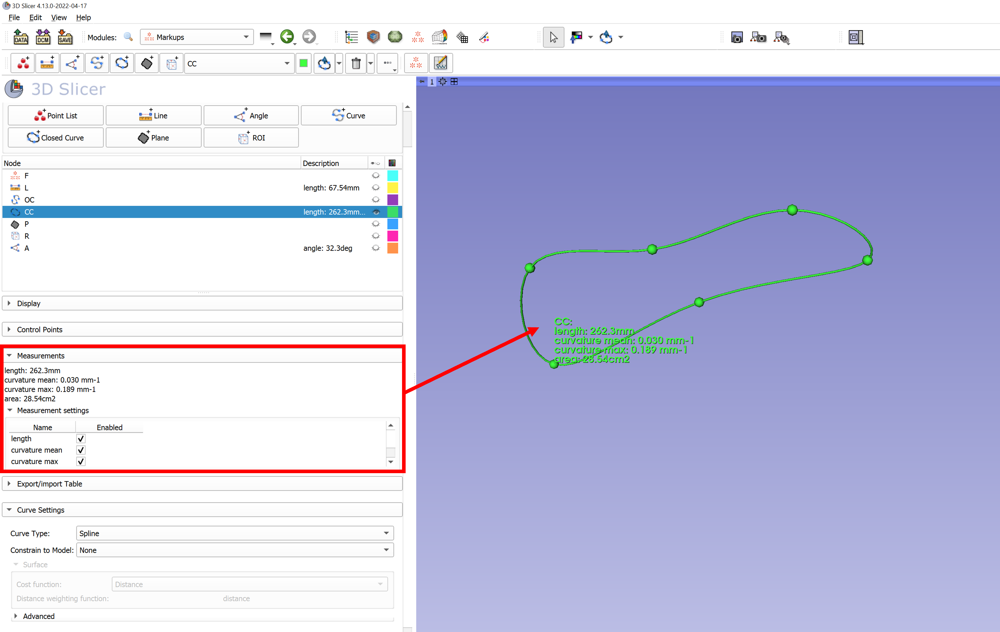

# Introduction to the Markups module
The Markups module is used to create and edit markups and adjust their display properties. This tutorial defines the different markup types, explains how to place and organize markups, adjust display properties, and view measurements. 

-----
### Displaying the Markups Toolbar
Markups can be interacted with through the `Markups module` or the `Markups Toolbar`, which provides convenient access to add and edit markups while any module is open. To display the Markups Toolbar, click the **Toggle Markups Toolbar** button in the upper menu bar. A menu with markups actions will be displayed, and can be moved to a convenient location. We recomment that this toolbar is moved to a new menu bar below, so all the interaction options can be seen.

### Markup types
Currently, there are seven types of markups available in the Slicer application, listed below. For additional details on each see the [Markups module documentation](https://slicer.readthedocs.io/en/latest/user_guide/modules/markups.html). 

**Point list:**
A container that can contain multiple control points.

**Line:**
Two points, placed sequentially, creating a line between them. 

**Angle:**
Three points, placed sequentially, forming two vectors where the second point placed is the vertex. The angle beween the two vectors is displayed.

**Open curve:**
A curve fit to sequentially placed points that is updated as additional points are added. 
* By default, curve fitting is done using Spline function. Other alternatives are: Linear, Polynomial, or Shortest-distance on a surface. Curve Type function can be adjusted under **Curve Settings** section of the `Markups` module.  

**Closed curve:**
Similar to an open curve, except the first and last points placed will be connected. 

**Plane:**
Click a point to place the  origin of the plane. Alt + Left-click will allow the placement of two points, where the second point defines the normal vector. The method used to place the plane (point normal, plane fit, three points) can be selected under the **Plane settings** menu of the `Markups` module.  

**ROI:**
Place two points sequentially that specify corners of a rectangular cube defining the region of interest. The size and shape of the rectangle can be adjusted after placement.

### Markup placement and editing with the `Markups Toolbar`
* The first set of buttons in the `Markups Toolbar` create a new markup for each type currently available. When one of these buttons is clicked, the new markup will displayed in the **Active Markup Selector** and the point placement mouse mode will be initiated. 
* For markups that allow multiple points, additional points can be placed by clicking the **Place point** button. Point placement mode can be made persistant by enabling the **Place multiple control points** option in the dropdown menu under the **Point placement button**. 
* To add new points to an existing markup, select it from list in the **Active Markup Selector** and click the **Place point** button to enter the placement mouse mode.
* Points can be removed by clicking the **Delete point** button which removes the last point placed, or with the **Delete all points** option in the dropdown menu under the **Delete point** button.

### Organizing your markups in the `Markups Module`
Markups can also be accessed and manipulated using the `Markups` module. 

* New markups can be created using the buttons in the **Create** menu, at the top of the `Markups` module. 
* To add new points to an existing node, select the node from list in the `Markups` module, and use the **Place point** button. 
* In practice, you should create markup nodes for different sets (e.g., Skull_LMs, Mandible_LMs, etc). Any set of landmarks that you will analyze indepedently should have its own Point List  node.

 

### Display options in the `Markups Module`

* In the **Display** menu (click the arrow to expand this section), you can set the visibility, opacity, glyph and text size of a markup node. Depending on the markup type, you can also change the line color, thickness, font type, 2D and 3D display properties.
* Once you find an optimal settings for our screen resolution and sample size, you can hit the **Save to Defaults** button, and Slicer would remember these settings in your future sessions. You can click to **Reset to Defaults** to go back to the Slicer's default size. Expand and explore the **Advanced** tab for additional options. 

* If you want to translate (move) or rotate the entire node (all control points together), you can use **Interaction handles** setting from **Display** menu by enabling the **Visible** checkbox. 3 orthogonal vectors (the directions depends on the configuration of the markup node in space) and rotation arcs appear in 3D and 2D views at the center of your control points. Using the vectors, you can translate the node (all points); and using the arcs, you can rotate the node. Rotation may not be sensitive enough if interaction handles are too small. The size of the interaction handles is controlled by the Glyph Size option of the Markups node. Interaction handles are especially useful for Planes: you can "move" a plane without changing its normal vector.

### The Control Points menu

* In the **Control Points** menu there is a menu with buttons to operate on all/highlighted subsets of points and a table to adjust visibility, labels, and position of the control points individually.

* Because there is no undo for markups actions, when you are actively landmarking, we suggest setting the lock icon so that you don't accidentally grab an already placed LM and modify it.
* You can copy/paste/delete control points across point lists by highlighting the rows (use ctrl to select multiple rows), as if in a regular spreadsheet.
* The status of the position can be in the following states: Placed, Unset, Skipped, and Edit. The position status of an individual point can be toggled in the control points table or in the right-click context menu. Additional information on these position states is covered in the Markups Template tutorial.
* You can right click and use **Click to Jump Slicess** option to see where the control point is in slice views. This is a very useful feature, if you are landmarking directly on the 3D volume (e.g., a CT scan) as oppose to a 3D model. 

* The **Advanced** section of the **Control Points** menu allows you to move highlighted control points up or down in the list, or add a new uninitialized control point to the list. You will find this feature useful when you miss a landmark in the sequence, and place it later.  
* The **Name Format** field allows you to modify the control point labels in bulk. Current convention of %N-%d means that landmarks are named by the node name (e.g., MarkupsFiducial) followed by the (-) sign and the number indicating the sequence they are landmarked. If you want a shorted label, you can just switch to %d and hit apply to rename the existing ones. The subsequent control points will follow this format.

### Measurements

* In the **Measurements** menu, you can calculate different statistics for different markup nodes. One of the useful statistics is the length of open/closed curves and area of a plane or a closed curve. 

## Links to Learn More: 
* [Markups documentation from 3D Slicer](https://slicer.readthedocs.io/en/latest/user_guide/modules/markups.html)
* [Resampling curves for semiLMs tutorial](https://github.com/SlicerMorph/Tutorials/tree/main/Markups_2)
* [Creating Landmark Templates tutorial](https://github.com/SlicerMorph/Tutorials/tree/main/Markups_3)
