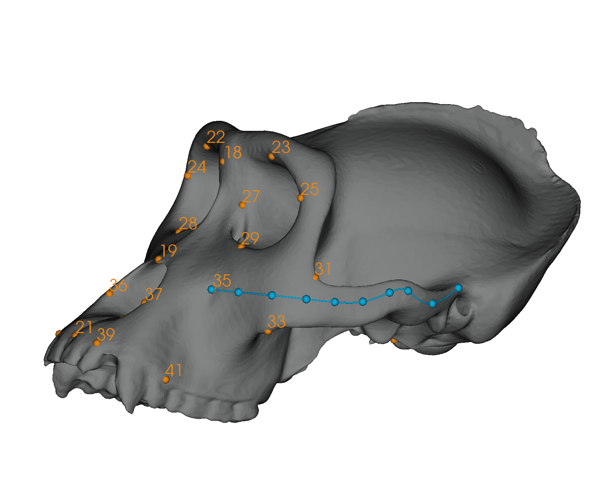
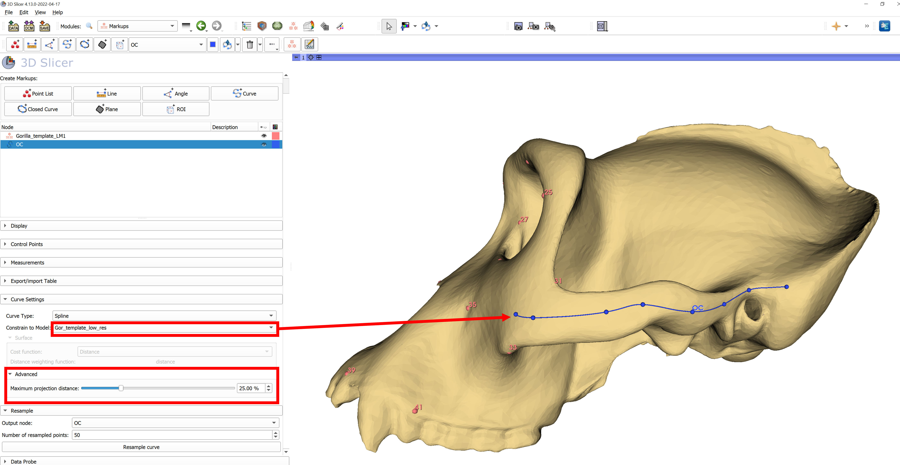
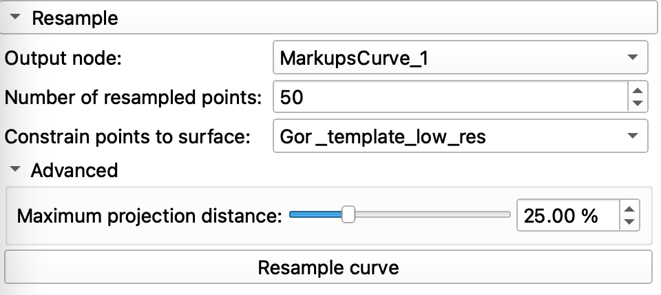
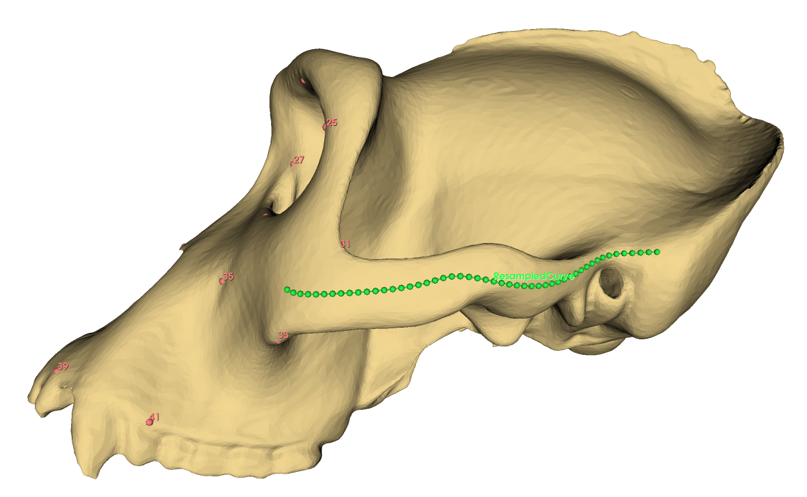
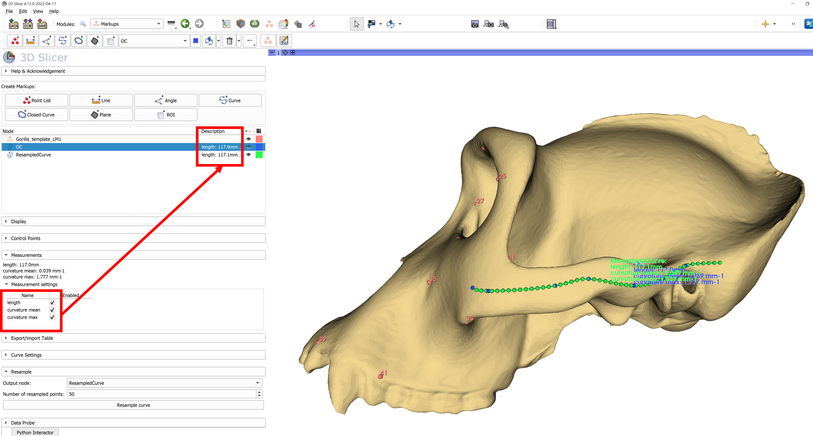

## Resampling Curves
This tutorial explains how to resample a curve using the `Markups` module. In this tutorial we use the Gorilla Skull Reference Model from the SlicerMorph tab of the `Sample Data` module (you will need the SlicerMorph extention installed to see this option in the menu).

----

### Resampling a curve on the surface of a model to create Semi-Landmarks

1. Create a new open curve on the surface of your mesh (blue points and cuve in the example below) using the `Markups` module. 
  * Note that the control points are snapped to the mesh, but the curve itself may lie above or below the mesh surface. 

2. In `Markups` module, select the open curve node that you just created and expand the **Curve Settings** Menu.
  * Select the loaded model, **Gor_template_low_res** from the **Constrain to Model** dropdown selector.
  * The curve should now appear along the surface of the model. If it has been projected to an interior or exterior surface, expand the **Advanced** menu and adjust the **Maximum projection distance** slider. This will change the maximum distance that the point is allowed to move from it's original position. 
 
 
3. Expand the **Resample** Menu. 
  * Select *Create a new markups curve* from the Output node dropdown menu to create a new curve that will contain the resampled points.
  * The new, empty curve created will now be the active curve, so reselect the original (blue) curve in the node viewer to proceed with resampling.
  * Choose the number of resampled points (in this example we use 50). 

4. Click the **Resample curve** button to generate a new open curve with 50 points constrained to the mesh surface. This results in a curve that is closer to the actual surface curvature than the original. 

5. Check the lengths of new curve and the original curve using **Measurements** menu.

## Links to Learn More: 
* [Markups documentation from 3D Slicer](https://slicer.readthedocs.io/en/latest/user_guide/modules/markups.html)
* [Introduction to landmarks tutorial](https://github.com/SlicerMorph/Tutorials/tree/main/Markups_1)
* [Creating landmark templates tutorial](https://github.com/SlicerMorph/Tutorials/tree/main/Markups_3)
