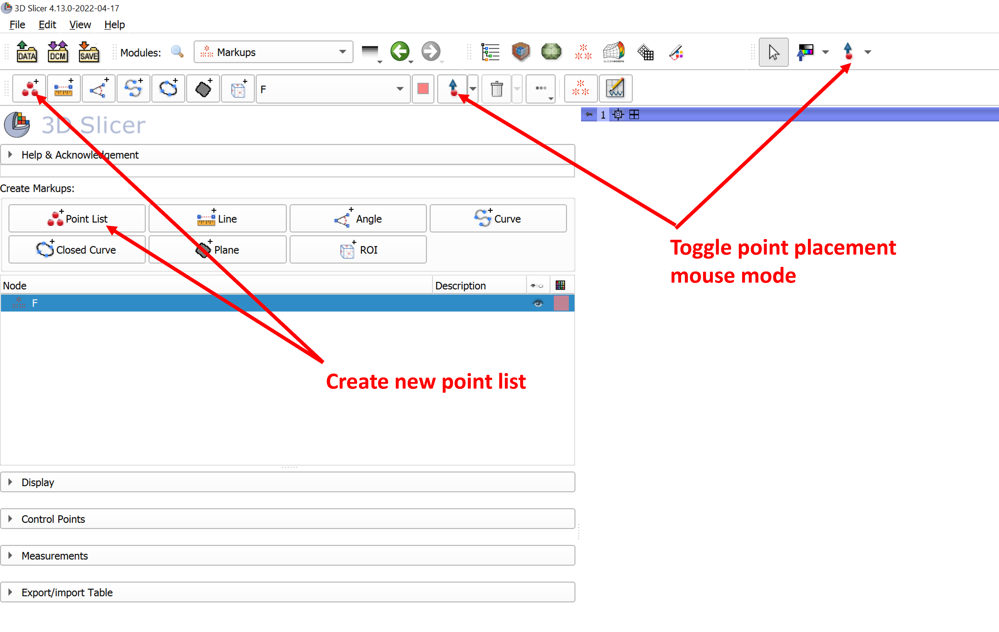
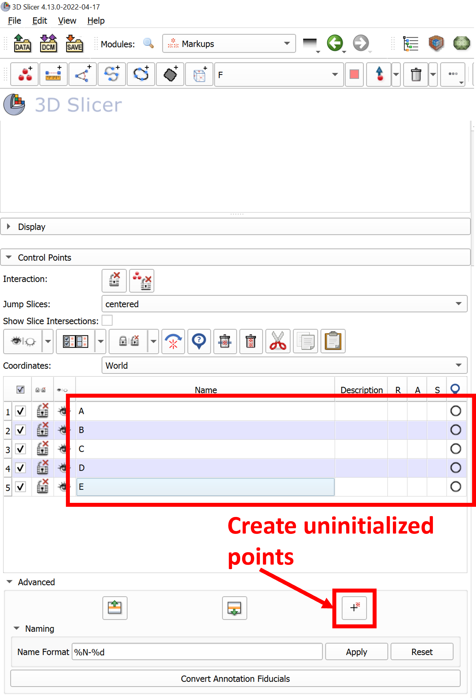
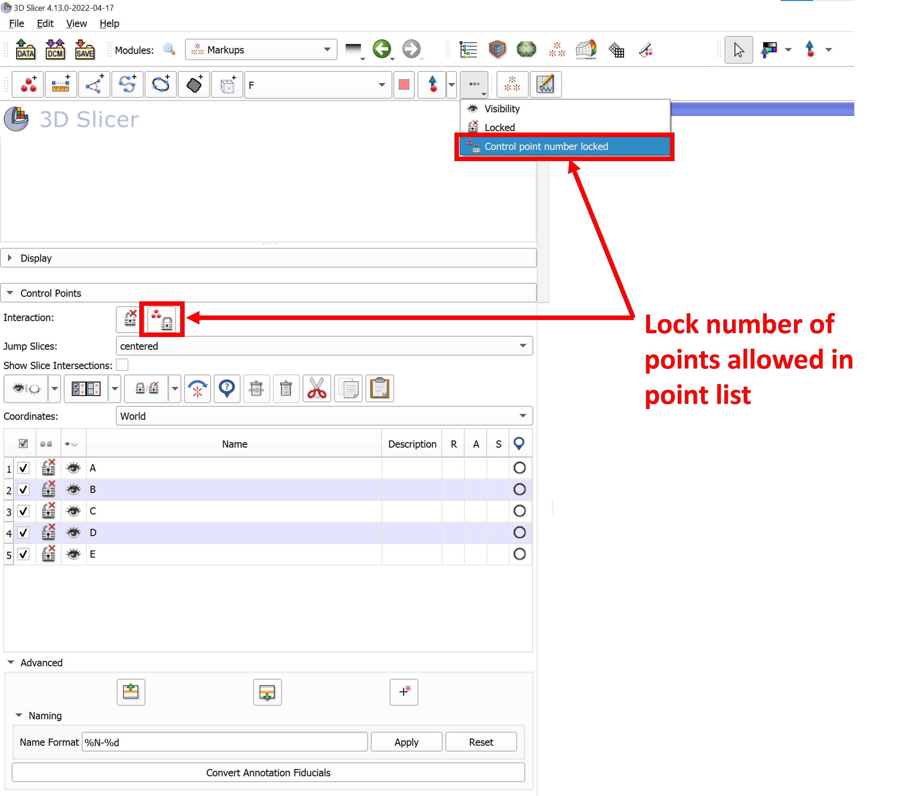
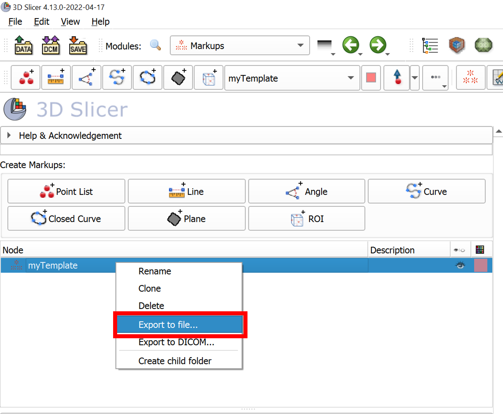
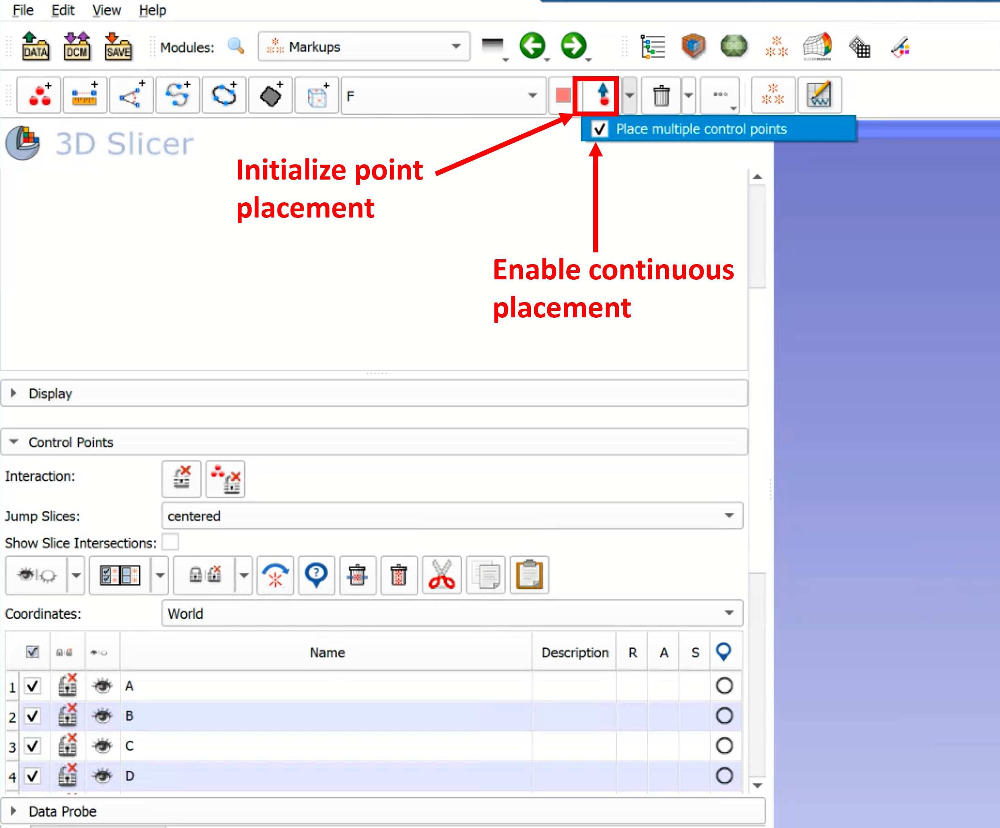

## Resampling Curves
This tutorial explains how to create and use a template for landmarking using the `Markups` module. 

----

### Resampling a curve on the surface of a model to create Semi Landmarks

1. Create a new point list markup using the **Crate new point list** button in the `Markups` toolbar or module. Note that point placement will be initiated but you can exit by right-clicking the mouse or toggling the **Place point** button in the  `Markups` toolbar.

2. In `Markups` module, select the point list just created and expand the **Control Points** Menu.
  * Expand the **Advanced Menu**
  * Click the **Add new control point** to add 5 points. These points will have positions that are uninitialized, so they will not appear in any view, have no position listed in the **Control Points** table, and have a position status displayed as an open circle to indicate that the position is not set.
  * Rename the points A, B, C, D, and E.
 
 
3. To finalize the number of points in the template, we would like to lock the number of points allowed in the list. This will prevent additional, unnamed points from being added accidentally when the landmark template is being used. In the **Control Points** menu, click the **Lock point number** button. This action can also be done from the `Markups` toolbar, under the **More options** drop down menu.

4. There are a few ways to save the point list template. The most direct way when working in the `Markups` module is to right-click the node name in the `Markups` node viewer and selecting **Export to file**. In this example, we have renamed the point list node to **myTemplate**.

The **Export to file** dialog box brings up options to choose the file name, location, and filetype.

5. Clear the scene and import the newly created template file. 
  * Check that the template node is the active markup (selected in the `Markups` module or toolbar) and click the **Place point** button in the `Markups` toolbar to begin placing points. 
  * To stay in placement mode and place all five points sequentially, expand the **Place point** dropdown menu and enable **Place multiple control points**.
  * Note that when all five points have been placed, point placement mode will end automatically and no more points can be added to the list.
  * The point list with defined points can now be saved with a new filename following the method in step 4.

