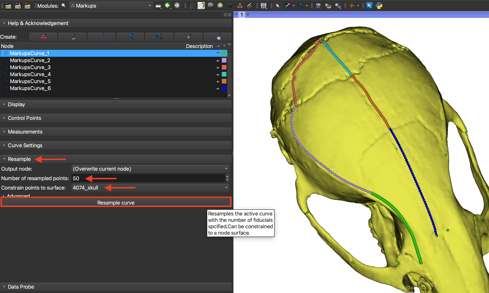
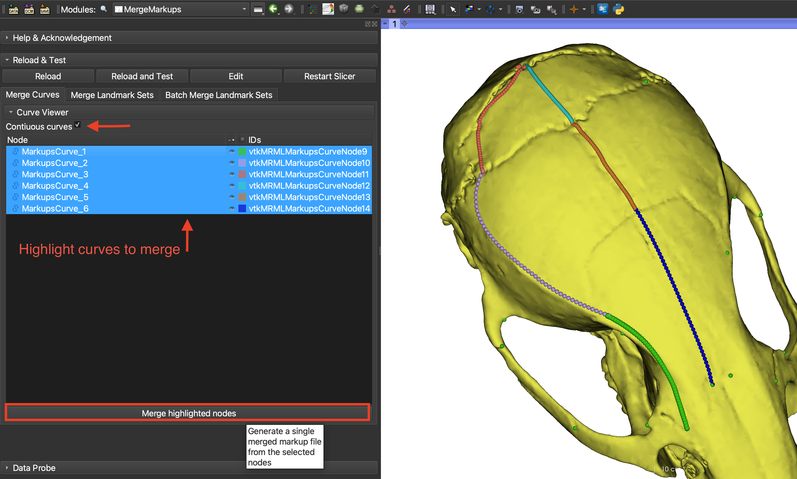
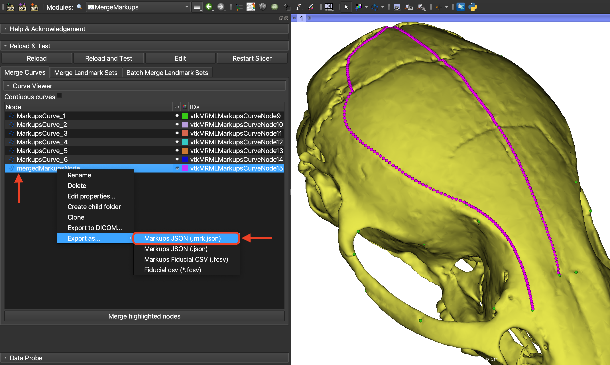
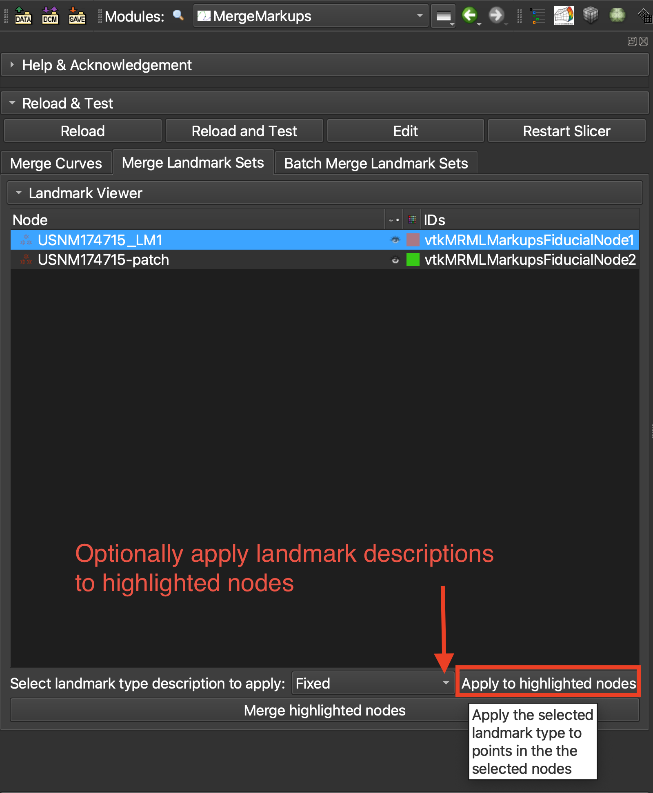
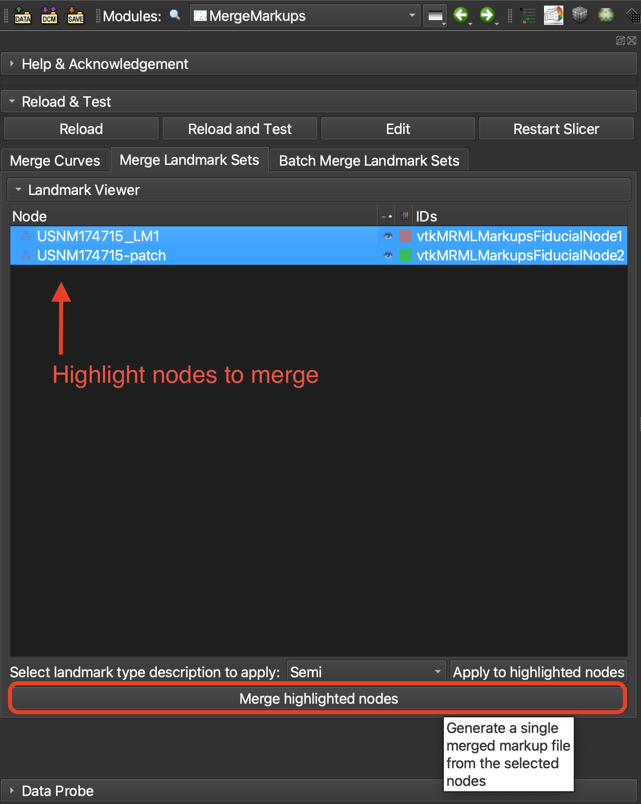
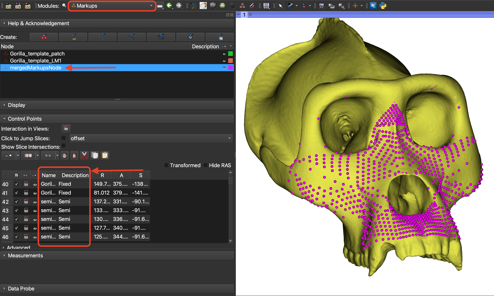
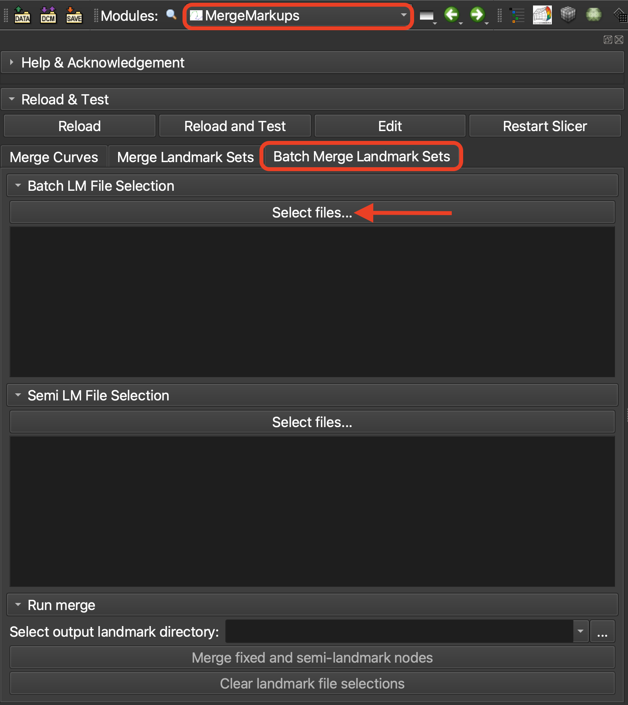
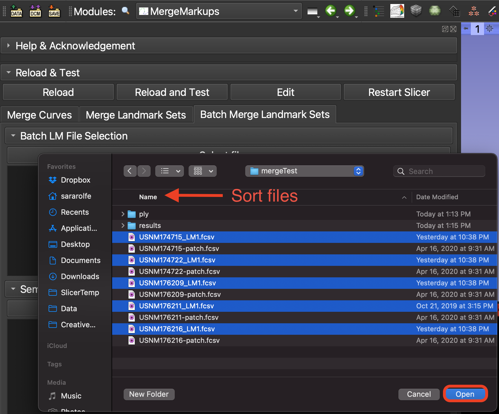
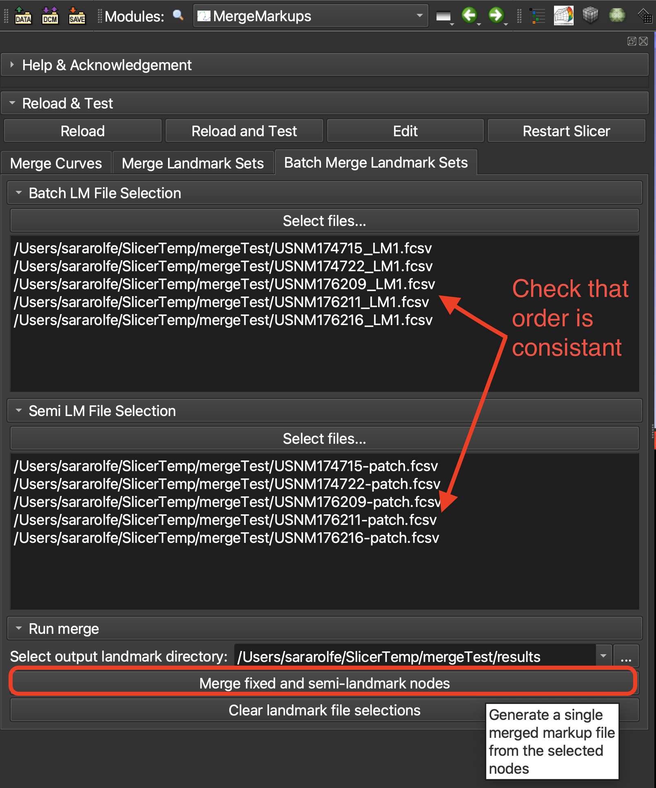

# MergeMarkups
This is a SlicerMorph specific utility to merge open curve or fiducial landmark nodes. It can be used to combine landmark nodes containing fixed landmarks semi-landmarks aquired separately for statistical analysis. The `MergeMarups` module supports three workflows which will be demonstrated in this tutorial: merging curves in the scene, merging landmark nodes in the scene, and batch merging a folder of landmark files.

## Merging multiple open curves in the scene
Curves can be used to sample an image surface with semi-landmark points by placing a curve along a region (often between two fixed landmark points) and resampling with specified number of equidistant samples. When multiple curves are placed on a specimen, the final, resampled curves can be merged into a single markup node for export and further analysis. To demonstrate how to use the `MergeMarkups` module to merge a series of curves, we will first generate a series of curves between landmark points on a sample model. 

1. Download the *Mouse Skull Reference Model* data from the `Sample Data` module. As described in the `Markups` module tutorial, place curves on the surface of the mouse skull model between landmark points and resample each curve with an equal number of points.

   

2. Now that we have a set of curves with dense, equidistant sampling, we will merge them into a single node that can be exported for further analysis. Switch to the `MergeMarkups` module and check that the *Merge Curves* tab is selected. In the curves node viewer, you will see the open curves that we created. Select the checkbox labeled *Continuous curves* to indicate that the curves we placed are continuous, and include overlapping points. This option will remove the redundant points from the final merged set (the first point of each connecting curve will be deleted). If you need to change the order of the curves from how they were created, you can drap and drop the nodes into the correct position in the node viewer. Highlight the curves you would like to merge and click the *Merge highlighted curves* button.

   

3. You will see a new curve displayed in the node viewer, named *mergedMarkupsNode* containing the final merged curve. This curve node can be exported from the `Save` dialog or through the right-click `Export as...` menu.

   
	
## Merging landmark nodes in the scene
SlicerMorph provides many methods of placing fixed landmarks and generating semi or pseudo-landmarks. The `MergeMarkups` is used to merge different types of points collected from a specimen into a single markups node. The landmark type is notated in the output to faciliate analysis by methods which distinguish between fixed and semi-landmark points. To demonstrate the merge landmarks function of the `MergeMarkups` module, we will merge manual landmark set collected from a gorilla skull with a semi-landmark set generated using the `CreateSemiLMPatches` module.

1. Download the *Gorilla Skull Reference Model* and the *Gorilla Semi-landmark Patch Landmarks* data from the `SampleData` module.

2. Switch to the `MergeMarkups` module select the *Merge Landmarks* tab. In the node viewer, you will see the two landmark files loaded. When the files are merged, the landmark description that designates points as *Fixed* or *Semi* landmark type will be propigated to the merged node. If the nodes have no landmark type descriptions, they optionally be added in this module. To add a description label to each landmark in one or more nodes, highlight those nodes in the viewer window. Select the landmark description to apply from the dropdown menu and select *Apply to hightlighted nodes*. In this example apply the *Fixed* landmark label to the fixed landmark node and the *Semi* landmark label to the patch semi-landmark node.

   

3. To merge the nodes, highlight them in the landmark node viewer and select *Merge highlighted nodes*

   

4. Switch to the `Markups` module to view the output node, named *mergedMarkupsNode*. Expand the *Control Points* menu to see the full landmark set with the landmark type descriptions. Note that the landmark names and landmark type descriptions have been transferred from the original nodes.

 
## Merging multiple landmark nodes from file (batch mode)
When working with a large number of samples, loading and merging landmark nodes in the scene can be time consuming. For faster processing, a batch method for merging fixed and semi-landmarks is provided in the third tab of the `MergeMarkups` module. This workflow assumes each subject has one fixed landmark file and one semi-landmark file that will be merged and saved in an output file. If landmark type descriptions are provided in the fixed and landmark files these will be propagated to the merged node. If no descriptions are specified, they will be added based on the load file viewer that the node has been assigned to. In this tutorial, we will merge manually placed landmarks from a set of gorilla skulls with semi-landmarks automatically generated using the the `CreateSemiLMPatches` module.

1. In the `MergeMarkups` module, select the third tab, *Batch Merge*. Under the *Fixed LM Selection* menu, click the *Select files...* button to choose the fixed landmark files that will be merged. 

   

2. In the pop-up browser, browse to the location where you downloaded the *Gorilla Patch Semi-Landmarks* folder from the `SampleData` module in the previous exercise. Select the folder *Sample batch* and highlight the the fixed landmark files. In this example, the fixed and patch semi-landmarks are located in the same folder. The fixed landmark files are named with the subject number and end with *_LM*. The order the fixed files are selected in must correspond to the order of the semi-landmark files that will be selected in the following step. In this excercise, use the file browser options to sort the files by name to ensure consistant selection.

   
	
3. Under the *Select LM File Selection* menu, click the *Select Files...* button to choose the semi-landmark files. Browse to the same folder and check that the files are sorted by name. Highlight and load the semi-landmark files, which have filenames ending with *_patch*. Confirm that the subject number and order in the fixed and semi-landmark file selection viewers is identical. These viewers are editable, so if there is a file listed out of order this can be corrected manually. If the landmark file lists are correct, click the *Merge fixed and semi-landmark nodes* button to create and save a merged landmark file for each subject. To confirm the output was generated correctly, browse to the output folder location and load one of the merged files into 3D Slicer.

   
