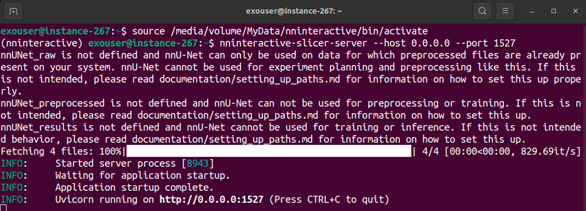
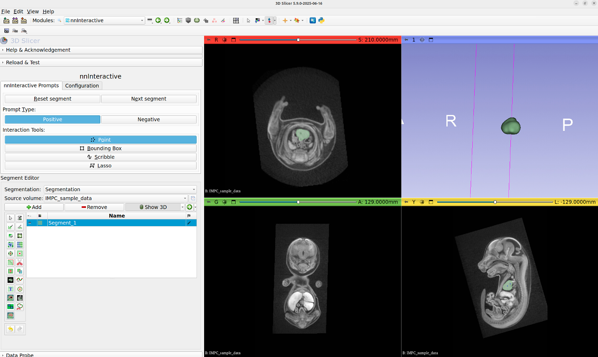

# Setting & Using NNInteractive extension on the MorphoCloud instances
nnInteractive is a deep learning-based framework for interactive segmentation of 3D images, allowing for fast voxel-wise segmentation using prompts like points, scribbles, bounding boxes, and lasso. It is a very useful and effective tool for rapid 3D segmentation with few clicks. It is a little different from the typical Slicer extensions, because it is a client and server application. While Slicer installation on the MOrphoCloud instances come with SlicerNNInteractive, that's only the **client**; you still have to install and then run the server each time you are planning to use NNInteractive. 

The official repository and most up-to-date instructions on how to install NNInteractive can be found at https://github.com/coendevente/SlicerNNInteractive/blob/main/README.md. This guide covers specific steps specific known to work with on MorphoCloud.

## Installing the server and running it.
There are multiple ways of running the server. On MorphoCloud we suggest you use the []**pip install** option as documented in the official documentation](https://github.com/coendevente/SlicerNNInteractive?tab=readme-ov-file#option-2-using-pip). 

1. Open a terminal window 
2. To create a python virtual environment specific to NNinteractive copy and paste this command to the terminal window (one-time only)
```
python3 -m venv /media/volume/MyData/nninteractive
```
3. To activate this python virtual enviroment copy and paste this command to the terminal window (everytime you want to run the server)
```
source /media/volume/MyData/nninteractive/bin/activate
```
4. To install the NNinteractive server copy and paste this command to the terminal window (one-time only)
```
pip install nninteractive-slicer-server
```
5. To start the NNinteractive server copy and paste this command to the terminal window (everytime you want to run the server)
```
nninteractive-slicer-server --host 0.0.0.0 --port 1527
```

When you complete these steps your server should be running with this output on the terminal window:



As shown in the screenshot, the server is now successfully running and will continue to run unless you hit CTRL+C (quit), close the terminal window, or your instance shelves. Also, once you completed these steps, to run the server next time (e.g., after an unshelving) you need to open the terminal window, and copy and paste the commands in steps 3 and 5 only. 

## Configuring the NNInteractive Slicer Extension
NNInteractive extension comes automatically installed with the Slicer installation in the MorphoCloud instances. However, if any reason you cannot find the NNInteractive module (CTRL+F then search for NNInteractive), you can always use the Extension Manager (CTRL+4) mechanism to reinstall it. 

Before you can use the nnInteractive, make sure you started the server following the steps above. Also you need to configure the server address in the nnInteractive extension (this is usually a one-time setting). To do that, click on the `Configuration` tab and type this as the server URL field: `http://0.0.0.0:1527`

Now, NNInteractive extension should be ready to be used. 

## Using nnInteractive Extension
We will be using low-resolution diceCT scan of a mouse embryo as a sample data. You can use the ImportFromURL utility of SlicerMorph (SlicerMorph->Utilities->ImportFromURL) to obtain the sample data. Just copy and paste this address to the URL field and hit `Import`: https://github.com/SlicerMorph/SampleData/blob/master/IMPC_sample_data.nrrd. ImportFromURL automatically creates a volume rendering of the data. This may occlude the visibility of some of segmentations of internal organs. So I advise turning off the volume rendering.

Now go to NNInteractive module, and make sure you are on the `Interactive Prompts` tab. If no segmentation has been specified, from the drop down choose **Create a new segmentation** option. Make sure that the **Source Volume** is set to IMPC_Sample_Data (or whatever volume you are trying to segment, if you are using your own dataset).

To create the first segment hit the `Next segment` button, which will create Segment_1. Make sure your **Prompt Type** is positive and from the **Interaction Tools** select the **Point** mode. Place a point in the center of the heart (see the screenshot). This will initiate the segmentation process. Click the **Show 3D** button of the segment editor widges in the bottom half of the screen to make the resultant segmentation visible in the 3D view. 



While this prompt selected all the ventricle and bulk of the heart, it left the atrium out. To add that to the segmentation, place another point prompt on the atrium. Go ahead and review the segmentation in other slices and planes, and if you encounter any region that you want to remove from the existing segmentation, switch to **Negative** prompt and place point prompt to exclude the region. This is the primary mode of operation in NNInteractive, as you guide the model with positive and negative prompt it will learn what you want to segment more accurately. 

When you are satistifed with the heart segmentation, click the `Next Segment` button to create a new segment. This time try segmenting the liver (the brightest structure), and experiment with other prompt types such scribble, or lasso. 

## Data and GPU size considerations
NNinteractive uses the GPU available in your instance to do the segmentation. That means both the data and the model needs to be able to fit onto the GPU memory. The standard GPU instance (g3.L) on MorphoCloud has a 20GB GPU. When running, GPU memory consumption goes as high as 6GBs (you can use the `nvidia-smi` command in the terminal window to see the GPU memory utilization. Search for the nvidia-smi on internet for usage). Yet, this is a tiny dataset, only 259x258x421 voxels (or 27MB). So as a rule of thumb, you may start to hit GPU memory limitation on the standard GPU instances, if your dataset is bigger than 512x512x512 (128MB). Instead of the default GPU type, you can also request the next larger instance (g3.xl), which provides 40GB of GPU RAM. That's still going to be small for large datasets that are typical of microCT scans.

To deal with large data (many gigabytes), you have two options: 
1. **Downsample your data to match your GPU memory**: While the simplest option, this is not always a feasible  since you might be losing crucial anatomical detal. 
2. **Use CropVolume to create smaller subvolumes of your data** at the original resolution. When you are segmenting heart, it is not important for the model that the brain or the limbs are part of the volume. It focusing around the region you provided as the input prompt. So, for large datasets, you can use the CropVolume to isolate parts of the specimen you are going to segment. That way individual subvolumes, while have the same spatial resolution as the original data, will be much smaller and will not cause the GPU to have memory overflow problem. Even if you are segmenting a full specimen (many parts), this approach is very effective. Because all the segmentations in Slicer is in the physical space, these subvolumes and the segmentations you derived from them will preserve their spatial relationships. Then you can simply copy and paste the individual segments into a single segmentation object (see the `Segmentation` module documentation on how to do that). 


 
