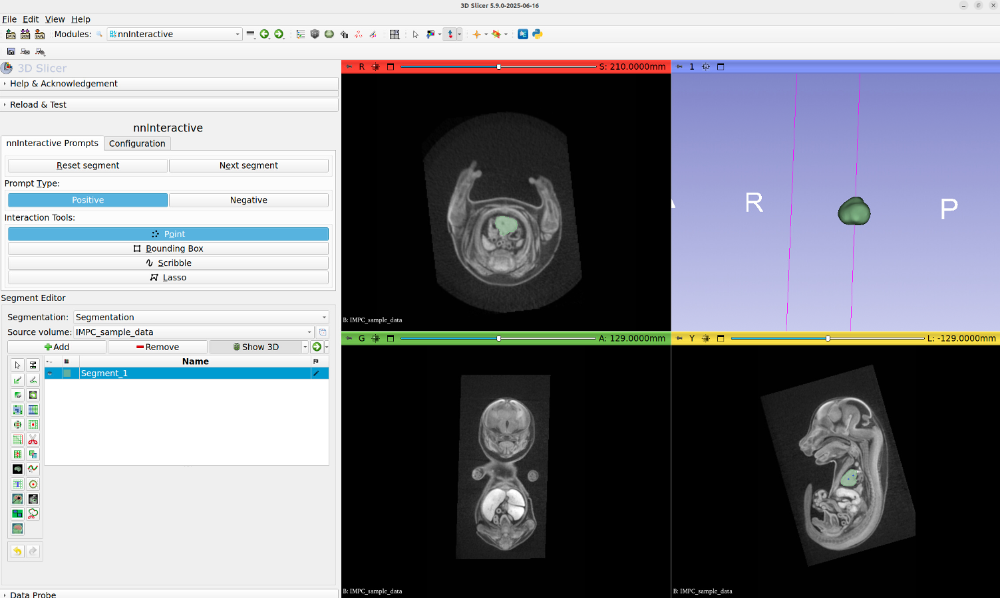

# MorphoCloud

  

MorphoCloud gives SlicerMorph users **on-demand, GPU-enabled cloud workstations** — full
[3D Slicer](https://download.slicer.org) + [SlicerMorph](https://slicermorph.org) desktops running on
[JetStream2](https://jetstream-cloud.org/) and reachable from any web browser. You request and control an
instance entirely through GitHub Issues, so it is well suited to occasional high-performance work,
AI-assisted segmentation, and teaching.

> **The authoritative documentation lives at [morphocloud.org](https://morphocloud.org) and in the
> [MorphoCloud user guide](https://github.com/MorphoCloud/docs).** This page is only a short orientation
> for SlicerMorph users. For anything beyond it — connecting, file transfer, storage, commands, instance
> types, GPU notes — use those, as they are kept current.

## Before you start: become a member

MorphoCloud is members-only. Joining is free and takes a couple of minutes:

1. Go to **[join.morphocloud.org](https://join.morphocloud.org)** and sign in with your
   [ORCID iD](https://orcid.org) (free to create).
2. Fill in the short form and accept the [Usage Terms](https://github.com/MorphoCloud/docs/blob/main/terms.MD).
3. Confirm your email, then accept the GitHub organization invitation that is sent to you.

You also need a [GitHub account](https://github.com). Membership lets you *request* instances; it does not
guarantee that shared resources are free at any given moment.

## The core idea

- **Request** an instance by opening an issue in the
  [MorphoCloud Instances repository](https://github.com/MorphoCloud/Instances/issues/new/choose).
- **Create and control** it with slash-command comments on that same issue — `/create`, `/shelve`,
  `/unshelve`, `/renew`, `/delete_instance`. `/create` is a one-time step you run *after* approval;
  instances are not provisioned automatically.
- **Connect** using the credentials email you receive — either the in-browser desktop (Guacamole) or the
  [TurboVNC](https://github.com/TurboVNC/turbovnc/releases) client.
- **It auto-shelves** after roughly 4 hours online to conserve shared resources. Bring it back later with
  `/unshelve`; each time it comes online you receive a fresh credentials email.
- **Mind your data.** The instance is ephemeral — keep anything you want to survive in your persistent
  **MyData** volume (your home directory is stored there).
- **Check availability first.** JetStream2 is a nationally shared cloud. Before `/create` or `/unshelve`,
  check the [real-time availability dashboard](https://morphocloud.org).

   
  <em>3D Slicer + SlicerMorph running on a MorphoCloud cloud desktop, used entirely in the browser.</em>

## Where to go next

| You want to…                                      | Go to |
| ------------------------------------------------- | ----- |
| Check real-time resource availability             | [morphocloud.org](https://morphocloud.org) |
| Full user guide (connect, commands, storage, GPU) | [MorphoCloud/docs](https://github.com/MorphoCloud/docs) |
| Request or manage an instance                     | [MorphoCloud Instances issues](https://github.com/MorphoCloud/Instances/issues/new/choose) |
| Become a member                                   | [join.morphocloud.org](https://join.morphocloud.org) |
| Run a workshop or teach a course                  | [Access pathways](https://github.com/MorphoCloud/docs#access-pathways) |
| AI-assisted segmentation on MorphoCloud           | [NNInteractive tutorial](NNInteractive.MD) |
