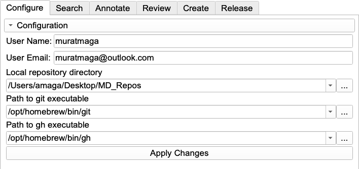

_MorphoDepot Tutorial · Part 2 of 8 — Slicer Installation & Setup_

[⬅ Overview](./README.md)  ·  [⬅ Prev: Prerequisites & System Configuration](./1-prerequisites.md)  ·  [Next: Preparing Data: 3D Volume ➡](./3-prepare-volume.md)

---

## **2. Slicer Installation & Setup**

Now that your github credentials are set, you can set up the software.

> [!NOTE]
> [You can skip to Section 2.3](./2-slicer-setup.md#23-verify-connection-the-configure-tab) if you are using MorphoCloud.

### **2.1 Install Slicer**

1. Go to [download.slicer.org](https://download.slicer.org/).  
2. Download and install the latest **Stable Release** for your operating system.

### **2.2 Install Extensions**

1. Open 3D Slicer.  
2. Navigate to the **Extensions Manager**.  
3. Search for and install the following extensions:  
   * SlicerMorph  
   * MorphoDepot   
4. **Restart Slicer** to for changes to take effect. 

### **2.3 Verify Connection (The "Configure" Tab)**

1. Open the **MorphoDepot** module.  
2. Click the **Configure** tab.  
3. Enter your information:  
   * **User Name**: Your full name (e.g., "Jane Smith")  
   * **User Email**: The email address associated with your GitHub account

These fields are required for accurate commit histories and tracking of the issues. 

4. Because you completed Section 1, MorphoDepot should be able to detect where git and gh are installed.  
   * *Troubleshooting:* If you encounter errors, you may need to manually point Slicer to the full path where you installed git or gh (the same path used in Section 1.3).

5. **Applying Changes:** After modifying any settings in the Configure tab (repository directory, git path, gh path, or user credentials), click the **Apply Changes** button to reload the module with your new settings. This eliminates the need to restart Slicer after configuration changes. You will not be able to proceed to other tab of MorphoDepot, unless you configure the extension fully. 

*The Configure tab. MorphoDepot auto-detects your `git` and `gh` paths after Section 1; enter your name and the email tied to your GitHub account, then click **Apply Changes**. The remaining tabs stay disabled until configuration is complete.*

---

[⬅ Overview](./README.md)  ·  [⬅ Prev: Prerequisites & System Configuration](./1-prerequisites.md)  ·  [Next: Preparing Data: 3D Volume ➡](./3-prepare-volume.md)
