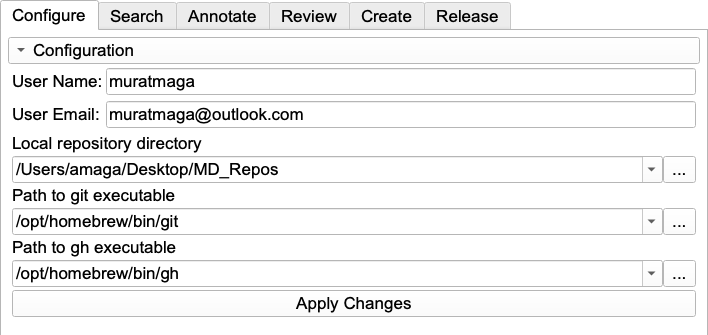

_MorphoDepot Tutorial · Part 2 of 10 — Slicer Installation & Setup_

[⬅ Overview](./README.md)  ·  [⬅ Prev: Prerequisites & System Configuration](./1-prerequisites.md)  ·  [Next: Preparing Data: 3D Volume ➡](./3-prepare-volume.md)

---

## **2. Slicer Installation & Setup**

Now that your GitHub credentials are set, you can set up the software.

> [!NOTE]
> [You can skip to Section 2.3](./2-slicer-setup.md#23-verify-connection-the-configure-tab) if you are using MorphoCloud.

### **2.1 Install Slicer**

1. Go to [download.slicer.org](https://download.slicer.org/).
2. Download and install the latest **Stable Release** for your operating system.

### **2.2 Install Extensions**

1. Open 3D Slicer.
2. Navigate to the **Extensions Manager**.
3. Search for and install the following extensions:
   * SlicerMorph
   * MorphoDepot
4. **Restart Slicer** for the changes to take effect.

### **2.3 Verify Connection (The "Configure" Tab)**

1. Open the **MorphoDepot** module.
2. Click the **Configure** tab.
3. Enter your information:
   * **User Name**: Your full name (e.g., "Jane Smith")
   * **User Email**: The email address associated with your GitHub account

   These fields are required for accurate commit histories and tracking of the issues. If you logged in with `gh auth login -s user:email` (Section 1.3), MorphoDepot fills them in for you from your GitHub profile.

4. Because you completed Section 1, MorphoDepot should be able to detect where git and gh are installed.
   * *Troubleshooting:* If you encounter errors, you may need to manually point Slicer to the full path where you installed git or gh (the same path used in Section 1.3). A portable install that is not on your system PATH works fine — MorphoDepot passes the paths you set here to both tools.

5. **Applying Changes:** After modifying any settings in the Configure tab (repository directory, git path, gh path, or user credentials), click the **Apply Changes** button to reload the module with your new settings. This eliminates the need to restart Slicer after configuration changes. You will not be able to proceed to other tabs of MorphoDepot unless you configure the extension fully.

*The Configure tab. MorphoDepot auto-detects your `git` and `gh` paths after Section 1; enter your name and the email tied to your GitHub account, then click **Apply Changes**. The remaining tabs stay disabled until configuration is complete.*

> [!NOTE]
> **Shared and lab computers.** MorphoDepot signs in to GitHub *per repository*, through `gh`, for the repositories it clones. It uses whichever account `gh auth status` reports as active and leaves the rest of your machine's git configuration alone — so a credential another person left behind in the system keychain cannot make your commits go up under their name. If you use several GitHub accounts, `gh auth switch` is what selects the one MorphoDepot works as.

### **2.4 Keeping MorphoDepot up to date**

MorphoDepot can update **itself**, in place — you do not have to wait for an Extension Manager build.

This matters because Slicer's extension server only builds MorphoDepot for the Slicer version that is current. If you stay on an older Slicer, the Extension Manager silently stops offering you new versions; the built-in updater does not.

**How it works**

1. The first time you open the MorphoDepot module in a Slicer session, it quietly checks GitHub for a newer version. If there is nothing new, it says nothing at all.
2. If there is, a banner appears above the tabs — visible from every tab — reading, for example, *"MorphoDepot 2026-08-16 (8707870) is available. You have 2026-07-27 (000f781)."* with three buttons:
   * **Update Now** — download and install it.
   * **What's New** — open the list of changes on GitHub.
   * **Dismiss** — hide the notice until the *next* version is released.
3. **Update Now** replaces the installed module files, keeping a backup of the previous version so the update can be undone, then verifies what it wrote.
4. When it finishes, you are asked how to apply it:
   * **Reload MorphoDepot** — quickest, and it **keeps your scene** (which matters if you have an unsaved segmentation open).
   * **Restart Slicer** — use this if anything looks wrong after a reload.
   * **Later** — keep working; the new version takes effect the next time Slicer starts.

**The Configure tab's "MorphoDepot Version" section** shows the same information at any time:

* **Installed** — the date and revision you are running.
* **Source** — how it was installed: *Extension Manager*, *Developer checkout*, *Built from source*, or *Unrecognized installation*.
* **Status** — *Up to date*, *Update available: …*, or the reason MorphoDepot will not update this particular installation.
* **Check for Updates Now** — re-run the check on demand.
* **Check for updates at startup** — turn the automatic check off if you would rather not have it.

> [!NOTE]
> MorphoDepot only writes to installations where that is safe: an **Extension Manager** install, or a **clean git clone** of the official repository on the release branch. A build tree, a modified or forked developer checkout, or an unpacked zip is reported but never touched — update those yourself. If it cannot write to its own install directory it says so instead of failing silently.

---

[⬅ Overview](./README.md)  ·  [⬅ Prev: Prerequisites & System Configuration](./1-prerequisites.md)  ·  [Next: Preparing Data: 3D Volume ➡](./3-prepare-volume.md)
