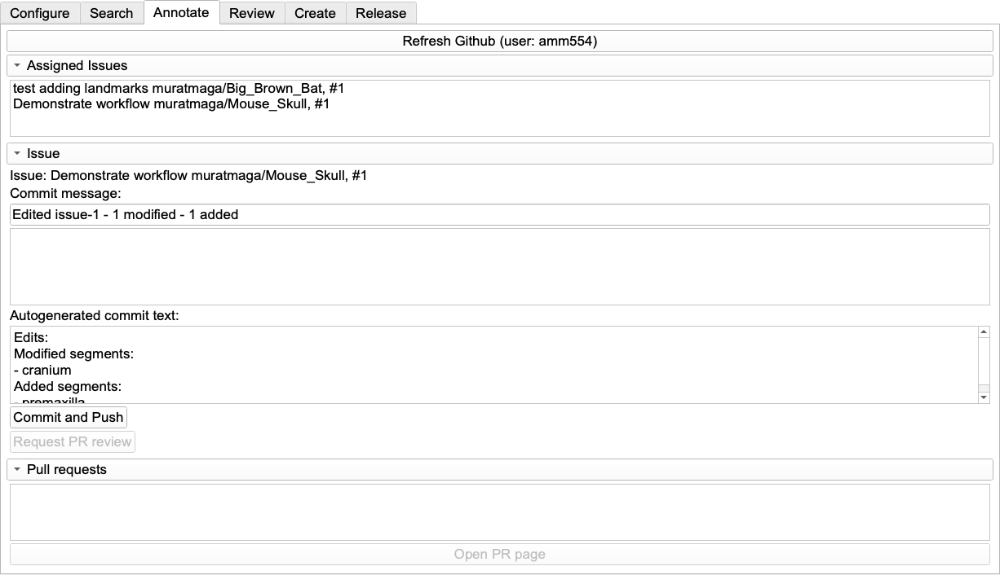

_MorphoDepot Tutorial · Part 6 of 8 — Project Management & Assignments_

[⬅ Overview](./README.md)  ·  [⬅ Prev: Creating the Repository](./5-create-repo.md)  ·  [Next: Reviewing & Merging Submissions ➡](./7-review.md)

---

## **6\. Project Management & Assignments**

In MorphoDepot, tasks are tracked via GitHub Issues. The workflow is bidirectional: **The Student creates the Issue** (requesting the work), and **The Owner assigns it back** **to the student for them to begin to work on the task.** It may seem more logical for instructors to create issues rather than students creating them, but GitHub will only allow you to assign issues to users who have expressed interest in the issue by creating or commenting on them.

### **6.1 Preparation (Owner)**

1. **Define Assignments:** Create a list of who is responsible for which anatomy (e.g., "Student A: Mandible", "Student B: Braincase").  
2. **Distribute URL:** Send the link to your new GitHub Repository to your students/collaborators.  
3. **Instruct:** Tell students to navigate to the "Issues" tab of that repository.

### **6.2 Creating Issues (Student Action)**

*Instruct your students to follow these steps:*

1. Navigate to the repository on GitHub.  
2. Click the **Issues** tab.  
3. Click the green **New Issue** button.  
4. **Title:** Enter a specific title using a standard convention (e.g., LastName\_StructureName).  
5. **Description:** Briefly describe the task (e.g., "I will be segmenting the pectoral girdle").  
6. Click **Submit New Issue**.

### **6.3 Assigning Issues (Owner Action)**

*Once students have created their issues, you must assign them:*

1. Navigate to the repository **Issues** tab on GitHub.  
2. Open an issue created by a student.  
3. Look at the right-hand sidebar for the **Assignees** section.  
4. Click the gear icon and select the student's username from the list.  
   * *Note:* This step is critical. If the student is not explicitly listed in the "Assignees" field, MorphoDepot will not download the task to their computer.

### **6.4 Starting Work (Student Action)**

1. Student opens Slicer \-\> **MorphoDepot** \-\> **Annotate** tab.  
2. Clicks **Refresh GitHub**.  
3. The issue (now assigned to them) will appear in the list.  
4. Student double-clicks the issue to download the data.
5. **Automatic Baseline Import:** If the repository owner included a baseline segmentation when creating the repository, it will be automatically imported into the student's working segmentation. This allows students to:
   * Start from a partial segmentation provided by the instructor
   * See reference boundaries for complex structures
   * Build upon existing work rather than starting from scratch
6. The student begins segmentation using Segment Editor.

### **6.5 Saving Progress (Student Action)**

**6.5.1 Automatic Tracking**

As you work in the Segment Editor, MorphoDepot automatically monitors your changes:

* **Modified segments**: Existing segments you've edited  
* **Added segments**: New segments you've created  
* **Removed segments**: Segments you've deleted  
* **Renamed segments**: Segments whose names have changed

**6.5.2 The Commit Message Interface**

In the Annotate tab, you'll see three text fields:

1. **Commit Title** (auto-generated, editable):  
   * Shows a summary like: "Edited issue-5 \- 3 modified, 2 added"  
   * You can edit this to add your own custom title  
2. **Commit Body** (optional):  
   * Add any additional notes or explanations  
   * Example: "Refined the boundary between the frontal and parietal bones"  
3. **Auto-generated Details** (read-only, grey box):  
   * Lists specific segment names (see the screenshot)

*The Annotate tab while working on an assigned issue. The **Refresh Github** button shows the logged-in student (`amm554`); assigned issues appear in the top list. MorphoDepot auto-generates the commit title (here `Edited issue-1 - 1 modified - 1 added`) and the read-only details box listing exactly which segments were modified (`cranium`) and added (`premaxilla`). Edit the title or add an optional body, then click **Commit and Push**.*

**6.5.3 Committing Your Work**

1. Review the auto-generated message  
2. (Optional) Edit the title or add a body message  
3. Click **Commit and Push**  
   * The first time you commit, a Pull Request is automatically created (as a Draft)  
   * Subsequent commits update the same Pull Request  
4. The message fields clear, ready for your next save

**Best Practice**:

* Commit frequently (every 20-30 minutes)  
* The auto-generated details provide a perfect audit trail  
* Add custom notes in the body only when you need to explain *why* you made changes  
* Optional: navigate to the GitHub issues page and add extra comments or screenshots illustrating the changes you made.

### **6.6 Submitting for Review (Student Action)**

When the student has completed the segmentation:

1. Click **Commit and Push** one last time.  
2. Click the **Request PR Review** button.  
3. This signals to GitHub that the work is finished and ready for the instructor to inspect. The issue will now appear in the Owner's "Review" tab.

---

[⬅ Overview](./README.md)  ·  [⬅ Prev: Creating the Repository](./5-create-repo.md)  ·  [Next: Reviewing & Merging Submissions ➡](./7-review.md)
