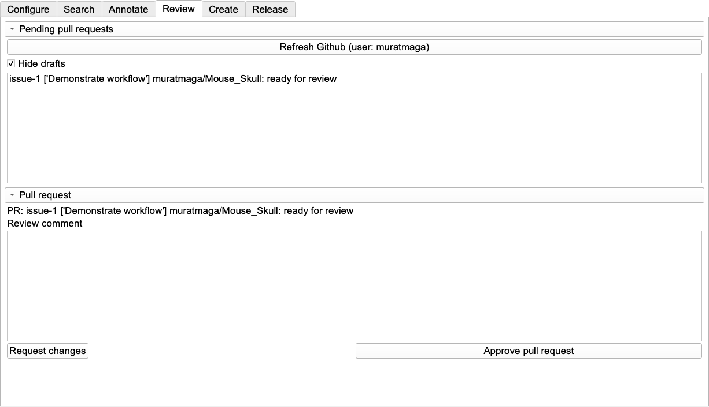

_MorphoDepot Tutorial · Part 7 of 10 — Reviewing & Merging Submissions_

[⬅ Overview](./README.md)  ·  [⬅ Prev: Project Management & Assignments](./6-project-management.md)  ·  [Next: Search & Discovery ➡](./8-search.md)

---

## **7. Reviewing & Merging Submissions**

As the Project Owner, you review work directly inside Slicer.

### **7.1 The Review Workflow**

1. Open MorphoDepot -> **Review** tab.
2. Click **Refresh Github**.
   * This pulls all open Pull Requests (submitted assignments) from the repositories you are the reviewer for: the MorphoDepot repositories you **own**, plus organization repositories whose `CURATOR` file names you.
   * The list is queried from GitHub each time you click it, so a submission made seconds ago is already there.
3. **Filtering PRs:** Use the **Hide Drafts** checkbox to control which Pull Requests are displayed:
   * **Checked (default):** Shows only PRs that are "Ready for Review"—these are submissions where students have clicked **Request PR Review**
   * **Unchecked:** Shows all PRs including drafts—useful for monitoring work-in-progress from students who haven't yet submitted for review  
4. **Select a Request:** Double-click an entry in the list to download the student's segmentation overlay.
5. **Inspect:** Use Slicer's 2D and 3D views to check the quality.
   * *Comparison:* You can use the **Segment Comparison** module (from SlicerRT) to compare against a ground truth if available.

*The Review tab (Owner view). Submissions that are **ready for review** appear in the list; the **Hide drafts** checkbox controls whether in-progress drafts are shown too. Double-click a row to load the student's segmentation into Slicer, then either **Approve pull request** (merges the work and closes the issue) or type feedback in the comment box and click **Request changes**.*

### **7.2 Taking Action (Owner)**

Once you have inspected the work, you have two choices:

* **Choice A: Approve & Merge:**  
  * If the segmentation is accurate, click the **Approve Pull Request** button.  
  * This merges the student's segmentation into the main branch of the repository, finalizing that specific anatomy. This also closes the issue the student opened. So at this point no future work is possible (unless the student opens a new issue).
  * The scene is cleared afterwards and MorphoDepot confirms that the pull request was approved and merged.
* **Choice B: Request Changes:**  
  * If the work needs correction, type your feedback into the text box and click **Request Changes**.  
  * **Result:** This reverts the Pull Request status to "Draft". The work is sent back to the student, and it will no longer appear in your "Ready for Review" queue until they resubmit.

### **7.3 Handling Feedback & Resubmission (Student Loop)**

If you requested changes, the student needs to follow this specific workflow to see your feedback and fix their work:

1. **Viewing Feedback:**  
   * Select your active Pull Request from the list  
   * In the **Annotate** tab's *Pull requests* section, select the pull request and click **Open PR page** (it becomes enabled when one is selected)
   * This opens the Pull Request page on GitHub in your web browser  
   * You can now:  
     1. Read detailed review comments  
     2. See the full conversation history  
     3. View any inline code/file suggestions from the reviewer  
     4. Add your own comments or questions  
2. **Making Corrections:**  
   * The student returns to Slicer and edits the segmentation based on the feedback.  
   * They click **Commit and Push** to save the changes.  
3. **Resubmitting:**  
   * Because the status was reverted to "Draft," the student **must** click the **Request PR review** button again.
   * Only after this button is clicked will the assignment reappear in your Review tab.

> [!NOTE]
> **A second, separate kind of review.** MorphoDepot reviewers (the organization's reviewer team) also see a **Repositories awaiting review (reviewers only)** section at the top of this tab. That is the editorial check that lets a new *archival dataset* or a *release* go public ([Part 5](./5-create-repo.md#54-creating-an-archival-repository), [Part 9](./9-releases.md)) — it has nothing to do with reviewing segmentation pull requests, and it is hidden unless you are on that team.

---

[⬅ Overview](./README.md)  ·  [⬅ Prev: Project Management & Assignments](./6-project-management.md)  ·  [Next: Search & Discovery ➡](./8-search.md)
