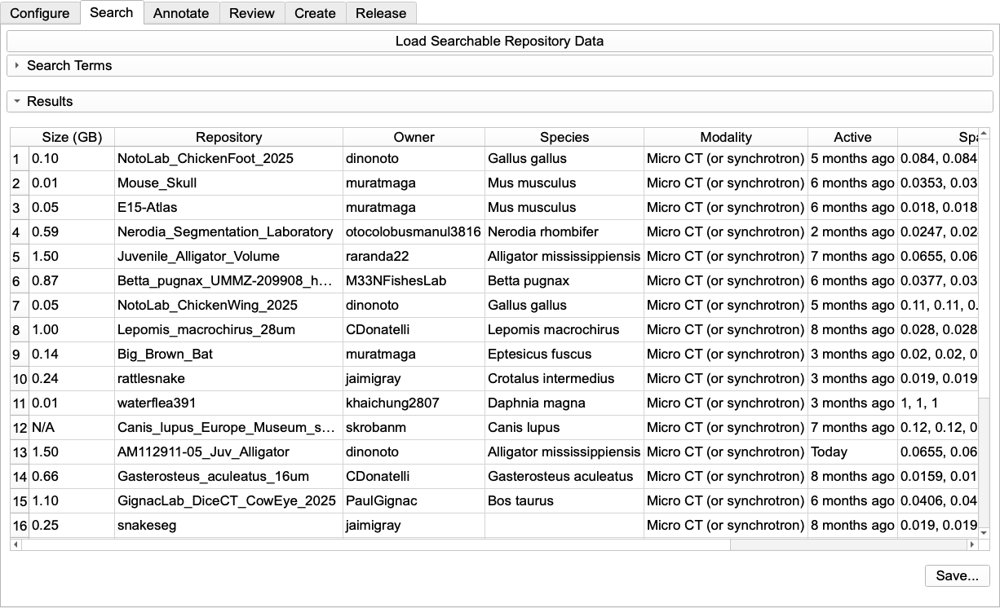

_MorphoDepot Tutorial · Part 8 of 9 — Search & Discovery_

[⬅ Overview](./README.md)  ·  [⬅ Prev: Reviewing & Merging Submissions](./7-review.md)  ·  [Next: Releases & DOIs ➡](./9-releases.md)

---

## **8: Search & Discovery**

The Search tab allows you to discover and preview MorphoDepot repositories created by other researchers. This is useful for finding reference datasets, teaching examples, or comparative anatomy studies.

**8.1 Initial Setup**

1. Open the MorphoDepot module and select the **Search** tab  
2. Click **"Load Searchable Repository Data"**  
   * MorphoDepot downloads metadata from all public MorphoDepot repositories  
   * This includes accession data, volume size, dimensions, and screenshots  
   * Data is cached locally to speed up future searches  
   * **Wait time**: 30 seconds to several minutes depending on the number of repositories (data will be cached to subsequent loads will be faster).  
3. Once loading completes:  
   * The search interface becomes enabled  
   * The results table populates with all repositories

**8.2 Search Filters**

The search form provides multiple filter options:

**Free Text Search:**

* Type any text in the search box  
* Searches across: repository names, species names, and subject descriptions  
* Uses wildcard matching (e.g., "cranium" matches "fish\_cranium\_2024")

**Structured Filters** (checkboxes):

* **Repository Type**: Archival / Short-term  
* **Subject Type**: Biological specimen / Other  
* **Specimen Source**: Accessioned / Non-accessioned  
* **In iDigBio**: Yes / No  
* **Sex**: Male / Female / Unknown  
* **Developmental Stage**: Prenatal / Juvenile / Adult  
* **Modality**: Micro CT, Medical CT, MRI, Lightsheet microscopy, etc.  
* **Contrast Enhanced**: Yes / No  
* **Image Contents**: Whole specimen / Partial specimen  
* **Anatomical Areas**: Head and neck, Pectoral girdle, Forelimb, etc.

**Default Behavior:**

* All checkboxes start checked (shows everything)  
* Uncheck options to narrow results  
* Filters combine using AND logic (all selected criteria must match)

**8.3 Viewing Results**

The results table displays (in order):

| Column | Description |
| ----- | ----- |
| Size (GB) | Volume file size (first column for quick assessment) |
| Repo | Repository name |
| Owner | GitHub username |
| Species | Scientific name (or subject description) |
| Modality | Imaging technique |
| Last Active | Time since last commit (e.g., "3 days ago", "2 months ago") |
| Spacing | Voxel spacing in mm |
| Dimensions | Volume dimensions (voxels) |

*The Search tab after clicking **Load Searchable Repository Data**. Every public MorphoDepot repository is listed with its size, owner, species, modality, and last-active time. Click any column header to sort, hover a row for screenshot thumbnails, or double-click a row to preview that dataset directly in Slicer.*

**Interactive Features:**

* **Hover over a row**: Tooltip shows detailed information and screenshot thumbnails (up to 5)  
* **Click column headers**: Sort the table by any column (alphabetically or numerically)
* **Save to CSV**: Click the **Save Search Results** button to export the current filtered results to a CSV file for external analysis or record-keeping

> [!NOTE]
> The "Last Active" column helps identify repositories that are actively maintained versus those that may be abandoned or completed projects.

**8.4 Taking Action**

**Right-Click Context Menu**

1. Right-click any repository in the table  
2. Choose:  
   * **"Open Repository Page"**: Opens the GitHub repository in your browser  
   * **"Preview in Slicer"**: Downloads and loads the data (see 8.5)

Alternatively, you can double-click on any entry, which will automatically download the dataset.

**8.5 Previewing a Repository**

When you preview a repository:

1. **Confirmation**: A dialog asks "Close scene and load repository for preview?" (click OK)  
2. **Download**:  
   * The repository is cloned to your local MorphoDepot cache.  
   * The source volume and segmentations are loaded.   
   * Cloned repository is removed from the cache.  
3. **Preview Mode Warning**: After loading completes, a notification dialog appears reminding you:
   * You are in **Preview mode**
   * The currently loaded data is **not saved by default**
   * To contribute segmentations, right-click on the search results row and open the repository web page to request access via an Issue
   * This dialog can be dismissed permanently using the "Don't show again" option
4. **Viewing**:  
   * The volume and segmentations appear in Slicer  
   * You can examine the data in 2D/3D views  
   * Measurements and visualization tools work normally  
5. **Read-Only**:  
   * You cannot commit changes to someone else's repository
   * Any edits you make will be lost when you close the scene or load another dataset  
   * This is for looking at the data. 

**Use Cases:**

* Compare your segmentation approach to published datasets  
* Find example segmentations for teaching  
* Explore anatomical variation across species  
* Download reference data for method validation

**8.6 Refreshing the Cache**

Repository metadata becomes stale over time. To update:

1. Click **"Load Searchable Repository Data"** again  
2. MorphoDepot re-downloads all metadata  
3. New repositories appear; updated information reflects recent changes

> [!TIP]
> **Recommendation:** Refresh monthly or before starting a new search session.

---

[⬅ Overview](./README.md)  ·  [⬅ Prev: Reviewing & Merging Submissions](./7-review.md)  ·  [Next: Releases & DOIs ➡](./9-releases.md)
