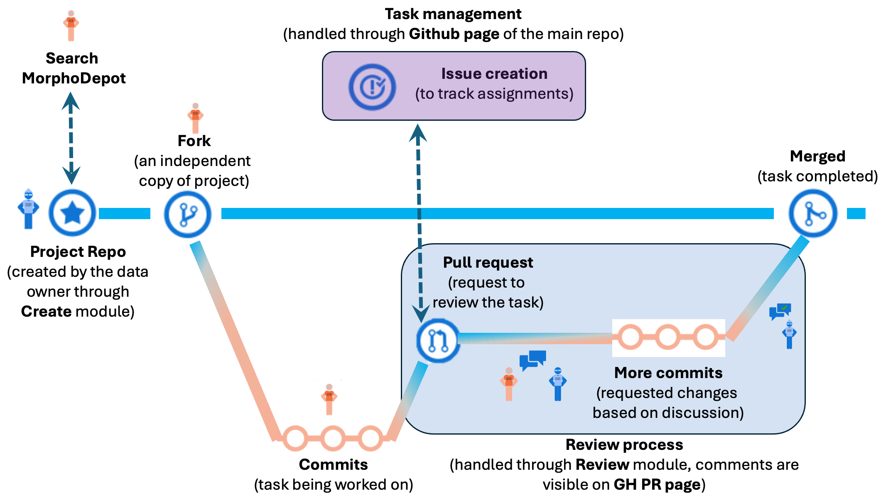

# **MorphoDepot Project Creation & Management**

Scope: This tutorial covers the complete lifecycle of a MorphoDepot project, from initial system configuration to repository creation, collaborator assignment, and segmentation review.  
Target Audience: Data Owners (PIs, Instructors) and researchers and students who use need to edit (segment) them.

## **0\. Conceptual Overview: The MorphoDepot Workflow**

MorphoDepot uses a "distributed collaboration" model. If you are new to **Git** (version control) and **GitHub** (cloud storage), this workflow might look complex, but MorphoDepot automates most of it.

Think of **GitHub** as the "Project Manager" (where assignments and discussions happen) and **MorphoDepot/Slicer** as the "Laboratory" (where the actual work happens).

**Refer to the diagram below to understand the lifecycle of a task:**

### **Key Concepts from the Diagram:**

#### **The Project Repo (The Blue Star):**  
   * **What it is:** This is the "Master Copy" of your dataset  
   * **Who creates it**: The Instructor/Project Owner creates this in [Section 5 (Creating the Repository)](https://github.com/SlicerMorph/Tutorials/tree/main/MorphoDepot#5-creating-the-repository)  
   * **Where it lives:** On GitHub, but managed through MorphoDepot  
   * **Analogy**: Think of this as the "reference textbook" that everyone works from but nobody except the author is allowed to modify it.  

#### **Task Management (Purple Box):**  
   * **Location:** GitHub Website.  
   * **Action:** You define *what* needs to be done by creating "Issues." This is how assignments are handed out. See [**Section 6.1 \- 6.3** (Project Management).](https://github.com/SlicerMorph/Tutorials/tree/main/MorphoDepot#6-project-management--assignments)  

#### **The Fork (Blue Branch Icon):**  
   * **What it is:** An independent copy of the project created under the student’s github account.  
   * **When it happens:** Automatically created when a student first loads an assigned issue in MorphoDepot.  
   * **Why it matters:** Students don't edit the Master Copy directly—they work on their own safe copy  
   * **Analogy:** Like making copies on a photocopy of a library book, not in the book itself  

#### **Commits (Peach/Orange Line):**  
   * **Location**: MorphoDepot (Slicer)  
   * **What it is**: A "save point" that records your progress  
   * **How it works**: As the student segments, they click **"Commit and Push"** to save their work to their Fork  
   * **Frequency**: Should be done every 20–30 minutes to prevent data loss  
   * **Analogy**: Like saving your Word document and backing it up to the cloud  
   * **See**: [Section 6.5 (Saving Progress)](https://github.com/SlicerMorph/Tutorials/tree/main/MorphoDepot#65-saving-progress-student-action)  

#### **Pull Request / "PR" (Blue Box):**  
   * **Location**: Bridge between MorphoDepot and GitHub  
   * **What it is**: A formal request to merge your work back into the Master Copy  
   * **When it happens**: After the student clicks **"Request PR Review"**  
   * **Analogy**: Handing in your homework—you're asking the instructor to review and accept your work  
   * **Status tracking**:  
     1. **Draft**: Work in progress, not ready for review  
     2. **Ready for Review**: Student has submitted for grading  
     3. **Approved & Merged**: Work is accepted and added to the Master Copy and the issue is closed.  
   * **See**: [Section 6.6 (Submitting for Review)](https://github.com/SlicerMorph/Tutorials/tree/main/MorphoDepot#66-submitting-for-review-student-action)  

#### **The Review Loop:**  
   * **Location**: MorphoDepot (Review Tab) & GitHub (Comments)  
   * **How it works**:  
     1. Instructor reviews the segmentation in Slicer  
     2. If changes are needed, instructor types feedback and clicks **"Request Changes"**  
     3. Student reads the feedback (by clicking **"PR Link"** button)  
     4. Student makes corrections and commits again  
     5. Student clicks **"Request PR Review"** to resubmit  
     6. Loop continues until work is approved  
   * **End result**: Once approved, the work is **Merged** back into the main Project Repo and the task is complete  
   * **See**: [Section 7 (Reviewing)](https://github.com/SlicerMorph/Tutorials/tree/main/MorphoDepot#7-reviewing--merging-submissions)

#### **Merged (Right side: checkmark icon labeled "Merged")**

* **What it means**: The student's segmentation has been approved and permanently added to the Master Copy  
* **What happens**: The Issue is closed, the PR is merged, and that anatomical structure is now complete in the project  
* **Important**: After merging, no further edits to that specific submission are possible (though a new Issue could be created if needed)

#### **Search MorphoDepot (Optional: Top left, dashed arrow)**

* **What it is**: A discovery tool to browse existing MorphoDepot repositories created by other researchers  
* **Use cases**:  
  * Find reference datasets for comparison  
  * Explore example segmentations for teaching  
  * Preview data before deciding to use it  
* **See**: [Section 8 (Search & Discovery)](https://github.com/SlicerMorph/Tutorials/tree/main/MorphoDepot#section-8-search--discovery-new-section)

### **Summary: The Complete MorphoDepot Cycle**

1. **Instructor** creates the project repository with volume and color table (and optionally with an existing segmentation).  
2. **Student** creates an Issue requesting to work on a specific structure  
3. **Instructor** assigns the Issue to the student  
4. **Student** loads the issue in MorphoDepot, which automatically creates a Fork  
5. **Student** segments and commits frequently to save progress  
6. **Student** requests review when finished  
7. **Instructor** reviews and either approves (merge) or requests changes  
8. If changes needed, student revises and resubmits  
9. Once approved, work is merged into the Master Copy  
10. **Instructor** creates versioned releases at project milestones

**The beauty of this system**: Everyone works independently on their own copy, preventing conflicts, while the repository owner maintains quality control before any work becomes "official."

## **1. Prerequisites & System Configuration**

First, you need to configure your operating system to communicate with GitHub. Experience shows that setting up these credentials *before* installing Slicer prevents critical connectivity errors later. We also strongly advise using [MorphoCloud Instances](https://morphocloud.org) to cut down the necessary time for setup. On MorphoCloud all prerequisites are installed for you. 

### **1.1 GitHub Account Setup**

1. **Register:** Create an account at [GitHub.com](https://github.com/) if you do not have one.  
2. **Security:** Enable Two-Factor Authentication (2FA).  
3. **Mobile App:** Install the GitHub Mobile App on your phone. This is the easiest way for approving 2FA requests.

### **1.2 Install Command Line Tools**

**Note:** [you can skip to Section 1.3](https://github.com/SlicerMorph/Tutorials/tree/main/MorphoDepot#13-authenticate-with-github-via-terminal) if you are using MorphoCloud.

You must install git (for version control) and gh (GitHub CLI for authentication) on your computer.  
Important: Make a note of the exact folder path where you install gh. You may need this in the next step.

* **Windows:**  
  * Download and install [Git for Windows](https://git-scm.com/download/win).  
  * Download and install the [GitHub CLI (gh)](https://cli.github.com/).  
* **Mac:**  
  * Open the **Terminal** app.  
  * Type git and press Enter. If not installed, a pop-up will ask to install "Command Line Tools". Accept and install.  
  * Install the GitHub CLI via Homebrew (brew install gh) or download the [Mac installer](https://cli.github.com/).  
* **Linux:**  
  * **Git:** Use your distribution's package manager (e.g., sudo apt install git).  
  * **GitHub CLI (gh):** **Do not use the standard package manager** (e.g., apt or yum) as they often provide outdated or incompatible versions.  
    1. Go to the [GitHub CLI Releases page](https://github.com/cli/cli/releases).  
    2. Download the correct Linux archive (tar.gz) for your architecture.  
    3. Unarchive the file.  
    4. **Note the path** where you extracted the bin/gh file.

### **1.3 Authenticate with GitHub via Terminal**

1. Open your computer’s **Terminal** (Mac/Linux) or **Command window** (Windows).  
2. Run the following command:

   `gh auth login`

   **Troubleshooting:** If you receive a **"Command not found"** or **"File not found"** error, it means `gh` executable is not in your system path. You must locate the installation folder from Section 1.2 and run the command using the **full path**.  
   * *Example (Mac/Linux):* /Users/yourname/downloads/gh\_2.20.0/bin/gh auth login  
   * *Example (Windows):* "C:\\Program Files\\GitHub CLI\\gh.exe" auth login  
3. Follow the prompts:  
   * **Account:** GitHub.com  
   * **Protocol:** HTTPS  
   * **Authenticate:** Login with a web browser.  
4. Copy the one-time code provided in the terminal, paste it into the browser window that opens, and authorize the connection. You might also need to use the GitHub Mobile to do the 2FA.  
5. **Success:** The terminal should verify that you are logged in. If not, you will need to redo the procedure.

You can confirm you have successfully logged in via command `gh auth status`, which should display that you are logged in and your username.

## **2. Slicer Installation & Setup**

Now that your github credentials are set, you can set up the software.

**Note:** [You can skip to Section 2.3,](https://github.com/SlicerMorph/Tutorials/tree/main/MorphoDepot#23-verify-connection-the-configure-tab)  if you are using MorphoCloud.

### **2.1 Install Slicer**

1. Go to [download.slicer.org](https://download.slicer.org/).  
2. Download and install the latest **Stable Release** for your operating system.

### **2.2 Install Extensions**

1. Open 3D Slicer.  
2. Navigate to the **Extensions Manager**.  
3. Search for and install the following extensions:  
   * SlicerMorph  
   * MorphoDepot   
4. **Restart Slicer** to complete the installation.

### **2.3 Verify Connection (The "Configure" Tab)**

1. Open the **MorphoDepot** module.  
2. Click the **Configure** tab.  
3. Enter your information:  
   * **User Name**: Your full name (e.g., "Jane Smith")  
   * **User Email**: The email address associated with your GitHub account

These fields are required for commit histories and tracking of the issues. 

2. Because you completed Section 1, MorphoDepot should be able to detect where git and gh are installed.  
   * *Troubleshooting:* If you see encounter errors, you may need to manually point Slicer to the full path where you installed git or gh (the same path used in Section 1.3).
---

## **3. Preparing Data for MorphoDepot Repository: 3D Volume**

**CRITICAL STEP:** Data must be cleaned, posed, and padded *before* uploading. Once a repository is created, the source volume cannot be easily changed without restarting the project.

### **3.1 Volume Quality Control**

* **Cleaning:** Ensure the scan has minimal noise and no background artifacts (holders, markers, packing peanuts).  
* **Orientation:** The specimen should be aligned with the standard world axes (Anterior-Posterior, Dorsal-Ventral; see below).

### **3.2 Cropping and Posing**

Use the **Crop Volume** module in Slicer to prepare the specific Region of Interest (ROI).

1. Load your volume into Slicer.  
2. Open **Crop Volume**.  
3. **Reorient:** Use the "Reorient Volume" dropdown to align the specimen using the rotation handles in the 3D viewer. Hit **Apply** when done.   
4. **Input ROI:** Create a new ROI.
5. **Crucial:** Set "Fit to Volume" mode to **Align to world axes \+ Resize**. Then, hit **Fit to Volume** button to expand the ROI to span the new alignment.   
6. Drag the ROI box to encase the specimen with a padding of approximately **5%** of image on all sides.  
7. **ROI Settings:**  
   * Set **Interpolated cropping** to "Enabled".  
   * Set **Fill value** to the background intensity (usually 0 for microCT, and \-1000 for medical CT. If unsure, check specifics for your dataset using the Volumes module).  
   * Click **Apply**. This creates a new resampled volume in the user specified orientation.  
8. **Image Metadata:** Check the volume has correct image spacing (resolution) entered.   
9. **Size:** The final .nrrd file **must be under 2 GB** when saved on disk (with compression enabled). 

### **3.3 File Naming**

* Rename the resulting cropped volume node in the **Data** module.  
* **Rules:** No spaces. Use alphanumerics, underscores, or dashes only (e.g., Sebastes\_caurinus\_Skull\_01). In general, keep the filename simple. Repository metadata provides far more information about the specimen and the scan that you can include in the filename.

---

## **4. Preparing Data for MorphoDepot Repository: Color Table with Terminologies.**

You must define what anatomical structures will be segmented. This ensures all collaborators use the exact same label values and names. We suggest creating these color table comprehensively (include as much structural detail as possible), You can see some examples of existing terminology color tables at https://github.com/SlicerMorph/terms-and-colors

### **4.1 Color Table Creation**

* **Custom Color Table:** Use the `Colors` module of Slicer to create the color table in the csv format. We recommend using **Uberon** anatomical terms as reference. *For more details See:* [SlicerMorph Color Table Creation Tutorial](https://github.com/SlicerMorph/Tutorials/blob/main/Segmentation/colors-and-terms/README.md)  

* **Load from URL:** If you find a directly relevant color table in the referenced Terms-and-Colors repository, you can load it directly into Slicer using the Sample Data modules `Load From URL` feature  
  * *Example:* Copy the Raw URL of a CSV file (e.g., from the SlicerMorph repo).  
  * Use the **Sample Data** module \-\> **Load data from URL**.

---

## **5. Creating the Repository**

This step uploads your volume and creates the collaborative space on GitHub.

1. Open the **MorphoDepot** module and select the **Create** tab.

Before filling the accession form, you must choose the intended lifespan of your repository:

**Repository Type Options:**

* **Archival (intended for long-term maintenance)**:  
  * Use for research publications, permanent collections, or datasets meant for long-term citation  
  * **Requirement**: Your color table MUST have complete terminology information for every label (except index 0\)  
  * MorphoDepot will validate this and prevent repository creation if terminologies are missing  
* **Short-term (e.g., repositories for classroom exercises)**:  
  * Use for teaching demonstrations, workshops, or temporary projects  
  * Terminology validation is relaxed  
  * These repositories are meant to be ephemeral. If your short-term repository becomes useful and informative, consider creating an archival one from that point on. 

### **5.1 Subject Data**

* **Source Volume:** Select your cropped, cleaned, and properly named volume from the dropdown. (Mandatory field)  
* **Color Table:** Select your custom or loaded color table. (Mandatory field). If you do not choose a color table with terminology, you will not be able to proceed.   
* **Baseline Segmentation (Optional):** If you have started the segmentation (e.g., to demonstrate boundaries), select it here.

### **5.2 Accession Form**

Fill out the metadata. This generates the README.md for the repository.

* **Subject Type:** Biological Specimen vs. Other.  
* **Accession Status:**  
  * *Accessioned:* Provide the institution code and catalog number (links to iDigBio if applicable).  
  * *Non-Accessioned:* Provide a unique identifier.  
* **Taxonomy:** Enter the **Species Name**. Verify spelling against Linnean hierarchies.  
* **Biological Details:** Sex and Developmental Stage (if known).  
* **Imaging Details:** Modality (CT, MRI, etc.) and contrast staining info.  
* **License:**  
  * *CC BY 4.0 (preferred):* Open, attribution required.  
  * *CC BY-NC 4.0:* Open, attribution required, non-commercial only.  
* **Repository Name:** Create a short, unique name (No spaces, e.g., Project\_FishSkull\_2024).

### **5.3: Adding Screenshots** 

You can capture and annotate screenshots to showcase your dataset. These images will be embedded in the repository's README and visible in search results.

**5.3.1 Taking Screenshots**

1. In the Create tab, locate the **Screenshots** section  
2. Arrange your 3D/2D views to show interesting features of your data  
3. Click **Take Screenshot**  
   * The current viewport is captured  
   * Screenshot is saved with a numbered filename (screenshot-1.png, screenshot-2.png, etc.)  
   * A counter shows how many screenshots you've taken

**5.3.2 Reviewing and Editing Screenshots**

1. Click **Review Screenshots** to open the review dialog  
2. The dialog shows:  
   * **Left panel**: Thumbnail list of all screenshots  
   * **Right panel**: Large preview of the selected screenshot  
   * **Caption editor**: Text area below the preview

**Editing Actions:**

* **Select a screenshot**: Click its thumbnail to view full size  
* **Add a caption**: Type descriptive text in the caption editor (supports multiple lines)  
  * Example: "Dorsal view showing the parietal and frontal bones"  
* **Delete a screenshot**: Select it and click "Delete Screenshot"  
* **Reorder**: Not currently supported; delete and retake if needed  
3. Click **Save** to confirm your changes  
4. Click **Cancel** to discard all edits

**5.3.3 What Happens to Screenshots**

When the repository is created:

* Screenshots are uploaded to a /screenshots folder in the repository  
* Captions are saved to /screenshots/captions.json  
* The README.md automatically embeds images with their captions  
* Search results will show a screenshot icon and thumbnails in tooltips

**Note**: Screenshots are optional but highly recommended—they appear in the MorphoDepot repository search (within 3D Slicer; see Section 8 below) and help others discover and understand your data.

### **5.4 Execution**

* Click **Create Repository**.  
* Carefully review the information  (image spacing, specimen information, etc). in the pop-up window. This is your final chance to make corrections. If necessary go back to previous steps to fix them. Otherwise click **Proceed** (to be implemented).   
* *Wait Time:* Depending on internet speed and volume size (max 2GB), this may take several minutes.   
* **Success:** The button un-grays, and the repo appears in your GitHub account. 

---

## **6\. Project Management & Assignments**

In MorphoDepot, tasks are tracked via GitHub Issues. The workflow is bidirectional: **The Student creates the Issue** (requesting the work), and **The Owner assigns it back** **to the student for them to begin to work on the task.** It may seem more logical for instructors to create issues rather than students creating them, but GitHub will only allow you to assign issues to users who have expressed interest in the issue by creating or commenting on them (presumably to prevent spammers from assigning issues to people who don't want them).

### **6.1 Preparation (Owner)**

1. **Define Assignments:** Create a list of who is responsible for which anatomy (e.g., "Student A: Mandible", "Student B: Braincase").  
2. **Distribute URL:** Send the link to your new GitHub Repository to your students/collaborators.  
3. **Instruct:** Tell students to navigate to the "Issues" tab of that repository.

### **6.2 Creating Issues (Student Action)**

*Instruct your students to follow these steps:*

1. Navigate to the repository on GitHub.  
2. Click the **Issues** tab.  
3. Click the green **New Issue** button.  
4. **Title:** Enter a specific title using a standard convention (e.g., LastName\_StructureName).  
5. **Description:** Briefly describe the task (e.g., "I will be segmenting the pectoral girdle").  
6. Click **Submit New Issue**.

### **6.3 Assigning Issues (Owner Action)**

*Once students have created their issues, you must assign them:*

1. Navigate to the repository **Issues** tab on GitHub.  
2. Open an issue created by a student.  
3. Look at the right-hand sidebar for the **Assignees** section.  
4. Click the gear icon and select the student's username from the list.  
   * *Note:* This step is critical. If the student is not explicitly listed in the "Assignees" field, MorphoDepot will not download the task to their computer.

### **6.4 Starting Work (Student Action)**

1. Student opens Slicer \-\> **MorphoDepot** \-\> **Annotate** tab.  
2. Clicks **Refresh GitHub**.  
3. The issue (now assigned to them) will appear in the list.  
4. Student double-clicks the issue to download the data and begins segmentation.

### **6.5 Saving Progress (Student Action)**

**6.5.1 Automatic Tracking**

As you work in the Segment Editor, MorphoDepot automatically monitors your changes:

* **Modified segments**: Existing segments you've edited  
* **Added segments**: New segments you've created  
* **Removed segments**: Segments you've deleted  
* **Renamed segments**: Segments whose names have changed

**6.5.2 The Commit Message Interface**

In the Annotate tab, you'll see three text fields:

1. **Commit Title** (auto-generated, editable):  
   * Shows a summary like: "Edited issue-5 \- 3 modified, 2 added"  
   * You can edit this to add your own custom title  
2. **Commit Body** (optional):  
   * Add any additional notes or explanations  
   * Example: "Refined the boundary between the frontal and parietal bones"  
3. **Auto-generated Details** (read-only, grey box):  
   * Lists specific segment names (see the screenshot)

![][image2]

**6.5.3 Committing Your Work**

1. Review the auto-generated message  
2. (Optional) Edit the title or add a body message  
3. Click **Commit and Push**  
   * The first time you commit, a Pull Request is automatically created (as a Draft)  
   * Subsequent commits update the same Pull Request  
4. The message fields clear, ready for your next save

**Best Practice**:

* Commit frequently (every 20-30 minutes)  
* The auto-generated details provide a perfect audit trail  
* Add custom notes in the body only when you need to explain *why* you made changes  
* Optional: navigate to the GitHub issues page and add extra comments or screenshots illustrating the changes you made.

### **6.6 Submitting for Review (Student Action)**

When the student has completed the segmentation:

1. Click **Commit and Push** one last time.  
2. Click the **Request PR Review** button.  
3. This signals to GitHub that the work is finished and ready for the instructor to inspect. The issue will now appear in the Owner's "Review" tab.

---

## **7\. Reviewing & Merging Submissions**

As the Project Owner, you review work directly inside Slicer.

### **7.1 The Review Workflow**

1. Open MorphoDepot \-\> **Review** tab.  
2. Click **Refresh GitHub**.  
   * This pulls all "Open Pull Requests" (submitted assignments) from your repositories.  
3. **Select a Request:** Click on a row in the table to download the student's segmentation overlay.  
4. **Inspect:** Use Slicer's 2D and 3D views to check the quality.  
   * *Comparison:* You can use the **Segment Comparison** module (from SlicerRT) to compare against a ground truth if available.

### **7.2 Taking Action (Owner)**

Once you have inspected the work, you have two choices:

* **Choice A: Approve & Merge:**  
  * If the segmentation is accurate, click the **Approve Pull Request** button.  
  * This merges the student's segmentation into the main branch of the repository, finalizing that specific anatomy. This also closes the issue the student opened. So at this point no future work is possible (unless the student opens a new issue).   
* **Choice B: Request Changes:**  
  * If the work needs correction, type your feedback into the text box and click **Request Changes**.  
  * **Result:** This reverts the Pull Request status to "Draft". The work is sent back to the student, and it will no longer appear in your "Ready for Review" queue until they resubmit.

### **7.3 Handling Feedback & Resubmission (Student Loop)**

If you requested changes, the student needs to follow this specific workflow to see your feedback and fix their work:

1. **Viewing Feedback:**  
   * Select your active Pull Request from the list  
   * Click the **"PR Link"** button (becomes enabled when a PR is selected)  
   * This opens the Pull Request page on GitHub in your web browser  
   * You can now:  
     1. Read detailed review comments  
     2. See the full conversation history  
     3. View any inline code/file suggestions from the reviewer  
     4. Add your own comments or questions  
2. **Making Corrections:**  
   * The student returns to Slicer and edits the segmentation based on the feedback.  
   * They click **Commit and Push** to save the changes.  
3. **Resubmitting:**  
   * Because the status was reverted to "Draft," the student **must** click the **Request PR Review** button again.  
   * Only after this button is clicked will the assignment reappear in your Review tab.

---

## **8: Search & Discovery**

The Search tab allows you to discover and preview MorphoDepot repositories created by other researchers. This is useful for finding reference datasets, teaching examples, or comparative anatomy studies.

**8.1 Initial Setup**

1. Open the MorphoDepot module and select the **Search** tab  
2. Click **"Load Searchable Repository Data"**  
   * MorphoDepot downloads metadata from all public MorphoDepot repositories  
   * This includes accession data, volume size, dimensions, and screenshots  
   * Data is cached locally to speed up future searches  
   * **Wait time**: 30 seconds to several minutes depending on the number of repositories (data will be cached to subsequent loads will be faster).  
3. Once loading completes:  
   * The search interface becomes enabled  
   * The results table populates with all repositories

**8.2 Search Filters**

The search form provides multiple filter options:

**Free Text Search:**

* Type any text in the search box  
* Searches across: repository names, species names, and subject descriptions  
* Uses wildcard matching (e.g., "cranium" matches "fish\_cranium\_2024")

**Structured Filters** (checkboxes):

* **Repository Type**: Archival / Short-term  
* **Subject Type**: Biological specimen / Other  
* **Specimen Source**: Accessioned / Non-accessioned  
* **In iDigBio**: Yes / No  
* **Sex**: Male / Female / Unknown  
* **Developmental Stage**: Prenatal / Juvenile / Adult  
* **Modality**: Micro CT, Medical CT, MRI, Lightsheet microscopy, etc.  
* **Contrast Enhanced**: Yes / No  
* **Image Contents**: Whole specimen / Partial specimen  
* **Anatomical Areas**: Head and neck, Pectoral girdle, Forelimb, etc.

**Default Behavior:**

* All checkboxes start checked (shows everything)  
* Uncheck options to narrow results  
* Filters combine using AND logic (all selected criteria must match)

**8.3 Viewing Results**

The results table displays:

| Column | Description |
| ----- | ----- |
| 📷 | Screenshot icon (if available) with count |
| Repo | Repository name |
| Owner | GitHub username |
| Species | Scientific name (or subject description) |
| Modality | Imaging technique |
| Size (GB) | Volume file size |
| Spacing | Voxel spacing in mm |
| Dimensions | Volume dimensions (voxels) |

**Interactive Features:**

* **Hover over a row**: Tooltip shows detailed information and screenshot thumbnails (up to 5\)  
* **Click column headers**: Sort the table (alphabetically or numerically)

**8.4 Taking Action**

**Option A: Right-Click Context Menu**

1. Right-click any repository in the table  
2. Choose:  
   * **"Open Repository Page"**: Opens the GitHub repository in your browser  
   * **"Preview in Slicer"**: Downloads and loads the data (see 8.5)

**Option B: Double-Click**

* Double-click any row to immediately preview that repository

**8.5 Previewing a Repository**

When you preview a repository:

1. **Confirmation**: A dialog asks "Close scene and load repository for preview?" (click OK)  
2. **Download**:  
   * The repository is cloned to your local MorphoDepot cache  
   * The source volume is downloaded (if not already cached)  
   * All segmentations are loaded  
3. **Viewing**:  
   * The volume and segmentations appear in Slicer  
   * You can examine the data in 2D/3D views  
   * Measurements and visualization tools work normally  
4. **Read-Only**:  
   * You cannot commit changes to someone else's repository  
   * This is for reference and learning purposes only

**Use Cases:**

* Compare your segmentation approach to published datasets  
* Find example segmentations for teaching  
* Explore anatomical variation across species  
* Download reference data for method validation

**8.6 Refreshing the Cache**

Repository metadata becomes stale over time. To update:

1. Click **"Load Searchable Repository Data"** again  
2. MorphoDepot re-downloads all metadata  
3. New repositories appear; updated information reflects recent changes

**Recommendation**: Refresh monthly or before starting a new search session.
