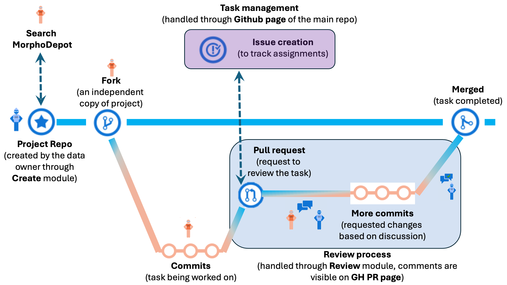

# **MorphoDepot Project Creation & Management**

Scope: This tutorial covers the complete lifecycle of a MorphoDepot project, from initial system configuration to repository creation, collaborator assignment, and segmentation review.  
Target Audience: Data Owners (PIs, Instructors) and researchers and students who use need to edit (segment) them.

## **0\. Conceptual Overview: The MorphoDepot Workflow**

MorphoDepot uses a "distributed collaboration" model. If you are new to **Git** (version control) and **GitHub** (cloud storage), this workflow might look complex, but MorphoDepot automates most of it.

Think of **GitHub** as the "Project Manager" (where assignments and discussions happen) and **MorphoDepot/Slicer** as the "Laboratory" (where the actual work happens).

**Refer to the diagram below to understand the lifecycle of a task:**

### **Key Concepts from the Diagram:**

#### **The Project Repo (The Blue Star):**  
   * **What it is:** This is the "Main Copy" of your dataset  
   * **Who creates it**: The Instructor/Project Owner creates this in [Section 5 (Creating the Repository)](./5-create-repo.md#5-creating-the-repository)  
   * **Where it lives:** On GitHub, but managed through MorphoDepot  
   * **Analogy**: Think of this as the "reference textbook" that everyone works from but nobody except the author is allowed to modify it.  

#### **Task Management (Purple Box):**  
   * **Location:** GitHub Website.  
   * **Action:** You define *what* needs to be done by creating "Issues." This is how assignments are handed out. See [**Section 6.1 \- 6.3** (Project Management).](./6-project-management.md#6-project-management--assignments)  

#### **The Fork (Blue Branch Icon):**  
   * **What it is:** An independent copy of the project created under the student’s github account.  
   * **When it happens:** Automatically created when a student first loads an assigned issue in MorphoDepot.  
   * **Why it matters:** Students don't edit the main repo directly—they work on their own safe copy  
   * **Analogy:** Like making edits on a photocopy of a library book, not in the book itself  

#### **Commits (Peach/Orange Line):**  
   * **Location**: MorphoDepot (Slicer)  
   * **What it is**: A "save point" that records your progress  
   * **How it works**: As the student segments, they click **"Commit and Push"** to save their work to their Fork of the repo.
   * **Frequency**: Should be done every 20–30 minutes to prevent data loss  
   * **Analogy**: Like saving your Word document and backing it up to the cloud  
   * **See**: [Section 6.5 (Saving Progress)](./6-project-management.md#65-saving-progress-student-action)  

#### **Pull Request / "PR" (Blue Box):**  
   * **Location**: Bridge between MorphoDepot and GitHub  
   * **What it is**: A formal request to merge your work back into the main repo where it derived from.  
   * **When it happens**: After the student clicks **"Request PR Review"**  
   * **Analogy**: Handing in your homework: you're asking the instructor to review your work  
   * **Status tracking**:  
     1. **Draft**: Work in progress, not ready for review  
     2. **Ready for Review**: Student has submitted for review  
     3. **Approved & Merged**: Work is accepted and added to the main repo and the issue is closed.  
   * **See**: [Section 6.6 (Submitting for Review)](./6-project-management.md#66-submitting-for-review-student-action)  

#### **The Review Loop:**  
   * **Location**: MorphoDepot (Review Tab) & GitHub (Comments)  
   * **How it works**:  
     1. Instructor reviews the segmentation in Slicer  
     2. If changes are needed, instructor types feedback and clicks **"Request Changes"**  
     3. Student reads the feedback on the GitHub (by clicking **"PR Link"** button)  
     4. Student makes corrections and commits again  
     5. Student clicks **"Request PR Review"** to resubmit  
     6. Loop continues until work is approved and finalized.  
   * **End result**: Once approved, the work is **Merged** back into the main Project Repo and the task is complete  
   * **See**: [Section 7 (Reviewing)](./7-review.md#7-reviewing--merging-submissions)

#### **Merged (Right side: checkmark icon labeled "Merged")**

* **What it means**: The student's segmentation has been approved and permanently added to the main repo.  
* **What happens**: The Issue is closed, the PR is merged, and that anatomical structure is now completely segmented in the project  
* **Important**: After merging, no further edits to that specific submission are possible (though a new Issue could be created if needed)

#### **Search MorphoDepot (Optional: Top left, dashed arrow)**

* **What it is**: A discovery tool to browse existing MorphoDepot repositories created by other researchers  
* **Use cases**:  
  * Find reference datasets for comparison  
  * Explore example segmentations for teaching  
  * Preview data before deciding to use it  
* **See**: [Section 8 (Search & Discovery)](./8-search.md#8-search--discovery)

### **Summary: The Complete MorphoDepot Cycle**

1. **Instructor** creates the project repository with volume and color table (and optionally with an existing segmentation).  
2. **Student** creates an Issue requesting to work on a specific structure  
3. **Instructor** assigns the Issue to the student  
4. **Student** loads the issue in MorphoDepot, which automatically creates a Fork  
5. **Student** segments and commits frequently to save progress  
6. **Student** requests review when finished  
7. **Instructor** reviews and either approves (merge) or requests changes  
8. If changes needed, student revises and resubmits  
9. Once approved, work is merged into the Master Copy  
10. **Instructor** creates [versioned releases](./9-releases.md) at project milestones (archival datasets only)

**The beauty of this system**: Everyone works independently on their own copy, preventing conflicts, while the repository owner maintains quality control before any work becomes "official."

---

## Tutorial Contents

This tutorial is split into 10 parts. Work through them in order, or jump straight to the part you need:

1. **[Prerequisites & System Configuration](./1-prerequisites.md)** — GitHub account, 2FA, and installing git + gh.
2. **[Slicer Installation & Setup](./2-slicer-setup.md)** — Install Slicer and the extensions, then verify the connection.
3. **[Preparing Data: 3D Volume](./3-prepare-volume.md)** — Clean, reorient, crop, and name your source volume.
4. **[Preparing Data: Color Table](./4-color-table.md)** — Define the anatomical labels and terminologies.
5. **[Creating the Repository](./5-create-repo.md)** — Fill the accession form, add screenshots, and create the repo.
6. **[Project Management & Assignments](./6-project-management.md)** — Issues, assignments, segmenting, and committing work.
7. **[Reviewing & Merging Submissions](./7-review.md)** — Review pull requests and approve or request changes.
8. **[Search & Discovery](./8-search.md)** — Find and preview existing MorphoDepot repositories.
9. **[Releases & DOIs](./9-releases.md)** — Cut a versioned, citable release of an archival dataset (archival repositories only).
10. **[Collections](./10-collections.md)** — Group related MorphoDepot repositories into a themed, browsable gallery (organization members create; anyone browses).
