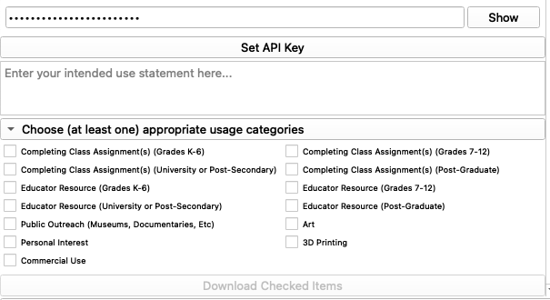

# MorphoSourceImport

## Contents
- [Introduction to the MorphoSourceImport Module for 3D Slicer](#introduction-to-the-morphosourceimport-module-for-3d-slicer)
- [Prerequisites for MorphoSourceImport Usage](#prerequisites-for-morphosourceimport-usage)
- [Launching the Module](#launching-the-module)
- [Configuring MorphoSource Query Parameters for Data Retrieval](#configuring-morphosource-query-parameters-for-data-retrieval)
- [Reviewing Query Results](#reviewing-query-results)
- [Setting Up Your API Access and Specifying Usage](#setting-up-your-api-access-and-specifying-usage)
- [Utilizing Downloaded Data in 3D Slicer](#utilizing-downloaded-data-in-3d-slicer)
- [Conclusion](#conclusion)

## Introduction to the MorphoSourceImport Module for 3D Slicer
The MorphoSource Import Module is an advanced tool within the 3D Slicer platform designed for researchers and professionals in the field of morphological analysis. It provides a robust interface for directly searching, querying, and downloading high-quality 3D mesh models and CT image series from the extensive MorphoSource database. Once retrieved, these datasets can be seamlessly imported into 3D Slicer, facilitating sophisticated analysis, detailed visualization, and comprehensive morphometric evaluation. This integration streamlines the workflow, significantly enhancing the efficiency of morphological studies and research endeavors.

## Prerequisites for MorphoSourceImport Usage
Before commencing the MorphoSource data retrieval process, ensure the following prerequisites are met:

- **3D Slicer Installation**: Verify that the most recent version of 3D Slicer is installed on your system. Updates or fresh installations can be obtained from the [official 3D Slicer website](https://www.slicer.org/).
- **Internet Connectivity**: A stable internet connection is required for seamless querying of the MorphoSource database.
- **MorphoSource Account**: An active [MorphoSource](https://www.morphosource.org/) account is necessary to access the full suite of features. Register for an account if you have not done so already.
- **API Key**: Secure an API key from MorphoSource, which is critical for authenticating and facilitating data transactions between 3D Slicer and the MorphoSource database.

Completion of these preliminary steps will enable a smooth and efficient setup, allowing you to fully leverage the capabilities of 3D Slicer with MorphoSource.

## Launching the Module

To begin utilizing the MorphoSource Import module within 3D Slicer, please follow the steps outlined below:

1. Initiate the 3D Slicer application.
2. Navigate to the Extensions Manager to locate and install the SlicerMorph extension. This extension can be found under the 'SlicerMorph' category or by utilizing the search function.
3. After installation, a restart of the 3D Slicer software is required for the changes to take effect.
4. Upon restarting, access the Modules Menu dropdown located in the top menu bar.
5. Scroll to locate the 'SlicerMorph' submenu.
6. Within this submenu, select 'Input and Output'.
7. From the expanded list, choose 'MorphoSourceImport' to activate the module.

By following these instructions, you will successfully launch the MorphoSourceImport module and can commence with downloading and analyzing morphological data. Please ensure that you have a stable internet connection for the best performance during the extension installation and data import processes.

## Configuring MorphoSource Query Parameters for Data Retrieval

When preparing to execute a data retrieval query in MorphoSource within the 3D Slicer environment, adhere to the following steps to specify your search criteria:

- **Query Keyword**: Input your primary search term that describes the dataset you are seeking, such as `Skull`.
- **Taxon**: For queries requiring taxonomic precision, input the appropriate classification (optional), for instance, `Primates`.
- **Media Tag**: To further refine your search, provide a relevant media tag if applicable (optional).
- **Data Types**: Select your preferred type of data from the available options, which include `Mesh` or `CT Image Series`.
- **Open Access Datasets Only**: Enable this option by checking the box to limit your search results to datasets available under open access.
- **Download Folder**: Establish the destination for your downloaded files by clicking on **Select Download Folder** and navigating to the desired location on your system.

Once all parameters are set to your specifications, initiate your search by selecting the **Submit Query** button.

These detailed instructions are designed to facilitate an efficient and targeted search within the MorphoSource database, ensuring you acquire the precise datasets needed for your scientific analysis.

## Reviewing Query Results

After executing a search within the MorphoSource Import Module, the query results will be organized and displayed in a tabular format. This table includes several columns providing essential details about each dataset:

- **Image**: Displays a thumbnail preview of the dataset. Right-clicking on the thumbnail opens the corresponding MorphoSource object webpage for comprehensive details.
- **Media ID**: Denotes the unique identifier for the media item within MorphoSource.
- **Title**: The title of the dataset, typically indicating the content and, if applicable, the specific part represented in the media.
- **Media Type**: Specifies the type of media, which can be either Mesh or CT Image Series.
- **Object ID**: The unique identifier for the object within the MorphoSource database.
- **Part**: Describes the anatomical part that the media item represents.

Navigation through the query results is facilitated by 'Previous Page' and 'Next Page' buttons.

- To download a summary of your query results, select the **Download Query Results** button. This action will generate a .csv file containing the details of your search criteria and results.
- To select specific datasets for download, simply check the boxes in the first column adjacent to the desired media items.

## Setting Up Your API Access and Specifying Usage

To fully access the features provided by the MorphoSource Import Module, you need to configure your API settings and specify your intended use. Follow the steps below to complete the setup:

1. **API Key Configuration**:
    - Click on the **Set API Key** button.
    - In the revealed field, input your unique API key. If you have not already obtained an API key, you may request one from your MorphoSource account settings.
    - To view the entered API key, click the **Show** button next to the input field.

2. **Usage Statement**:
    - In the provided text area, articulate a clear statement describing your intended use of the downloaded data. This helps ensure compliance with MorphoSource's data use policies.

3. **Usage Categories Selection**:
    - Below your usage statement, you'll find a list of potential usage categories. It is mandatory to select at least one category that aligns with your purpose for downloading the data. The available categories encompass educational, research, personal interest, and commercial applications.
    - Tick the checkbox(es) next to the category or categories that best represent your intended use.

4. **Downloading Selected Items**:
    - After setting your API key and detailing your usage intentions, you can proceed to download the datasets.
    - Review your selections and then click the **Download Checked Items** button to initiate the download of the data associated with the checked categories.

Remember, the proper setting of the API key and accurate usage declarations are crucial for maintaining the integrity of data use and ensuring the sustainability of resources like MorphoSource.

## Utilizing Downloaded Data in 3D Slicer

Once you have successfully downloaded the desired media items from MorphoSource, they will be available for use in 3D Slicer for various visualization and analysis tasks. Here are the steps to get started:

1. **Locate Your Downloads**:
    - Navigate to the folder where your media items were downloaded. By default, this will be the folder you specified in the MorphoSource Import Module. For example, `test_downloads`.
    - You should see a list of `.zip` files, each corresponding to a different media item you selected for download, as well as a `.csv` file that contains the metadata for your query results.

2. **Extracting Files**:
    - Double-click on each `.zip` file to extract the content. Ensure you have sufficient storage space for the unzipped files, as they may significantly expand in size.

3. **Importing into 3D Slicer**:
    - Launch 3D Slicer, and select the module appropriate for the type of data you've downloaded (e.g., Volume Rendering, Surface Models, etc.).
    - Use the `Add Data` function within 3D Slicer to import the extracted files into your project.
    - Once the data is imported, it will appear in the Data module where you can organize and manage your datasets.

4. **Visualization and Analysis**:
    - With your data imported, utilize the powerful tools of 3D Slicer to visualize the media items. This may include rendering 3D models, viewing CT slices, or performing morphometric analyses.
    - Tailor the visualization settings to your needs, adjusting thresholds, colors, and lighting to best interpret the data.

5. **Data Management**:
    - Keep your datasets organized within 3D Slicer. Consider renaming the data nodes for clarity and maintaining a structured approach to your analysis workflow.
    - Take advantage of 3D Slicer's capabilities to annotate, measure, and segment your data for in-depth examination.

By following these steps, you'll be able to fully exploit the capabilities of 3D Slicer to analyze the anatomical and morphological data obtained from MorphoSource.

## Conclusion
The MorphoSource Import Module is a valuable tool for accessing and utilizing 3D anatomical data from MorphoSource in 3D Slicer.