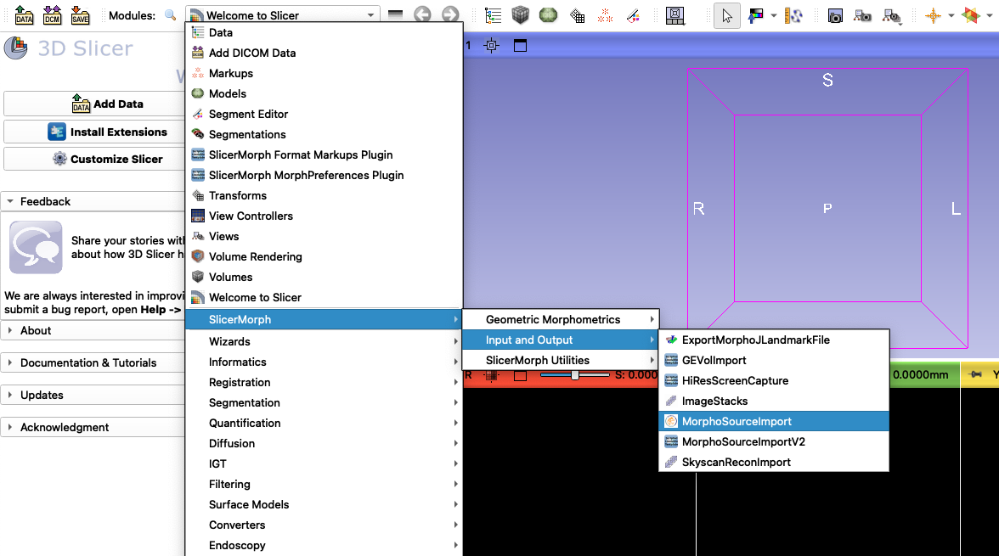
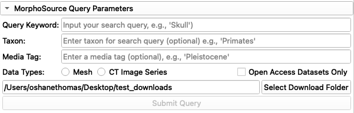
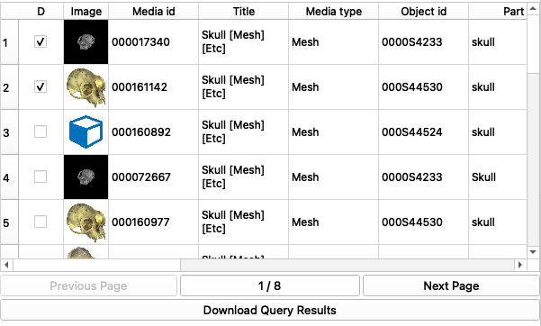
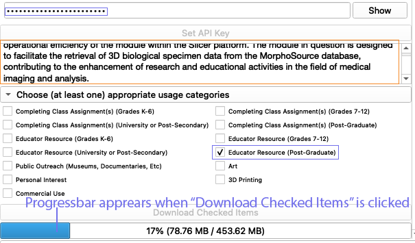

# MorphoSourceImport

## Contents
- [Prerequisites for MorphoSourceImport](#prerequisites-for-morphosourceimport)
- [Launching the Module](#launching-the-module)
- [MorphoSource Query Fields](#morphosource-query-fields)
- [Reviewing Query Results](#reviewing-query-results)
- [Setting Up Your API Access and Specifying Usage](#setting-up-your-api-access-and-specifying-usage)
- [Utilizing Downloaded Data in 3D Slicer](#utilizing-downloaded-data-in-3d-slicer)
- [Conclusion](#conclusion)

## Prerequisites for MorphoSourceImport
Before using the MorphoSourceImport module, ensure the following prerequisites are met:

- **MorphoSource Account**: An active [MorphoSource](https://www.morphosource.org/) account is necessary to interact with MorphoSource. Register for an account at MorphoSource.org, if you have not done so already.
- **API Key**: You will need to create an API key from MorphoSource, which is necessary for downloading files directly from the module. (Simply query MorphoSource through MorphoSourceImport data doesn't require an API key, but downloading does). After registering an account at MorphoSource.org, go to your account dashboard, click **Profile** and then find the **Generate API Key** link under Advanced User Functions. If you already created an API key, just click **View API Key** and copy the API key (you will need it later)

## Launching the Module

1. Go to Module Selector and from the dropdown select SlicerMorph->Input & Output->MorphoSourceImport (CTRL+F)
2. Or hit CTRL+F (CMD+F in MacOS), and search for MorphoSourceImport

## MorphoSource Query Fields 

- **Query Keyword**: Input your primary search term that describes the dataset you are seeking, such as `Skull`. This field is mandatory.

You can do multiple keyword searches using `+` symbol for **AND** and `|`symbol for **OR**. You can use parentheses to create more complex searches such as:

`(lower+jaw)|head`: would mean searching for everything that has ("lower" AND "jaw") OR "head" keywords.  
`skull|SKULL|head|HEAD|cranium|CRANIUM`: would mean searching for records that contain ANY of these words. 

You can also use compound searches using double quotes `""`. For example compound keyword search `"lower jaw"` will return different results then the search `lower+jaw`. The former is more restrictive in the sense that keywords have to appear next to each other with a space in between, whereas in the latter as long as both "lower" and "jaw" keywords appear simultaneously in the metadata of the same media, a result will be returned. 

- **Taxon**: To restrict your results to a specific taxon, input the appropriate classification level, for instance, `Primates` or `Carnivora`. This field is optional
- **Media Tag**: To further refine your search, provide a relevant media tag if applicable. This field is optional. 
- **Data Types**: Select the modality of 3D dataset. Either `Mesh` or `Volumetric Image Series`. You need to select one of these options for results to be returned. 
- **Open Access Datasets Only**: Enable this option to limit your search results to datasets available under open access. Note that you cannot download restricted datasets, unless access already has been granted to you.
- **Download Folder**: Set the destination folder for your downloaded files by clicking on **Select Download Folder** and navigating to the desired location on your system (e.g., **MorphoSourceDownloads** folder on your desktop).

Once all parameters are set to your specifications, initiate your search by clicking the **Submit Query** button.

## Query Results

After executing a search, query results will be organized and displayed in a tabular format. For brevity, results table includes only a small portion of all the metadata available in MorphoSource. These fields are:

- **Image**: Displays a thumbnail preview of the dataset. Right-clicking on the thumbnail opens the corresponding MorphoSource object webpage for comprehensive details.
- **Media ID**: Denotes the unique identifier for the media item within MorphoSource.
- **Title**: The title of the dataset, typically indicating the content and, if applicable, the specific part represented in the media.
- **Media Type**: Specifies the type of media, which can be either Mesh or CT Image Series.
- **Object ID**: The unique identifier for the object within the MorphoSource database.
- **Part**: Describes the anatomical part that the media item represents.

Each table is restricted to 20 results. Use the `Previous Page` and `Next Page` to go back and forth through the results. 

- To download a summary of your query results, select the **Download Query Results** button. This action will generate a .csv file containing the details of your search criteria and results.
- To see the full metadata about a dataset, right-click any of the cells for it, and choose `Open dataset in browser` option in the pop-up menu. This will take you to the specific media page on MorphoSource. You can also copy the contents of any cell using the `Copy` function from this pop-up menu.
- To select specific datasets for download, simply check the boxes in the first column adjacent to the desired media items.

## Setting Up API Key for download and Specifying Data Usage

To be able to download datasets through MorphoSourceImport, you need to enter your MorphoSource API key (see prerequisites above) and specify your intended use of the dataset, which is a requirement by MorphoSource. Follow these steps  to complete the setup:

1. **API Key Configuration**:
    - Click on the **Set API Key** button.
    - In the revealed field, copy your API key, which is found under your MorphoSource account dashboard page (see prerequisites above).
    - To view the entered API key, click the **Show** button next to the input field.

2. **Usage Statement**:
    - In the provided text area, articulate a clear statement describing your intended use of the downloaded data. This fields needs to be at least 50 characters long (required by MorphoSource)

3. **Usage Categories Selection**:
    - Below your usage statement, you'll find a list of data usage categories. It is mandatory to select at least one category that aligns with your purpose for downloading the data. The available categories encompass educational, research, personal interest, and commercial applications.
    - Tick the checkbox(es) next to the category or categories that best represent your intended use.

4. **Downloading Selected Items**:
    - After setting your API key and detailing your usage intentions, you can proceed to download the datasets.
    - Review your selections and then click the **Download Checked Items** button to initiate the download of the data associated with the checked categories. Remember you can only download datasets that are "Open Source". To be able to download restricted datasets, you need to be given access by the data owner. You can make that request from the MorphoSource website. MorphoSourceImport does not allow you to request datasets, as it is primarily a tool for data retrieval. 

## Interacting with downloaded data in 3D Slicer

Once you have successfully downloaded media items from MorphoSource, they will be available for use in 3D Slicer for various visualization and analysis tasks. Here are the steps to get started:

1. **Locate Your Downloads**:
    - Navigate to the folder where your media items were downloaded. This is the folder you specified in the MorphoSourceImport Query Fields step. For example, `MorphoSourceDownloads` folder on your desktop.
    - You should see a list of `.zip` files, each corresponding to a different media item you selected for download, as well as a `.csv` file that contains the metadata for your query results. Filenames of the zip files corresponds to the MorphoSource media ID given to that dataset. 

2. **Extract Files**:
    - Most operating systems allows you to open zip files by simply double-clicking them. You can also use free software such as 7zip, Nanazip to extract the contents of these archive files. Volumetric datasets usually have a second (and and occassionally a third) zip file inside the primary archive you have downloaded. This secondary (occassionally tertiary) zip file contains the image stack. Thus, make sure to expand all the zip files inside the primary archive file you have downloaded. 

3. **Importing data into 3D Slicer**:
    - If you have downloaded surface models (OBJ, PLY, STL), you can simply drag and drop them into 3D Slicer, and they will be immediately visible in the 3D viewer. 
    - If you are trying to import a volumetric dataset (e.g., microCT image stack), you can use the `ImageStacks` module of the SlicerMorph to import them. The crucial piece of information is the image spacing (also known as resolution). You can find the X/Y/Z resolution of a volumetric dataset in the results table. Copy it, so that you can paste it to the relevant field of the `ImageStacks` module. Make sure you are entering the resolution in millimeters (some data owners report the resolution in microns. In that case, divide the reported value by 1000 to convert them to millimeters). If you need a refresher on how to import an image stack into Slicer, please see our [ImageStacks Tutorial](https://github.com/SlicerMorph/Tutorials/tree/main/ImageStacks#readme). Likewise for 3D visualization of the import volume, review the [Volume Rendering module tutorial](https://github.com/SlicerMorph/Spr_2021/blob/main/Day_2/VolumeRendering/VolumeRendering.md).

